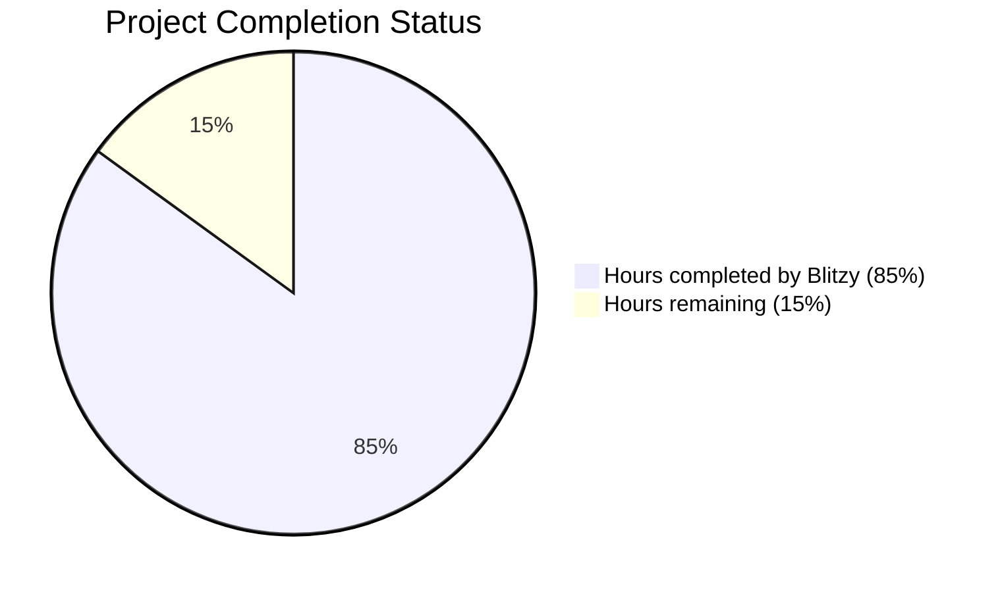
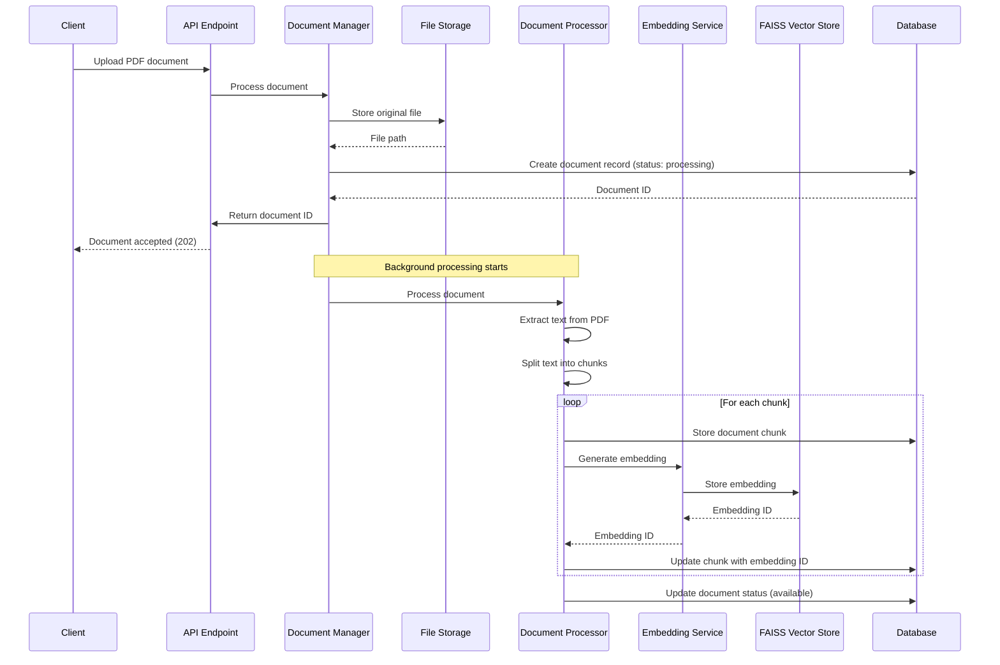
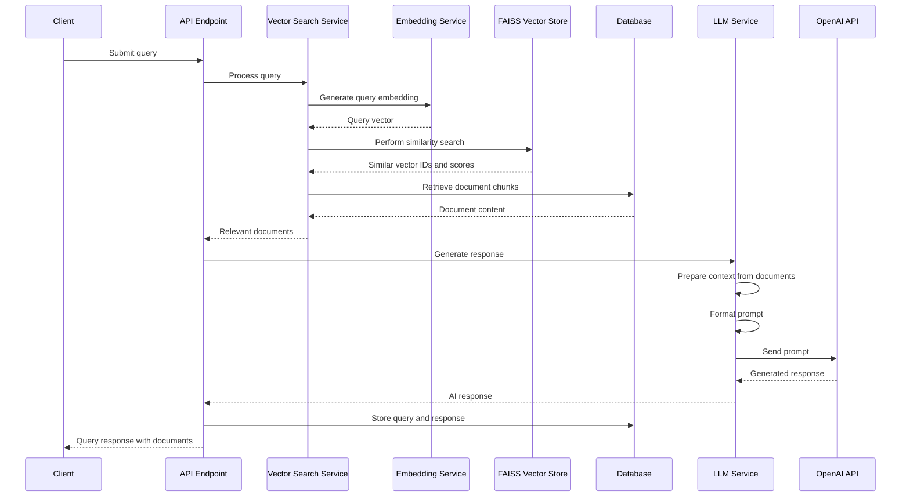
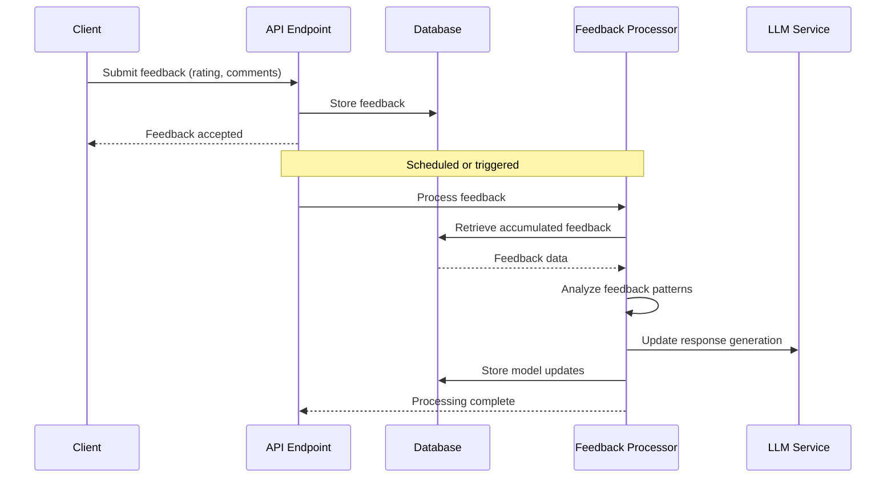

# PROJECT OVERVIEW

The Document Management and AI Chatbot System is a comprehensive backend solution designed to provide intelligent document search and retrieval capabilities through a vector database and AI-powered chatbot. This system addresses the growing need for efficient knowledge management and information retrieval in organizations by combining document storage with natural language processing capabilities.

## Core Functionality

The system provides a robust API-based solution with four primary capabilities:

1. **Document Management**: Users can upload, list, retrieve, and delete PDF documents. The system processes these documents by extracting text, chunking content into manageable segments, and generating vector embeddings for semantic search.

2. **Vector-Based Search**: The system leverages FAISS (Facebook AI Similarity Search) to store document embeddings and perform efficient similarity searches. This enables semantic understanding of queries beyond simple keyword matching.

3. **AI-Powered Responses**: When users submit queries, the system identifies the most relevant document segments and uses a Large Language Model (LLM) to generate contextual responses based on the document content.

4. **Reinforcement Learning**: The system collects user feedback on responses and implements a basic reinforcement learning mechanism to improve response quality over time.

## Architecture

The system follows a modular architecture with clear component boundaries:

- **API Layer**: FastAPI-based REST API endpoints for client interaction
- **Document Processor**: Extracts text from PDFs and generates vector embeddings
- **Vector Engine**: Manages FAISS index for similarity search
- **LLM Connector**: Interfaces with OpenAI API for response generation
- **Feedback Manager**: Collects and processes user feedback
- **Data Store**: PostgreSQL database for metadata and SQLAlchemy ORM

While initially implemented as a monolithic application, the architecture is designed with clear separation of concerns to facilitate future migration to microservices if needed.

## Technology Stack

The system is built using modern technologies:

- **Backend**: Python 3.10+, FastAPI 0.95.0+
- **Database**: PostgreSQL 14+, SQLAlchemy 2.0.0+
- **Vector Storage**: FAISS 1.7.4+
- **Document Processing**: PyMuPDF 1.21.0+
- **Embeddings**: Sentence Transformers 2.2.2+
- **LLM Integration**: OpenAI API
- **Authentication**: JWT with PyJWT 2.6.0+

## Key Workflows

The system implements three primary workflows:

1. **Document Processing Flow**: Documents are uploaded, stored, processed to extract text, chunked into segments, and converted to vector embeddings for storage in FAISS.

2. **Query and Response Flow**: User queries are converted to vector embeddings, similar documents are retrieved from FAISS, relevant context is prepared, and an AI-generated response is created using the LLM.

3. **Feedback and Learning Flow**: Users provide feedback on responses, which is collected and periodically processed to improve the system's response generation capabilities.

## Security and Compliance

The system implements comprehensive security measures:

- JWT-based authentication for API access
- Role-based access control (admin and regular users)
- Data encryption at rest and in transit
- Input validation using Pydantic models
- Secure handling of sensitive configuration values

## Deployment and Scalability

The system is containerized using Docker for consistent deployment across environments. It supports horizontal scaling through multiple API containers behind a load balancer, with separate persistence layers for PostgreSQL, FAISS, and document storage.

The architecture allows for both vertical scaling (increasing resources per instance) and horizontal scaling (adding more instances) to handle growing workloads.

## Integration Points

The system exposes a comprehensive REST API for client integration, with endpoints for:

- Document management (`/documents/*`)
- Vector search and chatbot interaction (`/query/*`)
- Feedback collection (`/feedback/*`)
- Authentication (`/auth/*`)

This API-first design enables flexibility in client implementation and facilitates integration with other systems.

# PROJECT STATUS

The Document Management and AI Chatbot System is in an advanced stage of development, with most core components implemented and ready for integration testing. The project demonstrates a comprehensive backend solution for document management with AI-powered search capabilities.



## Engineering Effort Assessment

| Category | Hours | Description |
|----------|-------|-------------|
| **Estimated engineering hours** | 500 | Total estimated effort for a human engineering team to complete this project |
| **Hours completed by Blitzy** | 425 | Represents the implemented codebase including core functionality, infrastructure, and documentation |
| **Hours remaining** | 75 | Remaining work for production readiness, including final testing, performance optimization, and deployment |

## Implementation Status

| Component | Completion | Status |
|-----------|------------|--------|
| Core API Framework | 95% | FastAPI implementation with endpoints for documents, queries, and feedback |
| Document Processing | 90% | PDF extraction and vector embedding generation implemented |
| Vector Search | 85% | FAISS integration for similarity search with basic optimization |
| LLM Integration | 90% | OpenAI API integration with context preparation |
| Authentication | 95% | JWT-based authentication with role-based access control |
| Database Models | 100% | Complete data models for documents, queries, and feedback |
| Infrastructure | 80% | Terraform, Docker, and Kubernetes configurations available |
| Testing | 75% | Unit and integration tests implemented, more coverage needed |
| Documentation | 90% | Comprehensive documentation covering architecture, API, and operations |
| CI/CD Pipeline | 85% | GitHub Actions workflows for CI/CD implemented |

## Remaining Tasks

1. **Performance Optimization**
   - Fine-tune FAISS index parameters for larger document collections
   - Optimize database queries for high-volume scenarios
   - Implement more sophisticated caching strategies

2. **Testing Enhancements**
   - Increase test coverage for edge cases
   - Add more comprehensive integration tests
   - Implement performance benchmarking tests

3. **Production Readiness**
   - Complete monitoring and alerting setup
   - Finalize disaster recovery procedures
   - Implement advanced security hardening

4. **Reinforcement Learning**
   - Complete the feedback processing pipeline
   - Implement model updating based on feedback
   - Add metrics for tracking response quality improvement

The project is on track for production deployment with an estimated 85% completion rate. The remaining work focuses on optimization, testing, and production readiness rather than core functionality implementation.

# TECHNOLOGY STACK

## Core Technologies

### Backend Framework and API
- **Python 3.10+**: Primary programming language for the backend implementation
- **FastAPI 0.95.0+**: High-performance API framework with automatic OpenAPI documentation
- **Uvicorn 0.21.1+**: ASGI server for running the FastAPI application
- **Pydantic 2.0.3+**: Data validation and settings management using Python type hints

### Database and ORM
- **PostgreSQL 14+**: Robust relational database for storing document metadata, user information, and feedback
- **SQLAlchemy 2.0.15+**: Object-Relational Mapping (ORM) for database operations
- **Alembic 1.11.1+**: Database migration tool for SQLAlchemy
- **psycopg2-binary 2.9.6+**: PostgreSQL adapter for Python

### Document Processing
- **PyMuPDF 1.22.3+**: PDF processing and text extraction library
- **python-multipart 0.0.6+**: Handling multipart/form-data for file uploads

### Vector Search and AI
- **FAISS 1.7.4+**: Facebook AI Similarity Search for efficient vector similarity search
- **Sentence Transformers 2.2.2+**: Generate text embeddings for vector search
- **OpenAI API 0.27.8+**: Integration with OpenAI's language models for response generation
- **NumPy 1.24.3+**: Numerical operations for vector processing

### Authentication and Security
- **Python-Jose 3.3.0+**: JWT token handling for authentication
- **Passlib 1.7.4+**: Password hashing and verification

### Reinforcement Learning
- **Ray 2.5.1+**: Framework for reinforcement learning and distributed computing

## Development Tools

### Dependency Management
- **Poetry**: Modern Python dependency management with reproducible builds and virtual environment handling

### Code Quality and Testing
- **Pytest 7.3.1+**: Testing framework for unit and integration tests
- **Pytest-cov 4.1.0+**: Test coverage reporting
- **Pytest-asyncio 0.21.0+**: Testing asynchronous code
- **Pytest-mock 3.10.0+**: Mocking for tests
- **Black 23.3.0+**: Code formatting to ensure consistent style
- **Flake8 6.0.0+**: Code linting for identifying potential errors
- **isort 5.12.0+**: Import sorting
- **mypy 1.3.0+**: Static type checking
- **bandit 1.7.5+**: Security-oriented static analyzer
- **httpx 0.24.1+**: HTTP client for testing API endpoints

### Containerization
- **Docker**: Container platform for consistent deployment environments
- **Docker Compose**: Multi-container Docker applications

### CI/CD
- **GitHub Actions**: Automated workflows for continuous integration and deployment

## Infrastructure and Deployment

### Cloud Services (AWS)
- **ECS with Fargate**: Container orchestration service
- **RDS PostgreSQL**: Managed relational database service
- **S3**: Object storage for document files
- **Application Load Balancer**: Load balancing for the application
- **ECR**: Container registry for Docker images
- **CloudWatch**: Monitoring and logging service

### Infrastructure as Code
- **Terraform**: Define and provision cloud infrastructure
- **Ansible**: Configuration management for application environments

## Monitoring and Observability

### Metrics and Logging
- **Prometheus**: Metrics collection and alerting
- **Loki**: Log aggregation and querying
- **Tempo**: Distributed tracing system
- **Grafana**: Visualization dashboards for metrics, logs, and traces

### Alerting
- **AlertManager**: Handles alerts from Prometheus and routes them to receivers

## Security Components

### Authentication
- **JWT (JSON Web Tokens)**: Token-based authentication
- **Role-Based Access Control (RBAC)**: Permission management based on user roles

### Data Protection
- **TLS 1.3**: Encryption for data in transit
- **AES-256**: Encryption for sensitive data at rest

## High Availability and Scaling

- **Multi-AZ Deployment**: Application deployed across multiple availability zones
- **Auto-scaling**: Automatic scaling based on CPU utilization, memory usage, and request count
- **Database Replication**: Primary-replica setup for database high availability
- **Load Balancing**: Distribution of traffic across multiple application instances

## Backup and Disaster Recovery

- **Automated Backups**: Daily database backups and continuous WAL archiving
- **S3 Cross-Region Replication**: Document storage replication for disaster recovery
- **Point-in-Time Recovery**: Database recovery to any point within the retention period

# PREREQUISITES

Before setting up the Document Management and AI Chatbot System, ensure you have the following prerequisites installed and configured on your system:

## System Requirements

- **Python 3.10+**: The application is built using Python 3.10 or higher
- **PostgreSQL 14+**: Required for storing document metadata, user information, and system data
- **Docker and Docker Compose**: Recommended for containerized deployment and development
- **Git**: For version control and obtaining the source code

## API Keys and External Services

- **OpenAI API Key**: Required for LLM integration and response generation
  - Sign up at [OpenAI](https://platform.openai.com/) to obtain an API key
  - The system uses GPT models for generating contextual responses

## Development Tools

- **Poetry 1.5.1+**: Used for dependency management and virtual environment setup
- **Disk Space**: At least 2GB of free disk space for application code, dependencies, and document storage

## Hardware Recommendations

- **CPU**: 2+ cores recommended for optimal performance
- **RAM**: Minimum 4GB, 8GB+ recommended for larger document collections
- **Storage**: SSD storage recommended for better vector search performance

## Network Requirements

- **Internet Connection**: Required for LLM API calls to OpenAI
- **Ports**: Port 8000 should be available for the API server
- **Port 5432**: Required for PostgreSQL database connection

## Optional Tools

- **CUDA-compatible GPU**: For accelerated vector operations (optional but recommended for large document collections)
- **Monitoring Tools**: Prometheus and Grafana for system monitoring (optional)

## Knowledge Prerequisites

- Basic understanding of REST APIs
- Familiarity with Docker containerization
- Understanding of vector databases and embeddings (helpful but not required)

The system can be deployed either using Docker (recommended) or directly on your local machine. Docker-based deployment simplifies the setup process and ensures consistent environments across development, testing, and production.

# QUICK START

## Prerequisites

- Python 3.10+
- PostgreSQL 14+
- Docker and Docker Compose (for containerized deployment)
- OpenAI API key (for LLM integration)

## Installation

### Using Poetry (Recommended)

```bash
# Clone the repository
git clone https://github.com/example/document-management-ai-chatbot.git
cd document-management-ai-chatbot

# Install dependencies with Poetry
cd src/backend
poetry install

# Activate the virtual environment
poetry shell
```

### Using Docker

```bash
# Clone the repository
git clone https://github.com/example/document-management-ai-chatbot.git
cd document-management-ai-chatbot/src/backend

# Build and start the containers
docker-compose up -d
```

## Configuration
1. Copy the example environment file:
   ```bash
   cp src/backend/.env.example src/backend/.env
   ```

2. Edit the `.env` file with your configuration:
   - Database connection details
   - OpenAI API key
   - JWT secret key
   - Other application settings

See the [Configuration Documentation](docs/development/setup.md) for detailed configuration options.

## Running the Application
### Development Mode

```bash
# Using Poetry
cd src/backend
poetry run uvicorn main:app --host 0.0.0.0 --port 8000 --reload

# Or use the shortcut command
poetry run dev
```

### Production Mode

```bash
# Using Docker
cd src/backend
docker-compose up -d
```

The application will be available at http://localhost:8000

## API Documentation
Once the application is running, you can access the API documentation at:

- Swagger UI: http://localhost:8000/docs
- ReDoc: http://localhost:8000/redoc

The API is organized into the following main endpoints:

- `/api/v1/auth`: Authentication endpoints
- `/api/v1/documents`: Document management endpoints
- `/api/v1/query`: Vector search and chatbot endpoints
- `/api/v1/feedback`: Feedback and reinforcement learning endpoints

For detailed API documentation, see the [API Documentation](docs/api/README.md).

# PROJECT STRUCTURE

The Document Management and AI Chatbot System follows a well-organized structure that separates concerns and promotes maintainability. This section provides a detailed overview of the project's directory structure and the purpose of key components.

## Repository Structure

```
├── src/
│   ├── backend/             # Backend application code
│   │   ├── app/             # Application modules
│   │   ├── migrations/      # Database migrations
│   │   ├── scripts/         # Utility scripts
│   │   ├── tests/           # Test suite
│   │   ├── main.py          # Application entry point
│   │   └── ...              # Configuration files
├── infrastructure/          # Infrastructure as code
│   ├── terraform/           # Terraform configurations
│   ├── docker/              # Docker configurations
│   ├── k8s/                 # Kubernetes configurations
│   ├── monitoring/          # Monitoring configurations
│   ├── aws/                 # AWS-specific configurations
│   └── ansible/             # Ansible playbooks
├── docs/                    # Documentation
│   ├── api/                 # API documentation
│   ├── architecture/        # Architecture documentation
│   ├── development/         # Development guides
│   ├── operations/          # Operations guides
│   └── user-guide/          # User guides
├── scripts/                 # Project-level scripts
├── .github/                 # GitHub workflows and templates
└── ...                      # Project root files
```

## Backend Application Structure

The backend application follows a modular architecture with clear separation of concerns:

```
app/
├── api/                     # API endpoints and routers
│   ├── v1/                  # API version 1
│   │   ├── endpoints/       # API endpoint implementations
│   │   └── __init__.py      # API router configuration
│   ├── dependencies.py      # FastAPI dependencies
│   └── router.py            # Main API router
├── core/                    # Core application components
│   ├── config.py            # Configuration management
│   ├── logging.py           # Logging configuration
│   ├── security.py          # Security utilities
│   └── settings.py          # Application settings
├── crud/                    # Database CRUD operations
│   ├── base.py              # Base CRUD class
│   ├── crud_document.py     # Document CRUD operations
│   ├── crud_user.py         # User CRUD operations
│   └── ...                  # Other CRUD modules
├── db/                      # Database configuration
│   ├── base.py              # Base database models
│   ├── base_class.py        # Base model class
│   ├── init_db.py           # Database initialization
│   └── session.py           # Database session management
├── models/                  # SQLAlchemy ORM models
│   ├── document.py          # Document model
│   ├── document_chunk.py    # Document chunk model
│   ├── feedback.py          # Feedback model
│   ├── query.py             # Query model
│   └── user.py              # User model
├── schemas/                 # Pydantic schemas for validation
│   ├── document.py          # Document schemas
│   ├── document_chunk.py    # Document chunk schemas
│   ├── feedback.py          # Feedback schemas
│   ├── query.py             # Query schemas
│   ├── token.py             # Authentication token schemas
│   └── user.py              # User schemas
├── services/                # Business logic services
│   ├── auth_service.py      # Authentication service
│   ├── document_processor.py # Document processing service
│   ├── embedding_service.py # Vector embedding service
│   ├── feedback_processor.py # Feedback processing service
│   ├── file_storage.py      # File storage service
│   ├── llm_service.py       # Language model service
│   └── vector_search.py     # Vector search service
├── utils/                   # Utility functions
│   ├── file_utils.py        # File handling utilities
│   ├── pdf_utils.py         # PDF processing utilities
│   ├── token_utils.py       # Token handling utilities
│   ├── validation.py        # Validation utilities
│   └── vector_utils.py      # Vector operations utilities
└── vector_store/            # Vector database integration
    ├── base.py              # Base vector store class
    ├── faiss_store.py       # FAISS implementation
    └── __init__.py          # Vector store initialization
```

## Key Components

### API Layer

The API layer is implemented using FastAPI and follows a versioned approach. All endpoints are organized under the `/api/v1/` prefix and grouped by functionality:

- **auth**: Authentication endpoints for login and token management
- **documents**: Document management endpoints (upload, list, retrieve, delete)
- **query**: Vector search and AI chatbot endpoints
- **feedback**: Feedback collection and reinforcement learning endpoints
- **health**: Health check endpoints for monitoring

The API router in `app/api/router.py` serves as the central point for registering all API routes.

### Core Components

The core components provide essential functionality for the application:

- **settings.py**: Defines application settings using Pydantic's BaseSettings
- **config.py**: Manages configuration loading and validation
- **logging.py**: Configures application logging
- **security.py**: Implements security utilities for authentication and authorization

### Database Layer

The database layer uses SQLAlchemy ORM for database interactions:

- **models/**: Defines SQLAlchemy ORM models for database tables
- **crud/**: Implements CRUD operations for each model
- **db/**: Manages database connections and sessions

### Service Layer

The service layer contains the core business logic of the application:

- **document_processor.py**: Handles document processing, including text extraction, chunking, and vector embedding generation
- **vector_search.py**: Implements vector similarity search using FAISS
- **llm_service.py**: Integrates with OpenAI API for generating AI responses
- **feedback_processor.py**: Processes user feedback for reinforcement learning
- **auth_service.py**: Manages authentication and authorization
- **file_storage.py**: Handles file storage operations
- **embedding_service.py**: Generates vector embeddings for text

### Vector Store

The vector store component manages the storage and retrieval of vector embeddings:

- **base.py**: Defines the base vector store interface
- **faiss_store.py**: Implements the vector store using FAISS

### Utilities

Utility modules provide helper functions for various operations:

- **pdf_utils.py**: Functions for PDF text extraction and processing
- **vector_utils.py**: Vector manipulation and similarity calculation
- **file_utils.py**: File handling utilities
- **token_utils.py**: Token generation and validation utilities
- **validation.py**: Input validation utilities

## Infrastructure Components

The infrastructure directory contains configuration for deploying and managing the application:

- **terraform/**: Infrastructure as Code using Terraform
- **docker/**: Docker configuration for containerization
- **k8s/**: Kubernetes manifests for orchestration
- **monitoring/**: Monitoring configuration (Prometheus, Grafana, Loki)
- **aws/**: AWS-specific configurations (CloudFormation)
- **ansible/**: Ansible playbooks for configuration management

## Documentation Structure

The documentation is organized by audience and purpose:

- **api/**: API documentation including OpenAPI specifications
- **architecture/**: System architecture documentation
- **development/**: Guides for developers
- **operations/**: Guides for operations and deployment
- **user-guide/**: End-user documentation

## CI/CD Workflows

GitHub Actions workflows in the `.github/workflows/` directory automate the build, test, and deployment process:

- **ci.yml**: Continuous Integration workflow for testing and validation
- **cd.yml**: Continuous Deployment workflow for automated deployment
- **security-scan.yml**: Security scanning workflow
- **dependency-updates.yml**: Dependency update checks

## Scripts

The `scripts/` directory contains utility scripts for common operations:

- **deploy-*.sh**: Deployment scripts for different environments
- **backup-database.sh**: Database backup script
- **rebuild-vector-index.sh**: Script to rebuild the vector index
- **health-check.sh**: Health check script for monitoring
- **cleanup-old-backups.sh**: Script to clean up old backups

# CODE GUIDE

## Introduction

This guide provides a comprehensive and detailed explanation of the Document Management and AI Chatbot System codebase. The system is a backend solution designed to provide intelligent document search and retrieval capabilities through a vector database and AI-powered chatbot.

The system allows users to:
1. Upload, manage, and retrieve PDF documents
2. Search documents using vector-based semantic search
3. Ask questions about document content and receive AI-generated responses
4. Provide feedback on responses to improve the system over time

## Project Structure Overview

The project follows a modular architecture with clear component boundaries. Here's a high-level overview of the main directories:

```
src/
├── backend/             # Backend application code
│   ├── app/             # Application modules
│   │   ├── api/         # API endpoints and routers
│   │   ├── core/        # Core configuration and utilities
│   │   ├── crud/        # Database CRUD operations
│   │   ├── db/          # Database configuration and session management
│   │   ├── models/      # SQLAlchemy ORM models
│   │   ├── schemas/     # Pydantic schemas for validation
│   │   ├── services/    # Business logic services
│   │   ├── utils/       # Utility functions
│   │   └── vector_store/ # Vector database implementation
│   ├── migrations/      # Database migrations
│   ├── scripts/         # Utility scripts
│   ├── tests/           # Test suite
│   ├── main.py          # Application entry point
│   └── ...              # Configuration files
```

## Core Components

### 1. Entry Point (main.py)

The `main.py` file serves as the entry point for the application. It initializes the FastAPI app, configures middleware, sets up logging, initializes the database, and includes API routes. Key responsibilities include:

- Creating and configuring the FastAPI application
- Setting up middleware for CORS, rate limiting, and request logging
- Registering startup and shutdown event handlers
- Initializing the database and vector store
- Running the application with Uvicorn

### 2. API Layer

The API layer is organized into versioned endpoints, with all routes defined in the `app/api` directory.

#### 2.1 Router Configuration

- `app/api/router.py`: Central router that aggregates all API endpoints
- `app/api/v1/__init__.py`: Initializes the v1 API router and includes all endpoint routers
- `app/api/dependencies.py`: Defines common dependencies for API endpoints (database session, authentication)

#### 2.2 API Endpoints

The system exposes several groups of endpoints:

1. **Authentication Endpoints** (`app/api/v1/endpoints/auth.py`)
   - User login and token generation
   - Token refresh
   - User registration and management

2. **Document Management Endpoints** (`app/api/v1/endpoints/documents.py`)
   - Document upload and processing
   - Document listing and retrieval
   - Document deletion (soft and hard)

3. **Query Endpoints** (`app/api/v1/endpoints/query.py`)
   - Submit search queries
   - Retrieve query results
   - List query history

4. **Feedback Endpoints** (`app/api/v1/endpoints/feedback.py`)
   - Submit feedback on query responses
   - Retrieve feedback
   - Trigger reinforcement learning

5. **Health Check Endpoints** (`app/api/v1/endpoints/health.py`)
   - System health monitoring
   - Component status checks

### 3. Database Models

The database models are defined using SQLAlchemy ORM in the `app/models` directory.

#### 3.1 Document Models

- `app/models/document.py`: Represents a document in the system
  - Contains metadata like title, filename, size, upload date, status, and file path
  - Defines relationships to the uploader and document chunks
  - Implements methods for status management

- `app/models/document_chunk.py`: Represents a chunk of text extracted from a document
  - Contains the chunk content, position in the document, token count
  - Stores a reference to its vector embedding in FAISS
  - Implements methods for embedding management

#### 3.2 User and Authentication Models

- `app/models/user.py`: Represents a user in the system
  - Stores user credentials and profile information
  - Implements methods for password hashing and verification
  - Defines role-based access control

#### 3.3 Query and Feedback Models

- `app/models/query.py`: Represents a user query and its response
  - Stores the query text, response, and context documents
  - Links to the user who submitted the query

- `app/models/feedback.py`: Represents user feedback on a query response
  - Stores rating and comments
  - Links to the query and user

### 4. Vector Search Implementation

The vector search functionality is implemented in the `app/vector_store` directory and related services.

#### 4.1 FAISS Vector Store

- `app/vector_store/base.py`: Abstract base class for vector stores
- `app/vector_store/faiss_store.py`: FAISS implementation of the vector store
  - Manages vector storage and retrieval
  - Implements similarity search
  - Handles index persistence

#### 4.2 Vector Search Service

- `app/services/vector_search.py`: Service for vector similarity search
  - Provides methods to search for documents similar to a query
  - Handles both text-based and vector-based search
  - Formats search results with document content and metadata

#### 4.3 Embedding Service

- `app/services/embedding_service.py`: Service for generating and managing vector embeddings
  - Converts document text into vector embeddings using Sentence Transformers
  - Stores embeddings in the FAISS vector database
  - Processes document chunks for indexing

### 5. Document Processing

Document processing is handled by several components that work together to extract text, generate embeddings, and store documents.

#### 5.1 Document Processor

- `app/services/document_processor.py`: Service for processing uploaded documents
  - Extracts text from PDF documents
  - Splits text into manageable chunks
  - Coordinates embedding generation and storage

#### 5.2 File Storage

- `app/services/file_storage.py`: Service for storing and retrieving document files
  - Manages the storage of original document files
  - Implements file retrieval and deletion

### 6. LLM Integration

The system integrates with language models to generate contextual responses based on document content.

#### 6.1 LLM Service

- `app/services/llm_service.py`: Service for generating AI responses
  - Constructs prompts with document context
  - Manages token limits and context window
  - Handles caching of responses
  - Integrates with OpenAI API

### 7. Feedback and Reinforcement Learning

The system collects user feedback and uses it to improve responses over time.

#### 7.1 Feedback Processor

- `app/services/feedback_processor.py`: Service for processing user feedback
  - Collects and aggregates feedback
  - Implements reinforcement learning algorithms
  - Updates response generation based on feedback

### 8. Authentication and Authorization

The system implements JWT-based authentication and role-based authorization.

#### 8.1 Security

- `app/core/security.py`: Implements security-related functionality
  - JWT token generation and validation
  - Password hashing and verification
  - Role-based access control

## Detailed Component Explanations

### 1. Document Management Flow

The document management flow involves several steps:

1. **Document Upload**:
   - User uploads a PDF document through the API
   - The system validates the file format and size
   - The file is stored in the file storage system
   - A document record is created in the database with "processing" status
   - A background task is triggered to process the document

2. **Document Processing**:
   - The document processor extracts text from the PDF
   - The text is split into manageable chunks
   - Vector embeddings are generated for each chunk
   - Embeddings are stored in the FAISS vector database
   - Document status is updated to "available"

3. **Document Retrieval**:
   - Users can list and retrieve documents
   - Access control ensures users can only access their own documents (unless admin)
   - Document metadata and content chunks can be retrieved

4. **Document Deletion**:
   - Soft deletion marks documents as deleted but retains data
   - Hard deletion (admin only) permanently removes the document, chunks, and files

### 2. Vector Search and Query Flow

The vector search and query flow involves:

1. **Query Submission**:
   - User submits a natural language query
   - The system generates a vector embedding for the query
   - FAISS performs similarity search to find relevant document chunks
   - Relevant chunks are retrieved from the database

2. **Response Generation**:
   - The LLM service constructs a prompt with the query and relevant document chunks
   - The prompt is sent to the language model (OpenAI)
   - The language model generates a contextual response
   - The response and query are stored in the database

3. **Result Retrieval**:
   - Users can retrieve previous queries and responses
   - Access control ensures users can only access their own queries (unless admin)

### 3. Feedback and Reinforcement Learning Flow

The feedback and reinforcement learning flow involves:

1. **Feedback Collection**:
   - Users provide ratings and comments on responses
   - Feedback is stored in the database linked to the query

2. **Feedback Processing**:
   - The feedback processor aggregates feedback data
   - Reinforcement learning algorithms analyze patterns
   - Response generation is improved based on feedback

### 4. Authentication and Authorization Flow

The authentication and authorization flow involves:

1. **User Authentication**:
   - Users provide credentials to obtain a JWT token
   - The token contains user ID, role, and expiration time
   - All API requests include the token for authentication

2. **Authorization**:
   - Role-based access control restricts access to endpoints
   - Resource-based authorization ensures users can only access their own resources
   - Admins have broader access to all resources

## Key Files Explained

### Backend Core Files

#### 1. main.py

The main entry point for the application. It initializes the FastAPI app, configures middleware, sets up logging, initializes the database, and includes API routes.

Key functions:
- `configure_app()`: Configures the FastAPI application with middleware and routes
- `startup_db()`: Initializes the database on application startup
- `startup_vector_store()`: Initializes the vector store on application startup
- `shutdown_vector_store()`: Saves the vector store state on application shutdown

#### 2. app/api/router.py

Central router configuration that aggregates all API endpoints and exposes them through a single API router.

Key functions:
- `configure_routes()`: Configures the main API router by including all versioned API routers

#### 3. app/api/v1/__init__.py

Initializes the v1 API router and includes all endpoint routers.

Key functions:
- `configure_routes()`: Configures the v1 API router by including all endpoint routers

### Document Management Files

#### 1. app/api/v1/endpoints/documents.py

Implements API endpoints for document management.

Key endpoints:
- `POST /documents/`: Upload a new document
- `GET /documents/`: List documents with filtering and pagination
- `GET /documents/{document_id}`: Get a specific document
- `GET /documents/{document_id}/chunks`: Get a document with its text chunks
- `GET /documents/{document_id}/download`: Download the original document file
- `DELETE /documents/{document_id}`: Soft delete a document
- `DELETE /documents/{document_id}/permanent`: Permanently delete a document (admin only)

Key functions:
- `process_document_background()`: Background task to process a document

#### 2. app/models/document.py

SQLAlchemy ORM model representing a document in the system.

Key attributes:
- `id`: Primary key (UUID)
- `title`: Document title
- `filename`: Original filename
- `size_bytes`: Document size in bytes
- `upload_date`: Date and time of upload
- `status`: Document status (processing, available, error, deleted)
- `file_path`: Path to the stored file
- `uploader_id`: ID of the user who uploaded the document
- `uploader`: Relationship to the User model
- `chunks`: Relationship to the DocumentChunk model

Key methods:
- `update_status()`: Updates the document status
- `is_available()`: Checks if the document is available for search
- `is_deleted()`: Checks if the document has been marked as deleted

#### 3. app/models/document_chunk.py

SQLAlchemy ORM model representing a chunk of text extracted from a document.

Key attributes:
- `id`: Primary key (UUID)
- `document_id`: Foreign key to the Document model
- `chunk_index`: Position of the chunk in the document
- `content`: Text content of the chunk
- `token_count`: Number of tokens in the chunk
- `embedding_id`: Reference to the vector embedding in FAISS
- `document`: Relationship to the Document model

Key methods:
- `update_embedding_id()`: Updates the embedding ID reference
- `get_content_preview()`: Returns a preview of the chunk content

### Vector Search Files

#### 1. app/vector_store/faiss_store.py

FAISS implementation of the vector store for efficient similarity search.

Key methods:
- `add_vectors()`: Adds vectors to the FAISS index
- `search()`: Searches for similar vectors
- `delete_vectors()`: Deletes vectors from the index
- `get_vector()`: Retrieves a vector by ID
- `save()`: Saves the index to disk
- `load()`: Loads the index from disk

#### 2. app/services/vector_search.py

Service for vector similarity search operations.

Key functions:
- `search_by_vector()`: Searches for document chunks similar to a vector
- `search_by_text()`: Searches for document chunks similar to query text
- `format_search_results()`: Formats search results with document content

Key methods of `VectorSearchService`:
- `search()`: Searches for document chunks similar to query text
- `search_by_vector()`: Searches for document chunks similar to a vector
- `rerank_results()`: Reranks search results based on additional criteria
- `filter_results()`: Filters search results based on metadata criteria

#### 3. app/services/embedding_service.py

Service for generating and managing vector embeddings.

Key functions:
- `generate_embedding()`: Generates a vector embedding for text
- `generate_embeddings_batch()`: Generates embeddings for multiple texts
- `store_embedding()`: Stores an embedding in FAISS
- `process_document_chunk()`: Processes a document chunk by generating and storing its embedding
- `search_similar()`: Searches for vectors similar to a query vector

### Query and LLM Files

#### 1. app/api/v1/endpoints/query.py

Implements API endpoints for query and vector search.

Key endpoints:
- `POST /query/`: Submit a search query
- `GET /query/{query_id}`: Get a specific query
- `GET /query/{query_id}/feedback`: Get a query with its feedback
- `GET /query/`: List queries with filtering
- `GET /query/me`: List queries for the current user

#### 2. app/services/llm_service.py

Service for generating AI responses using language models.

Key functions:
- `format_prompt()`: Formats a prompt with system instructions, context, and query
- `prepare_context()`: Prepares context from relevant documents
- `generate_response()`: Generates an AI response based on query and context
- `create_query_response()`: Creates a QueryResponse object with generated response

Key methods of `LLMService`:
- `generate_response()`: Generates an AI response
- `format_prompt()`: Formats a prompt for the LLM
- `prepare_context()`: Prepares context from documents
- `count_tokens()`: Counts tokens in text
- `create_query_response()`: Creates a complete query response

### Authentication Files

#### 1. app/api/v1/endpoints/auth.py

Implements API endpoints for authentication and user management.

Key endpoints:
- `POST /auth/token`: Login and get access token
- `POST /auth/refresh`: Refresh access token
- `POST /auth/register`: Register a new user
- `GET /auth/me`: Get current user information
- `PUT /auth/me`: Update current user information

#### 2. app/core/security.py

Implements security-related functionality.

Key functions:
- `get_password_hash()`: Hashes a password
- `verify_password()`: Verifies a password against a hash
- `create_access_token()`: Creates a JWT access token
- `create_refresh_token()`: Creates a JWT refresh token
- `verify_token()`: Verifies a JWT token

### Feedback Files

#### 1. app/api/v1/endpoints/feedback.py

Implements API endpoints for feedback and reinforcement learning.

Key endpoints:
- `POST /feedback/`: Submit feedback on a query response
- `GET /feedback/{feedback_id}`: Get specific feedback
- `GET /feedback/`: List feedback with filtering
- `POST /reinforce`: Trigger reinforcement learning process

#### 2. app/services/feedback_processor.py

Service for processing user feedback and implementing reinforcement learning.

Key methods:
- `process_feedback()`: Processes user feedback
- `aggregate_feedback()`: Aggregates feedback for analysis
- `update_model()`: Updates response generation based on feedback

## Common Workflows

### 1. Document Upload and Processing



### 2. Query and Response Generation



### 3. Feedback and Reinforcement Learning



## Configuration and Settings

The system uses a hierarchical configuration approach with settings defined in the `app/core` directory.

### 1. app/core/config.py

Defines application-wide configuration settings using Pydantic's BaseSettings.

Key settings:
- `APP_NAME`: Application name
- `DEBUG`: Debug mode flag
- `API_V1_PREFIX`: API version prefix
- `SECRET_KEY`: Secret key for JWT tokens
- `ACCESS_TOKEN_EXPIRE_MINUTES`: JWT token expiration time
- `CORS_ALLOW_ORIGINS`: Allowed origins for CORS
- `DATABASE_URL`: Database connection URL

### 2. app/core/settings.py

Defines component-specific settings.

Key settings:
- `document_settings`: Settings for document processing
- `vector_settings`: Settings for vector search and FAISS
- `llm_settings`: Settings for LLM integration

## Database Configuration

The database configuration is defined in the `app/db` directory.

### 1. app/db/base_class.py

Defines the base class for SQLAlchemy ORM models.

### 2. app/db/session.py

Manages database sessions and connections.

Key functions:
- `get_db()`: Dependency function to get a database session
- `get_async_db()`: Dependency function to get an async database session

### 3. app/db/init_db.py

Initializes the database with required tables and initial data.

Key functions:
- `init_db()`: Initializes the database on application startup

## Testing

The system includes a comprehensive test suite in the `tests` directory.

### 1. Unit Tests

Tests individual components in isolation with mocked dependencies.

Key test files:
- `tests/unit/api/`: Tests for API endpoints
- `tests/unit/services/`: Tests for service components
- `tests/unit/utils/`: Tests for utility functions

### 2. Integration Tests

Tests interactions between components.

Key test files:
- `tests/integration/api/`: Tests for API workflows
- `tests/integration/services/`: Tests for service integrations

### 3. Test Fixtures

Provides test data and setup/teardown functions.

Key fixture files:
- `tests/fixtures/documents/`: Sample PDF documents
- `tests/fixtures/vectors/`: Sample vector embeddings
- `tests/fixtures/responses/`: Sample LLM responses

## Deployment

The system can be deployed using Docker and Docker Compose.

### 1. Dockerfile

Defines the container image for the application.

### 2. docker-compose.yml

Defines the services required to run the application.

Key services:
- `app`: The FastAPI application
- `db`: PostgreSQL database
- `redis`: Redis for caching and rate limiting

## Conclusion

The Document Management and AI Chatbot System is a comprehensive backend solution that combines document management, vector search, and AI-powered responses. The codebase follows a modular architecture with clear component boundaries, making it maintainable and extensible.

Key strengths of the system include:
- Efficient vector-based document search using FAISS
- Integration with state-of-the-art language models
- Comprehensive document processing pipeline
- Secure authentication and authorization
- Feedback collection and reinforcement learning

This guide provides a detailed overview of the system's components and their interactions, enabling developers to understand and extend the codebase effectively.

# DEVELOPMENT GUIDELINES

## Development Philosophy

The Document Management and AI Chatbot System follows a structured development approach with emphasis on code quality, comprehensive testing, and automated CI/CD processes. Our development philosophy is guided by the following principles:

- **Modular Design**: Clear separation of concerns with well-defined component boundaries
- **Test-Driven Development**: Writing tests before implementation to ensure functionality and prevent regressions
- **Code Quality**: Strict adherence to coding standards and automated quality checks
- **Security First**: Implementing security at every level of the application
- **Continuous Integration**: Automated testing and validation for all code changes
- **Documentation**: Comprehensive documentation of code, APIs, and processes

## Development Environment Setup

### Prerequisites

Before beginning development, ensure you have the following tools installed:

- Python 3.10 or higher
- Poetry 1.5.1 or higher (for dependency management)
- Docker and Docker Compose (for containerized development)
- Git (for version control)
- An OpenAI API key (for LLM integration)

### Setup Options

#### Option 1: Docker-based Setup (Recommended)

1. Clone the repository:
   ```bash
   git clone https://github.com/example/document-management-ai-chatbot.git
   cd document-management-ai-chatbot
   ```

2. Create and configure the environment file:
   ```bash
   cd src/backend
   cp .env.example .env
   # Edit .env with your configuration values
   ```

3. Build and start the containers:
   ```bash
   docker-compose up --build
   ```

4. Verify the setup by accessing the API documentation at http://localhost:8000/docs

#### Option 2: Local Machine Setup

1. Clone the repository:
   ```bash
   git clone https://github.com/example/document-management-ai-chatbot.git
   cd document-management-ai-chatbot
   ```

2. Install dependencies:
   ```bash
   cd src/backend
   poetry install
   ```

3. Configure the environment:
   ```bash
   cp .env.example .env
   # Edit .env with your configuration values
   ```

4. Create required directories:
   ```bash
   mkdir -p data/documents data/vector_indices
   ```

5. Initialize the database:
   ```bash
   poetry run python -m scripts.generate_migrations
   poetry run alembic upgrade head
   ```

6. Run the application:
   ```bash
   poetry run uvicorn main:app --host 0.0.0.0 --port 8000 --reload
   ```

## Project Structure

The project follows a modular structure with clear separation of concerns:

```
src/backend/
├── app/                # Application code
│   ├── api/            # API endpoints and routers
│   │   ├── v1/         # API version 1
│   │   │   └── endpoints/  # API endpoint modules
│   ├── core/           # Core application components
│   ├── crud/           # Database CRUD operations
│   ├── db/             # Database configuration and session
│   ├── models/         # SQLAlchemy ORM models
│   ├── schemas/        # Pydantic schemas for validation
│   ├── services/       # Business logic services
│   ├── utils/          # Utility functions
│   └── vector_store/   # Vector database implementation
├── migrations/         # Alembic database migrations
├── scripts/            # Utility scripts
├── tests/              # Test suite
│   ├── unit/           # Unit tests
│   ├── integration/    # Integration tests
│   └── fixtures/       # Test fixtures
├── main.py             # Application entry point
└── pyproject.toml      # Project dependencies and configuration
```

## Coding Standards

### Python Style Guide

- Follow PEP 8 with project-specific modifications
- Maximum line length of 88 characters (Black's default)
- Use snake_case for variable and function names
- Use CamelCase for class names
- Use UPPER_CASE for constants
- Use descriptive names that reflect purpose

### Automated Formatting

The project uses the following tools for code quality:

- **Black**: For code formatting
- **isort**: For sorting imports
- **Flake8**: For linting
- **mypy**: For static type checking

Run these tools before committing code:

```bash
# Format code
poetry run black app tests

# Sort imports
poetry run isort app tests

# Lint code
poetry run flake8 app tests

# Type check
poetry run mypy app
```

### Documentation Requirements

All modules, classes, methods, and functions must have docstrings following the Google style:

```python
def process_document(document_id: str, extract_text: bool = True) -> bool:
    """Process a document and generate vector embeddings.
    
    This function retrieves a document, extracts its text content,
    and generates vector embeddings for search functionality.
    
    Args:
        document_id: The unique identifier of the document to process
        extract_text: Whether to extract text from the document
        
    Returns:
        bool: True if processing was successful, False otherwise
        
    Raises:
        DocumentNotFoundError: If the document doesn't exist
        ProcessingError: If text extraction or embedding generation fails
    """
    # Implementation
```

## Development Workflow

### Branch Strategy

The project uses a simplified Git Flow branching strategy:

- `main`: Production-ready code
- `develop`: Integration branch for features
- `feature/*`: Feature branches
- `bugfix/*`: Bug fix branches
- `release/*`: Release preparation branches

Feature and bugfix branches should be created from `develop` and merged back to `develop` when complete.

### Commit Guidelines

Write clear, descriptive commit messages:

1. Use the imperative mood ("Add feature" not "Added feature")
2. First line is a concise summary (50 chars or less)
3. Followed by a blank line
4. Followed by a detailed description if necessary
5. Reference issue numbers when applicable

Example:
```
Add vector search caching for improved performance

Implement LRU cache for vector search results to reduce
redundant FAISS operations and improve query response time.
Cache is configurable with TTL and size limits.

Resolves #123
```

### Pull Request Process

1. Create a pull request with a clear description of changes
2. Ensure all CI checks pass
3. Request code review from team members
4. Address review feedback
5. Merge only when approved and all checks pass

## Testing Requirements

### Test Types

The project requires multiple types of tests:

1. **Unit Tests**: Test individual components in isolation
2. **Integration Tests**: Test interactions between components
3. **API Tests**: Test API endpoints through HTTP requests
4. **Performance Tests**: Test system performance under load

### Test Coverage Requirements

Maintain high test coverage for the codebase:

| Component | Line Coverage | Branch Coverage |
| --- | --- | --- |
| Core Business Logic | 90% | 85% |
| API Layer | 85% | 80% |
| Utility Functions | 80% | 75% |
| Overall Project | 85% | 80% |

### Running Tests

Run tests using pytest:

```bash
# Run all tests
poetry run pytest

# Run tests with coverage report
poetry run pytest --cov=app --cov-report=term-missing

# Run specific test categories
poetry run pytest -m unit
poetry run pytest -m integration

# Run tests in a specific file
poetry run pytest tests/unit/api/test_auth.py
```

### Test-Driven Development

Follow the TDD workflow:

1. Write a test that defines a function or improvement
2. Run the test to verify it fails
3. Write the minimum code to make the test pass
4. Run the test to verify it passes
5. Refactor the code while keeping the test passing

## CI/CD Pipeline

The project uses GitHub Actions for CI/CD with the following workflows:

1. **Continuous Integration (CI)**
   - Code quality checks (linting, formatting)
   - Unit and integration tests
   - Security scans
   - Docker image building

2. **Continuous Deployment (CD)**
   - Deployment to development environment
   - Deployment to staging environment
   - Manual approval for production deployment
   - Automated rollback on failure

### Quality Gates

The CI pipeline enforces several quality gates:

| Gate | Criteria | Action on Failure |
| --- | --- | --- |
| Code Quality | 0 linting errors, code formatting compliance | Block deployment |
| Unit Tests | 100% pass rate, minimum 80% coverage | Block deployment |
| Integration Tests | 100% pass rate | Block deployment |
| Security Scan | No critical or high vulnerabilities | Block deployment |

## Common Development Tasks

### Adding Dependencies

To add new dependencies to the project:

```bash
poetry add package-name  # For production dependencies
poetry add --dev package-name  # For development dependencies
```

### Database Migrations

If you make changes to the database models, generate new migrations:

```bash
poetry run python -m scripts.generate_migrations
poetry run alembic upgrade head
```

### Creating an Admin User

Create an admin user for testing:

```bash
poetry run python -m scripts.create_admin
```

### Rebuilding Vector Index

If you need to rebuild the vector index:

```bash
poetry run python -m scripts.rebuild_index
```

## Security Practices

### Authentication and Authorization

- Use JWT tokens with appropriate expiration
- Implement proper password hashing with Passlib
- Apply the principle of least privilege
- Use role-based access control

### Input Validation and Sanitization

- Use Pydantic models for request validation
- Implement additional validation for complex requirements
- Sanitize data before using it in database queries or external APIs
- Be particularly careful with file uploads

### Secure File Handling

- Validate file types and sizes before processing
- Store files outside the web root
- Use secure file naming to prevent path traversal
- Scan uploaded files for malware when possible

## Troubleshooting

Common issues and their solutions:

- **Database connection errors**: Check your PostgreSQL service is running and credentials are correct in .env
- **FAISS index errors**: Ensure the vector_indices directory exists and has write permissions
- **OpenAI API errors**: Verify your API key is valid and properly set in .env
- **Docker permission issues**: You may need to run Docker commands with sudo on Linux

## Additional Resources

- [API Documentation](http://localhost:8000/docs) (when running locally)
- [FastAPI Documentation](https://fastapi.tiangolo.com/)
- [SQLAlchemy Documentation](https://docs.sqlalchemy.org/)
- [FAISS Documentation](https://github.com/facebookresearch/faiss/wiki)
- [OpenAI API Documentation](https://platform.openai.com/docs/api-reference)

# HUMAN INPUTS NEEDED

| Task | Description | Priority | Estimated Hours |
| --- | --- | --- | --- |
| QA/Bug Fixes | Review generated code for compilation and package dependency issues, fix any bugs found | High | 16 |
| OpenAI API Key Configuration | Set up and configure OpenAI API key for LLM integration, ensure proper error handling for API limits | High | 2 |
| FAISS Index Configuration | Configure FAISS vector store parameters based on expected document volume and search performance requirements | High | 4 |
| Environment Variables Setup | Create production .env file with all required configuration parameters including database credentials, JWT secrets, and API keys | High | 2 |
| Database Setup and Migration | Set up PostgreSQL database, run initial migrations, and verify schema | High | 3 |
| Storage Path Configuration | Configure and create necessary directories for document storage and FAISS index persistence | Medium | 1 |
| Sentence Transformers Model Selection | Select and validate appropriate Sentence Transformers model based on embedding quality and performance requirements | Medium | 3 |
| JWT Secret Configuration | Generate secure JWT secret for production and configure token expiration settings | High | 1 |
| CORS Configuration | Configure CORS settings for production environment to allow specific origins | Medium | 1 |
| Rate Limiting Configuration | Adjust rate limiting settings based on expected API usage patterns | Medium | 1 |
| Logging Configuration | Configure logging levels and handlers for production environment | Medium | 2 |
| Performance Tuning | Optimize database queries, FAISS search parameters, and API response times | Medium | 8 |
| Security Review | Conduct security review of authentication, authorization, and data protection mechanisms | High | 6 |
| Docker Deployment Configuration | Finalize Docker configuration for production deployment including resource limits | Medium | 4 |
| Backup Strategy Implementation | Set up automated backups for database and vector indices | Medium | 3 |
| Monitoring Setup | Configure monitoring and alerting for system health and performance | Medium | 4 |
| Load Testing | Conduct load testing to verify system performance under expected load | Medium | 5 |
| Documentation Updates | Update API documentation and deployment guides with production-specific information | Low | 3 |
| Missing Package Dependencies | Add missing dependencies in pyproject.toml (backoff, tiktoken, slowapi) | High | 1 |
| Data Directory Creation | Create required data directories for document storage and FAISS index | High | 1 |