# Technical Specifications

## 1. INTRODUCTION

### 1.1 EXECUTIVE SUMMARY

The Document Management and AI Chatbot System is a comprehensive backend solution designed to provide intelligent document search and retrieval capabilities through a vector database and AI-powered chatbot. This system addresses the growing need for efficient knowledge management and information retrieval in organizations by combining document storage with natural language processing capabilities.

| Business Problem | Solution Approach | Value Proposition |
| --- | --- | --- |
| Inefficient document search and information retrieval | Vector-based document storage with AI-powered query processing | Faster access to relevant information, improved knowledge worker productivity |
| Time-consuming manual document analysis | Automated document processing and intelligent querying | Reduced time spent searching for information, better decision-making |
| Difficulty extracting insights from large document collections | AI chatbot that can understand and respond to natural language queries | Enhanced knowledge discovery and utilization |

**Key Stakeholders and Users:**

- Knowledge workers requiring efficient document search
- Business organizations managing internal knowledge bases
- Researchers and educators working with large document collections
- System administrators managing document repositories

### 1.2 SYSTEM OVERVIEW

#### 1.2.1 Project Context

The system positions itself as a lightweight yet powerful document management and search solution in the growing knowledge management market. It addresses limitations in traditional keyword-based search systems by implementing vector embeddings and AI-powered responses.

| Business Context | Current Limitations | Integration Points |
| --- | --- | --- |
| Growing need for AI-enhanced knowledge management | Traditional search systems lack semantic understanding | Will integrate with existing document repositories |
| Increasing volume of organizational documents | Keyword searches miss contextual relevance | API-based architecture allows for flexible integration |
| Need for natural language interaction with document repositories | Current systems require precise query formulation | Can be extended to connect with enterprise systems |

#### 1.2.2 High-Level Description

The system provides a comprehensive API-based solution for document management, vector search, and AI-powered responses. It combines FastAPI for the backend, FAISS for vector storage, and LLM integration for intelligent query processing.

Primary capabilities include:

- Document upload, storage, and management
- Vector-based document search and retrieval
- AI-powered chatbot responses based on document content
- Basic reinforcement learning from user feedback

The architecture follows a modular approach with components for document processing, vector storage, query handling, and reinforcement learning, initially deployed as a monolithic application but designed for future scalability.

#### 1.2.3 Success Criteria

| Objective | Success Factors | Key Performance Indicators |
| --- | --- | --- |
| Efficient document search | Fast and accurate retrieval of relevant documents | Search response time \< 3 seconds; Relevance score \> 80% |
| Accurate AI responses | Quality of chatbot answers based on document content | User satisfaction rating \> 4/5; Feedback positivity \> 75% |
| System performance | Reliable handling of document uploads and queries | 99.9% uptime; Support for documents up to 10MB |
| Learning capability | System improvement based on user feedback | Measurable improvement in response quality over time |

### 1.3 SCOPE

#### 1.3.1 In-Scope

**Core Features and Functionalities:**

- Document upload, storage, and management API
- Vector-based document search using FAISS
- AI-powered chatbot responses using LLM integration
- Basic reinforcement learning from user feedback
- JWT-based authentication and authorization

**Implementation Boundaries:**

| System Boundaries | User Coverage | Data Domains |
| --- | --- | --- |
| Backend API system only (no frontend) | Regular users and administrators | PDF documents and their text content |
| Document processing and vector storage | Knowledge workers and business users | Document metadata (title, size, etc.) |
| Query processing and response generation | Researchers and information seekers | User feedback on responses |

#### 1.3.2 Out-of-Scope

- Frontend user interface development
- Support for document formats other than PDF
- Advanced document collaboration features
- Real-time document editing capabilities
- Multi-language support beyond English
- Advanced analytics and reporting
- Integration with specific third-party enterprise systems
- Complex document workflow management
- Advanced access control beyond basic user roles
- Automated document classification and tagging

Future phases may consider expanding to include some of these features, particularly multi-format document support, advanced analytics, and more sophisticated reinforcement learning capabilities.

## 2. PRODUCT REQUIREMENTS

### 2.1 FEATURE CATALOG

#### 2.1.1 Document Management Features

| Feature ID | Feature Name | Priority Level | Status |
| --- | --- | --- | --- |
| F-001 | Document Upload | Critical | Approved |
| F-002 | Document Listing | High | Approved |
| F-003 | Document Retrieval | High | Approved |
| F-004 | Document Deletion | Medium | Approved |

**F-001: Document Upload**

- **Description**: API endpoint to upload PDF documents, process them, and store as vector embeddings in FAISS.
- **Business Value**: Enables the core functionality of document storage and future searchability.
- **User Benefits**: Allows users to add their documents to the knowledge base for later querying.
- **Technical Context**: Requires PDF parsing and vector embedding generation.
- **Dependencies**:
  * System Dependencies: FAISS vector database, PDF parsing libraries
  * Integration Requirements: Vector embedding service

**F-002: Document Listing**

- **Description**: API endpoint to retrieve a list of all uploaded documents with metadata.
- **Business Value**: Provides visibility into available knowledge resources.
- **User Benefits**: Allows users to see what documents are available in the system.
- **Technical Context**: Requires metadata storage and retrieval from database.
- **Dependencies**:
  * Prerequisite Features: Document Upload (F-001)
  * System Dependencies: Relational database for metadata storage

**F-003: Document Retrieval**

- **Description**: API endpoint to retrieve a specific document's details or content.
- **Business Value**: Enables users to access specific documents directly.
- **User Benefits**: Provides direct access to document content when needed.
- **Technical Context**: Requires document storage and retrieval mechanisms.
- **Dependencies**:
  * Prerequisite Features: Document Upload (F-001)
  * System Dependencies: Document storage system

**F-004: Document Deletion**

- **Description**: API endpoint to remove documents from the system.
- **Business Value**: Maintains system cleanliness and compliance with data retention policies.
- **User Benefits**: Allows users to remove outdated or irrelevant documents.
- **Technical Context**: Requires deletion from both vector database and metadata storage.
- **Dependencies**:
  * Prerequisite Features: Document Upload (F-001)
  * System Dependencies: FAISS vector database, relational database

#### 2.1.2 Vector Search and Query Features

| Feature ID | Feature Name | Priority Level | Status |
| --- | --- | --- | --- |
| F-101 | Vector Search | Critical | Approved |
| F-102 | Query Results Retrieval | High | Approved |

**F-101: Vector Search**

- **Description**: API endpoint to submit search queries and receive relevant documents and AI-generated responses.
- **Business Value**: Core search functionality that leverages vector embeddings for semantic search.
- **User Benefits**: Enables natural language querying of document content.
- **Technical Context**: Requires vector similarity search in FAISS and LLM integration.
- **Dependencies**:
  * Prerequisite Features: Document Upload (F-001)
  * System Dependencies: FAISS, LLM integration
  * External Dependencies: LLM API (if using external service)

**F-102: Query Results Retrieval**

- **Description**: API endpoint to retrieve results of a specific previous query.
- **Business Value**: Enables result caching and history tracking.
- **User Benefits**: Allows users to revisit previous search results.
- **Technical Context**: Requires storage of query results and associated metadata.
- **Dependencies**:
  * Prerequisite Features: Vector Search (F-101)
  * System Dependencies: Relational database for query storage

#### 2.1.3 Reinforcement Learning Features

| Feature ID | Feature Name | Priority Level | Status |
| --- | --- | --- | --- |
| F-201 | Feedback Collection | Medium | Approved |
| F-202 | Feedback Retrieval | Low | Approved |
| F-203 | Reinforcement Learning | Medium | Proposed |

**F-201: Feedback Collection**

- **Description**: API endpoint to submit user feedback on chatbot responses.
- **Business Value**: Enables system improvement through user feedback.
- **User Benefits**: Allows users to contribute to system improvement.
- **Technical Context**: Requires feedback storage and association with queries.
- **Dependencies**:
  * Prerequisite Features: Vector Search (F-101)
  * System Dependencies: Relational database for feedback storage

**F-202: Feedback Retrieval**

- **Description**: API endpoint to retrieve feedback for a specific query.
- **Business Value**: Enables analysis of user satisfaction with responses.
- **User Benefits**: Allows administrators to review feedback.
- **Technical Context**: Requires feedback storage and retrieval mechanisms.
- **Dependencies**:
  * Prerequisite Features: Feedback Collection (F-201)
  * System Dependencies: Relational database for feedback storage

**F-203: Reinforcement Learning**

- **Description**: API endpoint to trigger reinforcement learning based on accumulated feedback.
- **Business Value**: Improves system response quality over time.
- **User Benefits**: Results in better answers to user queries.
- **Technical Context**: Requires RL algorithms and model updating mechanisms.
- **Dependencies**:
  * Prerequisite Features: Feedback Collection (F-201)
  * System Dependencies: RL framework (Ray RLlib or custom)
  * External Dependencies: LLM API (if using external service)

#### 2.1.4 Authentication and Authorization Features

| Feature ID | Feature Name | Priority Level | Status |
| --- | --- | --- | --- |
| F-301 | JWT Authentication | High | Approved |
| F-302 | Role-Based Authorization | Medium | Approved |

**F-301: JWT Authentication**

- **Description**: Authentication system using JWT tokens for API access.
- **Business Value**: Secures the system against unauthorized access.
- **User Benefits**: Provides secure access to system features.
- **Technical Context**: Requires JWT token generation, validation, and management.
- **Dependencies**:
  * System Dependencies: JWT library
  * Integration Requirements: User management system

**F-302: Role-Based Authorization**

- **Description**: Authorization system to control access based on user roles.
- **Business Value**: Enables appropriate access control for different user types.
- **User Benefits**: Ensures users can only access appropriate features.
- **Technical Context**: Requires role definition and permission checking.
- **Dependencies**:
  * Prerequisite Features: JWT Authentication (F-301)
  * System Dependencies: Authorization framework

### 2.2 FUNCTIONAL REQUIREMENTS TABLE

#### 2.2.1 Document Management Requirements

**F-001: Document Upload**

| Requirement ID | Description | Acceptance Criteria | Priority |
| --- | --- | --- | --- |
| F-001-RQ-001 | System shall provide an API endpoint to upload PDF documents | API endpoint accepts PDF files and returns success response with document ID | Must-Have |
| F-001-RQ-002 | System shall extract text content from uploaded PDF documents | Text extraction works for standard PDF formats | Must-Have |
| F-001-RQ-003 | System shall generate vector embeddings for document content | Vector embeddings are created and stored in FAISS | Must-Have |
| F-001-RQ-004 | System shall store document metadata in relational database | Metadata is correctly stored and retrievable | Must-Have |

**Technical Specifications:**

- Input Parameters: PDF file (multipart/form-data), optional metadata
- Output/Response: Document ID, status, metadata
- Performance Criteria: Upload and processing completed within 10 seconds for documents up to 10MB
- Data Requirements: PDF documents with extractable text

**Validation Rules:**

- Business Rules: Only PDF files are accepted
- Data Validation: File size limit of 10MB, valid PDF format
- Security Requirements: Authentication required, file scanning for malware
- Compliance Requirements: Document storage complies with data protection regulations

**F-002: Document Listing**

| Requirement ID | Description | Acceptance Criteria | Priority |
| --- | --- | --- | --- |
| F-002-RQ-001 | System shall provide an API endpoint to list all documents | API returns a paginated list of documents with metadata | Must-Have |
| F-002-RQ-002 | System shall support filtering documents by metadata | Filtering works correctly for all supported metadata fields | Should-Have |
| F-002-RQ-003 | System shall support sorting documents by metadata | Sorting works correctly for all supported metadata fields | Could-Have |

**Technical Specifications:**

- Input Parameters: Page number, page size, filter criteria, sort criteria
- Output/Response: List of documents with metadata, pagination info
- Performance Criteria: Response time under 1 second for up to 1000 documents
- Data Requirements: Document metadata from database

**Validation Rules:**

- Business Rules: Users can only see documents they have access to
- Data Validation: Valid pagination parameters
- Security Requirements: Authentication required
- Compliance Requirements: Access control based on user permissions

#### 2.2.2 Vector Search Requirements

**F-101: Vector Search**

| Requirement ID | Description | Acceptance Criteria | Priority |
| --- | --- | --- | --- |
| F-101-RQ-001 | System shall provide an API endpoint to submit search queries | API accepts natural language queries and returns relevant results | Must-Have |
| F-101-RQ-002 | System shall perform vector similarity search in FAISS | Vector search returns relevant documents based on semantic similarity | Must-Have |
| F-101-RQ-003 | System shall generate AI responses based on relevant documents | AI responses are contextually relevant to the query and document content | Must-Have |
| F-101-RQ-004 | System shall store query and response for future reference | Query and response are stored with a unique query ID | Should-Have |

**Technical Specifications:**

- Input Parameters: Query text, optional parameters (max results, similarity threshold)
- Output/Response: Query ID, AI response, list of relevant documents with similarity scores
- Performance Criteria: Response time under 3 seconds for standard queries
- Data Requirements: Document vectors in FAISS, LLM for response generation

**Validation Rules:**

- Business Rules: Responses must be based on document content
- Data Validation: Query text length limits (min 3 characters, max 1000 characters)
- Security Requirements: Authentication required, no sensitive data in responses
- Compliance Requirements: AI responses comply with content policies

### 2.3 FEATURE RELATIONSHIPS

#### 2.3.1 Feature Dependencies Map

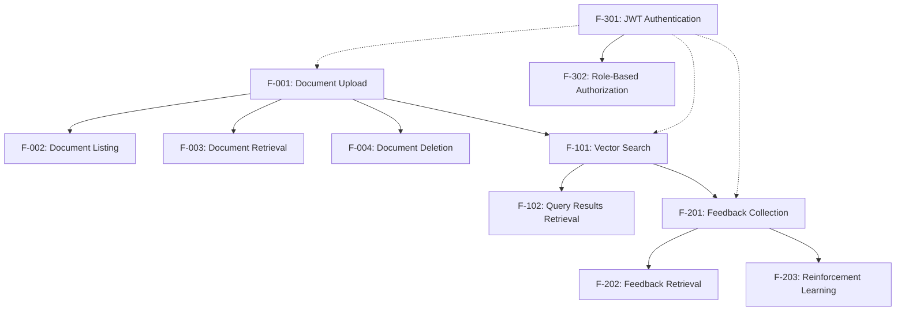
```mermaid
graph TD
    F001[F-001: Document Upload] --> F002[F-002: Document Listing]
    F001 --> F003[F-003: Document Retrieval]
    F001 --> F004[F-004: Document Deletion]
    F001 --> F101[F-101: Vector Search]
    F101 --> F102[F-102: Query Results Retrieval]
    F101 --> F201[F-201: Feedback Collection]
    F201 --> F202[F-202: Feedback Retrieval]
    F201 --> F203[F-203: Reinforcement Learning]
    F301[F-301: JWT Authentication] --> F302[F-302: Role-Based Authorization]
    F301 -.-> F001
    F301 -.-> F101
    F301 -.-> F201
```

#### 2.3.2 Integration Points

| Feature | Integration Point | Description |
| --- | --- | --- |
| F-001 | PDF Parsing Service | Integration with PyMuPDF or pdfplumber for text extraction |
| F-001, F-101 | Vector Embedding Service | Integration with Sentence Transformers or OpenAI embeddings |
| F-101, F-203 | LLM Service | Integration with OpenAI GPT or alternative LLM |
| F-301 | Authentication Service | Integration with JWT token management |

#### 2.3.3 Shared Components

| Component | Used By Features | Description |
| --- | --- | --- |
| FAISS Vector Database | F-001, F-101, F-004 | Stores and retrieves document vector embeddings |
| Relational Database | F-001, F-002, F-003, F-004, F-102, F-201, F-202 | Stores document metadata, query history, and feedback |
| LLM Integration | F-101, F-203 | Handles interaction with language model for response generation |
| Authentication Middleware | All Features | Handles JWT validation and user authentication |

### 2.4 IMPLEMENTATION CONSIDERATIONS

#### 2.4.1 Technical Constraints

| Feature | Constraint | Impact |
| --- | --- | --- |
| F-001 | PDF parsing limitations | Some complex PDF formats may not parse correctly |
| F-101 | Vector similarity limitations | Semantic search may miss some relevant documents |
| F-101, F-203 | LLM token limits | Response generation may be limited by token constraints |
| All Features | API rate limits | External service dependencies may impose rate limits |

#### 2.4.2 Performance Requirements

| Feature | Requirement | Measurement |
| --- | --- | --- |
| F-001 | Document upload and processing within 10 seconds | Response time for upload endpoint |
| F-101 | Query response within 3 seconds | Response time for query endpoint |
| F-002, F-003 | Document listing and retrieval within 1 second | Response time for respective endpoints |
| All Features | System handles 100 concurrent users | Load testing results |

#### 2.4.3 Scalability Considerations

| Component | Scalability Approach |
| --- | --- |
| FAISS | Sharding for large document collections |
| API Endpoints | Horizontal scaling with load balancing |
| Document Processing | Queue-based asynchronous processing |
| Database | Connection pooling and query optimization |

#### 2.4.4 Security Implications

| Feature | Security Consideration | Mitigation |
| --- | --- | --- |
| F-001 | Malicious file uploads | File type validation, virus scanning |
| F-301 | Token theft | Short token expiry, refresh token pattern |
| F-101 | Prompt injection | Input sanitization, LLM safety measures |
| All Features | Data exposure | Encryption at rest and in transit |

#### 2.4.5 Traceability Matrix

| Requirement ID | Feature ID | Business Requirement | Technical Implementation |
| --- | --- | --- | --- |
| F-001-RQ-001 | F-001 | Document storage | FastAPI endpoint with file upload |
| F-001-RQ-002 | F-001 | Text extraction | PyMuPDF integration |
| F-001-RQ-003 | F-001 | Vector storage | Sentence Transformers + FAISS |
| F-101-RQ-001 | F-101 | Natural language search | FastAPI endpoint with query processing |
| F-101-RQ-002 | F-101 | Semantic search | FAISS vector similarity search |
| F-101-RQ-003 | F-101 | AI responses | LLM integration with context injection |
| F-201-RQ-001 | F-201 | User feedback | FastAPI endpoint with feedback storage |
| F-301-RQ-001 | F-301 | Secure access | JWT implementation with FastAPI |

## 3. TECHNOLOGY STACK

### 3.1 PROGRAMMING LANGUAGES

| Language | Component | Justification | Version |
| --- | --- | --- | --- |
| Python | Backend API, Document Processing, Vector Search | Python offers excellent support for AI/ML libraries, natural language processing, and vector operations. It provides a balance of development speed and performance for this application. | 3.10+ |
| SQL | Database Queries | Required for interacting with PostgreSQL database for document metadata and user feedback storage. | Standard SQL |

Python is the primary language for this project due to its rich ecosystem of libraries for document processing, vector operations, and AI integration. Its simplicity and readability also facilitate maintenance and future extensions of the codebase.

### 3.2 FRAMEWORKS & LIBRARIES

#### 3.2.1 Core Frameworks

| Framework | Purpose | Justification | Version |
| --- | --- | --- | --- |
| FastAPI | API Development | FastAPI provides high performance, automatic OpenAPI documentation, and type validation. It's well-suited for async operations needed for document processing and search. | 0.95.0+ |
| SQLAlchemy | ORM | Provides a pythonic interface to the database, simplifying data operations and providing migration capabilities. | 2.0.0+ |
| Pydantic | Data Validation | Integrates seamlessly with FastAPI for request/response validation and provides clean data modeling. | 2.0.0+ |

#### 3.2.2 Document Processing Libraries

| Library | Purpose | Justification | Version |
| --- | --- | --- | --- |
| PyMuPDF | PDF Processing | Efficient library for extracting text and metadata from PDF documents with good performance characteristics. | 1.21.0+ |
| Sentence Transformers | Text Embedding | Provides pre-trained models for generating high-quality text embeddings suitable for semantic search. | 2.2.2+ |
| FAISS | Vector Database | Facebook AI Similarity Search (FAISS) offers efficient similarity search and clustering of dense vectors with optimized performance. | 1.7.4+ |

#### 3.2.3 AI and Machine Learning Libraries

| Library | Purpose | Justification | Version |
| --- | --- | --- | --- |
| OpenAI API Client | LLM Integration | Provides access to GPT models for generating contextual responses based on document content. | Latest |
| Ray RLlib | Reinforcement Learning | Scalable library for reinforcement learning that can be used for the feedback-based learning system. | 2.5.0+ |
| NumPy | Numerical Operations | Fundamental package for scientific computing with Python, used for vector operations. | 1.24.0+ |

#### 3.2.4 Authentication and Security

| Library | Purpose | Justification | Version |
| --- | --- | --- | --- |
| PyJWT | JWT Implementation | Industry-standard implementation for JSON Web Tokens in Python. | 2.6.0+ |
| Passlib | Password Hashing | Comprehensive password hashing library for secure user authentication. | 1.7.4+ |
| python-multipart | File Upload | Handles multipart/form-data for document uploads. | 0.0.6+ |

### 3.3 DATABASES & STORAGE

| Database/Storage | Purpose | Justification | Version |
| --- | --- | --- | --- |
| PostgreSQL | Relational Database | Robust, open-source relational database for storing document metadata, user information, and feedback data. Provides advanced querying capabilities and transaction support. | 14.0+ |
| FAISS | Vector Database | Specialized database for efficient storage and similarity search of high-dimensional vectors representing document content. | 1.7.4+ |
| File System | Document Storage | Local or cloud-based file system for storing original document files. | N/A |

#### 3.3.1 Data Persistence Strategy

- **Document Metadata**: Stored in PostgreSQL with proper indexing for efficient retrieval
- **Vector Embeddings**: Stored in FAISS for fast similarity search
- **Original Documents**: Stored in file system with references in PostgreSQL
- **User Feedback**: Stored in PostgreSQL with relationships to queries and responses

### 3.4 THIRD-PARTY SERVICES

| Service | Purpose | Justification | Integration Method |
| --- | --- | --- | --- |
| OpenAI API | LLM Provider | Provides access to state-of-the-art language models for generating contextual responses based on document content. | REST API |

The system is designed to be self-contained with minimal external dependencies, which reduces operational complexity and potential points of failure. The OpenAI API is the only critical external service required for the core functionality of generating contextual responses.

### 3.5 DEVELOPMENT & DEPLOYMENT

#### 3.5.1 Development Tools

| Tool | Purpose | Justification |
| --- | --- | --- |
| Poetry | Dependency Management | Modern Python dependency management with reproducible builds and virtual environment handling. |
| Black | Code Formatting | Enforces consistent code style across the codebase. |
| Flake8 | Linting | Identifies potential errors and enforces coding standards. |
| Pytest | Testing | Comprehensive testing framework for unit and integration tests. |
| Docker | Containerization | Ensures consistent development and deployment environments. |

#### 3.5.2 Deployment Architecture

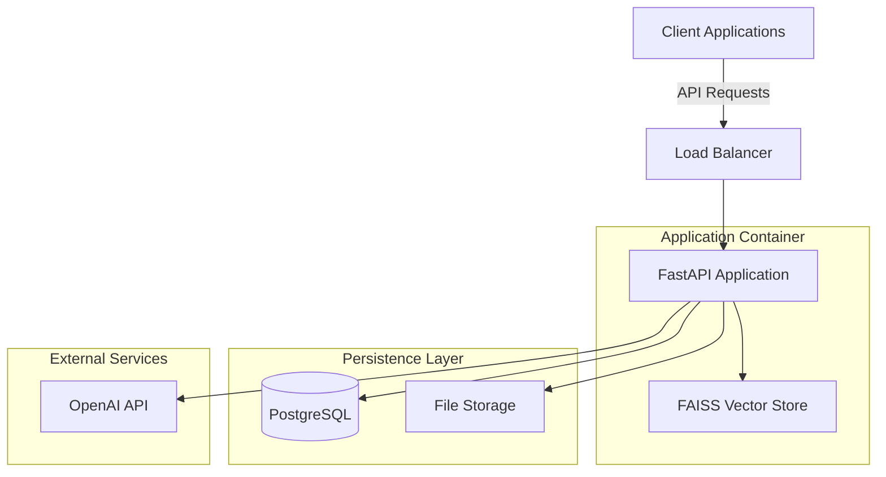
```mermaid
graph TD
    Client[Client Applications] -->|API Requests| LB[Load Balancer]
    LB --> API[FastAPI Application]
    API --> DB[(PostgreSQL)]
    API --> VS[FAISS Vector Store]
    API --> FS[File Storage]
    API --> LLM[OpenAI API]
    
    subgraph "Application Container"
        API
        VS
    end
    
    subgraph "Persistence Layer"
        DB
        FS
    end
    
    subgraph "External Services"
        LLM
    end
```

#### 3.5.3 Containerization Strategy

The application will be containerized using Docker with the following components:

- **Application Container**: Contains the FastAPI application, document processing libraries, and FAISS vector store
- **Database Container**: PostgreSQL database for metadata and user data
- **Volume Mounts**: For persistent storage of documents and vector indices

This containerization approach ensures consistent deployment across environments and simplifies scaling and management.

#### 3.5.4 CI/CD Requirements

| Stage | Tools | Purpose |
| --- | --- | --- |
| Code Validation | GitHub Actions | Run linting, formatting checks, and unit tests on pull requests |
| Build | Docker | Build container images for deployment |
| Testing | Pytest | Run integration tests against containerized application |
| Deployment | Docker Compose | Deploy application stack to target environment |

The CI/CD pipeline will ensure code quality through automated testing and provide a streamlined path to deployment with minimal manual intervention.

## 4. PROCESS FLOWCHART

### 4.1 SYSTEM WORKFLOWS

#### 4.1.1 Core Business Processes

##### Document Upload and Processing Workflow

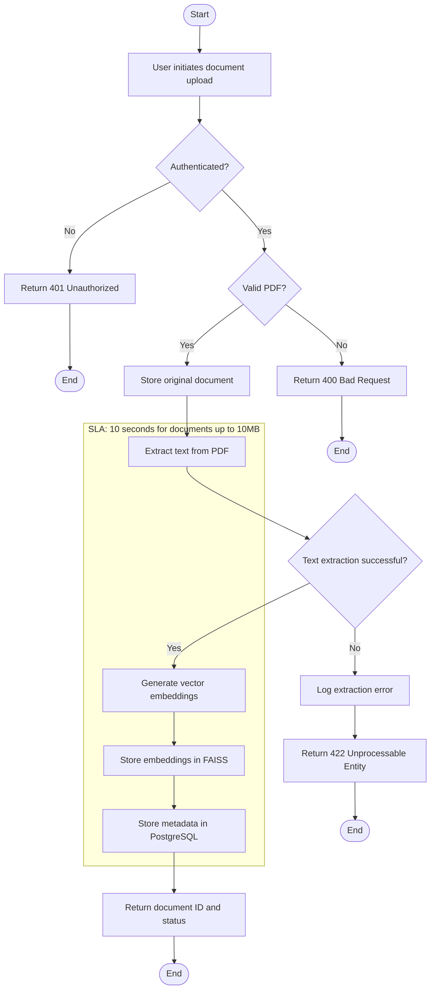
```mermaid
flowchart TD
    Start([Start]) --> A[User initiates document upload]
    A --> B{Authenticated?}
    B -->|No| C[Return 401 Unauthorized]
    C --> End1([End])
    
    B -->|Yes| D{Valid PDF?}
    D -->|No| E[Return 400 Bad Request]
    E --> End2([End])
    
    D -->|Yes| F[Store original document]
    F --> G[Extract text from PDF]
    G --> H{Text extraction successful?}
    
    H -->|No| I[Log extraction error]
    I --> J[Return 422 Unprocessable Entity]
    J --> End3([End])
    
    H -->|Yes| K[Generate vector embeddings]
    K --> L[Store embeddings in FAISS]
    L --> M[Store metadata in PostgreSQL]
    M --> N[Return document ID and status]
    N --> End4([End])
    
    subgraph "SLA: 10 seconds for documents up to 10MB"
    G
    K
    L
    M
    end
```

##### Query and Response Workflow

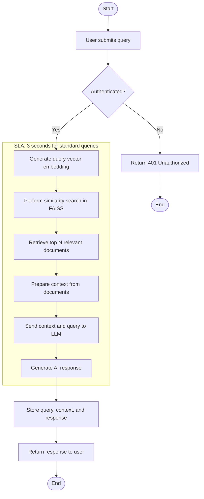
```mermaid
flowchart TD
    Start([Start]) --> A[User submits query]
    A --> B{Authenticated?}
    B -->|No| C[Return 401 Unauthorized]
    C --> End1([End])
    
    B -->|Yes| D[Generate query vector embedding]
    D --> E[Perform similarity search in FAISS]
    E --> F[Retrieve top N relevant documents]
    F --> G[Prepare context from documents]
    G --> H[Send context and query to LLM]
    H --> I[Generate AI response]
    I --> J[Store query, context, and response]
    J --> K[Return response to user]
    K --> End2([End])
    
    subgraph "SLA: 3 seconds for standard queries"
    D
    E
    F
    G
    H
    I
    end
```

##### Feedback and Reinforcement Learning Workflow

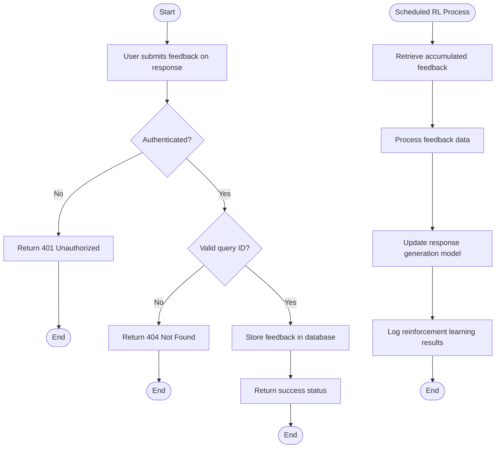
```mermaid
flowchart TD
    Start([Start]) --> A[User submits feedback on response]
    A --> B{Authenticated?}
    B -->|No| C[Return 401 Unauthorized]
    C --> End1([End])
    
    B -->|Yes| D{Valid query ID?}
    D -->|No| E[Return 404 Not Found]
    E --> End2([End])
    
    D -->|Yes| F[Store feedback in database]
    F --> G[Return success status]
    G --> End3([End])
    
    H([Scheduled RL Process]) --> I[Retrieve accumulated feedback]
    I --> J[Process feedback data]
    J --> K[Update response generation model]
    K --> L[Log reinforcement learning results]
    L --> End4([End])
```

#### 4.1.2 Integration Workflows

##### LLM Integration Workflow

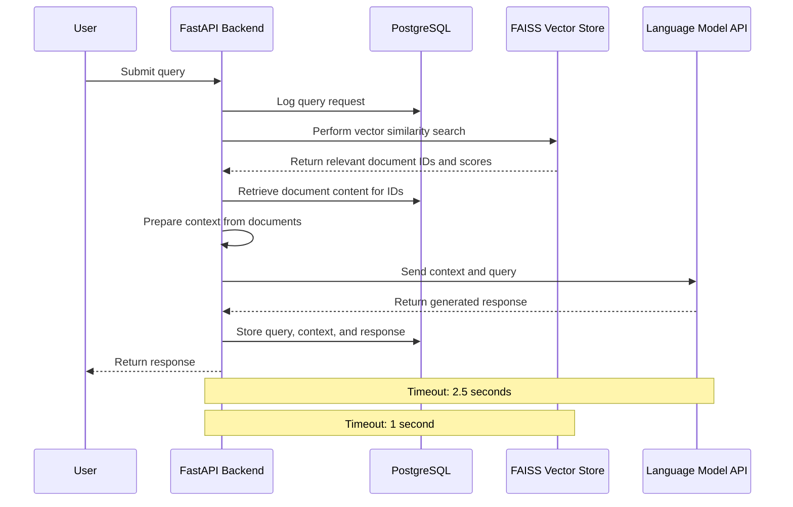
```mermaid
sequenceDiagram
    participant User
    participant API as FastAPI Backend
    participant DB as PostgreSQL
    participant VS as FAISS Vector Store
    participant LLM as Language Model API
    
    User->>API: Submit query
    API->>DB: Log query request
    API->>VS: Perform vector similarity search
    VS-->>API: Return relevant document IDs and scores
    API->>DB: Retrieve document content for IDs
    API->>API: Prepare context from documents
    API->>LLM: Send context and query
    LLM-->>API: Return generated response
    API->>DB: Store query, context, and response
    API-->>User: Return response
    
    Note over API,LLM: Timeout: 2.5 seconds
    Note over API,VS: Timeout: 1 second
```

##### Document Processing Integration

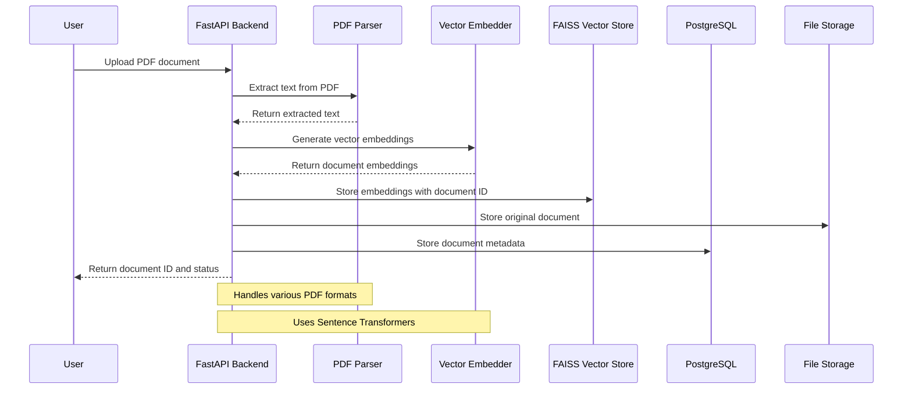
```mermaid
sequenceDiagram
    participant User
    participant API as FastAPI Backend
    participant Parser as PDF Parser
    participant Embedder as Vector Embedder
    participant VS as FAISS Vector Store
    participant DB as PostgreSQL
    participant FS as File Storage
    
    User->>API: Upload PDF document
    API->>Parser: Extract text from PDF
    Parser-->>API: Return extracted text
    API->>Embedder: Generate vector embeddings
    Embedder-->>API: Return document embeddings
    API->>VS: Store embeddings with document ID
    API->>FS: Store original document
    API->>DB: Store document metadata
    API-->>User: Return document ID and status
    
    Note over API,Parser: Handles various PDF formats
    Note over API,Embedder: Uses Sentence Transformers
```

### 4.2 FLOWCHART REQUIREMENTS

#### 4.2.1 Document Management Workflow

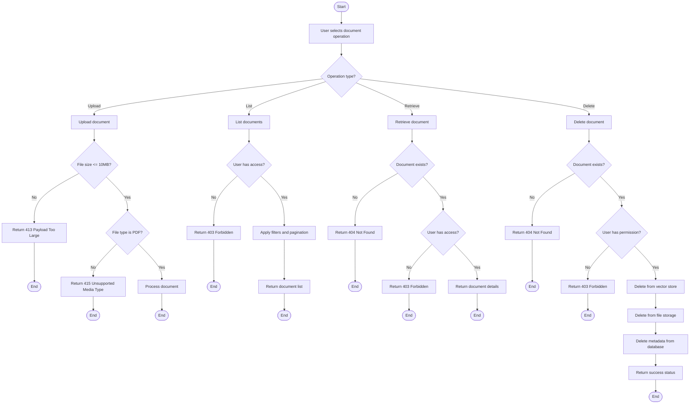
```mermaid
flowchart TD
    Start([Start]) --> A[User selects document operation]
    
    A --> B{Operation type?}
    
    B -->|Upload| C[Upload document]
    C --> C1{File size <= 10MB?}
    C1 -->|No| C2[Return 413 Payload Too Large]
    C2 --> End1([End])
    C1 -->|Yes| C3{File type is PDF?}
    C3 -->|No| C4[Return 415 Unsupported Media Type]
    C4 --> End2([End])
    C3 -->|Yes| C5[Process document]
    C5 --> End3([End])
    
    B -->|List| D[List documents]
    D --> D1{User has access?}
    D1 -->|No| D2[Return 403 Forbidden]
    D2 --> End4([End])
    D1 -->|Yes| D3[Apply filters and pagination]
    D3 --> D4[Return document list]
    D4 --> End5([End])
    
    B -->|Retrieve| E[Retrieve document]
    E --> E1{Document exists?}
    E1 -->|No| E2[Return 404 Not Found]
    E2 --> End6([End])
    E1 -->|Yes| E3{User has access?}
    E3 -->|No| E4[Return 403 Forbidden]
    E4 --> End7([End])
    E3 -->|Yes| E5[Return document details]
    E5 --> End8([End])
    
    B -->|Delete| F[Delete document]
    F --> F1{Document exists?}
    F1 -->|No| F2[Return 404 Not Found]
    F2 --> End9([End])
    F1 -->|Yes| F3{User has permission?}
    F3 -->|No| F4[Return 403 Forbidden]
    F4 --> End10([End])
    F3 -->|Yes| F5[Delete from vector store]
    F5 --> F6[Delete from file storage]
    F6 --> F7[Delete metadata from database]
    F7 --> F8[Return success status]
    F8 --> End11([End])
```

#### 4.2.2 Vector Search Workflow

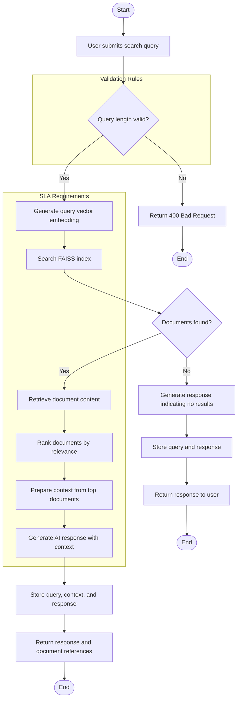
```mermaid
flowchart TD
    Start([Start]) --> A[User submits search query]
    A --> B{Query length valid?}
    B -->|No| C[Return 400 Bad Request]
    C --> End1([End])
    
    B -->|Yes| D[Generate query vector embedding]
    D --> E[Search FAISS index]
    E --> F{Documents found?}
    
    F -->|No| G[Generate response indicating no results]
    G --> H[Store query and response]
    H --> I[Return response to user]
    I --> End2([End])
    
    F -->|Yes| J[Retrieve document content]
    J --> K[Rank documents by relevance]
    K --> L[Prepare context from top documents]
    L --> M[Generate AI response with context]
    M --> N[Store query, context, and response]
    N --> O[Return response and document references]
    O --> End3([End])
    
    subgraph "Validation Rules"
    B
    end
    
    subgraph "SLA Requirements"
    D
    E
    J
    K
    L
    M
    end
```

#### 4.2.3 Authentication and Authorization Workflow

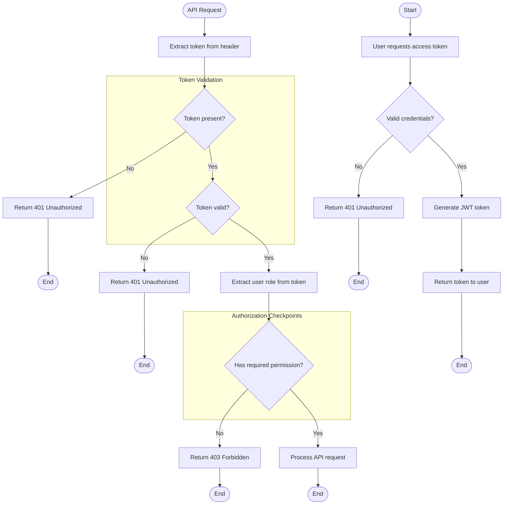
```mermaid
flowchart TD
    Start([Start]) --> A[User requests access token]
    A --> B{Valid credentials?}
    B -->|No| C[Return 401 Unauthorized]
    C --> End1([End])
    
    B -->|Yes| D[Generate JWT token]
    D --> E[Return token to user]
    E --> End2([End])
    
    F([API Request]) --> G[Extract token from header]
    G --> H{Token present?}
    H -->|No| I[Return 401 Unauthorized]
    I --> End3([End])
    
    H -->|Yes| J{Token valid?}
    J -->|No| K[Return 401 Unauthorized]
    K --> End4([End])
    
    J -->|Yes| L[Extract user role from token]
    L --> M{Has required permission?}
    M -->|No| N[Return 403 Forbidden]
    N --> End5([End])
    
    M -->|Yes| O[Process API request]
    O --> End6([End])
    
    subgraph "Authorization Checkpoints"
    M
    end
    
    subgraph "Token Validation"
    H
    J
    end
```

### 4.3 TECHNICAL IMPLEMENTATION

#### 4.3.1 State Management Diagram

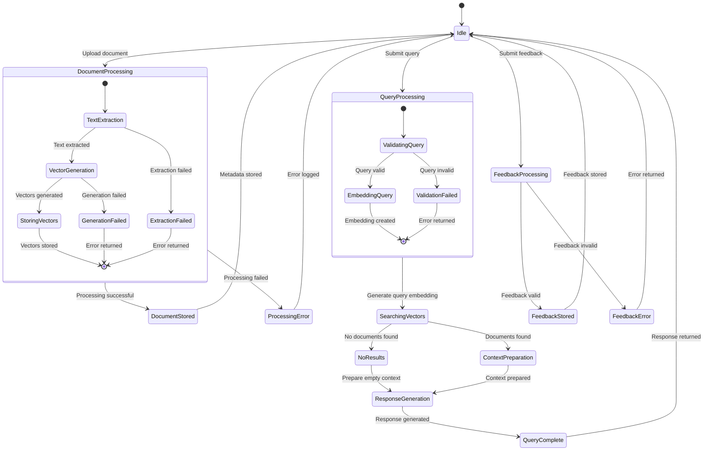
```mermaid
stateDiagram-v2
    [*] --> Idle
    
    Idle --> DocumentProcessing: Upload document
    DocumentProcessing --> DocumentStored: Processing successful
    DocumentProcessing --> ProcessingError: Processing failed
    ProcessingError --> Idle: Error logged
    DocumentStored --> Idle: Metadata stored
    
    Idle --> QueryProcessing: Submit query
    QueryProcessing --> SearchingVectors: Generate query embedding
    SearchingVectors --> ContextPreparation: Documents found
    SearchingVectors --> NoResults: No documents found
    NoResults --> ResponseGeneration: Prepare empty context
    ContextPreparation --> ResponseGeneration: Context prepared
    ResponseGeneration --> QueryComplete: Response generated
    QueryComplete --> Idle: Response returned
    
    Idle --> FeedbackProcessing: Submit feedback
    FeedbackProcessing --> FeedbackStored: Feedback valid
    FeedbackProcessing --> FeedbackError: Feedback invalid
    FeedbackStored --> Idle: Feedback stored
    FeedbackError --> Idle: Error returned
    
    state DocumentProcessing {
        [*] --> TextExtraction
        TextExtraction --> VectorGeneration: Text extracted
        TextExtraction --> ExtractionFailed: Extraction failed
        VectorGeneration --> StoringVectors: Vectors generated
        VectorGeneration --> GenerationFailed: Generation failed
        StoringVectors --> [*]: Vectors stored
        ExtractionFailed --> [*]: Error returned
        GenerationFailed --> [*]: Error returned
    }
    
    state QueryProcessing {
        [*] --> ValidatingQuery
        ValidatingQuery --> EmbeddingQuery: Query valid
        ValidatingQuery --> ValidationFailed: Query invalid
        EmbeddingQuery --> [*]: Embedding created
        ValidationFailed --> [*]: Error returned
    }
```

#### 4.3.2 Error Handling Flowchart

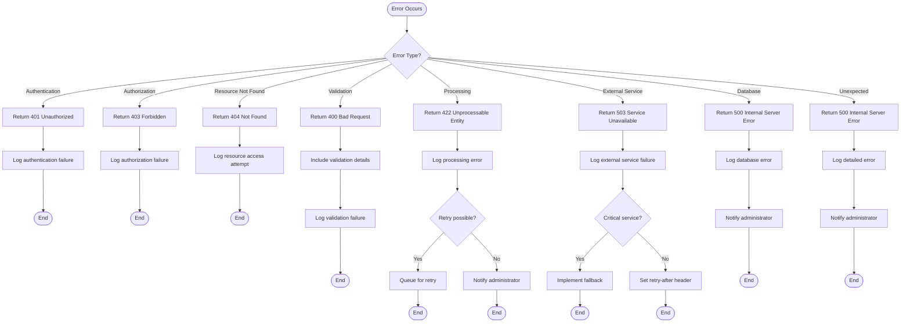
```mermaid
flowchart TD
    Start([Error Occurs]) --> A{Error Type?}
    
    A -->|Authentication| B[Return 401 Unauthorized]
    B --> B1[Log authentication failure]
    B1 --> End1([End])
    
    A -->|Authorization| C[Return 403 Forbidden]
    C --> C1[Log authorization failure]
    C1 --> End2([End])
    
    A -->|Resource Not Found| D[Return 404 Not Found]
    D --> D1[Log resource access attempt]
    D1 --> End3([End])
    
    A -->|Validation| E[Return 400 Bad Request]
    E --> E1[Include validation details]
    E1 --> E2[Log validation failure]
    E2 --> End4([End])
    
    A -->|Processing| F[Return 422 Unprocessable Entity]
    F --> F1[Log processing error]
    F1 --> F2{Retry possible?}
    F2 -->|Yes| F3[Queue for retry]
    F3 --> End5([End])
    F2 -->|No| F4[Notify administrator]
    F4 --> End6([End])
    
    A -->|External Service| G[Return 503 Service Unavailable]
    G --> G1[Log external service failure]
    G1 --> G2{Critical service?}
    G2 -->|Yes| G3[Implement fallback]
    G3 --> End7([End])
    G2 -->|No| G4[Set retry-after header]
    G4 --> End8([End])
    
    A -->|Database| H[Return 500 Internal Server Error]
    H --> H1[Log database error]
    H1 --> H2[Notify administrator]
    H2 --> End9([End])
    
    A -->|Unexpected| I[Return 500 Internal Server Error]
    I --> I1[Log detailed error]
    I1 --> I2[Notify administrator]
    I2 --> End10([End])
```

### 4.4 INTEGRATION SEQUENCE DIAGRAMS

#### 4.4.1 Document Upload Sequence

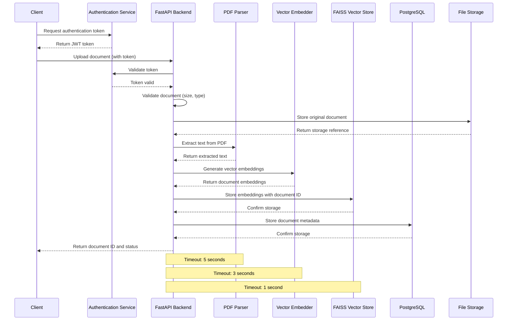
```mermaid
sequenceDiagram
    participant Client
    participant Auth as Authentication Service
    participant API as FastAPI Backend
    participant Parser as PDF Parser
    participant Embedder as Vector Embedder
    participant FAISS as FAISS Vector Store
    participant DB as PostgreSQL
    participant FS as File Storage
    
    Client->>Auth: Request authentication token
    Auth-->>Client: Return JWT token
    
    Client->>API: Upload document (with token)
    API->>Auth: Validate token
    Auth-->>API: Token valid
    
    API->>API: Validate document (size, type)
    API->>FS: Store original document
    FS-->>API: Return storage reference
    
    API->>Parser: Extract text from PDF
    Parser-->>API: Return extracted text
    
    API->>Embedder: Generate vector embeddings
    Embedder-->>API: Return document embeddings
    
    API->>FAISS: Store embeddings with document ID
    FAISS-->>API: Confirm storage
    
    API->>DB: Store document metadata
    DB-->>API: Confirm storage
    
    API-->>Client: Return document ID and status
    
    Note over API,Parser: Timeout: 5 seconds
    Note over API,Embedder: Timeout: 3 seconds
    Note over API,FAISS: Timeout: 1 second
```

#### 4.4.2 Query Processing Sequence

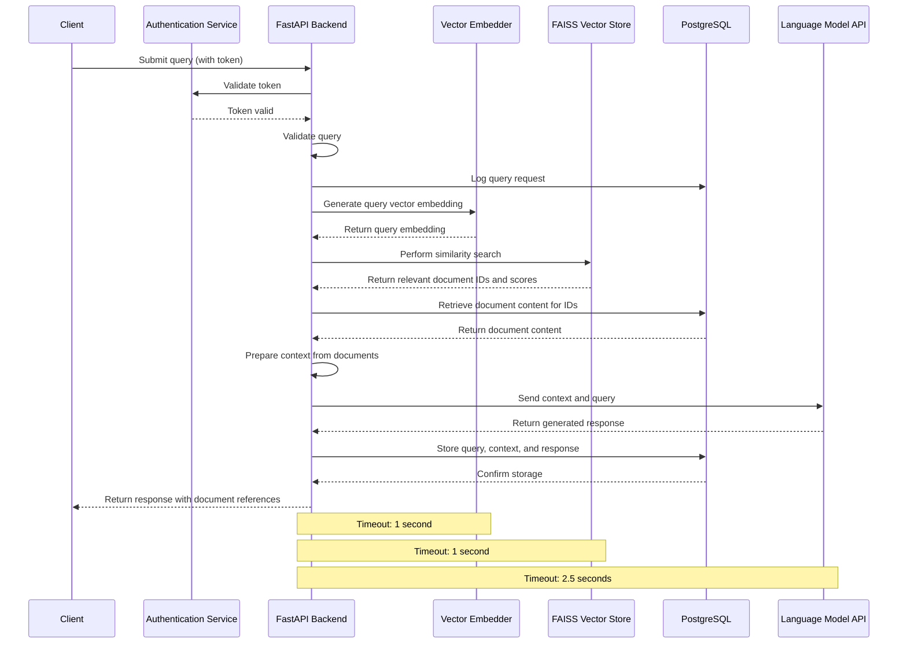
```mermaid
sequenceDiagram
    participant Client
    participant Auth as Authentication Service
    participant API as FastAPI Backend
    participant Embedder as Vector Embedder
    participant FAISS as FAISS Vector Store
    participant DB as PostgreSQL
    participant LLM as Language Model API
    
    Client->>API: Submit query (with token)
    API->>Auth: Validate token
    Auth-->>API: Token valid
    
    API->>API: Validate query
    API->>DB: Log query request
    
    API->>Embedder: Generate query vector embedding
    Embedder-->>API: Return query embedding
    
    API->>FAISS: Perform similarity search
    FAISS-->>API: Return relevant document IDs and scores
    
    API->>DB: Retrieve document content for IDs
    DB-->>API: Return document content
    
    API->>API: Prepare context from documents
    
    API->>LLM: Send context and query
    LLM-->>API: Return generated response
    
    API->>DB: Store query, context, and response
    DB-->>API: Confirm storage
    
    API-->>Client: Return response with document references
    
    Note over API,Embedder: Timeout: 1 second
    Note over API,FAISS: Timeout: 1 second
    Note over API,LLM: Timeout: 2.5 seconds
```

### 4.5 STATE TRANSITION DIAGRAMS

#### 4.5.1 Document Lifecycle

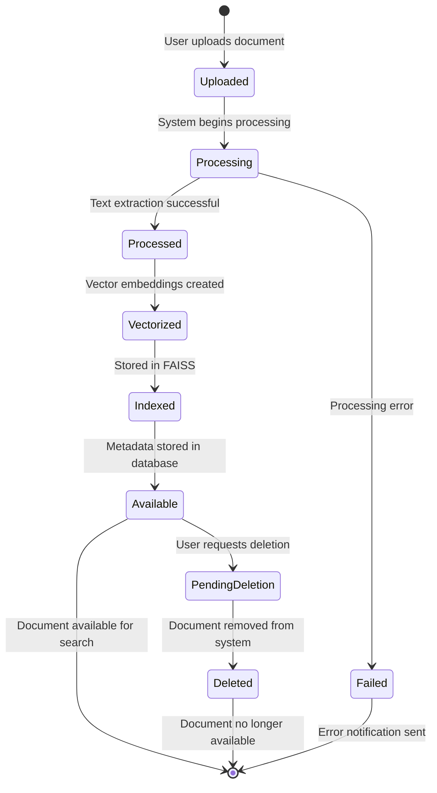
```mermaid
stateDiagram-v2
    [*] --> Uploaded: User uploads document
    
    Uploaded --> Processing: System begins processing
    Processing --> Failed: Processing error
    Processing --> Processed: Text extraction successful
    
    Processed --> Vectorized: Vector embeddings created
    Vectorized --> Indexed: Stored in FAISS
    Indexed --> Available: Metadata stored in database
    
    Available --> [*]: Document available for search
    
    Available --> PendingDeletion: User requests deletion
    PendingDeletion --> Deleted: Document removed from system
    Deleted --> [*]: Document no longer available
    
    Failed --> [*]: Error notification sent
```

#### 4.5.2 Query Processing States

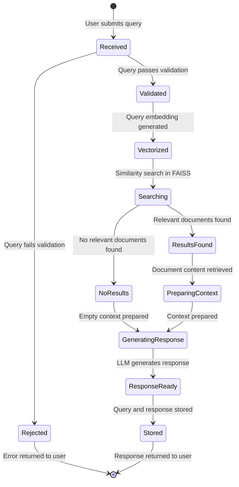
```mermaid
stateDiagram-v2
    [*] --> Received: User submits query
    
    Received --> Validated: Query passes validation
    Received --> Rejected: Query fails validation
    Rejected --> [*]: Error returned to user
    
    Validated --> Vectorized: Query embedding generated
    Vectorized --> Searching: Similarity search in FAISS
    
    Searching --> NoResults: No relevant documents found
    Searching --> ResultsFound: Relevant documents found
    
    NoResults --> GeneratingResponse: Empty context prepared
    ResultsFound --> PreparingContext: Document content retrieved
    PreparingContext --> GeneratingResponse: Context prepared
    
    GeneratingResponse --> ResponseReady: LLM generates response
    ResponseReady --> Stored: Query and response stored
    Stored --> [*]: Response returned to user
```

#### 4.5.3 Feedback Processing States

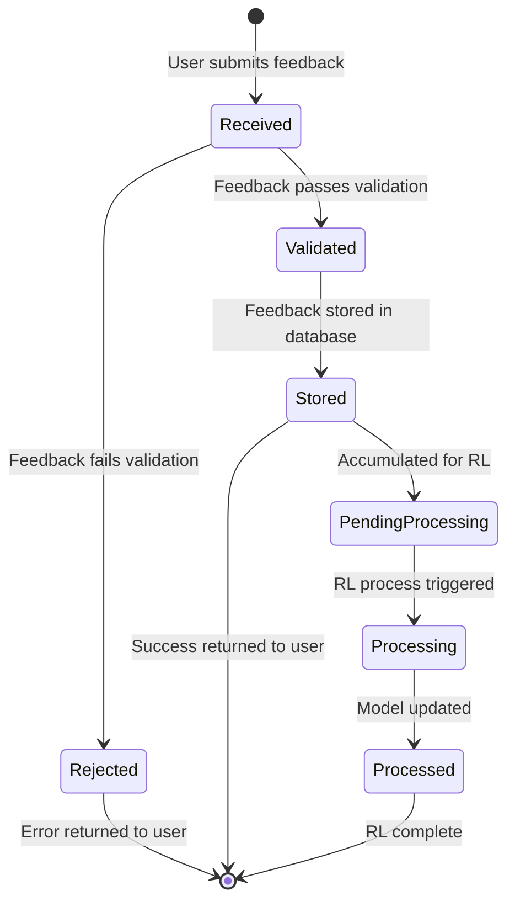
```mermaid
stateDiagram-v2
    [*] --> Received: User submits feedback
    
    Received --> Validated: Feedback passes validation
    Received --> Rejected: Feedback fails validation
    Rejected --> [*]: Error returned to user
    
    Validated --> Stored: Feedback stored in database
    Stored --> [*]: Success returned to user
    
    Stored --> PendingProcessing: Accumulated for RL
    PendingProcessing --> Processing: RL process triggered
    Processing --> Processed: Model updated
    Processed --> [*]: RL complete
```

## 5. SYSTEM ARCHITECTURE

### 5.1 HIGH-LEVEL ARCHITECTURE

#### 5.1.1 System Overview

The Document Management and AI Chatbot System follows a layered architecture with a modular design to support document processing, vector search, and AI-powered responses. The system adopts a monolithic deployment approach initially, with clear component boundaries to facilitate future migration to microservices if needed.

Key architectural principles include:

- **Separation of concerns**: Clear boundaries between document management, vector search, and AI response generation
- **API-first design**: All functionality exposed through well-defined REST APIs
- **Stateless processing**: Core processing components maintain minimal state for scalability
- **Asynchronous processing**: Document processing and vector generation handled asynchronously
- **Data isolation**: Clear separation between document storage, vector database, and metadata

System boundaries are defined by the FastAPI application, which serves as the entry point for all client interactions. Major interfaces include the Document Management API, Vector Search API, and Reinforcement Learning API, all exposed as RESTful endpoints.

#### 5.1.2 Core Components Table

| Component Name | Primary Responsibility | Key Dependencies | Critical Considerations |
| --- | --- | --- | --- |
| API Layer | Handle HTTP requests, authentication, and routing | FastAPI, Pydantic, JWT | Request validation, error handling, authentication |
| Document Processor | Extract text from PDFs and prepare for vectorization | PyMuPDF, asyncio | Document size limits, text extraction quality |
| Vector Engine | Generate and store document embeddings, perform similarity search | FAISS, Sentence Transformers | Vector quality, search performance, index management |
| LLM Connector | Interface with language models for response generation | OpenAI API or alternative LLM | Token limits, prompt engineering, response quality |
| Feedback Manager | Collect and process user feedback for reinforcement learning | SQLAlchemy, Ray RLlib | Feedback quality, learning rate, model improvement |
| Data Store | Manage document metadata and system state | PostgreSQL, SQLAlchemy | Data consistency, query performance |

#### 5.1.3 Data Flow Description

The primary data flow begins with document upload, where PDFs are processed through the Document Processor to extract text. The extracted text is then passed to the Vector Engine, which generates embeddings using Sentence Transformers and stores them in the FAISS index. Document metadata is stored in PostgreSQL through the Data Store component.

For queries, user input is processed by the API Layer and passed to the Vector Engine, which generates a query embedding and performs similarity search in FAISS. The most relevant document segments are retrieved and combined with the original query to form a prompt for the LLM Connector. The LLM generates a response based on the document context, which is returned to the user along with references to the source documents.

Feedback flows from the API Layer to the Feedback Manager, which stores user ratings and uses them to periodically update the response generation process through reinforcement learning techniques.

Data transformation occurs primarily at three points:

1. Document text extraction (PDF to plain text)
2. Vector embedding generation (text to vector embeddings)
3. Context preparation (document segments to LLM prompt)

#### 5.1.4 External Integration Points

| System Name | Integration Type | Data Exchange Pattern | Protocol/Format | SLA Requirements |
| --- | --- | --- | --- | --- |
| OpenAI API | Service API | Request-Response | HTTPS/JSON | Response time \< 2.5s, 99.9% availability |
| File Storage | Storage Service | Write-Read | File System API | Read/Write latency \< 100ms |
| PostgreSQL | Database | CRUD Operations | SQL/TCP | Query response \< 100ms, 99.99% availability |

### 5.2 COMPONENT DETAILS

#### 5.2.1 API Layer

**Purpose and Responsibilities:**

- Handle HTTP requests and responses
- Implement authentication and authorization
- Validate request data using Pydantic models
- Route requests to appropriate processing components
- Handle error conditions and generate appropriate responses

**Technologies and Frameworks:**

- FastAPI for API implementation
- Pydantic for data validation
- PyJWT for token-based authentication
- Starlette for middleware support

**Key Interfaces:**

- `/documents/*` endpoints for document management
- `/query/*` endpoints for vector search and chatbot interaction
- `/feedback/*` endpoints for reinforcement learning

**Data Persistence Requirements:**

- No direct persistence, delegates to Data Store component
- Maintains JWT secret for token validation

**Scaling Considerations:**

- Stateless design allows horizontal scaling
- Can be deployed behind load balancer for high availability

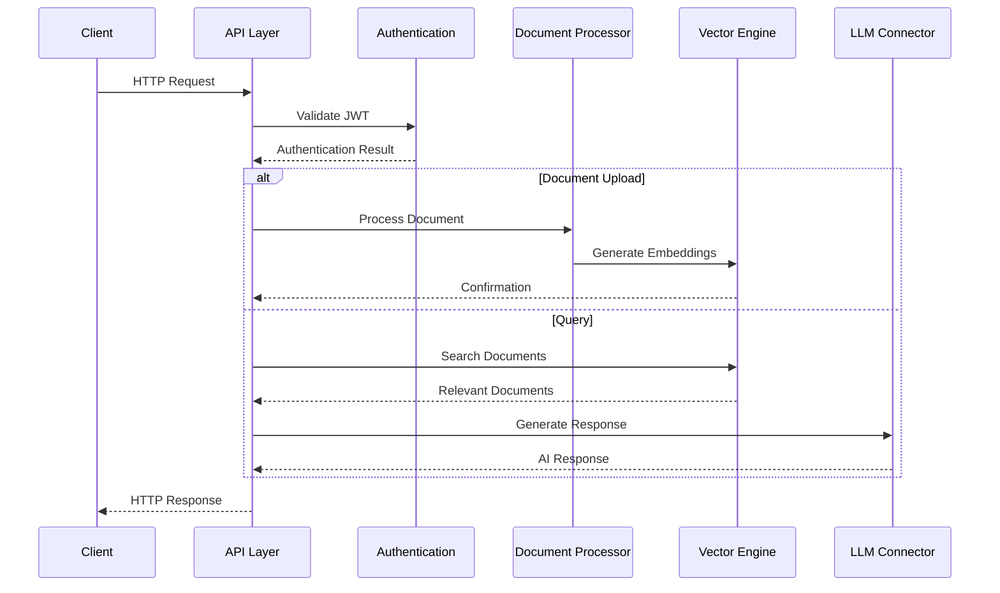
```mermaid
sequenceDiagram
    participant Client
    participant APILayer as API Layer
    participant Auth as Authentication
    participant DocProcessor as Document Processor
    participant VectorEngine as Vector Engine
    participant LLMConnector as LLM Connector
    
    Client->>APILayer: HTTP Request
    APILayer->>Auth: Validate JWT
    Auth-->>APILayer: Authentication Result
    
    alt Document Upload
        APILayer->>DocProcessor: Process Document
        DocProcessor->>VectorEngine: Generate Embeddings
        VectorEngine-->>APILayer: Confirmation
    else Query
        APILayer->>VectorEngine: Search Documents
        VectorEngine-->>APILayer: Relevant Documents
        APILayer->>LLMConnector: Generate Response
        LLMConnector-->>APILayer: AI Response
    end
    
    APILayer-->>Client: HTTP Response
```

#### 5.2.2 Document Processor

**Purpose and Responsibilities:**

- Extract text content from PDF documents
- Clean and normalize document text
- Split documents into manageable chunks
- Prepare document text for vector embedding

**Technologies and Frameworks:**

- PyMuPDF for PDF text extraction
- Python text processing libraries
- Asyncio for non-blocking processing

**Key Interfaces:**

- `process_document(file)`: Processes uploaded document
- `extract_text(document)`: Extracts text from document
- `chunk_document(text)`: Splits document into processable chunks

**Data Persistence Requirements:**

- Temporary storage of document chunks during processing
- No long-term persistence requirements

**Scaling Considerations:**

- CPU-intensive operations can be offloaded to worker processes
- Document processing can be parallelized for multiple uploads

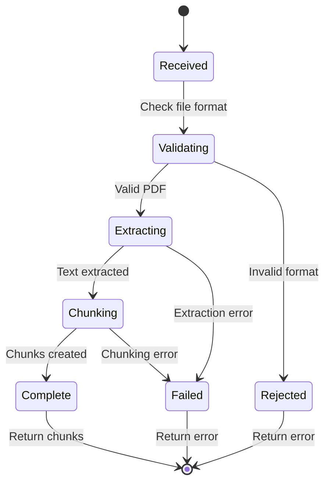
```mermaid
stateDiagram-v2
    [*] --> Received
    Received --> Validating: Check file format
    Validating --> Extracting: Valid PDF
    Validating --> Rejected: Invalid format
    Extracting --> Chunking: Text extracted
    Extracting --> Failed: Extraction error
    Chunking --> Complete: Chunks created
    Chunking --> Failed: Chunking error
    Complete --> [*]: Return chunks
    Rejected --> [*]: Return error
    Failed --> [*]: Return error
```

#### 5.2.3 Vector Engine

**Purpose and Responsibilities:**

- Generate vector embeddings for document chunks
- Maintain FAISS index for vector storage and retrieval
- Perform similarity search for query processing
- Rank and retrieve relevant document chunks

**Technologies and Frameworks:**

- FAISS for vector storage and similarity search
- Sentence Transformers for embedding generation
- NumPy for vector operations

**Key Interfaces:**

- `generate_embedding(text)`: Creates vector embedding for text
- `add_to_index(document_id, embedding)`: Adds embedding to FAISS
- `search(query_embedding, top_k)`: Performs similarity search
- `delete_from_index(document_id)`: Removes document from index

**Data Persistence Requirements:**

- FAISS index for vector storage
- Mapping between vector IDs and document chunks

**Scaling Considerations:**

- FAISS supports distributed indices for large document collections
- Embedding generation can be parallelized or offloaded to GPU

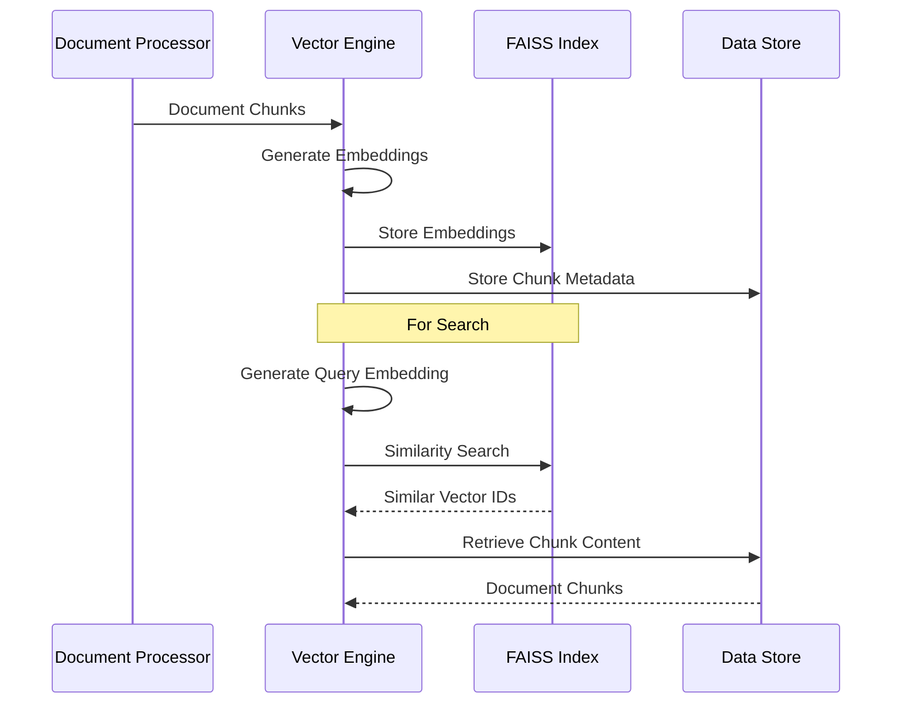
```mermaid
sequenceDiagram
    participant DocProcessor as Document Processor
    participant VectorEngine as Vector Engine
    participant FAISS as FAISS Index
    participant DataStore as Data Store
    
    DocProcessor->>VectorEngine: Document Chunks
    VectorEngine->>VectorEngine: Generate Embeddings
    VectorEngine->>FAISS: Store Embeddings
    VectorEngine->>DataStore: Store Chunk Metadata
    
    Note over VectorEngine,FAISS: For Search
    VectorEngine->>VectorEngine: Generate Query Embedding
    VectorEngine->>FAISS: Similarity Search
    FAISS-->>VectorEngine: Similar Vector IDs
    VectorEngine->>DataStore: Retrieve Chunk Content
    DataStore-->>VectorEngine: Document Chunks
```

#### 5.2.4 LLM Connector

**Purpose and Responsibilities:**

- Interface with language model API
- Construct prompts from query and document context
- Process and format LLM responses
- Handle token limits and context management

**Technologies and Frameworks:**

- OpenAI API client or alternative LLM integration
- Prompt engineering techniques
- Context window management

**Key Interfaces:**

- `generate_response(query, context)`: Generates AI response
- `format_prompt(query, documents)`: Creates prompt from context
- `process_response(llm_response)`: Formats response for client

**Data Persistence Requirements:**

- Caching of common queries and responses
- No long-term persistence requirements

**Scaling Considerations:**

- API rate limiting and token budget management
- Response caching for frequently asked questions

```mermaid
sequenceDiagram
    participant VectorEngine as Vector Engine
    participant LLMConnector as LLM Connector
    participant LLM as Language Model API
    participant DataStore as Data Store
    
    VectorEngine->>LLMConnector: Query + Relevant Documents
    LLMConnector->>LLMConnector: Format Prompt
    LLMConnector->>LLM: Send Prompt
    LLM-->>LLMConnector: Generate Response
    LLMConnector->>LLMConnector: Process Response
    LLMConnector->>DataStore: Store Query and Response
    LLMConnector-->>VectorEngine: Formatted Response
```

#### 5.2.5 Feedback Manager

**Purpose and Responsibilities:**

- Collect and store user feedback on responses
- Process feedback for reinforcement learning
- Update response generation based on feedback
- Track response quality metrics

**Technologies and Frameworks:**

- SQLAlchemy for feedback storage
- Ray RLlib for reinforcement learning
- Statistical analysis for feedback processing

**Key Interfaces:**

- `store_feedback(query_id, rating)`: Stores user feedback
- `retrieve_feedback(query_id)`: Gets feedback for a query
- `process_feedback_batch()`: Processes accumulated feedback
- `update_model()`: Updates response generation based on feedback

**Data Persistence Requirements:**

- Feedback storage in relational database
- Learning model state persistence

**Scaling Considerations:**

- Batch processing of feedback for efficiency
- Periodic model updates rather than real-time learning

```mermaid
stateDiagram-v2
    [*] --> Collecting
    Collecting --> Processing: Sufficient feedback
    Processing --> Analyzing: Feedback processed
    Analyzing --> Updating: Analysis complete
    Updating --> Deployed: Model updated
    Deployed --> [*]
    
    Collecting --> Collecting: New feedback
```

#### 5.2.6 Data Store

**Purpose and Responsibilities:**

- Store document metadata (title, upload date, size)
- Maintain mapping between documents and vector IDs
- Store user queries and responses
- Persist user feedback for reinforcement learning

**Technologies and Frameworks:**

- PostgreSQL for relational data storage
- SQLAlchemy for ORM and database operations
- Database migration tools for schema evolution

**Key Interfaces:**

- `store_document_metadata(document_id, metadata)`: Stores document info
- `retrieve_document(document_id)`: Gets document metadata
- `store_query(query, response)`: Stores query and response
- `list_documents(filters)`: Lists documents with optional filtering

**Data Persistence Requirements:**

- Document metadata in relational tables
- Query history and responses
- User feedback records
- Vector ID to document chunk mapping

**Scaling Considerations:**

- Database connection pooling
- Index optimization for query performance
- Potential sharding for large document collections

```mermaid
erDiagram
    DOCUMENT {
        uuid document_id
        string title
        timestamp upload_date
        int size
        string status
    }
    
    DOCUMENT_CHUNK {
        uuid chunk_id
        uuid document_id
        int chunk_number
        string content
        vector embedding_id
    }
    
    QUERY {
        uuid query_id
        string query_text
        timestamp query_time
        string response
    }
    
    QUERY_DOCUMENT {
        uuid query_id
        uuid document_id
        float similarity_score
    }
    
    FEEDBACK {
        uuid feedback_id
        uuid query_id
        int rating
        string comments
        timestamp feedback_time
    }
    
    DOCUMENT ||--o{ DOCUMENT_CHUNK : contains
    QUERY ||--o{ QUERY_DOCUMENT : references
    QUERY ||--o{ FEEDBACK : receives
```

### 5.3 TECHNICAL DECISIONS

#### 5.3.1 Architecture Style Decisions

| Decision | Options Considered | Selected Approach | Rationale |
| --- | --- | --- | --- |
| Overall Architecture | Microservices, Monolithic, Serverless | Monolithic with modular components | Simplifies initial development while allowing future decomposition into microservices |
| API Design | REST, GraphQL, gRPC | REST API with JSON | Widely supported, simple to implement, good tooling support |
| Processing Model | Synchronous, Asynchronous | Hybrid (sync API, async processing) | Provides responsive API while handling resource-intensive tasks asynchronously |
| Deployment Strategy | Containerized, VM-based, Serverless | Containerized application | Offers deployment flexibility and environment consistency |

The monolithic architecture with clear component boundaries was selected to balance development speed with future scalability. The system is designed with well-defined interfaces between components, allowing for potential extraction into microservices as the system grows. REST APIs provide a familiar interface for clients while maintaining simplicity in implementation.

```mermaid
graph TD
    subgraph "Architecture Decision: Processing Model"
        A[Problem: Document Processing Performance] --> B{Decision Point}
        B -->|Option 1| C[Synchronous Processing]
        B -->|Option 2| D[Fully Asynchronous]
        B -->|Option 3| E[Hybrid Approach]
        
        C --> F[Pro: Simple implementation]
        C --> G[Con: Blocks API responses]
        
        D --> H[Pro: Non-blocking]
        D --> I[Con: Complex state management]
        
        E --> J[Pro: Responsive API with background processing]
        E --> K[Con: Moderate complexity]
        
        J --> L[Selected: Hybrid Approach]
    end
```

#### 5.3.2 Communication Pattern Choices

| Pattern | Use Case | Implementation | Benefits |
| --- | --- | --- | --- |
| Request-Response | API interactions | FastAPI HTTP endpoints | Simplicity, familiar pattern for clients |
| Asynchronous Processing | Document processing | Background tasks with FastAPI | Non-blocking API responses for long-running tasks |
| Caching | Frequent queries | In-memory cache with TTL | Reduced latency, lower LLM API costs |
| Batching | Vector operations | Batch processing of embeddings | Improved throughput for vector operations |

The system primarily uses request-response patterns for API interactions, with asynchronous processing for resource-intensive operations like document processing and vector generation. This hybrid approach maintains responsiveness while efficiently handling computationally expensive tasks.

#### 5.3.3 Data Storage Solution Rationale

| Data Type | Storage Solution | Justification | Considerations |
| --- | --- | --- | --- |
| Document Metadata | PostgreSQL | ACID compliance, relational queries | Connection pooling, indexing strategy |
| Vector Embeddings | FAISS | Optimized for vector similarity search | Index type selection, memory requirements |
| Original Documents | File System | Simple, efficient for binary data | Backup strategy, file organization |
| User Queries/Responses | PostgreSQL | Relational structure, query capabilities | Data retention policy, archiving strategy |

PostgreSQL was selected for structured data due to its reliability, ACID compliance, and robust query capabilities. FAISS provides specialized vector storage optimized for similarity search, which is critical for the core search functionality. The file system offers simple, efficient storage for the original document files.

#### 5.3.4 Caching Strategy Justification

| Cache Type | Implementation | Purpose | Invalidation Strategy |
| --- | --- | --- | --- |
| Query Results | In-memory cache | Reduce duplicate processing | Time-based expiration (TTL) |
| Vector Embeddings | FAISS in-memory index | Fast vector similarity search | Manual invalidation on document updates |
| Document Metadata | Database query cache | Reduce database load | Automatic invalidation on updates |
| LLM Responses | Response cache for identical queries | Reduce API costs | Time-based expiration (TTL) |

Caching is implemented at multiple levels to improve performance and reduce costs. Query results and LLM responses use time-based expiration to balance freshness with performance. Vector embeddings are kept in memory for fast search operations, with manual invalidation when documents are updated or deleted.

#### 5.3.5 Security Mechanism Selection

| Security Concern | Selected Mechanism | Implementation | Rationale |
| --- | --- | --- | --- |
| Authentication | JWT Tokens | PyJWT with secure key | Stateless, scalable authentication |
| Authorization | Role-based access control | FastAPI dependency injection | Granular permission control |
| Data Protection | TLS encryption | HTTPS for all API endpoints | Industry standard for data in transit |
| Input Validation | Schema validation | Pydantic models | Prevents injection attacks |
| File Security | Content validation | File type checking, size limits | Prevents malicious uploads |

JWT-based authentication provides a stateless, scalable approach to user authentication. Role-based access control implemented through FastAPI dependencies enables granular permission management. All data in transit is protected using TLS encryption, and input validation using Pydantic models prevents common injection attacks.

### 5.4 CROSS-CUTTING CONCERNS

#### 5.4.1 Monitoring and Observability Approach

The system implements a comprehensive monitoring strategy focusing on:

- **API Performance Metrics**: Response times, error rates, and request volumes
- **Resource Utilization**: CPU, memory, and disk usage
- **Vector Search Performance**: Search latency and relevance scores
- **LLM Integration**: Response generation time and token usage
- **User Satisfaction**: Feedback metrics and response quality

Implementation includes:

- Prometheus for metrics collection
- Structured logging with correlation IDs
- Health check endpoints for each component
- Custom metrics for vector search quality

#### 5.4.2 Logging and Tracing Strategy

| Log Type | Information Captured | Storage | Retention |
| --- | --- | --- | --- |
| Application Logs | API requests, errors, processing events | Structured JSON | 30 days |
| Performance Logs | Timing data, resource usage | Time-series database | 14 days |
| Security Logs | Authentication events, access attempts | Secure log storage | 90 days |
| Audit Logs | Document operations, user actions | Append-only storage | 1 year |

The logging strategy uses structured JSON logs with correlation IDs to track requests across components. Log levels are configurable, with production environments defaulting to INFO level. Sensitive information is redacted from logs to maintain security and compliance.

#### 5.4.3 Error Handling Patterns

```mermaid
flowchart TD
    A[Error Occurs] --> B{Error Type}
    
    B -->|Validation Error| C[Return 400 Bad Request]
    C --> C1[Log validation details]
    
    B -->|Authentication Error| D[Return 401 Unauthorized]
    D --> D1[Log authentication failure]
    
    B -->|Authorization Error| E[Return 403 Forbidden]
    E --> E1[Log access attempt]
    
    B -->|Resource Not Found| F[Return 404 Not Found]
    F --> F1[Log resource request]
    
    B -->|Processing Error| G[Return 422 Unprocessable Entity]
    G --> G1[Log processing details]
    G1 --> G2{Retryable?}
    G2 -->|Yes| G3[Add retry header]
    G2 -->|No| G4[Log permanent failure]
    
    B -->|External Service Error| H[Return 503 Service Unavailable]
    H --> H1[Log service dependency failure]
    H1 --> H2[Implement circuit breaker]
    
    B -->|Internal Error| I[Return 500 Internal Server Error]
    I --> I1[Log detailed error]
    I1 --> I2[Alert operations team]
```

The system implements a consistent error handling pattern across all components:

- **Structured Error Responses**: All errors return a consistent JSON structure with error code, message, and details
- **Appropriate HTTP Status Codes**: Using standard HTTP status codes for different error types
- **Detailed Logging**: All errors are logged with context information for troubleshooting
- **Graceful Degradation**: System continues to function with reduced capabilities when non-critical components fail
- **Circuit Breakers**: Implemented for external service dependencies to prevent cascading failures

#### 5.4.4 Authentication and Authorization Framework

The authentication and authorization framework is based on JWT tokens with role-based access control:

- **Authentication Flow**:

  - Users authenticate with credentials to receive a JWT token
  - Token contains user ID, roles, and expiration time
  - All API requests include the token in the Authorization header
  - Tokens are validated for authenticity and expiration

- **Authorization Model**:

  - Role-based permissions (Admin, Regular User)
  - Resource-based access control for documents
  - Permission checks implemented as FastAPI dependencies
  - Granular API endpoint protection

- **Security Considerations**:

  - Short token expiration (1 hour)
  - Refresh token pattern for extended sessions
  - Token revocation capability for security incidents
  - Rate limiting to prevent brute force attacks

#### 5.4.5 Performance Requirements and SLAs

| Component | Performance Metric | Target SLA | Measurement Method |
| --- | --- | --- | --- |
| Document Upload | Processing Time | \< 10s for 10MB document | API response timing |
| Vector Search | Query Response Time | \< 3s for standard queries | API response timing |
| Document Listing | Response Time | \< 1s for up to 1000 documents | API response timing |
| LLM Response | Generation Time | \< 2.5s | Component timing logs |
| Overall System | Availability | 99.9% uptime | Health check monitoring |

Performance is monitored continuously through:

- API response time metrics
- Component-level timing logs
- Resource utilization monitoring
- Periodic load testing
- User feedback on response quality

#### 5.4.6 Disaster Recovery Procedures

The disaster recovery strategy focuses on data protection and service restoration:

- **Data Backup**:

  - PostgreSQL: Daily full backups, hourly incremental backups
  - FAISS Index: Daily snapshots
  - Document Storage: Redundant storage with daily backups
  - Configuration: Version-controlled and backed up

- **Recovery Procedures**:

  - Database Restoration: Automated restore from latest backup
  - Vector Index Rebuild: Can be reconstructed from document storage if needed
  - Application Deployment: Automated deployment from version control
  - Configuration Restoration: Applied from backed-up configuration

- **Recovery Time Objectives**:

  - Database: \< 1 hour
  - Vector Index: \< 2 hours
  - Full System: \< 4 hours

- **Testing**:

  - Quarterly disaster recovery drills
  - Automated backup verification
  - Restoration testing in staging environment

## 6. SYSTEM COMPONENTS DESIGN

### 6.1 COMPONENT ARCHITECTURE

#### 6.1.1 Component Diagram

```mermaid
graph TD
    Client[Client Applications] --> API[API Layer]
    
    subgraph "Core Components"
        API --> DocMgr[Document Manager]
        API --> QueryEngine[Query Engine]
        API --> FeedbackSystem[Feedback System]
        API --> AuthService[Authentication Service]
        
        DocMgr --> DocProcessor[Document Processor]
        DocMgr --> MetadataStore[Metadata Store]
        
        QueryEngine --> VectorSearch[Vector Search Engine]
        QueryEngine --> ResponseGenerator[Response Generator]
        
        FeedbackSystem --> FeedbackCollector[Feedback Collector]
        FeedbackSystem --> RLEngine[Reinforcement Learning Engine]
    end
    
    subgraph "Data Storage"
        DocProcessor --> FileStore[(File Storage)]
        DocProcessor --> VectorDB[(FAISS Vector DB)]
        MetadataStore --> RelationalDB[(PostgreSQL)]
        VectorSearch --> VectorDB
        ResponseGenerator --> LLMService[LLM Service]
        FeedbackCollector --> RelationalDB
        RLEngine --> RelationalDB
        AuthService --> RelationalDB
    end
```

#### 6.1.2 Component Interaction Matrix

| Component | Interacts With | Interface Type | Data Exchanged |
| --- | --- | --- | --- |
| API Layer | Document Manager | Internal API | Document data, metadata |
| API Layer | Query Engine | Internal API | Queries, search parameters |
| API Layer | Feedback System | Internal API | Feedback data, query IDs |
| API Layer | Authentication Service | Internal API | Credentials, tokens |
| Document Manager | Document Processor | Function calls | Document files, text content |
| Document Manager | Metadata Store | Function calls | Document metadata |
| Document Processor | File Storage | I/O operations | Document binary data |
| Document Processor | FAISS Vector DB | Library API | Vector embeddings |
| Query Engine | Vector Search Engine | Function calls | Query vectors, search parameters |
| Query Engine | Response Generator | Function calls | Document context, query text |
| Vector Search Engine | FAISS Vector DB | Library API | Vector queries, similarity results |
| Response Generator | LLM Service | External API | Prompts, generated responses |
| Feedback System | Feedback Collector | Function calls | User ratings, comments |
| Feedback System | RL Engine | Function calls | Aggregated feedback data |
| Feedback Collector | PostgreSQL | SQL | Feedback records |
| Authentication Service | PostgreSQL | SQL | User credentials, tokens |

### 6.2 DOCUMENT MANAGEMENT COMPONENT

#### 6.2.1 Document Manager Design

The Document Manager component handles all document-related operations, including upload, retrieval, listing, and deletion. It coordinates between the Document Processor for content extraction and vectorization, and the Metadata Store for document information management.

**Key Responsibilities:**

- Validate incoming document files (format, size)
- Coordinate document processing workflow
- Manage document metadata
- Handle document deletion and updates

**Internal Structure:**

```mermaid
classDiagram
    class DocumentManager {
        +upload_document(file, metadata) Document
        +get_document(document_id) Document
        +list_documents(filters) List~Document~
        +delete_document(document_id) bool
        -validate_document(file) bool
        -store_document_file(file) string
    }
    
    class DocumentProcessor {
        +process_document(file_path) ProcessedDocument
        +extract_text(file_path) string
        +generate_embeddings(text) List~Vector~
        +chunk_document(text) List~TextChunk~
        -clean_text(text) string
    }
    
    class MetadataStore {
        +save_metadata(document_id, metadata) bool
        +get_metadata(document_id) Metadata
        +update_metadata(document_id, metadata) bool
        +delete_metadata(document_id) bool
        +list_metadata(filters) List~Metadata~
    }
    
    DocumentManager --> DocumentProcessor
    DocumentManager --> MetadataStore
```

#### 6.2.2 Document Processing Workflow

The document processing workflow handles the transformation of uploaded PDF documents into searchable vector embeddings and stored metadata.

```mermaid
sequenceDiagram
    participant Client
    participant API as API Layer
    participant DocMgr as Document Manager
    participant DocProc as Document Processor
    participant MetaStore as Metadata Store
    participant FileStore as File Storage
    participant VectorDB as FAISS Vector DB
    participant RelDB as PostgreSQL
    
    Client->>API: Upload Document (PDF)
    API->>DocMgr: Process Document
    
    DocMgr->>DocMgr: Validate Document
    DocMgr->>FileStore: Store Original Document
    FileStore-->>DocMgr: File Path
    
    DocMgr->>DocProc: Process Document
    DocProc->>DocProc: Extract Text
    DocProc->>DocProc: Clean Text
    DocProc->>DocProc: Chunk Document
    
    loop For Each Chunk
        DocProc->>DocProc: Generate Embedding
        DocProc->>VectorDB: Store Embedding
    end
    
    DocProc-->>DocMgr: Processing Results
    
    DocMgr->>MetaStore: Store Metadata
    MetaStore->>RelDB: Save Document Metadata
    RelDB-->>MetaStore: Confirmation
    MetaStore-->>DocMgr: Metadata Stored
    
    DocMgr-->>API: Document Processed
    API-->>Client: Upload Success Response
```

#### 6.2.3 Document Data Model

The document data model defines the structure for storing document information in the system.

```mermaid
erDiagram
    DOCUMENT {
        uuid id PK
        string title
        string filename
        int size_bytes
        timestamp upload_date
        string status
        string file_path
        uuid uploader_id FK
    }
    
    DOCUMENT_CHUNK {
        uuid id PK
        uuid document_id FK
        int chunk_index
        string content
        int token_count
        vector embedding_id
    }
    
    DOCUMENT_METADATA {
        uuid document_id PK, FK
        jsonb custom_metadata
        timestamp last_accessed
        int access_count
    }
    
    USER {
        uuid id PK
        string username
        string password_hash
        string role
    }
    
    DOCUMENT ||--o{ DOCUMENT_CHUNK : contains
    DOCUMENT ||--|| DOCUMENT_METADATA : has
    USER ||--o{ DOCUMENT : uploads
```

### 6.3 VECTOR SEARCH COMPONENT

#### 6.3.1 Vector Search Engine Design

The Vector Search Engine component handles the core functionality of converting queries to vector embeddings and performing similarity searches against the document vector database.

**Key Responsibilities:**

- Generate vector embeddings for search queries
- Perform similarity search in FAISS
- Rank and filter search results
- Retrieve document content for matched vectors

**Internal Structure:**

```mermaid
classDiagram
    class VectorSearchEngine {
        +search(query_text, top_k, filters) SearchResults
        +get_document_by_vector(vector_id) DocumentChunk
        -generate_query_embedding(query_text) Vector
        -rank_results(results, query) RankedResults
    }
    
    class FAISSIndex {
        +add_vectors(vectors, ids) bool
        +search(query_vector, top_k) SimilarityResults
        +delete_vectors(ids) bool
        +get_vector(id) Vector
        -build_index() bool
    }
    
    class EmbeddingGenerator {
        +generate_embedding(text) Vector
        +batch_generate_embeddings(texts) List~Vector~
        -preprocess_text(text) string
        -normalize_vector(vector) Vector
    }
    
    VectorSearchEngine --> FAISSIndex
    VectorSearchEngine --> EmbeddingGenerator
```

#### 6.3.2 Query Processing Workflow

The query processing workflow handles the transformation of user queries into vector searches and AI-generated responses.

```mermaid
sequenceDiagram
    participant Client
    participant API as API Layer
    participant QueryEng as Query Engine
    participant VectorSearch as Vector Search Engine
    participant RespGen as Response Generator
    participant VectorDB as FAISS Vector DB
    participant RelDB as PostgreSQL
    participant LLM as LLM Service
    
    Client->>API: Submit Query
    API->>QueryEng: Process Query
    
    QueryEng->>VectorSearch: Search Documents
    VectorSearch->>VectorSearch: Generate Query Embedding
    VectorSearch->>VectorDB: Perform Similarity Search
    VectorDB-->>VectorSearch: Similar Vector IDs and Scores
    
    VectorSearch->>RelDB: Retrieve Document Chunks
    RelDB-->>VectorSearch: Document Content
    VectorSearch->>VectorSearch: Rank Results
    VectorSearch-->>QueryEng: Ranked Document Chunks
    
    QueryEng->>RespGen: Generate Response
    RespGen->>RespGen: Prepare Context
    RespGen->>LLM: Send Query and Context
    LLM-->>RespGen: Generated Response
    RespGen-->>QueryEng: Formatted Response
    
    QueryEng->>RelDB: Store Query and Response
    RelDB-->>QueryEng: Storage Confirmation
    
    QueryEng-->>API: Query Results
    API-->>Client: Response with Document References
```

#### 6.3.3 FAISS Integration Design

The FAISS integration component handles the storage and retrieval of vector embeddings for efficient similarity search.

**Key Design Decisions:**

| Aspect | Decision | Rationale |
| --- | --- | --- |
| Index Type | IVFFlat | Balance between search speed and accuracy for medium-sized document collections |
| Vector Dimension | 768 | Standard dimension for Sentence Transformers embeddings |
| Similarity Metric | Inner Product | Optimized for normalized embeddings |
| Quantization | None initially | Prioritize accuracy over storage efficiency |
| Sharding Strategy | Single index initially | Simplify implementation for initial version |
| Persistence | Memory-mapped file | Balance between performance and durability |

**Index Configuration Parameters:**

```python
# Pseudocode for FAISS index configuration
dimension = 768  # Vector dimension
nlist = 100      # Number of clusters for IVF
index = faiss.IndexIVFFlat(faiss.IndexFlatIP(dimension), dimension, nlist)
```

### 6.4 RESPONSE GENERATION COMPONENT

#### 6.4.1 Response Generator Design

The Response Generator component handles the creation of AI-powered responses based on document content and user queries.

**Key Responsibilities:**

- Prepare context from relevant document chunks
- Format prompts for the LLM
- Process and format LLM responses
- Handle token limits and context management

**Internal Structure:**

```mermaid
classDiagram
    class ResponseGenerator {
        +generate_response(query, documents) Response
        +format_response(llm_response) FormattedResponse
        -prepare_context(documents, query) Context
        -create_prompt(context, query) Prompt
        -handle_token_limits(context) TrimmedContext
    }
    
    class LLMConnector {
        +send_prompt(prompt) LLMResponse
        +estimate_tokens(text) int
        -handle_rate_limits() bool
        -process_llm_error(error) ErrorResponse
    }
    
    class PromptTemplate {
        +system_prompt: string
        +user_prompt_template: string
        +format_prompt(context, query) string
        -truncate_context(context, max_tokens) string
    }
    
    ResponseGenerator --> LLMConnector
    ResponseGenerator --> PromptTemplate
```

#### 6.4.2 LLM Integration Design

The LLM integration component handles communication with the language model service for generating contextual responses.

**Integration Approach:**

| Aspect | Implementation | Details |
| --- | --- | --- |
| Service Provider | OpenAI API | Initial implementation uses GPT models |
| Model Selection | gpt-3.5-turbo | Balance between cost and quality |
| Fallback Strategy | Cached responses | Use cached responses if API unavailable |
| Token Management | Dynamic allocation | Allocate tokens between context and response |
| Error Handling | Retry with backoff | Implement exponential backoff for transient errors |
| Caching Strategy | LRU cache | Cache common queries to reduce API costs |

**Prompt Engineering:**

The system uses carefully designed prompts to ensure high-quality responses:

1. **System Prompt:**

   ```
   You are a helpful assistant that answers questions based on the provided document context.
   Only use information from the provided context to answer the question.
   If the context doesn't contain relevant information, say "I don't have enough information to answer this question."
   Provide specific references to the documents you used in your answer.
   ```

2. **User Prompt Template:**

   ```
   Context:
   {context}
   
   Question: {query}
   ```

#### 6.4.3 Response Quality Metrics

The system tracks several metrics to evaluate and improve response quality:

| Metric | Measurement Method | Target Value |
| --- | --- | --- |
| Relevance Score | Cosine similarity between query and response | \> 0.7 |
| User Satisfaction | Explicit feedback ratings (1-5 scale) | \> 4.0 average |
| Response Time | Time from query submission to response delivery | \< 3 seconds |
| Context Utilization | Percentage of context information used in response | \> 50% |
| Hallucination Rate | Manual review of responses vs. document content | \< 5% |

### 6.5 FEEDBACK AND REINFORCEMENT LEARNING COMPONENT

#### 6.5.1 Feedback System Design

The Feedback System component handles the collection, storage, and processing of user feedback on AI-generated responses.

**Key Responsibilities:**

- Collect and validate user feedback
- Store feedback data in the database
- Provide feedback retrieval and aggregation
- Support the reinforcement learning process

**Internal Structure:**

```mermaid
classDiagram
    class FeedbackSystem {
        +submit_feedback(query_id, rating, comments) bool
        +get_feedback(query_id) Feedback
        +list_feedback(filters) List~Feedback~
        +aggregate_feedback(time_period) AggregatedFeedback
    }
    
    class FeedbackCollector {
        +store_feedback(feedback_data) bool
        +validate_feedback(feedback_data) bool
        -normalize_rating(rating) float
    }
    
    class FeedbackRepository {
        +save(feedback) bool
        +get_by_id(feedback_id) Feedback
        +get_by_query(query_id) Feedback
        +list(filters) List~Feedback~
        +get_statistics(time_period) Statistics
    }
    
    FeedbackSystem --> FeedbackCollector
    FeedbackCollector --> FeedbackRepository
```

#### 6.5.2 Reinforcement Learning Engine Design

The Reinforcement Learning Engine component handles the improvement of response generation based on user feedback.

**Key Responsibilities:**

- Process accumulated feedback data
- Identify patterns in successful and unsuccessful responses
- Update response generation parameters
- Track improvement metrics over time

**RL Approach:**

| Aspect | Implementation | Details |
| --- | --- | --- |
| Learning Method | Supervised Fine-tuning | Use feedback to create training examples |
| Update Frequency | Batch updates | Process feedback in batches (weekly initially) |
| Feedback Signals | Explicit ratings, implicit engagement | Combine explicit ratings with usage patterns |
| Model Adaptation | Prompt optimization | Initially focus on prompt engineering improvements |
| Evaluation | A/B testing | Compare performance of updated vs. previous approach |

**Feedback Processing Workflow:**

```mermaid
flowchart TD
    A[Collect User Feedback] --> B[Validate and Store Feedback]
    B --> C[Aggregate Feedback by Query Type]
    C --> D[Identify High/Low Performing Patterns]
    D --> E{Sufficient Data?}
    
    E -->|No| F[Continue Collecting]
    F --> A
    
    E -->|Yes| G[Generate Training Examples]
    G --> H[Update Response Parameters]
    H --> I[Deploy Updated Model]
    I --> J[Monitor Performance]
    J --> K{Improvement?}
    
    K -->|Yes| L[Keep Changes]
    L --> A
    
    K -->|No| M[Rollback Changes]
    M --> N[Adjust Learning Approach]
    N --> A
```

#### 6.5.3 Feedback Data Model

The feedback data model defines the structure for storing and processing user feedback.

```mermaid
erDiagram
    QUERY {
        uuid id PK
        string query_text
        timestamp query_time
        string response_text
        jsonb context_documents
        uuid user_id FK
    }
    
    FEEDBACK {
        uuid id PK
        uuid query_id FK
        int rating
        string comments
        timestamp feedback_time
        uuid user_id FK
    }
    
    FEEDBACK_METRICS {
        uuid id PK
        date collection_date
        float avg_rating
        int feedback_count
        jsonb rating_distribution
        float response_improvement
    }
    
    RL_MODEL_VERSION {
        uuid id PK
        timestamp created_at
        string model_parameters
        float performance_score
        bool is_active
    }
    
    QUERY ||--o{ FEEDBACK : receives
    FEEDBACK_METRICS ||--o{ FEEDBACK : aggregates
    RL_MODEL_VERSION ||--o{ FEEDBACK_METRICS : trained_on
```

### 6.6 AUTHENTICATION AND AUTHORIZATION COMPONENT

#### 6.6.1 Authentication Service Design

The Authentication Service component handles user authentication, token management, and access control.

**Key Responsibilities:**

- Authenticate users with credentials
- Generate and validate JWT tokens
- Manage token expiration and refresh
- Enforce role-based access control

**Internal Structure:**

```mermaid
classDiagram
    class AuthenticationService {
        +authenticate(username, password) Token
        +validate_token(token) TokenInfo
        +refresh_token(refresh_token) Token
        +revoke_token(token) bool
        -generate_jwt(user_data) string
        -verify_jwt(token) TokenPayload
    }
    
    class UserManager {
        +get_user(username) User
        +verify_password(password, hash) bool
        +create_user(user_data) User
        +update_user(user_id, user_data) User
        +delete_user(user_id) bool
    }
    
    class RoleManager {
        +get_user_roles(user_id) List~Role~
        +has_permission(user_id, permission) bool
        +assign_role(user_id, role_id) bool
        +remove_role(user_id, role_id) bool
    }
    
    AuthenticationService --> UserManager
    AuthenticationService --> RoleManager
```

#### 6.6.2 JWT Implementation Design

The JWT implementation handles secure token generation, validation, and management.

**JWT Configuration:**

| Parameter | Value | Rationale |
| --- | --- | --- |
| Token Expiration | 1 hour | Balance between security and user experience |
| Refresh Token Expiration | 7 days | Allow extended sessions with periodic revalidation |
| Signing Algorithm | HS256 | Industry standard, good balance of security and performance |
| Token Size | \< 1KB | Keep tokens compact for efficient transmission |
| Claims | sub, exp, iat, roles | Include only necessary information |

**Token Workflow:**

```mermaid
sequenceDiagram
    participant Client
    participant API as API Layer
    participant Auth as Authentication Service
    participant UserMgr as User Manager
    participant DB as PostgreSQL
    
    Client->>API: Login Request (username, password)
    API->>Auth: Authenticate User
    Auth->>UserMgr: Get User
    UserMgr->>DB: Query User
    DB-->>UserMgr: User Data
    UserMgr-->>Auth: User Object
    
    Auth->>Auth: Verify Password
    Auth->>Auth: Generate JWT Token
    Auth->>Auth: Generate Refresh Token
    Auth->>DB: Store Refresh Token
    
    Auth-->>API: Authentication Response
    API-->>Client: Token Response
    
    Note over Client,API: Later API Requests
    
    Client->>API: API Request with JWT
    API->>Auth: Validate Token
    Auth->>Auth: Verify Signature
    Auth->>Auth: Check Expiration
    Auth-->>API: Token Valid
    API->>API: Process Request
    
    Note over Client,API: Token Refresh
    
    Client->>API: Refresh Request
    API->>Auth: Refresh Token
    Auth->>DB: Verify Refresh Token
    DB-->>Auth: Token Valid
    Auth->>Auth: Generate New JWT
    Auth-->>API: New Token
    API-->>Client: Token Response
```

#### 6.6.3 Authorization Model

The authorization model defines the access control structure for the system.

**Role Definitions:**

| Role | Description | Permissions |
| --- | --- | --- |
| Admin | System administrator | All operations, user management |
| Regular User | Standard system user | Document upload, search, feedback |
| Guest | Unauthenticated user | Limited search only |

**Permission Matrix:**

| Endpoint | Admin | Regular User | Guest |
| --- | --- | --- | --- |
| POST /documents/upload | ✓ | ✓ | ✗ |
| GET /documents/list | ✓ | ✓ | ✗ |
| GET /documents/{id} | ✓ | ✓ | ✗ |
| DELETE /documents/{id} | ✓ | ✓ (own docs) | ✗ |
| POST /query | ✓ | ✓ | ✓ (limited) |
| GET /query/{id} | ✓ | ✓ (own queries) | ✗ |
| POST /feedback | ✓ | ✓ | ✗ |
| GET /feedback/{id} | ✓ | ✓ (own feedback) | ✗ |
| POST /reinforce | ✓ | ✗ | ✗ |
| User management | ✓ | ✗ | ✗ |

**Implementation Approach:**

The authorization system is implemented using FastAPI's dependency injection system, with role-based middleware that checks permissions before processing requests.

```python
# Pseudocode for authorization middleware
def require_permission(permission):
    def dependency(token: str = Depends(get_token)):
        payload = verify_token(token)
        user_roles = get_user_roles(payload["sub"])
        if has_permission(user_roles, permission):
            return True
        raise HTTPException(status_code=403, detail="Permission denied")
    return dependency

# Usage in API endpoint
@app.post("/documents/upload")
async def upload_document(file: UploadFile, _=Depends(require_permission("document:upload"))):
    # Implementation
```

## 6.1 CORE SERVICES ARCHITECTURE

While this system is initially implemented as a monolithic application, it is designed with clear component boundaries and service-oriented principles to facilitate future scalability. This section outlines the architecture of core services, their interactions, and strategies for ensuring system resilience and scalability.

### 6.1.1 SERVICE COMPONENTS

#### Service Boundaries and Responsibilities

| Service Component | Primary Responsibilities | Key Interfaces |
| --- | --- | --- |
| Document Service | Document upload, processing, and management | `/documents/*` endpoints |
| Vector Search Service | Query processing and vector similarity search | `/query/*` endpoints |
| Feedback Service | User feedback collection and reinforcement learning | `/feedback/*`, `/reinforce` endpoints |
| Authentication Service | User authentication and authorization | JWT token generation and validation |

Each service component is implemented as a module within the monolithic application but with clear boundaries to enable future extraction into microservices.

#### Inter-Service Communication Patterns

```mermaid
flowchart TD
    Client[Client Applications] --> API[API Gateway]
    
    subgraph "Core Service Components"
        API --> DS[Document Service]
        API --> VS[Vector Search Service]
        API --> FS[Feedback Service]
        API --> AS[Authentication Service]
        
        DS <--> VS
        VS <--> FS
        AS <-.-> DS
        AS <-.-> VS
        AS <-.-> FS
    end
    
    DS <--> DB[(PostgreSQL)]
    DS <--> FileStore[(File Storage)]
    VS <--> VectorDB[(FAISS)]
    VS <--> LLM[LLM Service]
    FS <--> DB
    AS <--> DB
    
    classDef service fill:#f9f,stroke:#333,stroke-width:2px
    class DS,VS,FS,AS service
```

The system uses the following communication patterns:

| Pattern | Implementation | Use Cases |
| --- | --- | --- |
| Synchronous Request-Response | Direct function calls | Real-time operations requiring immediate response |
| Asynchronous Processing | Background tasks | Document processing, vector generation |
| Event-Driven | Internal event bus | Notifications between components (e.g., document processed) |

#### Service Discovery and Load Balancing

In the monolithic implementation, service discovery is handled through direct module imports. For future microservice deployment, the following strategies are planned:

| Mechanism | Implementation | Purpose |
| --- | --- | --- |
| Service Registry | Consul or etcd | Dynamic service discovery |
| Load Balancing | Nginx or Traefik | Request distribution across service instances |
| Health Checks | Periodic ping endpoints | Service availability monitoring |

#### Circuit Breaker and Retry Mechanisms

```mermaid
stateDiagram-v2
    [*] --> Closed
    Closed --> Open: Failure threshold exceeded
    Open --> HalfOpen: Timeout period elapsed
    HalfOpen --> Closed: Success threshold met
    HalfOpen --> Open: Failure occurs
    
    state Closed {
        [*] --> Normal
        Normal --> Counting: Failure occurs
        Counting --> Normal: Success occurs
        Counting --> [*]: Threshold reached
    }
```

The system implements circuit breaker patterns for external dependencies:

| Component | Circuit Breaker Implementation | Retry Strategy |
| --- | --- | --- |
| LLM Service | Exponential backoff with jitter | 3 retries with increasing delays |
| Database Operations | Connection pooling with timeout | Immediate retry once, then fail |
| FAISS Operations | Timeout with fallback to cache | No retry, use cached results |

### 6.1.2 SCALABILITY DESIGN

#### Scaling Approach

The system is designed to scale both horizontally and vertically:

```mermaid
flowchart TD
    LB[Load Balancer] --> API1[API Instance 1]
    LB --> API2[API Instance 2]
    LB --> API3[API Instance 3]
    
    subgraph "Shared Resources"
        DB[(PostgreSQL)]
        FS[(File Storage)]
        FAISS[(FAISS Vector DB)]
    end
    
    API1 --> DB
    API1 --> FS
    API1 --> FAISS
    
    API2 --> DB
    API2 --> FS
    API2 --> FAISS
    
    API3 --> DB
    API3 --> FS
    API3 --> FAISS
```

| Scaling Dimension | Strategy | Implementation |
| --- | --- | --- |
| Horizontal Scaling | Add more API instances | Deploy behind load balancer with sticky sessions |
| Vertical Scaling | Increase resources per instance | Allocate more CPU/memory to compute-intensive components |
| Database Scaling | Connection pooling and read replicas | Implement for high query volumes |
| FAISS Scaling | Sharded indices | Partition vector database for large document collections |

#### Auto-Scaling Triggers

The system monitors the following metrics to trigger scaling operations:

| Metric | Threshold | Scaling Action |
| --- | --- | --- |
| CPU Utilization | \>70% for 5 minutes | Scale out by adding one instance |
| Memory Usage | \>80% for 5 minutes | Scale up by increasing memory allocation |
| Request Queue Length | \>100 requests | Scale out by adding one instance |
| Response Time | \>2 seconds average | Scale out or optimize database queries |

#### Performance Optimization Techniques

The system implements several performance optimization strategies:

1. **Query Optimization**:

   - Caching frequent queries
   - Optimized vector search parameters
   - Database query optimization

2. **Resource Management**:

   - Connection pooling for database and LLM service
   - Batch processing for document vectorization
   - Asynchronous processing for non-blocking operations

3. **Data Access Patterns**:

   - Read-heavy optimizations for document retrieval
   - Write-optimized storage for feedback collection
   - Efficient vector indexing for similarity search

### 6.1.3 RESILIENCE PATTERNS

#### Fault Tolerance Mechanisms

```mermaid
flowchart TD
    Client[Client] --> LB[Load Balancer]
    LB --> API1[API Instance 1]
    LB --> API2[API Instance 2]
    
    API1 --> CB1[Circuit Breaker]
    API2 --> CB2[Circuit Breaker]
    
    CB1 --> LLM[LLM Service]
    CB2 --> LLM
    
    API1 --> DB[(Primary DB)]
    API2 --> DB
    
    DB -.-> DBR[(Replica DB)]
    
    subgraph "Fallback Mechanisms"
        LLM -.-> Cache[Response Cache]
        DB -.-> DBR
    end
```

The system implements the following fault tolerance mechanisms:

| Component | Fault Tolerance Mechanism | Fallback Strategy |
| --- | --- | --- |
| API Layer | Multiple instances behind load balancer | Automatic failover to healthy instances |
| Database | Connection pooling with timeout handling | Retry with exponential backoff |
| LLM Service | Circuit breaker with fallback | Use cached responses or simplified model |
| FAISS | In-memory with periodic persistence | Rebuild from document storage if corrupted |

#### Disaster Recovery Procedures

The system implements a comprehensive disaster recovery strategy:

1. **Data Backup**:

   - Daily database backups
   - FAISS index snapshots
   - Document storage replication

2. **Recovery Procedures**:

   - Database restoration from latest backup
   - FAISS index reconstruction from document storage
   - Automated deployment from version control

3. **Recovery Time Objectives**:

   - Database: \< 1 hour
   - Vector Index: \< 2 hours
   - Full System: \< 4 hours

#### Service Degradation Policies

When facing resource constraints or component failures, the system implements graceful degradation:

| Failure Scenario | Degradation Policy | User Impact |
| --- | --- | --- |
| LLM Service Unavailable | Fall back to basic keyword search | Less contextual responses |
| FAISS Overloaded | Reduce search precision | Slightly less relevant results |
| Database Slow | Increase caching, reduce result set size | Limited document metadata |
| High Request Volume | Implement request throttling | Increased response times |

### 6.1.4 IMPLEMENTATION CONSIDERATIONS

While the initial implementation is monolithic, the system is designed with future scalability in mind:

1. **Modular Design**:

   - Clear separation of concerns between components
   - Well-defined interfaces between modules
   - Minimal dependencies between service boundaries

2. **Deployment Strategy**:

   - Containerized application using Docker
   - Environment-specific configuration
   - CI/CD pipeline for automated deployment

3. **Monitoring and Observability**:

   - Comprehensive logging with correlation IDs
   - Performance metrics collection
   - Health check endpoints for each component

This architecture provides a solid foundation for the initial monolithic implementation while enabling future migration to a microservice architecture as system requirements evolve.

## 6.2 DATABASE DESIGN

### 6.2.1 SCHEMA DESIGN

The database design for the Document Management and AI Chatbot System incorporates both relational database (PostgreSQL) and vector database (FAISS) components to efficiently store and retrieve document content, metadata, and vector embeddings.

#### Entity Relationships

```mermaid
erDiagram
    USERS {
        uuid id PK
        string username
        string password_hash
        string email
        string role
        timestamp created_at
        timestamp last_login
    }
    
    DOCUMENTS {
        uuid id PK
        string title
        string filename
        int size_bytes
        timestamp upload_date
        string status
        string file_path
        uuid uploader_id FK
    }
    
    DOCUMENT_CHUNKS {
        uuid id PK
        uuid document_id FK
        int chunk_index
        string content
        int token_count
        string embedding_id
    }
    
    QUERIES {
        uuid id PK
        uuid user_id FK
        string query_text
        timestamp query_time
        string response_text
        jsonb context_documents
    }
    
    FEEDBACK {
        uuid id PK
        uuid query_id FK
        uuid user_id FK
        int rating
        string comments
        timestamp feedback_time
    }
    
    USERS ||--o{ DOCUMENTS : uploads
    USERS ||--o{ QUERIES : submits
    USERS ||--o{ FEEDBACK : provides
    DOCUMENTS ||--o{ DOCUMENT_CHUNKS : contains
    QUERIES ||--o{ FEEDBACK : receives
    DOCUMENT_CHUNKS }o--o{ QUERIES : referenced_in
```

#### Data Models and Structures

| Entity | Description | Primary Key | Foreign Keys |
| --- | --- | --- | --- |
| USERS | Stores user authentication and role information | id (UUID) | None |
| DOCUMENTS | Stores document metadata and file location | id (UUID) | uploader_id → USERS.id |
| DOCUMENT_CHUNKS | Stores document text chunks and references to vector embeddings | id (UUID) | document_id → DOCUMENTS.id |
| QUERIES | Stores user queries and system responses | id (UUID) | user_id → USERS.id |
| FEEDBACK | Stores user feedback on query responses | id (UUID) | query_id → QUERIES.id, user_id → USERS.id |

**USERS Table Schema:**

```sql
CREATE TABLE users (
    id UUID PRIMARY KEY DEFAULT gen_random_uuid(),
    username VARCHAR(50) NOT NULL UNIQUE,
    password_hash VARCHAR(255) NOT NULL,
    email VARCHAR(100) NOT NULL UNIQUE,
    role VARCHAR(20) NOT NULL DEFAULT 'regular',
    created_at TIMESTAMP WITH TIME ZONE DEFAULT CURRENT_TIMESTAMP,
    last_login TIMESTAMP WITH TIME ZONE,
    CONSTRAINT valid_role CHECK (role IN ('admin', 'regular'))
);
```

**DOCUMENTS Table Schema:**

```sql
CREATE TABLE documents (
    id UUID PRIMARY KEY DEFAULT gen_random_uuid(),
    title VARCHAR(255) NOT NULL,
    filename VARCHAR(255) NOT NULL,
    size_bytes INTEGER NOT NULL,
    upload_date TIMESTAMP WITH TIME ZONE DEFAULT CURRENT_TIMESTAMP,
    status VARCHAR(20) NOT NULL DEFAULT 'processing',
    file_path VARCHAR(255) NOT NULL,
    uploader_id UUID NOT NULL REFERENCES users(id) ON DELETE CASCADE,
    CONSTRAINT valid_status CHECK (status IN ('processing', 'available', 'error', 'deleted'))
);
```

**DOCUMENT_CHUNKS Table Schema:**

```sql
CREATE TABLE document_chunks (
    id UUID PRIMARY KEY DEFAULT gen_random_uuid(),
    document_id UUID NOT NULL REFERENCES documents(id) ON DELETE CASCADE,
    chunk_index INTEGER NOT NULL,
    content TEXT NOT NULL,
    token_count INTEGER NOT NULL,
    embedding_id VARCHAR(100) NOT NULL,
    CONSTRAINT unique_chunk UNIQUE(document_id, chunk_index)
);
```

**QUERIES Table Schema:**

```sql
CREATE TABLE queries (
    id UUID PRIMARY KEY DEFAULT gen_random_uuid(),
    user_id UUID NOT NULL REFERENCES users(id) ON DELETE CASCADE,
    query_text TEXT NOT NULL,
    query_time TIMESTAMP WITH TIME ZONE DEFAULT CURRENT_TIMESTAMP,
    response_text TEXT NOT NULL,
    context_documents JSONB NOT NULL,
    embedding_id VARCHAR(100)
);
```

**FEEDBACK Table Schema:**

```sql
CREATE TABLE feedback (
    id UUID PRIMARY KEY DEFAULT gen_random_uuid(),
    query_id UUID NOT NULL REFERENCES queries(id) ON DELETE CASCADE,
    user_id UUID NOT NULL REFERENCES users(id) ON DELETE CASCADE,
    rating INTEGER NOT NULL,
    comments TEXT,
    feedback_time TIMESTAMP WITH TIME ZONE DEFAULT CURRENT_TIMESTAMP,
    CONSTRAINT valid_rating CHECK (rating BETWEEN 1 AND 5)
);
```

#### Indexing Strategy

| Table | Index Name | Columns | Type | Purpose |
| --- | --- | --- | --- | --- |
| USERS | users_username_idx | username | B-tree | Fast lookup by username during authentication |
| USERS | users_email_idx | email | B-tree | Fast lookup by email for account management |
| DOCUMENTS | documents_uploader_id_idx | uploader_id | B-tree | Fast retrieval of documents by uploader |
| DOCUMENTS | documents_upload_date_idx | upload_date | B-tree | Efficient sorting and filtering by upload date |
| DOCUMENT_CHUNKS | document_chunks_document_id_idx | document_id | B-tree | Fast retrieval of chunks for a document |
| DOCUMENT_CHUNKS | document_chunks_embedding_id_idx | embedding_id | B-tree | Lookup chunks by embedding ID |
| QUERIES | queries_user_id_idx | user_id | B-tree | Fast retrieval of queries by user |
| QUERIES | queries_query_time_idx | query_time | B-tree | Efficient sorting and filtering by query time |
| FEEDBACK | feedback_query_id_idx | query_id | B-tree | Fast retrieval of feedback for a query |
| FEEDBACK | feedback_user_id_idx | user_id | B-tree | Fast retrieval of feedback by user |

#### Partitioning Approach

For the initial implementation, table partitioning will not be implemented as the expected data volume does not warrant it. However, the system is designed to support future partitioning if needed:

| Table | Potential Partitioning Strategy | Partition Key | Implementation Timeline |
| --- | --- | --- | --- |
| DOCUMENTS | Range partitioning | upload_date | When document count exceeds 1 million |
| DOCUMENT_CHUNKS | List partitioning | document_id | When chunk count exceeds 10 million |
| QUERIES | Range partitioning | query_time | When query count exceeds 5 million |

#### Replication Configuration

```mermaid
graph TD
    PrimaryDB[(Primary PostgreSQL)] --> ReplicaDB1[(Read Replica 1)]
    PrimaryDB --> ReplicaDB2[(Read Replica 2)]
    
    subgraph "Write Operations"
        Client1[Client] -->|Writes| PrimaryDB
    end
    
    subgraph "Read Operations"
        Client2[Client] -->|Reads| LoadBalancer[Load Balancer]
        LoadBalancer -->|Distribute Reads| ReplicaDB1
        LoadBalancer -->|Distribute Reads| ReplicaDB2
    end
```

The PostgreSQL database will be configured with:

1. **Primary-Replica Setup**:

   - One primary database for all write operations
   - Two read replicas for distributing read queries
   - Synchronous replication for the primary replica to ensure data consistency
   - Asynchronous replication for secondary replicas to optimize performance

2. **Connection Distribution**:

   - Write operations directed to the primary database
   - Read operations distributed across replicas using connection pooling
   - Automatic failover configuration using PostgreSQL's streaming replication

#### Backup Architecture

```mermaid
graph TD
    PrimaryDB[(Primary PostgreSQL)] -->|Daily Full Backup| S3[S3 Bucket]
    PrimaryDB -->|Continuous WAL Archiving| WAL[WAL Archive]
    WAL -->|Hourly Transfer| S3
    
    S3 -->|Retention Policy| LongTerm[Long-term Storage]
    
    subgraph "Backup Verification"
        S3 -->|Weekly| TestRestore[Test Restore]
        TestRestore -->|Verify| Validation[Validation Process]
    end
```

The backup strategy includes:

1. **Regular Backups**:

   - Daily full database backups during low-traffic periods
   - Continuous Write-Ahead Log (WAL) archiving for point-in-time recovery
   - Weekly incremental backups to minimize storage requirements

2. **Storage and Retention**:

   - All backups stored in encrypted S3 buckets
   - 30-day retention for daily backups
   - 90-day retention for weekly backups
   - 1-year retention for monthly backups

3. **Verification Process**:

   - Weekly automated restore tests to verify backup integrity
   - Automated validation of restored data
   - Backup success/failure notifications to administrators

### 6.2.2 DATA MANAGEMENT

#### Migration Procedures

The database migration strategy follows these principles:

1. **Version-Controlled Migrations**:

   - All schema changes tracked in version control
   - Migrations implemented using Alembic with SQLAlchemy
   - Each migration includes both upgrade and downgrade paths

2. **Migration Process**:

   - Development migrations tested in staging environment
   - Production migrations scheduled during maintenance windows
   - Automated rollback procedures if migration fails

3. **Migration Types**:

   - Schema migrations (structure changes)
   - Data migrations (content transformations)
   - Index modifications (performance optimizations)

| Migration Type | Tool | Testing Approach | Rollback Strategy |
| --- | --- | --- | --- |
| Schema Changes | Alembic | Staging environment validation | Automatic downgrade scripts |
| Data Transformations | Custom scripts + Alembic | Data integrity checks | Backup restoration if needed |
| Index Modifications | Alembic | Performance benchmarking | Revert to previous index configuration |

#### Versioning Strategy

The database versioning approach includes:

1. **Schema Versioning**:

   - Sequential version numbers for database schema
   - Version information stored in a dedicated database table
   - Application checks database version compatibility at startup

2. **Data Versioning**:

   - Timestamp-based versioning for critical data changes
   - Audit trails for significant data modifications
   - No hard deletion of critical data (soft delete with status flags)

#### Archival Policies

| Data Type | Active Retention | Archival Trigger | Archival Storage | Retrieval Process |
| --- | --- | --- | --- | --- |
| Documents | Indefinite | Manual deletion or 3 years of inactivity | Cold storage (S3 Glacier) | On-demand restoration process |
| Queries | 1 year | Age \> 1 year | Compressed archive tables | SQL query with archive flag |
| Feedback | 2 years | Age \> 2 years | Compressed archive tables | SQL query with archive flag |
| User Data | Until account deletion | Account inactive \> 2 years | Anonymized archive | Support request required |

#### Data Storage and Retrieval Mechanisms

The system employs a hybrid storage approach:

1. **Relational Data (PostgreSQL)**:

   - Document metadata
   - User information
   - Query history
   - Feedback data

2. **Vector Data (FAISS)**:

   - Document embeddings stored in FAISS indices
   - Query embeddings for similarity search
   - FAISS indices persisted to disk and memory-mapped for performance

3. **File Storage**:

   - Original PDF documents stored in file system or object storage
   - Path references maintained in PostgreSQL

```mermaid
flowchart TD
    Upload[Document Upload] --> Extract[Text Extraction]
    Extract --> Chunk[Text Chunking]
    Chunk --> Embed[Generate Embeddings]
    
    Embed --> FAISS[(FAISS Vector DB)]
    Embed --> PG[(PostgreSQL)]
    Upload --> FileStore[(File Storage)]
    
    Query[User Query] --> QueryEmbed[Generate Query Embedding]
    QueryEmbed --> VectorSearch[Vector Similarity Search]
    VectorSearch --> FAISS
    
    VectorSearch --> RetrieveChunks[Retrieve Relevant Chunks]
    RetrieveChunks --> PG
    RetrieveChunks --> GenerateResponse[Generate AI Response]
    
    GenerateResponse --> StoreQuery[Store Query & Response]
    StoreQuery --> PG
```

#### Caching Policies

| Cache Type | Implementation | Invalidation Strategy | Size Limit |
| --- | --- | --- | --- |
| Query Results | In-memory LRU cache | Time-based (30 minutes) + manual invalidation | 1GB memory limit |
| Document Metadata | Database query cache | Automatic on document update/delete | Default PostgreSQL settings |
| Vector Embeddings | Memory-mapped FAISS index | Manual rebuild on significant changes | Based on available system memory |
| Authentication Tokens | Redis cache | Time-based expiration (JWT expiry) | 100MB memory limit |

### 6.2.3 COMPLIANCE CONSIDERATIONS

#### Data Retention Rules

| Data Category | Retention Period | Justification | Deletion Process |
| --- | --- | --- | --- |
| User Accounts | Until deletion request + 30 days | User control over personal data | Soft delete, then hard delete after 30 days |
| Documents | Until deletion request or 7 years | Business records retention | Soft delete with option for hard delete |
| Query History | 1 year active, 2 years archived | Balance between utility and storage | Automatic archival, then deletion |
| Feedback Data | 2 years active, 3 years archived | Reinforcement learning needs | Automatic archival, then deletion |
| Authentication Logs | 90 days | Security monitoring | Automatic deletion after retention period |

#### Backup and Fault Tolerance Policies

1. **Backup Schedule**:

   - Daily full backups (encrypted)
   - Continuous WAL archiving
   - Weekly backup verification

2. **Fault Tolerance**:

   - Primary-replica database configuration
   - Automatic failover to replica
   - Regular health checks and monitoring

3. **Recovery Objectives**:

   - Recovery Point Objective (RPO): \< 15 minutes
   - Recovery Time Objective (RTO): \< 1 hour

#### Privacy Controls

| Privacy Requirement | Implementation | Verification Method |
| --- | --- | --- |
| Data Minimization | Collect only necessary user data | Regular privacy audits |
| Access Controls | Role-based permissions | Permission matrix review |
| Data Encryption | Encryption at rest and in transit | Security scanning |
| User Consent | Clear terms of service and privacy policy | Legal review |
| Right to be Forgotten | Account deletion process | Process testing |

#### Audit Mechanisms

The system implements comprehensive auditing:

1. **Database-Level Auditing**:

   - PostgreSQL audit logging for sensitive operations
   - Tracking of all data modifications with user ID and timestamp
   - Separate audit log storage with restricted access

2. **Application-Level Auditing**:

   - Logging of all authentication attempts
   - Tracking of document access and modifications
   - Query history with user attribution

3. **Audit Log Protection**:

   - Immutable audit logs
   - Separate storage from application data
   - Restricted access to audit information

#### Access Controls

```mermaid
graph TD
    User[User] -->|Authenticate| Auth[Authentication Service]
    Auth -->|Validate| Token[JWT Token]
    
    subgraph "Database Access Control"
        Token -->|Authorize| RBAC[Role-Based Access Control]
        RBAC -->|Admin Role| AdminAccess[Full Access]
        RBAC -->|Regular Role| UserAccess[Limited Access]
        
        AdminAccess --> AllData[All Database Tables]
        UserAccess --> UserData[User's Own Data]
        UserAccess --> PublicData[Public Data]
    end
```

Database access controls include:

1. **User-Level Controls**:

   - Database roles aligned with application roles
   - Principle of least privilege for database access
   - Connection credentials managed through secure vault

2. **Row-Level Security**:

   - PostgreSQL row-level security policies
   - Users can only access their own data
   - Administrators have broader access with audit logging

3. **Column-Level Security**:

   - Sensitive data columns encrypted
   - Access to decryption keys restricted
   - Masking of sensitive data in query results for certain roles

### 6.2.4 PERFORMANCE OPTIMIZATION

#### Query Optimization Patterns

| Query Pattern | Optimization Technique | Expected Improvement |
| --- | --- | --- |
| Document Listing | Covering indexes for common filters | 50-70% reduction in query time |
| User Authentication | Indexed username lookups | 90% reduction in auth query time |
| Vector ID Retrieval | Composite indexes for document chunks | 60% reduction in retrieval time |
| Feedback Aggregation | Materialized views for common aggregations | 80% reduction in aggregation time |

Key query optimization strategies include:

1. **Index Optimization**:

   - Strategic index creation based on query patterns
   - Regular index maintenance and rebuilding
   - Monitoring of index usage and performance

2. **Query Tuning**:

   - Prepared statements for all database operations
   - Optimized JOIN operations with proper conditions
   - Limiting result sets with pagination

3. **Schema Optimization**:

   - Normalization for data integrity
   - Strategic denormalization for query performance
   - Appropriate data types for storage efficiency

#### Caching Strategy

The system implements a multi-level caching strategy:

```mermaid
flowchart TD
    Client[Client] --> APICache[API Response Cache]
    APICache -->|Cache Miss| QueryCache[Query Result Cache]
    QueryCache -->|Cache Miss| DBCache[Database Query Cache]
    DBCache -->|Cache Miss| DB[(PostgreSQL)]
    
    VectorQuery[Vector Query] --> VectorCache[Vector Search Cache]
    VectorCache -->|Cache Miss| FAISS[(FAISS Vector DB)]
```

1. **API-Level Caching**:

   - Caching of common API responses
   - Cache invalidation on data changes
   - Configurable TTL based on data volatility

2. **Query-Level Caching**:

   - Caching of expensive query results
   - LRU eviction policy
   - Automatic invalidation on related data changes

3. **Vector Search Caching**:

   - Caching of common vector search results
   - Time-based expiration
   - Memory-efficient storage of result IDs only

#### Connection Pooling

| Pool Type | Min Connections | Max Connections | Idle Timeout | Implementation |
| --- | --- | --- | --- | --- |
| Application Pool | 5 | 20 | 10 minutes | SQLAlchemy connection pool |
| Read Replica Pool | 3 | 15 | 5 minutes | PgBouncer |
| Admin Connection Pool | 2 | 5 | 30 minutes | SQLAlchemy connection pool |

Connection pooling configuration:

1. **Pool Sizing**:

   - Minimum connections maintained for responsiveness
   - Maximum connections limited to prevent database overload
   - Connection creation/destruction metrics monitored

2. **Connection Lifecycle**:

   - Connections validated before use
   - Idle connections recycled after timeout
   - Connection errors handled with retry logic

3. **Pool Segregation**:

   - Separate pools for read and write operations
   - Dedicated pools for background tasks
   - Isolated pools for administrative functions

#### Read/Write Splitting

The system implements read/write splitting to optimize database performance:

1. **Write Operations**:

   - All writes directed to primary database
   - Transactional integrity maintained
   - Write operations batched where possible

2. **Read Operations**:

   - Distributed across read replicas
   - Load balancing based on replica load
   - Stale read tolerance configurable by operation

3. **Consistency Management**:

   - Session consistency for user operations
   - Replica lag monitoring
   - Fallback to primary for critical reads

#### Batch Processing Approach

| Operation | Batch Size | Processing Frequency | Implementation |
| --- | --- | --- | --- |
| Document Indexing | 100 chunks | Real-time | Background task queue |
| Vector Generation | 50 documents | Real-time | Parallel processing |
| Query Archiving | 1000 queries | Daily | Scheduled job |
| Feedback Processing | All feedback | Weekly | Reinforcement learning job |

Batch processing strategies:

1. **Document Processing**:

   - Chunking and embedding generation in batches
   - Parallel processing of multiple documents
   - Progress tracking and resumability

2. **Database Operations**:

   - Bulk inserts for efficiency
   - Transaction management for consistency
   - Error handling with partial success capability

3. **Maintenance Operations**:

   - Scheduled during low-traffic periods
   - Incremental processing to minimize impact
   - Monitoring and alerting on batch job status

## 6.3 INTEGRATION ARCHITECTURE

### 6.3.1 API DESIGN

The Document Management and AI Chatbot System exposes a comprehensive REST API that serves as the primary integration point for client applications. The API is designed with consistency, security, and performance in mind.

#### Protocol Specifications

| Aspect | Specification | Details |
| --- | --- | --- |
| Protocol | HTTPS | All API communications use TLS 1.2+ |
| Format | JSON | Request and response bodies use JSON format |
| HTTP Methods | GET, POST, DELETE | Standard HTTP methods for CRUD operations |
| Status Codes | Standard HTTP | 2xx for success, 4xx for client errors, 5xx for server errors |

#### Authentication Methods

The system implements JWT-based authentication for securing API access:

```mermaid
sequenceDiagram
    participant Client
    participant Auth as Authentication Endpoint
    participant API as Protected API Endpoints
    
    Client->>Auth: POST /auth/token (credentials)
    Auth->>Auth: Validate credentials
    Auth-->>Client: JWT Access Token + Refresh Token
    
    Client->>API: Request with Bearer Token
    API->>API: Validate JWT
    API-->>Client: Protected Resource
    
    Note over Client,API: Token Refresh Flow
    Client->>Auth: POST /auth/refresh (refresh_token)
    Auth->>Auth: Validate refresh token
    Auth-->>Client: New JWT Access Token
```

| Authentication Aspect | Implementation | Details |
| --- | --- | --- |
| Token Format | JWT | Contains user ID, role, and expiration |
| Token Lifetime | 1 hour | Short-lived access tokens |
| Refresh Mechanism | Refresh Tokens | 7-day validity for extended sessions |
| Token Storage | HTTP-only Cookies | For web clients (optional Bearer token for other clients) |

#### Authorization Framework

The system implements role-based access control (RBAC) with the following roles:

| Role | Access Level | Permissions |
| --- | --- | --- |
| Admin | Full access | All operations including user management |
| Regular User | Limited access | Document upload, search, and feedback |
| Guest | Minimal access | Limited search functionality only |

Authorization is implemented using FastAPI's dependency injection system:

```python
# Pseudocode for authorization implementation
def require_role(allowed_roles: List[str]):
    def dependency(token: str = Depends(get_token)):
        payload = decode_jwt(token)
        if payload["role"] not in allowed_roles:
            raise HTTPException(status_code=403, detail="Permission denied")
        return payload
    return dependency

# Usage example
@app.post("/documents/upload")
async def upload_document(
    file: UploadFile,
    user: dict = Depends(require_role(["admin", "regular"]))
):
    # Implementation
```

#### Rate Limiting Strategy

The API implements rate limiting to prevent abuse and ensure fair resource allocation:

| Client Type | Rate Limit | Timeframe | Implementation |
| --- | --- | --- | --- |
| Anonymous | 10 requests | Per minute | IP-based limiting |
| Authenticated | 60 requests | Per minute | User-based limiting |
| Admin | 120 requests | Per minute | Role-based limiting |

Rate limiting is implemented using Redis for token bucket algorithm:

```mermaid
flowchart TD
    A[API Request] --> B{Check Rate Limit}
    B -->|Limit Exceeded| C[Return 429 Too Many Requests]
    B -->|Limit OK| D[Process Request]
    D --> E[Return Response]
    D --> F[Update Rate Limit Counter]
    F --> G[Store in Redis]
```

#### Versioning Approach

The API uses URI-based versioning to support multiple API versions:

| Version | URI Format | Status |
| --- | --- | --- |
| v1 | /api/v1/resource | Current stable version |
| v2 | /api/v2/resource | In development |

Version compatibility is maintained through:

- Backward compatibility within major versions
- Deprecation notices for endpoints scheduled for removal
- Minimum 6-month support for deprecated endpoints

#### Documentation Standards

The API is documented using OpenAPI (Swagger) specifications:

| Documentation Aspect | Implementation | Details |
| --- | --- | --- |
| API Specification | OpenAPI 3.0 | Generated automatically by FastAPI |
| Interactive Documentation | Swagger UI | Available at /docs endpoint |
| Alternative Documentation | ReDoc | Available at /redoc endpoint |
| Code Examples | Multiple languages | Python, JavaScript, curl examples |

### 6.3.2 MESSAGE PROCESSING

The system implements various message processing patterns to handle asynchronous operations and ensure system resilience.

#### Event Processing Patterns

```mermaid
flowchart TD
    A[Document Upload] --> B[Document Processing Queue]
    B --> C{Process Document}
    C -->|Success| D[Store in Vector DB]
    C -->|Failure| E[Error Queue]
    E --> F[Retry Processing]
    F --> C
    
    G[User Query] --> H[Query Processing]
    H --> I[Vector Search]
    I --> J[LLM Response Generation]
    J --> K[Store Results]
    
    L[User Feedback] --> M[Feedback Collection]
    M --> N[Feedback Storage]
    N --> O[Periodic RL Processing]
```

The system uses the following event processing patterns:

1. **Command Pattern**: For document upload and processing
2. **Query Pattern**: For search and retrieval operations
3. **Event Notification**: For system events like document processing completion

#### Message Queue Architecture

For asynchronous processing, the system uses background tasks with FastAPI:

```mermaid
sequenceDiagram
    participant Client
    participant API as FastAPI Endpoint
    participant BG as Background Tasks
    participant DB as Database
    participant FAISS as Vector Store
    
    Client->>API: Upload Document
    API->>Client: 202 Accepted (Processing Started)
    API->>BG: Add Background Task
    BG->>BG: Process Document
    BG->>DB: Update Document Status (Processing)
    BG->>BG: Extract Text
    BG->>BG: Generate Embeddings
    BG->>FAISS: Store Embeddings
    BG->>DB: Update Document Status (Complete)
```

| Queue Type | Purpose | Implementation |
| --- | --- | --- |
| Document Processing | Handle document uploads asynchronously | FastAPI BackgroundTasks |
| Vector Generation | Generate embeddings for document chunks | FastAPI BackgroundTasks |
| Feedback Processing | Aggregate feedback for RL | Scheduled tasks |

#### Stream Processing Design

The system implements limited stream processing for real-time feedback:

```mermaid
flowchart LR
    A[User Feedback] --> B[Feedback Collector]
    B --> C[Feedback Store]
    C --> D[Feedback Aggregator]
    D --> E[RL Model Updater]
    E --> F[Updated Response Generation]
```

Stream processing is primarily used for:

- Real-time feedback collection
- Monitoring system performance
- Event logging for audit purposes

#### Batch Processing Flows

The system implements batch processing for computationally intensive operations:

```mermaid
flowchart TD
    A[Scheduled Trigger] --> B[Retrieve Pending Documents]
    B --> C[Batch Process Documents]
    C --> D[Store Results]
    
    E[Scheduled Trigger] --> F[Retrieve Accumulated Feedback]
    F --> G[Process Feedback Batch]
    G --> H[Update RL Model]
```

| Batch Process | Frequency | Batch Size | Implementation |
| --- | --- | --- | --- |
| Document Indexing | Real-time | 10 documents | Background tasks |
| Vector Reindexing | Weekly | All documents | Scheduled job |
| Feedback Processing | Daily | All feedback | Scheduled job |

#### Error Handling Strategy

The system implements a comprehensive error handling strategy for message processing:

```mermaid
flowchart TD
    A[Message Processing] --> B{Success?}
    B -->|Yes| C[Normal Processing]
    B -->|No| D{Retryable Error?}
    
    D -->|Yes| E[Add to Retry Queue]
    E --> F[Apply Backoff]
    F --> G[Retry Processing]
    G --> B
    
    D -->|No| H[Dead Letter Queue]
    H --> I[Alert Administrator]
    H --> J[Manual Resolution]
```

Error handling includes:

- Retry mechanism with exponential backoff
- Dead letter queues for failed messages
- Comprehensive error logging
- Alerting for critical failures

### 6.3.3 EXTERNAL SYSTEMS

The system integrates with external services to provide core functionality while maintaining a clean separation of concerns.

#### Third-Party Integration Patterns

```mermaid
flowchart TD
    subgraph "Document Management and AI Chatbot System"
        A[FastAPI Backend]
        B[Document Processor]
        C[Vector Search Engine]
        D[Response Generator]
    end
    
    subgraph "External Services"
        E[OpenAI API]
        F[File Storage]
    end
    
    A --> B
    B --> C
    C --> D
    D --> E
    B --> F
```

The system integrates with the following external services:

| External Service | Integration Purpose | Integration Method |
| --- | --- | --- |
| OpenAI API | LLM for response generation | REST API with API key |
| File Storage | Document storage | Direct file system or S3-compatible API |

#### Legacy System Interfaces

The system is designed as a standalone solution but provides integration points for legacy systems:

```mermaid
flowchart LR
    subgraph "Legacy Systems"
        A[Document Management System]
        B[Knowledge Base]
    end
    
    subgraph "Integration Layer"
        C[API Gateway]
        D[Data Import/Export]
    end
    
    subgraph "Document Management and AI Chatbot"
        E[FastAPI Backend]
    end
    
    A --> C
    B --> C
    C --> E
    A --> D
    D --> E
```

Integration with legacy systems is facilitated through:

- REST API endpoints for data exchange
- Batch import/export capabilities
- Webhook support for event notifications

#### API Gateway Configuration

While the initial implementation is monolithic, the system is designed to work with API gateways for future scalability:

```mermaid
flowchart TD
    A[Client Applications] --> B[API Gateway]
    
    B --> C[Rate Limiting]
    B --> D[Authentication]
    B --> E[Request Routing]
    
    C --> F[FastAPI Backend]
    D --> F
    E --> F
    
    F --> G[Document Service]
    F --> H[Query Service]
    F --> I[Feedback Service]
```

The API gateway configuration includes:

- Request routing to appropriate service endpoints
- Authentication and authorization
- Rate limiting and throttling
- Request/response transformation
- Monitoring and analytics

#### External Service Contracts

The system defines clear contracts for integration with external services:

| Service | Contract Type | Version | Documentation |
| --- | --- | --- | --- |
| OpenAI API | REST API | gpt-3.5-turbo | OpenAI API documentation |
| File Storage | S3 API | S3 v4 signatures | AWS S3 API documentation |

Service contracts are maintained through:

- Comprehensive API documentation
- Version-controlled interface definitions
- Automated contract testing
- Fallback mechanisms for service unavailability

### 6.3.4 INTEGRATION FLOWS

#### Document Upload and Processing Flow

```mermaid
sequenceDiagram
    participant Client
    participant API as FastAPI Backend
    participant Auth as Authentication Service
    participant DocProc as Document Processor
    participant FileStore as File Storage
    participant VectorDB as FAISS Vector DB
    participant DB as PostgreSQL
    
    Client->>API: Upload Document (with JWT)
    API->>Auth: Validate JWT
    Auth-->>API: Token Valid
    
    API->>DocProc: Process Document
    DocProc->>FileStore: Store Original Document
    FileStore-->>DocProc: Storage Confirmation
    
    DocProc->>DocProc: Extract Text
    DocProc->>DocProc: Generate Embeddings
    DocProc->>VectorDB: Store Embeddings
    VectorDB-->>DocProc: Storage Confirmation
    
    DocProc->>DB: Store Document Metadata
    DB-->>DocProc: Storage Confirmation
    
    DocProc-->>API: Processing Complete
    API-->>Client: Upload Success Response
```

#### Query and Response Flow

```mermaid
sequenceDiagram
    participant Client
    participant API as FastAPI Backend
    participant Auth as Authentication Service
    participant VectorSearch as Vector Search Engine
    participant VectorDB as FAISS Vector DB
    participant DB as PostgreSQL
    participant LLM as OpenAI API
    
    Client->>API: Submit Query (with JWT)
    API->>Auth: Validate JWT
    Auth-->>API: Token Valid
    
    API->>VectorSearch: Process Query
    VectorSearch->>VectorSearch: Generate Query Embedding
    VectorSearch->>VectorDB: Perform Similarity Search
    VectorDB-->>VectorSearch: Similar Document IDs
    
    VectorSearch->>DB: Retrieve Document Content
    DB-->>VectorSearch: Document Content
    
    VectorSearch->>LLM: Generate Response (with context)
    LLM-->>VectorSearch: AI-Generated Response
    
    VectorSearch->>DB: Store Query and Response
    DB-->>VectorSearch: Storage Confirmation
    
    VectorSearch-->>API: Search Results and Response
    API-->>Client: Query Response
```

#### Feedback and Reinforcement Learning Flow

```mermaid
sequenceDiagram
    participant Client
    participant API as FastAPI Backend
    participant Auth as Authentication Service
    participant FeedbackSvc as Feedback Service
    participant DB as PostgreSQL
    participant RL as RL Engine
    
    Client->>API: Submit Feedback (with JWT)
    API->>Auth: Validate JWT
    Auth-->>API: Token Valid
    
    API->>FeedbackSvc: Process Feedback
    FeedbackSvc->>DB: Store Feedback
    DB-->>FeedbackSvc: Storage Confirmation
    FeedbackSvc-->>API: Feedback Accepted
    API-->>Client: Feedback Success Response
    
    Note over RL,DB: Scheduled Process
    RL->>DB: Retrieve Accumulated Feedback
    DB-->>RL: Feedback Data
    RL->>RL: Process Feedback
    RL->>RL: Update Response Model
    RL->>DB: Store Updated Model Parameters
    DB-->>RL: Storage Confirmation
```

### 6.3.5 INTEGRATION SECURITY

The system implements comprehensive security measures for all integration points:

```mermaid
flowchart TD
    A[Client Request] --> B[TLS Encryption]
    B --> C[API Gateway]
    C --> D[Authentication]
    D --> E[Authorization]
    E --> F[Input Validation]
    F --> G[Rate Limiting]
    G --> H[Backend Processing]
    H --> I[External Service Integration]
    
    I --> J[Secure Credentials]
    I --> K[TLS Communication]
    I --> L[Response Validation]
```

| Security Aspect | Implementation | Details |
| --- | --- | --- |
| Transport Security | TLS 1.2+ | All API communications encrypted |
| Authentication | JWT | Token-based authentication for all requests |
| Authorization | RBAC | Role-based access control for endpoints |
| API Keys | Vault-stored | Secure storage for external service credentials |
| Input Validation | Pydantic | Request validation using Pydantic models |
| Output Sanitization | Response filtering | Prevent sensitive data exposure |

The system follows security best practices for all integrations:

- Regular security audits and penetration testing
- Secure credential management using environment variables or vault
- Principle of least privilege for all service accounts
- Comprehensive logging of security events

## 6.4 SECURITY ARCHITECTURE

The Document Management and AI Chatbot System requires a comprehensive security architecture to protect sensitive document data, user information, and system integrity. This section outlines the security controls, mechanisms, and policies implemented throughout the system.

### 6.4.1 AUTHENTICATION FRAMEWORK

The system implements a robust authentication framework based on JWT tokens to secure API access and verify user identity.

#### Identity Management

| Component | Implementation | Purpose |
| --- | --- | --- |
| User Registration | Email/password with validation | Create new user accounts with verified identity |
| User Repository | PostgreSQL with encrypted passwords | Secure storage of user credentials |
| Identity Verification | Email verification flow | Ensure valid user email addresses |
| Account Recovery | Secure password reset flow | Allow users to recover access safely |

#### Token-Based Authentication

```mermaid
sequenceDiagram
    participant User
    participant API as API Gateway
    participant Auth as Authentication Service
    participant DB as User Database
    
    User->>API: Login Request (username/password)
    API->>Auth: Forward credentials
    Auth->>DB: Verify credentials
    DB-->>Auth: Validation result
    
    alt Valid Credentials
        Auth->>Auth: Generate JWT token
        Auth->>Auth: Generate refresh token
        Auth->>DB: Store refresh token
        Auth-->>API: Return tokens
        API-->>User: Authentication successful (JWT + refresh token)
    else Invalid Credentials
        Auth-->>API: Authentication failed
        API-->>User: 401 Unauthorized
    end
    
    Note over User,API: Subsequent API Requests
    User->>API: API Request with JWT
    API->>Auth: Validate token
    Auth-->>API: Token validation result
    
    alt Valid Token
        API->>API: Process request
        API-->>User: Response
    else Invalid Token
        API-->>User: 401 Unauthorized
    end
```

#### Session Management

| Aspect | Implementation | Details |
| --- | --- | --- |
| Token Lifetime | Short-lived access tokens | JWT tokens expire after 60 minutes |
| Refresh Mechanism | Refresh tokens | 7-day validity with rotation on use |
| Token Storage | HTTP-only cookies (web) | Prevent JavaScript access to tokens |
| Token Revocation | Blacklist mechanism | Immediate invalidation when needed |

#### Password Policies

| Policy | Requirement | Enforcement |
| --- | --- | --- |
| Minimum Length | 10 characters | Validated during registration and changes |
| Complexity | Must include uppercase, lowercase, number, symbol | Regex validation with feedback |
| History | No reuse of last 5 passwords | Store password history hashes |
| Expiration | 90 days | Prompt for change on expiration |
| Failed Attempts | Account lockout after 5 failed attempts | Temporary lockout with increasing duration |

### 6.4.2 AUTHORIZATION SYSTEM

The system implements a role-based access control (RBAC) model to ensure users can only access resources and perform actions appropriate to their role.

#### Role-Based Access Control

```mermaid
flowchart TD
    User[User Request] --> Auth[Authentication]
    Auth --> RBAC[Role Check]
    
    RBAC --> Admin{Admin?}
    RBAC --> Regular{Regular User?}
    RBAC --> Guest{Guest?}
    
    Admin -->|Yes| AdminRes[Full System Access]
    Regular -->|Yes| RegularRes[Document Upload/Search]
    Guest -->|Yes| GuestRes[Limited Search Only]
    
    Admin -->|No| Regular
    Regular -->|No| Guest
    Guest -->|No| Denied[Access Denied]
```

#### Permission Matrix

| Resource | Admin | Regular User | Guest |
| --- | --- | --- | --- |
| Document Upload | Create, Read, Update, Delete | Create, Read, Update (own) | None |
| Document Search | Full access | Full access | Limited queries |
| User Management | Full access | None | None |
| Feedback | View all, Process | Submit, View own | None |
| System Settings | Full access | None | None |

#### Resource Authorization

The system implements resource-level authorization to ensure users can only access their own resources or resources explicitly shared with them:

```mermaid
sequenceDiagram
    participant User
    participant API as API Gateway
    participant Auth as Authorization Service
    participant Resource as Resource Manager
    
    User->>API: Request Resource Access
    API->>Auth: Check Authorization
    Auth->>Auth: Verify User Role
    Auth->>Resource: Check Resource Ownership
    
    alt User Owns Resource or Has Permission
        Resource-->>Auth: Access Granted
        Auth-->>API: Authorization Successful
        API->>Resource: Process Resource Request
        Resource-->>API: Resource Data
        API-->>User: Resource Response
    else No Permission
        Resource-->>Auth: Access Denied
        Auth-->>API: Authorization Failed
        API-->>User: 403 Forbidden
    end
```

#### Policy Enforcement Points

| Enforcement Point | Implementation | Purpose |
| --- | --- | --- |
| API Gateway | Request interceptor | Validate JWT and extract user role |
| Service Layer | Method-level annotations | Check permissions before processing |
| Data Access Layer | Row-level security | Enforce data access restrictions |
| Frontend | UI element visibility | Hide unauthorized functionality |

#### Audit Logging

The system maintains comprehensive audit logs for security-relevant events:

| Event Type | Information Logged | Retention Period |
| --- | --- | --- |
| Authentication | User ID, timestamp, IP address, success/failure | 90 days |
| Authorization | User ID, resource, action, timestamp, success/failure | 90 days |
| Document Access | User ID, document ID, action, timestamp | 1 year |
| Admin Actions | User ID, action, affected resource, timestamp | 1 year |

### 6.4.3 DATA PROTECTION

The system implements multiple layers of data protection to ensure confidentiality, integrity, and availability of sensitive information.

#### Encryption Standards

| Data Type | Encryption Method | Key Strength |
| --- | --- | --- |
| Data at Rest | AES-256 | 256-bit keys |
| Data in Transit | TLS 1.3 | ECDHE with P-256 |
| Passwords | Argon2id | Memory: 65536 KB, Iterations: 3, Parallelism: 4 |
| Document Content | AES-256-GCM | 256-bit keys with unique IV per document |

#### Key Management

```mermaid
flowchart TD
    subgraph "Key Hierarchy"
        MK[Master Key] --> DEK1[Document Encryption Key 1]
        MK --> DEK2[Document Encryption Key 2]
        MK --> DEK3[Document Encryption Key 3]
        MK --> TEK[Token Encryption Key]
    end
    
    subgraph "Key Storage"
        MK --> KMS[Key Management Service]
        DEK1 --> DB[(Encrypted in Database)]
        DEK2 --> DB
        DEK3 --> DB
        TEK --> MS[Memory Store]
    end
    
    subgraph "Key Rotation"
        KR[Key Rotation Service] --> MK
        KR --> DEK1
        KR --> DEK2
        KR --> DEK3
        KR --> TEK
    end
```

Key management practices include:

- Encryption keys stored in a secure key management service
- Automatic key rotation every 90 days
- Key access limited to authorized services only
- Key backup and recovery procedures

#### Data Masking Rules

| Data Type | Masking Method | Display Format |
| --- | --- | --- |
| Email Addresses | Partial masking | user\*\*\*@domain.com |
| Document Content | Context-based redaction | Automated PII detection and masking |
| User Activity | Aggregation | Statistical summaries without individual identification |

#### Secure Communication

All communication within the system and with external services is secured using:

- TLS 1.3 for all HTTP traffic
- Certificate pinning for critical services
- Strong cipher suites (ECDHE-ECDSA-AES256-GCM-SHA384)
- Perfect forward secrecy

```mermaid
flowchart TD
    Client[Client] -->|TLS 1.3| API[API Gateway]
    
    subgraph "Internal Communication"
        API -->|TLS 1.3| Auth[Authentication Service]
        API -->|TLS 1.3| Doc[Document Service]
        API -->|TLS 1.3| Search[Search Service]
    end
    
    subgraph "External Communication"
        Search -->|TLS 1.3 + API Key| LLM[LLM Service]
        Doc -->|TLS 1.3| Storage[Storage Service]
    end
```

#### Compliance Controls

| Regulation | Control Implementation | Verification Method |
| --- | --- | --- |
| GDPR | Data minimization, right to be forgotten | Regular privacy audits |
| HIPAA (if applicable) | PHI detection and protection | Automated scanning and audits |
| SOC 2 | Access controls, encryption, monitoring | Annual certification |
| Internal Policies | Role-based access, audit logging | Quarterly reviews |

### 6.4.4 SECURITY ZONES

The system architecture is divided into security zones with appropriate controls at each boundary:

```mermaid
flowchart TD
    subgraph "Public Zone"
        Client[Client Applications]
    end
    
    subgraph "DMZ"
        LB[Load Balancer]
        WAF[Web Application Firewall]
        API[API Gateway]
    end
    
    subgraph "Application Zone"
        Auth[Authentication Service]
        Doc[Document Service]
        Search[Search Service]
        Feedback[Feedback Service]
    end
    
    subgraph "Data Zone"
        DB[(PostgreSQL)]
        FAISS[(FAISS Vector DB)]
        FS[(File Storage)]
    end
    
    subgraph "External Services Zone"
        LLM[LLM Service]
    end
    
    Client -->|HTTPS| LB
    LB --> WAF
    WAF --> API
    
    API --> Auth
    API --> Doc
    API --> Search
    API --> Feedback
    
    Auth --> DB
    Doc --> DB
    Doc --> FS
    Search --> DB
    Search --> FAISS
    Search --> LLM
    Feedback --> DB
```

### 6.4.5 THREAT MITIGATION

The system implements specific controls to mitigate common security threats:

| Threat | Mitigation Strategy | Implementation |
| --- | --- | --- |
| SQL Injection | Parameterized queries | SQLAlchemy ORM with query parameters |
| XSS | Input validation and output encoding | Pydantic validation, HTML escaping |
| CSRF | Anti-CSRF tokens | Double Submit Cookie pattern |
| Brute Force | Rate limiting, account lockout | Redis-based rate limiting |
| Data Leakage | Data classification and access controls | RBAC and data masking |
| Prompt Injection | Input sanitization, context boundaries | LLM prompt engineering with safety measures |

### 6.4.6 SECURITY MONITORING AND INCIDENT RESPONSE

The system implements continuous security monitoring and a defined incident response process:

| Component | Implementation | Purpose |
| --- | --- | --- |
| Security Logging | Centralized log collection | Capture security-relevant events |
| Intrusion Detection | Anomaly detection | Identify potential security breaches |
| Vulnerability Scanning | Regular automated scans | Identify and remediate vulnerabilities |
| Incident Response | Defined playbooks | Respond effectively to security incidents |

The incident response process follows these steps:

1. Detection and analysis
2. Containment
3. Eradication
4. Recovery
5. Post-incident review

### 6.4.7 SECURITY TESTING

The system undergoes regular security testing to identify and address vulnerabilities:

| Test Type | Frequency | Scope |
| --- | --- | --- |
| Static Application Security Testing (SAST) | Continuous (CI/CD pipeline) | Source code analysis |
| Dynamic Application Security Testing (DAST) | Monthly | Running application |
| Penetration Testing | Quarterly | Full system |
| Dependency Scanning | Weekly | Third-party libraries |

Test results are reviewed, prioritized, and addressed according to severity, with critical vulnerabilities remediated immediately.

### 6.5 MONITORING AND OBSERVABILITY

#### 6.5.1 MONITORING INFRASTRUCTURE

The Document Management and AI Chatbot System implements a comprehensive monitoring infrastructure to ensure system health, performance, and reliability. This infrastructure provides visibility into all system components and enables proactive issue detection and resolution.

```mermaid
flowchart TD
    subgraph "Application Components"
        API[FastAPI Backend]
        DocProc[Document Processor]
        VectorDB[FAISS Vector DB]
        LLM[LLM Integration]
        DB[(PostgreSQL)]
    end
    
    subgraph "Monitoring Infrastructure"
        Prometheus[Prometheus]
        Loki[Loki]
        Tempo[Tempo]
        AlertManager[Alert Manager]
        Grafana[Grafana Dashboards]
    end
    
    API --> Prometheus
    DocProc --> Prometheus
    VectorDB --> Prometheus
    LLM --> Prometheus
    DB --> Prometheus
    
    API --> Loki
    DocProc --> Loki
    VectorDB --> Loki
    LLM --> Loki
    DB --> Loki
    
    API --> Tempo
    DocProc --> Tempo
    VectorDB --> Tempo
    LLM --> Tempo
    
    Prometheus --> AlertManager
    Loki --> AlertManager
    
    Prometheus --> Grafana
    Loki --> Grafana
    Tempo --> Grafana
    AlertManager --> Grafana
```

##### Metrics Collection

The system uses Prometheus for metrics collection with the following components:

| Component | Collection Method | Metrics Type | Retention |
| --- | --- | --- | --- |
| FastAPI | Prometheus client | Request/response metrics | 15 days |
| FAISS | Custom exporter | Search performance metrics | 15 days |
| PostgreSQL | postgres_exporter | Database performance | 15 days |
| LLM Integration | Custom metrics | Response times, token usage | 15 days |

Key metrics collected include:

- Request rates, latencies, and error rates
- Resource utilization (CPU, memory, disk)
- Vector search performance (latency, relevance scores)
- LLM response generation times and token usage
- Database query performance and connection pool status

##### Log Aggregation

The system implements structured logging with centralized aggregation:

| Log Source | Log Format | Collection Method | Retention |
| --- | --- | --- | --- |
| Application Logs | JSON | Loki | 30 days |
| Database Logs | Text | Loki | 15 days |
| System Logs | Text | Loki | 15 days |
| Security Logs | JSON | Loki | 90 days |

All logs include:

- Timestamp
- Log level
- Component identifier
- Correlation ID for request tracing
- Structured data relevant to the event

##### Distributed Tracing

The system implements distributed tracing to track request flows across components:

| Tracing Aspect | Implementation | Collection | Sampling Rate |
| --- | --- | --- | --- |
| Request Tracing | OpenTelemetry | Tempo | 10% of requests |
| Database Queries | SQLAlchemy instrumentation | Tempo | 5% of queries |
| LLM API Calls | Custom instrumentation | Tempo | 100% of calls |

Traces capture:

- End-to-end request latency
- Component-level processing times
- Cross-service dependencies
- Error propagation paths

#### 6.5.2 OBSERVABILITY PATTERNS

##### Health Checks

The system implements multi-level health checks to verify component status:

```mermaid
flowchart TD
    Client[Monitoring System] --> A[API Health Check Endpoint]
    A --> B{API Status}
    B -->|Healthy| C[Check Dependencies]
    B -->|Unhealthy| D[Report API Issue]
    
    C --> E{Database}
    C --> F{FAISS}
    C --> G{LLM Service}
    
    E -->|Healthy| H[DB OK]
    E -->|Unhealthy| I[Report DB Issue]
    
    F -->|Healthy| J[FAISS OK]
    F -->|Unhealthy| K[Report FAISS Issue]
    
    G -->|Healthy| L[LLM OK]
    G -->|Unhealthy| M[Report LLM Issue]
    
    H --> N[Aggregate Status]
    J --> N
    L --> N
    
    N --> O[Return Health Status]
```

| Health Check Type | Endpoint | Frequency | Failure Action |
| --- | --- | --- | --- |
| Liveness Check | /health/live | 30 seconds | Restart container if failing |
| Readiness Check | /health/ready | 1 minute | Remove from load balancer |
| Dependency Check | /health/dependencies | 2 minutes | Alert if failing |

##### Performance Metrics

The system tracks key performance indicators to ensure optimal operation:

| Metric Category | Key Metrics | Warning Threshold | Critical Threshold |
| --- | --- | --- | --- |
| API Performance | Request latency | \> 1 second | \> 3 seconds |
| Vector Search | Search latency | \> 500ms | \> 2 seconds |
| LLM Integration | Response time | \> 2 seconds | \> 5 seconds |
| Database | Query time | \> 200ms | \> 1 second |

Performance dashboards visualize:

- Request rate and latency trends
- Error rates and status code distribution
- Resource utilization correlation with performance
- Dependency service performance impact

##### Business Metrics

The system tracks business-relevant metrics to measure system effectiveness:

| Business Metric | Description | Target | Dashboard |
| --- | --- | --- | --- |
| Document Processing Rate | Documents processed per hour | \> 100/hour | Document Operations |
| Query Success Rate | Percentage of queries with relevant results | \> 90% | Query Performance |
| User Satisfaction | Average feedback rating | \> 4.0/5.0 | User Experience |
| System Utilization | Active users and query volume | N/A (tracking) | Business Overview |

##### SLA Monitoring

The system monitors compliance with defined Service Level Agreements:

| Service | SLA Metric | Target | Measurement Method |
| --- | --- | --- | --- |
| Document Upload | Processing time | \< 10s for 10MB | Request duration tracking |
| Vector Search | Query response time | \< 3s | Request duration tracking |
| System Availability | Uptime | 99.9% | Synthetic monitoring |
| Error Rate | Failed requests | \< 0.1% | Error count / total requests |

SLA compliance is visualized through:

- SLA compliance dashboards
- Historical compliance trends
- Violation alerts and notifications
- Root cause analysis tools

##### Capacity Tracking

The system monitors resource utilization to predict and prevent capacity issues:

| Resource | Metrics Tracked | Warning Level | Critical Level |
| --- | --- | --- | --- |
| CPU | Utilization percentage | 70% | 85% |
| Memory | Usage percentage | 75% | 90% |
| Disk | Free space percentage | \< 20% | \< 10% |
| FAISS | Index size and query time | Size \> 80% of RAM | Query time \> 2s |

Capacity planning dashboards show:

- Resource utilization trends
- Growth projections
- Scaling recommendations
- Performance correlation with capacity

#### 6.5.3 ALERT MANAGEMENT

The system implements a comprehensive alerting strategy to notify operators of potential issues:

```mermaid
flowchart TD
    A[Monitoring System] --> B{Alert Condition}
    B -->|Triggered| C[Alert Manager]
    
    C --> D{Severity}
    D -->|Critical| E[Immediate Notification]
    D -->|Warning| F[Grouped Notification]
    D -->|Info| G[Dashboard Only]
    
    E --> H[On-Call Engineer]
    F --> I[Team Channel]
    G --> J[Status Dashboard]
    
    H --> K[Acknowledge Alert]
    K --> L[Investigate]
    L --> M[Resolve Issue]
    M --> N[Close Alert]
    N --> O[Post-Mortem]
```

##### Alert Definitions

| Alert Name | Condition | Severity | Response Time |
| --- | --- | --- | --- |
| API High Error Rate | Error rate \> 5% for 5 minutes | Critical | 15 minutes |
| Document Processing Failure | Failed document processing \> 3 consecutive | Warning | 1 hour |
| FAISS Search Latency | Search time \> 2s for 10 minutes | Warning | 4 hours |
| Database Connection Issues | Connection failures \> 3 in 5 minutes | Critical | 30 minutes |
| LLM Service Unavailable | Service unreachable for 2 minutes | Critical | 15 minutes |

##### Alert Routing and Escalation

| Severity | Initial Notification | Escalation (15 min) | Escalation (1 hour) |
| --- | --- | --- | --- |
| Critical | On-call engineer | Team lead | Engineering manager |
| Warning | Team channel | On-call engineer | Team lead |
| Info | Dashboard only | Team channel | No escalation |

#### 6.5.4 INCIDENT RESPONSE

The system defines clear procedures for responding to and resolving incidents:

##### Incident Classification

| Severity | Definition | Example | Initial Response |
| --- | --- | --- | --- |
| P1 | Service outage | API unavailable | Immediate response |
| P2 | Degraded service | Slow search responses | Response within 1 hour |
| P3 | Minor issue | Occasional errors | Next business day |

##### Incident Response Workflow

```mermaid
flowchart TD
    A[Alert Triggered] --> B[Initial Assessment]
    B --> C{Severity?}
    
    C -->|P1| D[Immediate Response]
    C -->|P2| E[Scheduled Response]
    C -->|P3| F[Backlog Item]
    
    D --> G[Incident Commander Assigned]
    G --> H[War Room Created]
    H --> I[Investigation]
    I --> J[Mitigation]
    J --> K[Resolution]
    K --> L[Post-Mortem]
    
    E --> M[Assign Owner]
    M --> N[Investigate]
    N --> O[Resolve]
    O --> P[Document Learnings]
    
    F --> Q[Track in Issue System]
    Q --> R[Address in Sprint]
```

##### Runbooks

The system maintains runbooks for common issues:

1. **API Performance Degradation**

   - Check system resource utilization
   - Verify database connection pool status
   - Check for long-running queries
   - Verify FAISS index performance
   - Check LLM service response times

2. **Document Processing Failures**

   - Verify file storage accessibility
   - Check PDF extraction service logs
   - Verify vector embedding service status
   - Check for malformed documents

3. **Vector Search Issues**

   - Verify FAISS index integrity
   - Check for memory pressure
   - Verify embedding generation service
   - Consider index rebuilding if corrupted

4. **Database Connectivity Issues**

   - Check connection pool metrics
   - Verify database server status
   - Check for connection leaks
   - Verify network connectivity

##### Post-Mortem Process

After resolving P1 and P2 incidents, the team conducts a post-mortem:

1. Timeline reconstruction
2. Root cause analysis
3. Impact assessment
4. Resolution steps documentation
5. Preventive measures identification
6. Action items assignment

#### 6.5.5 DASHBOARDS AND VISUALIZATION

The system provides comprehensive dashboards for monitoring and troubleshooting:

##### System Overview Dashboard

```mermaid
graph TD
    subgraph "System Health"
        A[API Status]
        B[Database Status]
        C[FAISS Status]
        D[LLM Service Status]
    end
    
    subgraph "Key Metrics"
        E[Request Rate]
        F[Error Rate]
        G[Avg Response Time]
        H[Active Users]
    end
    
    subgraph "Resource Utilization"
        I[CPU Usage]
        J[Memory Usage]
        K[Disk Usage]
        L[Network I/O]
    end
    
    subgraph "Business Metrics"
        M[Documents Processed]
        N[Queries Processed]
        O[User Satisfaction]
        P[SLA Compliance]
    end
```

##### Component-Specific Dashboards

1. **Document Processing Dashboard**

   - Upload rate and volume
   - Processing success/failure rate
   - Processing time distribution
   - Document size distribution
   - Vector generation performance

2. **Vector Search Dashboard**

   - Query volume and rate
   - Search latency distribution
   - Relevance score distribution
   - Top search terms
   - Index performance metrics

3. **LLM Integration Dashboard**

   - Response generation time
   - Token usage metrics
   - Error rate by query type
   - Cache hit ratio
   - Service availability

4. **Database Performance Dashboard**

   - Query performance
   - Connection pool status
   - Transaction rate
   - Lock contention
   - Index usage statistics

#### 6.5.6 SYNTHETIC MONITORING

The system implements synthetic monitoring to proactively detect issues:

| Test Type | Frequency | Components Tested | Success Criteria |
| --- | --- | --- | --- |
| API Health | 1 minute | API endpoints | 200 OK response |
| Document Upload | 15 minutes | Upload workflow | Successful processing |
| Search Query | 5 minutes | Vector search | Results returned \< 3s |
| End-to-End | 30 minutes | Complete workflow | Successful completion |

Synthetic monitoring tests are executed from multiple geographic locations to detect regional issues and network problems.

#### 6.5.7 LOGGING STRATEGY

The system implements a structured logging strategy with consistent log levels and formats:

| Log Level | Usage | Example |
| --- | --- | --- |
| ERROR | System errors requiring attention | Database connection failure |
| WARNING | Potential issues or degraded operation | Slow query performance |
| INFO | Normal operational events | Document uploaded successfully |
| DEBUG | Detailed information for troubleshooting | Query parameters and execution plan |

All logs include:

- Timestamp with timezone
- Log level
- Component/module identifier
- Correlation ID for request tracing
- Structured data relevant to the event
- User ID (where applicable, anonymized)

Sensitive information is redacted from logs to maintain security and compliance.

#### 6.5.8 METRICS DEFINITIONS

##### API Metrics

| Metric Name | Description | Unit | Collection Method |
| --- | --- | --- | --- |
| request_count | Total number of API requests | Count | Prometheus counter |
| request_duration_seconds | API request processing time | Seconds | Prometheus histogram |
| request_errors_total | Count of API errors by type | Count | Prometheus counter |
| active_requests | Currently active requests | Gauge | Prometheus gauge |

##### Document Processing Metrics

| Metric Name | Description | Unit | Collection Method |
| --- | --- | --- | --- |
| documents_processed_total | Total documents processed | Count | Prometheus counter |
| document_processing_duration | Time to process a document | Seconds | Prometheus histogram |
| document_size_bytes | Size of processed documents | Bytes | Prometheus histogram |
| document_processing_errors | Count of processing errors | Count | Prometheus counter |

##### Vector Search Metrics

| Metric Name | Description | Unit | Collection Method |
| --- | --- | --- | --- |
| vector_searches_total | Total vector searches | Count | Prometheus counter |
| vector_search_duration | Search execution time | Seconds | Prometheus histogram |
| vector_search_results | Number of results returned | Count | Prometheus histogram |
| vector_relevance_score | Relevance scores of results | Score | Prometheus histogram |

##### LLM Integration Metrics

| Metric Name | Description | Unit | Collection Method |
| --- | --- | --- | --- |
| llm_requests_total | Total LLM API requests | Count | Prometheus counter |
| llm_response_time | LLM response generation time | Seconds | Prometheus histogram |
| llm_token_usage | Tokens used per request | Count | Prometheus histogram |
| llm_errors_total | Count of LLM API errors | Count | Prometheus counter |

## 6.6 TESTING STRATEGY

### 6.6.1 TESTING APPROACH

#### Unit Testing

The Document Management and AI Chatbot System requires comprehensive unit testing to ensure the reliability and correctness of individual components.

| Aspect | Implementation | Details |
| --- | --- | --- |
| Testing Framework | pytest | Primary framework for all unit tests with pytest-cov for coverage reporting |
| Assertion Library | pytest built-in | Standard pytest assertions with custom helpers for vector comparisons |
| Mocking Framework | pytest-mock, unittest.mock | For isolating components and simulating external dependencies |

**Test Organization Structure:**

```
tests/
├── unit/
│   ├── api/
│   │   ├── test_document_routes.py
│   │   ├── test_query_routes.py
│   │   └── test_feedback_routes.py
│   ├── document_processor/
│   │   ├── test_pdf_extraction.py
│   │   └── test_vectorization.py
│   ├── vector_search/
│   │   ├── test_faiss_integration.py
│   │   └── test_similarity_search.py
│   ├── llm/
│   │   ├── test_prompt_generation.py
│   │   └── test_response_processing.py
│   └── auth/
│       ├── test_jwt_auth.py
│       └── test_permissions.py
```

**Mocking Strategy:**

| Component | Mocking Approach | Tools |
| --- | --- | --- |
| FAISS Vector DB | In-memory mock implementation | Custom mock class |
| LLM Service | Response simulation | pytest-mock fixtures |
| File Storage | In-memory file system | fs (filesystem) library |
| Database | SQLite in-memory database | SQLAlchemy with sqlite:///:memory: |

**Code Coverage Requirements:**

```mermaid
flowchart TD
    A[Run Unit Tests] --> B[Generate Coverage Report]
    B --> C{Coverage >= 80%?}
    C -->|Yes| D[Pass Build]
    C -->|No| E[Fail Build]
    E --> F[Add Missing Tests]
    F --> A
```

| Component | Minimum Coverage | Critical Paths |
| --- | --- | --- |
| API Layer | 90% | Authentication, error handling |
| Document Processor | 85% | PDF extraction, chunking |
| Vector Search | 85% | Embedding generation, similarity search |
| LLM Integration | 80% | Prompt construction, response processing |
| Authentication | 95% | Token validation, permission checks |

**Test Naming Conventions:**

Unit tests follow the convention: `test_<function_name>_<scenario>_<expected_result>`.

Examples:

- `test_upload_document_valid_pdf_returns_document_id`
- `test_search_query_no_results_returns_empty_list`
- `test_generate_embedding_invalid_text_raises_error`

**Test Data Management:**

| Data Type | Management Approach | Storage Location |
| --- | --- | --- |
| Sample PDFs | Versioned test fixtures | tests/fixtures/documents/ |
| Vector Embeddings | Pre-computed fixtures | tests/fixtures/embeddings/ |
| Query Examples | JSON test fixtures | tests/fixtures/queries/ |
| Mock Responses | JSON test fixtures | tests/fixtures/responses/ |

#### Integration Testing

Integration tests verify the correct interaction between system components and external services.

| Test Type | Focus Area | Tools |
| --- | --- | --- |
| API Integration | API endpoint behavior | pytest, httpx |
| Database Integration | Data persistence and retrieval | pytest-postgresql |
| Vector Store Integration | FAISS operations | pytest with real FAISS instance |
| LLM Integration | External LLM service interaction | pytest with mocked responses |

**Service Integration Test Approach:**

```mermaid
flowchart TD
    A[Setup Test Environment] --> B[Initialize Components]
    B --> C[Execute Test Scenario]
    C --> D[Verify Results]
    D --> E[Cleanup Resources]
    
    subgraph "Component Integration"
        F[Document Processor] --> G[Vector Store]
        G --> H[Query Engine]
        H --> I[LLM Service]
    end
```

**API Testing Strategy:**

| API Endpoint | Test Scenarios | Validation Criteria |
| --- | --- | --- |
| Document Upload | Valid PDF, invalid file, large file | Status codes, response structure |
| Document Listing | With/without filters, pagination | Result count, metadata accuracy |
| Query Processing | Simple query, complex query, no results | Response relevance, timing |
| Feedback Submission | Valid/invalid ratings, anonymous feedback | Storage verification |

**Database Integration Testing:**

- Use test database with migrations applied
- Verify CRUD operations for all models
- Test transaction handling and rollbacks
- Validate constraints and relationships

**External Service Mocking:**

| Service | Mocking Approach | Implementation |
| --- | --- | --- |
| OpenAI API | Response fixtures | responses library |
| File Storage | Local temporary directory | tempfile module |
| Email Service | Capture sent emails | pytest-mock |

**Test Environment Management:**

Integration tests use Docker Compose to create isolated test environments with:

- PostgreSQL database
- Mock LLM service
- Local FAISS instance

#### End-to-End Testing

End-to-end tests validate complete user workflows and system behavior.

| Test Type | Scope | Tools |
| --- | --- | --- |
| Workflow Testing | Complete user journeys | pytest, httpx |
| Performance Testing | System under load | locust |
| Security Testing | Vulnerability assessment | OWASP ZAP, bandit |

**E2E Test Scenarios:**

1. Document Upload and Search

   - Upload multiple documents
   - Perform search queries
   - Verify relevant documents are returned

2. Query and Feedback Loop

   - Submit query
   - Receive AI response
   - Provide feedback
   - Verify feedback storage

3. Authentication and Authorization

   - Test access with different user roles
   - Verify permission enforcement
   - Test token expiration and refresh

**Performance Testing Requirements:**

| Test Case | Performance Target | Load Profile |
| --- | --- | --- |
| Document Upload | \< 10s for 10MB document | 10 concurrent uploads |
| Vector Search | \< 3s response time | 50 concurrent queries |
| API Throughput | 100 requests/second | Sustained for 5 minutes |

**Security Testing Approach:**

- SAST (Static Application Security Testing) with bandit
- Dependency scanning for vulnerabilities
- API security testing with OWASP ZAP
- Authentication and authorization testing

### 6.6.2 TEST AUTOMATION

The system implements a comprehensive test automation strategy to ensure consistent quality.

**CI/CD Integration:**

```mermaid
flowchart TD
    A[Code Commit] --> B[Run Linting]
    B --> C[Run Unit Tests]
    C --> D[Run Integration Tests]
    D --> E[Run Security Scans]
    E --> F[Build Container]
    F --> G[Deploy to Staging]
    G --> H[Run E2E Tests]
    H --> I{All Tests Pass?}
    I -->|Yes| J[Deploy to Production]
    I -->|No| K[Notify Team]
```

**Automated Test Triggers:**

| Trigger | Test Scope | Environment |
| --- | --- | --- |
| Pull Request | Unit tests, linting | CI environment |
| Merge to main | Unit + Integration tests | CI environment |
| Scheduled (nightly) | Full test suite including E2E | Staging environment |
| Pre-release | Performance tests | Staging environment |

**Parallel Test Execution:**

- Unit tests run in parallel with pytest-xdist
- Integration tests grouped by component and run in parallel
- E2E tests run sequentially to avoid interference

**Test Reporting Requirements:**

| Report Type | Format | Distribution |
| --- | --- | --- |
| Test Results | JUnit XML | CI/CD dashboard |
| Coverage Report | HTML, XML | Team dashboard |
| Performance Metrics | CSV, Graphs | Team dashboard |
| Security Findings | SARIF | Security team |

**Failed Test Handling:**

1. Immediate notification to development team
2. Automatic issue creation in tracking system
3. Test artifacts preservation for debugging
4. Blocking of deployment pipeline for critical failures

**Flaky Test Management:**

- Automatic retry of failed tests (max 3 attempts)
- Tagging of consistently flaky tests
- Quarantine mechanism for temporarily disabling problematic tests
- Weekly review of flaky tests

### 6.6.3 QUALITY METRICS

The system defines clear quality metrics to ensure high standards are maintained.

**Code Coverage Targets:**

| Component | Line Coverage | Branch Coverage |
| --- | --- | --- |
| Core Business Logic | 90% | 85% |
| API Layer | 85% | 80% |
| Utility Functions | 80% | 75% |
| Overall Project | 85% | 80% |

**Test Success Rate Requirements:**

- 100% pass rate required for deployment
- \< 1% flaky test rate
- Zero critical path failures

**Performance Test Thresholds:**

| Metric | Warning Threshold | Critical Threshold |
| --- | --- | --- |
| API Response Time | \> 1 second | \> 3 seconds |
| Document Processing | \> 5 seconds | \> 10 seconds |
| Vector Search | \> 2 seconds | \> 5 seconds |
| Memory Usage | \> 70% | \> 85% |

**Quality Gates:**

```mermaid
flowchart TD
    A[Code Changes] --> B{Pass Unit Tests?}
    B -->|No| C[Fix Unit Tests]
    C --> A
    
    B -->|Yes| D{Pass Integration Tests?}
    D -->|No| E[Fix Integration Issues]
    E --> A
    
    D -->|Yes| F{Meet Coverage Targets?}
    F -->|No| G[Add Tests]
    G --> A
    
    F -->|Yes| H{Pass Security Scan?}
    H -->|No| I[Fix Security Issues]
    I --> A
    
    H -->|Yes| J[Proceed to Deployment]
```

**Documentation Requirements:**

| Documentation Type | Required Content | Update Frequency |
| --- | --- | --- |
| Test Plan | Test strategy, scope, schedule | Per release |
| Test Cases | Steps, expected results, data | When functionality changes |
| Test Reports | Results summary, issues found | After each test run |
| Coverage Reports | Coverage metrics by component | Daily |

### 6.6.4 SPECIALIZED TESTING

#### Security Testing

| Test Type | Tools | Frequency | Focus Areas |
| --- | --- | --- | --- |
| SAST | Bandit, SonarQube | Every commit | Code vulnerabilities |
| Dependency Scanning | Safety, Snyk | Daily | Vulnerable dependencies |
| API Security | OWASP ZAP | Weekly | Common vulnerabilities |
| Authentication | Custom test suite | Per release | Token security, permissions |

**Security Test Scenarios:**

1. JWT token validation and expiration
2. Permission boundary testing
3. Input validation and sanitization
4. Rate limiting effectiveness
5. Sensitive data exposure prevention

#### Data Integrity Testing

| Test Focus | Approach | Validation Criteria |
| --- | --- | --- |
| Document Storage | Upload-retrieve-verify | Content matches original |
| Vector Embeddings | Generate-store-search | Search returns original document |
| Feedback Data | Submit-retrieve-verify | Feedback accurately stored |
| Database Transactions | Simulate failures | Proper rollback behavior |

#### LLM Integration Testing

| Test Aspect | Test Approach | Validation Method |
| --- | --- | --- |
| Prompt Construction | Verify context inclusion | Manual review + automated checks |
| Response Quality | Compare to expected answers | Similarity scoring |
| Token Usage | Monitor token consumption | Usage within limits |
| Error Handling | Simulate API failures | Graceful degradation |

### 6.6.5 TEST ENVIRONMENTS

```mermaid
flowchart TD
    subgraph "Development Environment"
        A[Local Dev] --> B[Unit Tests]
        A --> C[Component Tests]
    end
    
    subgraph "CI Environment"
        D[CI Pipeline] --> E[Automated Unit Tests]
        D --> F[Integration Tests]
        D --> G[Security Scans]
    end
    
    subgraph "Staging Environment"
        H[Staging Deployment] --> I[E2E Tests]
        H --> J[Performance Tests]
        H --> K[Manual Testing]
    end
    
    subgraph "Production Environment"
        L[Production] --> M[Smoke Tests]
        L --> N[Monitoring]
    end
    
    A --> D
    D --> H
    H --> L
```

**Environment Configuration:**

| Environment | Purpose | Infrastructure | Data |
| --- | --- | --- | --- |
| Development | Local testing | Docker containers | Synthetic test data |
| CI | Automated testing | Ephemeral containers | Test fixtures |
| Staging | Pre-production validation | Mirror of production | Anonymized production data |
| Production | Live system | Production infrastructure | Real user data |

**Test Data Management:**

- Development: Generated test data and fixtures
- CI: Versioned test fixtures in repository
- Staging: Subset of anonymized production data
- Production: Synthetic transactions for smoke tests

### 6.6.6 TESTING TOOLS AND FRAMEWORKS

| Category | Tools | Purpose |
| --- | --- | --- |
| Unit Testing | pytest, pytest-cov | Core testing and coverage |
| API Testing | httpx, pytest-asyncio | Testing FastAPI endpoints |
| Mocking | pytest-mock, responses | Simulating dependencies |
| Database Testing | pytest-postgresql | Database integration testing |
| Performance Testing | locust | Load and performance testing |
| Security Testing | bandit, OWASP ZAP | Vulnerability detection |
| CI Integration | GitHub Actions | Automated test execution |

**Example Test Pattern (Unit Test):**

```python
# Pseudocode example - not for implementation
@pytest.mark.asyncio
async def test_vector_search_returns_relevant_documents():
    # Arrange
    query = "artificial intelligence applications"
    test_docs = [
        {"id": "1", "content": "AI applications in healthcare", "embedding": [0.1, 0.2, 0.3]},
        {"id": "2", "content": "Machine learning basics", "embedding": [0.4, 0.5, 0.6]},
    ]
    vector_search = VectorSearchEngine(mock_faiss_index(test_docs))
    
    # Act
    results = await vector_search.search(query, top_k=1)
    
    # Assert
    assert len(results) == 1
    assert results[0]["id"] == "1"  # Most relevant document returned first
    assert results[0]["similarity_score"] > 0.7  # High relevance threshold
```

**Example Test Pattern (Integration Test):**

```python
# Pseudocode example - not for implementation
@pytest.mark.asyncio
async def test_document_upload_and_search_integration(client, test_pdf):
    # Upload document
    response = await client.post(
        "/documents/upload",
        files={"file": test_pdf},
        headers={"Authorization": f"Bearer {test_token}"}
    )
    assert response.status_code == 200
    document_id = response.json()["document_id"]
    
    # Wait for processing to complete
    await wait_for_document_processing(client, document_id)
    
    # Search for content in the document
    search_term = "vector database"
    response = await client.post(
        "/query",
        json={"query": search_term},
        headers={"Authorization": f"Bearer {test_token}"}
    )
    assert response.status_code == 200
    assert document_id in [doc["id"] for doc in response.json()["relevant_documents"]]
```

### 6.6.7 TEST EXECUTION STRATEGY

```mermaid
flowchart TD
    A[Development] --> B[Commit Code]
    B --> C[Pre-commit Hooks]
    C --> D[Push to Repository]
    
    D --> E[CI Pipeline Triggered]
    E --> F[Run Unit Tests]
    F --> G{Pass?}
    G -->|No| H[Fix and Recommit]
    H --> B
    
    G -->|Yes| I[Run Integration Tests]
    I --> J{Pass?}
    J -->|No| K[Fix and Recommit]
    K --> B
    
    J -->|Yes| L[Run Security Scans]
    L --> M{Pass?}
    M -->|No| N[Fix Security Issues]
    N --> B
    
    M -->|Yes| O[Deploy to Staging]
    O --> P[Run E2E Tests]
    P --> Q{Pass?}
    Q -->|No| R[Fix Issues]
    R --> B
    
    Q -->|Yes| S[Ready for Production]
```

**Test Execution Schedule:**

| Test Type | Execution Frequency | Duration | Resources |
| --- | --- | --- | --- |
| Unit Tests | Every commit | \< 5 minutes | CI runner |
| Integration Tests | Every PR | \< 15 minutes | CI runner |
| E2E Tests | Daily and pre-release | \< 30 minutes | Staging environment |
| Performance Tests | Weekly | \< 60 minutes | Dedicated test environment |
| Security Scans | Daily | \< 20 minutes | CI runner |

**Resource Requirements:**

- CI runners: 4 vCPU, 8GB RAM
- Staging environment: Similar to production
- Performance testing environment: 8 vCPU, 16GB RAM

### 6.6.8 RISK MITIGATION

| Risk Area | Testing Approach | Mitigation Strategy |
| --- | --- | --- |
| LLM Integration | Robust mocking and contract testing | Fallback mechanisms for service unavailability |
| Vector Search Accuracy | Relevance testing with known datasets | Regular index quality evaluation |
| Performance Degradation | Regular performance testing | Performance budgets and alerts |
| Security Vulnerabilities | Comprehensive security testing | Regular dependency updates |

**Contingency Planning:**

1. Test environment unavailability

   - Maintain backup environments
   - Ability to run critical tests locally

2. External service dependencies

   - Comprehensive mocking capabilities
   - Service simulators for testing

3. Test data corruption

   - Versioned test fixtures
   - Automated data validation

## 7. USER INTERFACE DESIGN

No user interface required. This project is a backend API system only.

The Document Management and AI Chatbot System is designed as a backend solution that exposes RESTful APIs for document management, vector search, and AI-powered responses. Client applications would need to implement their own user interfaces to interact with these APIs.

For frontend development guidance, the following API endpoints would need to be integrated:

1. Document Management API endpoints:

   - POST /documents/upload
   - GET /documents/list
   - DELETE /documents/{document_id}
   - GET /documents/{document_id}

2. Vector Search API endpoints:

   - POST /query
   - GET /query/{query_id}

3. Reinforcement Learning API endpoints:

   - POST /feedback
   - GET /feedback/{query_id}
   - POST /reinforce

4. Authentication endpoints:

   - POST /auth/token
   - POST /auth/refresh

Any frontend implementation would need to handle authentication, document upload, search functionality, and feedback collection while communicating with these backend APIs.

## 8. INFRASTRUCTURE

### 8.1 DEPLOYMENT ENVIRONMENT

#### 8.1.1 Target Environment Assessment

The Document Management and AI Chatbot System is designed to be deployed in a cloud environment to leverage scalable computing resources for vector search operations and document processing.

| Environment Aspect | Requirement | Justification |
| --- | --- | --- |
| Environment Type | Cloud (Single Provider) | Simplifies management and reduces complexity for the initial deployment |
| Geographic Distribution | Single region with multi-AZ | Balances availability needs with operational simplicity |
| Compliance Requirements | Data residency compliance | Document storage may be subject to data sovereignty requirements |

**Resource Requirements:**

| Resource Type | Minimum Requirements | Recommended | Scaling Considerations |
| --- | --- | --- | --- |
| Compute | 2 vCPUs, 4GB RAM | 4 vCPUs, 8GB RAM | Scale vertically for FAISS performance |
| Memory | 8GB RAM | 16GB RAM | Vector operations are memory-intensive |
| Storage | 100GB SSD | 500GB SSD | Scale based on document volume |
| Network | 100 Mbps | 1 Gbps | Higher bandwidth for document uploads |

#### 8.1.2 Environment Management

**Infrastructure as Code Approach:**

```mermaid
flowchart TD
    A[Infrastructure Repository] --> B[Terraform Modules]
    B --> C[Cloud Resources]
    A --> D[Configuration Files]
    D --> E[Ansible Playbooks]
    E --> F[Application Configuration]
    C --> G[Deployed Infrastructure]
    F --> G
```

| IaC Component | Tool | Purpose |
| --- | --- | --- |
| Resource Provisioning | Terraform | Define and provision cloud infrastructure |
| Configuration Management | Ansible | Configure application environments |
| Secret Management | HashiCorp Vault | Secure storage of credentials and secrets |

**Environment Promotion Strategy:**

```mermaid
flowchart LR
    A[Development] --> B[Testing]
    B --> C[Staging]
    C --> D[Production]
    
    subgraph "Development Environment"
    A
    end
    
    subgraph "Testing Environment"
    B
    end
    
    subgraph "Staging Environment"
    C
    end
    
    subgraph "Production Environment"
    D
    end
```

| Environment | Purpose | Promotion Criteria |
| --- | --- | --- |
| Development | Feature development and initial testing | Developer approval |
| Testing | Automated testing and integration | All tests passing |
| Staging | Pre-production validation | QA approval |
| Production | Live system | Release approval |

**Backup and Disaster Recovery:**

| Component | Backup Strategy | Recovery Time Objective | Recovery Point Objective |
| --- | --- | --- | --- |
| PostgreSQL | Daily full backups, continuous WAL archiving | \< 1 hour | \< 15 minutes |
| FAISS Indices | Daily snapshots | \< 2 hours | \< 24 hours |
| Document Storage | Continuous replication to backup storage | \< 1 hour | \< 5 minutes |
| Application Code | Version controlled, immutable deployments | \< 30 minutes | N/A |

### 8.2 CLOUD SERVICES

#### 8.2.1 Cloud Provider Selection

The system will be deployed on AWS as the primary cloud provider due to its comprehensive service offerings, reliability, and robust support for the required infrastructure components.

| Selection Criteria | AWS Advantage | Consideration |
| --- | --- | --- |
| Service Maturity | Established services with proven reliability | Critical for production workloads |
| Cost Efficiency | Reserved instances and savings plans | Optimize for predictable workloads |
| Global Presence | Multiple regions for compliance | Supports future geographic expansion |

#### 8.2.2 Core Services Required

```mermaid
flowchart TD
    Client[Client Applications] --> ALB[Application Load Balancer]
    ALB --> ECS[ECS Fargate Cluster]
    ECS --> App[FastAPI Application]
    App --> RDS[RDS PostgreSQL]
    App --> S3[S3 Document Storage]
    App --> OpenAI[OpenAI API]
    
    subgraph "Compute Layer"
        ECS
        App
    end
    
    subgraph "Data Layer"
        RDS
        S3
    end
    
    subgraph "External Services"
        OpenAI
    end
```

| AWS Service | Purpose | Version/Configuration |
| --- | --- | --- |
| ECS Fargate | Container orchestration | Latest |
| RDS PostgreSQL | Relational database | PostgreSQL 14 |
| S3 | Document storage | Standard storage class |
| Application Load Balancer | Load balancing | HTTP/HTTPS |
| ECR | Container registry | Latest |
| CloudWatch | Monitoring and logging | Standard |

#### 8.2.3 High Availability Design

```mermaid
flowchart TD
    Client[Client Applications] --> Route53[Route 53]
    Route53 --> ALB1[ALB - AZ1]
    Route53 --> ALB2[ALB - AZ2]
    
    ALB1 --> ECS1[ECS Tasks - AZ1]
    ALB2 --> ECS2[ECS Tasks - AZ2]
    
    ECS1 --> RDS[(RDS Multi-AZ)]
    ECS2 --> RDS
    
    ECS1 --> S3[(S3)]
    ECS2 --> S3
```

| Component | HA Strategy | Failover Mechanism |
| --- | --- | --- |
| Application | Multiple containers across AZs | Load balancer health checks |
| Database | RDS Multi-AZ deployment | Automatic failover |
| Document Storage | S3 with cross-region replication | Automatic |
| Load Balancing | Multiple ALB nodes | Automatic DNS failover |

#### 8.2.4 Cost Optimization Strategy

| Service | Optimization Technique | Estimated Monthly Cost |
| --- | --- | --- |
| ECS Fargate | Spot instances for non-critical workloads | $150-300 |
| RDS PostgreSQL | Reserved instances for database | $100-200 |
| S3 Storage | Lifecycle policies for infrequent access | $50-100 |
| Data Transfer | Optimize request patterns | $30-80 |
| Total Estimated Cost |  | $330-680 |

**Cost Reduction Strategies:**

- Use Compute Savings Plans for predictable workloads
- Implement S3 lifecycle policies to move older documents to cheaper storage tiers
- Optimize container resource allocation based on actual usage patterns
- Cache common queries to reduce LLM API costs

### 8.3 CONTAINERIZATION

#### 8.3.1 Container Platform Selection

Docker will be used as the containerization platform due to its widespread adoption, robust tooling, and seamless integration with AWS ECS.

| Requirement | Docker Implementation | Benefit |
| --- | --- | --- |
| Consistency | Reproducible builds | Eliminates "works on my machine" issues |
| Isolation | Container runtime isolation | Secure execution environment |
| Portability | Standard OCI format | Works across environments |
| Resource Efficiency | Shared kernel, isolated processes | Efficient resource utilization |

#### 8.3.2 Base Image Strategy

```mermaid
flowchart TD
    A[Python 3.10 Slim Base] --> B[Core Dependencies Layer]
    B --> C[Application Code Layer]
    C --> D[Configuration Layer]
    D --> E[Final Image]
```

| Layer | Content | Update Frequency |
| --- | --- | --- |
| Base Image | Python 3.10-slim | Security updates only |
| Dependencies | Core libraries and packages | When dependencies change |
| Application | Application code | Every deployment |
| Configuration | Environment-specific configs | Per environment |

**Security Considerations:**

- Use minimal base images to reduce attack surface
- Implement multi-stage builds to minimize final image size
- Run containers as non-root users
- Scan images for vulnerabilities before deployment

#### 8.3.3 Image Versioning Approach

| Version Component | Format | Example | Purpose |
| --- | --- | --- | --- |
| Semantic Version | MAJOR.MINOR.PATCH | 1.2.3 | API compatibility tracking |
| Build Identifier | Build number or timestamp | 20230615-1 | Unique build identification |
| Environment Tag | Environment name | prod, staging | Deployment target |

**Complete Tag Format:** `{semantic-version}-{build-id}-{environment}`

Example: `1.2.3-20230615-1-prod`

#### 8.3.4 Container Security Requirements

| Security Measure | Implementation | Verification |
| --- | --- | --- |
| Vulnerability Scanning | Trivy, AWS ECR scanning | Pre-deployment gate |
| Image Signing | Docker Content Trust | Verify before deployment |
| Runtime Protection | AppArmor profiles | Applied during deployment |
| Secret Management | AWS Secrets Manager integration | No secrets in images |

### 8.4 ORCHESTRATION

#### 8.4.1 Orchestration Platform Selection

AWS ECS with Fargate will be used for container orchestration to minimize operational overhead while providing robust container management capabilities.

| Requirement | ECS Implementation | Alternative Considered |
| --- | --- | --- |
| Ease of Management | Managed service with minimal overhead | Kubernetes (more complex) |
| Integration | Native AWS service integration | Self-managed K8s (requires more work) |
| Scalability | Auto-scaling based on metrics | Similar capabilities in K8s |
| Cost Efficiency | Pay-per-use with Fargate | EC2 instances (requires capacity planning) |

#### 8.4.2 Cluster Architecture

```mermaid
flowchart TD
    subgraph "ECS Cluster"
        subgraph "Service: API"
            Task1[Task 1]
            Task2[Task 2]
            Task3[Task 3]
        end
        
        subgraph "Service: Document Processor"
            TaskA[Task A]
            TaskB[Task B]
        end
    end
    
    ALB[Application Load Balancer] --> Task1
    ALB --> Task2
    ALB --> Task3
    
    Task1 --> TaskA
    Task2 --> TaskA
    Task3 --> TaskB
```

| Service | Purpose | Task Configuration |
| --- | --- | --- |
| API Service | Handle API requests | 0.5 vCPU, 1GB RAM, min 2 tasks |
| Document Processor | Process document uploads | 1 vCPU, 2GB RAM, min 1 task |

#### 8.4.3 Service Deployment Strategy

```mermaid
flowchart TD
    A[New Deployment Triggered] --> B[Create New Task Definition]
    B --> C[Deploy to Target Group 2]
    C --> D[Health Checks Pass?]
    D -->|Yes| E[Shift Traffic Gradually]
    D -->|No| F[Rollback to Previous Version]
    E --> G[100% Traffic on New Version]
    G --> H[Terminate Old Tasks]
```

| Deployment Aspect | Strategy | Configuration |
| --- | --- | --- |
| Deployment Type | Blue/Green with traffic shifting | ALB target groups |
| Health Checks | HTTP endpoint checks | Path: /health, Interval: 30s |
| Rollback Strategy | Automatic on health check failure | 5-minute threshold |
| Deployment Rate | 10% increments every 2 minutes | Complete in 20 minutes |

#### 8.4.4 Auto-scaling Configuration

| Service | Scaling Metric | Scale Out Threshold | Scale In Threshold |
| --- | --- | --- | --- |
| API Service | CPU Utilization | \> 70% for 3 minutes | \< 40% for 10 minutes |
| API Service | Request Count | \> 100 req/sec for 2 minutes | \< 50 req/sec for 10 minutes |
| Document Processor | Queue Depth | \> 10 documents for 2 minutes | \< 2 documents for 5 minutes |

**Scaling Limits:**

- Minimum: 2 tasks per service
- Maximum: 10 tasks for API, 5 tasks for Document Processor
- Scale-out cooldown: 3 minutes
- Scale-in cooldown: 5 minutes

### 8.5 CI/CD PIPELINE

#### 8.5.1 Build Pipeline

```mermaid
flowchart TD
    A[Code Commit] --> B[Trigger GitHub Actions]
    B --> C[Run Linting]
    C --> D[Run Unit Tests]
    D --> E[Run Security Scans]
    E --> F{All Checks Pass?}
    F -->|Yes| G[Build Docker Image]
    F -->|No| H[Notify Developers]
    G --> I[Push to ECR]
    I --> J[Tag Image]
    J --> K[Update Deployment Manifest]
```

| Pipeline Stage | Tool | Purpose |
| --- | --- | --- |
| Source Control | GitHub | Code repository |
| CI/CD Platform | GitHub Actions | Automation platform |
| Code Quality | Flake8, Black | Linting and formatting |
| Testing | Pytest | Unit and integration testing |
| Security Scanning | Bandit, Trivy | Vulnerability detection |
| Artifact Storage | AWS ECR | Container registry |

#### 8.5.2 Deployment Pipeline

```mermaid
flowchart TD
    A[New Image in ECR] --> B[Update ECS Task Definition]
    B --> C[Deploy to Development]
    C --> D[Run Integration Tests]
    D --> E{Tests Pass?}
    E -->|Yes| F[Deploy to Staging]
    E -->|No| G[Rollback Development]
    F --> H[Run E2E Tests]
    H --> I{Tests Pass?}
    I -->|Yes| J[Manual Approval]
    I -->|No| K[Rollback Staging]
    J --> L[Deploy to Production]
    L --> M[Verify Deployment]
    M --> N[Monitor Performance]
```

| Environment | Deployment Strategy | Approval Process |
| --- | --- | --- |
| Development | Automatic on commit to main | None |
| Staging | Automatic after dev tests pass | None |
| Production | Manual approval | Required |

**Rollback Procedures:**

1. Revert to previous task definition
2. Update service to use previous task definition
3. Monitor health checks
4. Notify team of rollback

#### 8.5.3 Quality Gates

| Gate | Criteria | Action on Failure |
| --- | --- | --- |
| Code Quality | 0 linting errors, code formatting compliance | Block deployment |
| Unit Tests | 100% pass rate, minimum 80% coverage | Block deployment |
| Security Scan | No critical or high vulnerabilities | Block deployment |
| Integration Tests | 100% pass rate | Block promotion to staging |
| Performance Tests | Response time \< 3s, throughput \> 50 req/s | Warning, manual review |

### 8.6 INFRASTRUCTURE MONITORING

#### 8.6.1 Resource Monitoring Approach

```mermaid
flowchart TD
    subgraph "Monitoring Infrastructure"
        CW[CloudWatch]
        X-Ray[AWS X-Ray]
        Logs[CloudWatch Logs]
        Alarms[CloudWatch Alarms]
        Dashboard[CloudWatch Dashboards]
    end
    
    subgraph "Application Components"
        API[API Service]
        DocProc[Document Processor]
        DB[RDS PostgreSQL]
        S3[S3 Storage]
    end
    
    API --> CW
    API --> X-Ray
    API --> Logs
    
    DocProc --> CW
    DocProc --> X-Ray
    DocProc --> Logs
    
    DB --> CW
    S3 --> CW
    
    CW --> Alarms
    Logs --> Alarms
    
    CW --> Dashboard
    X-Ray --> Dashboard
    Logs --> Dashboard
    
    Alarms --> SNS[SNS Notifications]
    SNS --> Email[Email]
    SNS --> Slack[Slack]
```

| Monitoring Component | Tool | Purpose |
| --- | --- | --- |
| Metrics Collection | CloudWatch | Resource utilization metrics |
| Distributed Tracing | AWS X-Ray | Request tracing across services |
| Log Aggregation | CloudWatch Logs | Centralized logging |
| Alerting | CloudWatch Alarms | Notification on threshold violations |
| Visualization | CloudWatch Dashboards | Operational visibility |

#### 8.6.2 Key Metrics and Thresholds

| Component | Metric | Warning Threshold | Critical Threshold |
| --- | --- | --- | --- |
| API Service | CPU Utilization | \> 70% | \> 85% |
| API Service | Memory Utilization | \> 75% | \> 90% |
| API Service | Response Time | \> 1s | \> 3s |
| Document Processor | Processing Time | \> 5s | \> 10s |
| RDS | CPU Utilization | \> 70% | \> 85% |
| RDS | Free Storage Space | \< 20% | \< 10% |
| FAISS | Search Latency | \> 500ms | \> 2s |

#### 8.6.3 Cost Monitoring and Optimization

| Cost Component | Monitoring Approach | Optimization Strategy |
| --- | --- | --- |
| Compute (ECS) | CloudWatch metrics, AWS Cost Explorer | Right-size containers, use Spot instances |
| Database (RDS) | Performance Insights, CloudWatch | Right-size instances, use reserved instances |
| Storage (S3) | S3 Analytics, CloudWatch | Lifecycle policies, storage class optimization |
| Data Transfer | VPC Flow Logs, CloudWatch | Optimize request patterns, use caching |

**Cost Optimization Dashboard:**

- Monthly cost trends by service
- Resource utilization vs. cost
- Savings opportunities
- Anomaly detection for unexpected costs

#### 8.6.4 Security Monitoring

| Security Aspect | Monitoring Tool | Alert Criteria |
| --- | --- | --- |
| Authentication | CloudTrail, CloudWatch Logs | Failed login attempts, unusual patterns |
| API Access | CloudTrail, WAF logs | Unauthorized access attempts, unusual traffic |
| Infrastructure Changes | CloudTrail | Unauthorized modifications |
| Vulnerabilities | AWS Inspector | New critical vulnerabilities |
| Compliance | AWS Config | Drift from compliance rules |

### 8.7 NETWORK ARCHITECTURE

```mermaid
flowchart TD
    Internet((Internet)) --> WAF[AWS WAF]
    WAF --> ALB[Application Load Balancer]
    
    subgraph "VPC"
        subgraph "Public Subnet 1"
            ALB
        end
        
        subgraph "Private Subnet 1"
            ECS1[ECS Tasks]
        end
        
        subgraph "Private Subnet 2"
            ECS2[ECS Tasks]
        end
        
        subgraph "Database Subnet 1"
            RDS1[RDS Primary]
        end
        
        subgraph "Database Subnet 2"
            RDS2[RDS Standby]
        end
    end
    
    ALB --> ECS1
    ALB --> ECS2
    
    ECS1 --> RDS1
    ECS2 --> RDS1
    
    RDS1 -.-> RDS2
    
    ECS1 --> S3[(S3)]
    ECS2 --> S3
    
    ECS1 --> OpenAI[OpenAI API]
    ECS2 --> OpenAI
    
    VPC --> VPCEndpoint[VPC Endpoint]
    VPCEndpoint --> S3
```

| Network Component | Purpose | Security Controls |
| --- | --- | --- |
| VPC | Network isolation | Network ACLs, Security Groups |
| Public Subnet | Load balancer placement | Restricted inbound traffic |
| Private Subnet | Application tier | No direct internet access |
| Database Subnet | Database tier | Isolated subnet, restricted access |
| WAF | Web application firewall | SQL injection protection, rate limiting |
| VPC Endpoints | Private S3 access | No internet exposure for S3 traffic |

**Security Group Configuration:**

| Security Group | Inbound Rules | Outbound Rules |
| --- | --- | --- |
| ALB SG | HTTP/HTTPS from WAF | HTTP to ECS SG |
| ECS SG | HTTP from ALB SG | PostgreSQL to DB SG, HTTPS to internet |
| DB SG | PostgreSQL from ECS SG | No outbound |

### 8.8 DISASTER RECOVERY PLAN

#### 8.8.1 Recovery Objectives

| Component | Recovery Time Objective (RTO) | Recovery Point Objective (RPO) |
| --- | --- | --- |
| API Service | \< 30 minutes | N/A (Stateless) |
| Document Storage | \< 1 hour | \< 15 minutes |
| Database | \< 1 hour | \< 5 minutes |
| FAISS Indices | \< 2 hours | \< 24 hours |

#### 8.8.2 Disaster Recovery Strategy

```mermaid
flowchart TD
    A[Disaster Event] --> B{Severity Assessment}
    
    B -->|Minor| C[Component Recovery]
    B -->|Major| D[Full System Recovery]
    
    C --> C1[Restart Affected Services]
    C --> C2[Restore from Backups if Needed]
    C --> C3[Verify Functionality]
    
    D --> D1[Activate DR Environment]
    D --> D2[Restore Data from Backups]
    D --> D3[Redirect Traffic]
    D --> D4[Verify System Integrity]
    
    C3 --> E[Resume Normal Operations]
    D4 --> E
    
    E --> F[Post-Incident Review]
```

| Scenario | Recovery Strategy | Responsible Team |
| --- | --- | --- |
| Single AZ Failure | Automatic failover to other AZs | Automated |
| Database Failure | RDS automatic failover | Automated with DBA review |
| Application Failure | Redeploy from latest artifact | DevOps team |
| Region Failure | Restore to backup region | DR team |

#### 8.8.3 Backup Strategy

| Component | Backup Method | Frequency | Retention |
| --- | --- | --- | --- |
| RDS Database | Automated snapshots | Daily | 30 days |
| RDS Database | Transaction logs | Continuous | 7 days |
| S3 Documents | Cross-region replication | Real-time | Indefinite |
| FAISS Indices | S3 snapshots | Daily | 14 days |
| Configuration | Infrastructure as Code | Version controlled | Indefinite |

#### 8.8.4 DR Testing Schedule

| Test Type | Frequency | Scope |
| --- | --- | --- |
| Component Recovery | Monthly | Individual service restoration |
| Database Failover | Quarterly | RDS failover testing |
| Full DR Simulation | Bi-annually | Complete system recovery |

### 8.9 MAINTENANCE PROCEDURES

#### 8.9.1 Routine Maintenance

| Maintenance Task | Frequency | Impact | Notification |
| --- | --- | --- | --- |
| Security Patching | Monthly | Minimal (Rolling updates) | 24 hours notice |
| Database Maintenance | Weekly | Read-only for 5 minutes | 48 hours notice |
| FAISS Index Optimization | Monthly | Search performance impact | 24 hours notice |
| Infrastructure Updates | Quarterly | Potential brief outages | 1 week notice |

#### 8.9.2 Maintenance Windows

| Environment | Primary Window | Backup Window |
| --- | --- | --- |
| Development | Anytime | N/A |
| Staging | Weekdays 8 PM - 10 PM | Weekends 10 AM - 12 PM |
| Production | Sundays 2 AM - 4 AM | Saturdays 2 AM - 4 AM |

#### 8.9.3 Upgrade Procedures

```mermaid
flowchart TD
    A[Identify Upgrade Need] --> B[Test in Development]
    B --> C{Tests Pass?}
    C -->|No| D[Fix Issues]
    D --> B
    C -->|Yes| E[Schedule Upgrade]
    E --> F[Notify Users]
    F --> G[Apply to Staging]
    G --> H{Staging Verification}
    H -->|Fail| I[Rollback and Reassess]
    I --> B
    H -->|Pass| J[Apply to Production]
    J --> K[Monitor Post-Upgrade]
    K --> L{Issues Detected?}
    L -->|Yes| M[Rollback if Needed]
    L -->|No| N[Upgrade Complete]
```

| Upgrade Type | Approach | Downtime Expectation |
| --- | --- | --- |
| Minor Patches | Rolling updates | No downtime |
| Major Version | Blue/green deployment | Minimal (\< 5 minutes) |
| Database Schema | Apply with migrations | Potential read-only period |
| Infrastructure | Terraform apply | Varies by component |

## APPENDICES

### GLOSSARY

| Term | Definition |
| --- | --- |
| Vector Embedding | A numerical representation of text or other data in a high-dimensional space that captures semantic meaning |
| Document Chunk | A segment of a document that has been split into smaller pieces for processing and embedding |
| Similarity Search | A search technique that finds items with vector representations similar to a query vector |
| Context Window | The portion of text provided to an LLM to inform its response generation |
| Relevance Score | A numerical value indicating how closely a document matches a query |
| Token | A unit of text processed by an LLM, typically a word or part of a word |
| Prompt Engineering | The practice of designing effective prompts for LLMs to generate desired outputs |
| Vector Database | A specialized database optimized for storing and querying vector embeddings |
| Reinforcement Learning | A machine learning approach where an agent learns to make decisions by receiving feedback |
| Semantic Search | Search that understands the intent and contextual meaning of the query, not just keywords |

### ACRONYMS

| Acronym | Expanded Form |
| --- | --- |
| API | Application Programming Interface |
| CRUD | Create, Read, Update, Delete |
| FAISS | Facebook AI Similarity Search |
| JWT | JSON Web Token |
| LLM | Large Language Model |
| NLP | Natural Language Processing |
| ORM | Object-Relational Mapping |
| REST | Representational State Transfer |
| RL | Reinforcement Learning |
| SLA | Service Level Agreement |
| SQL | Structured Query Language |
| TLS | Transport Layer Security |
| TTL | Time To Live |
| WAL | Write-Ahead Logging |
| RBAC | Role-Based Access Control |
| RPO | Recovery Point Objective |
| RTO | Recovery Time Objective |

### TECHNICAL DEPENDENCIES

| Dependency | Version | Purpose |
| --- | --- | --- |
| Python | 3.10+ | Primary programming language |
| FastAPI | 0.95.0+ | API framework |
| SQLAlchemy | 2.0.0+ | ORM for database interactions |
| Pydantic | 2.0.0+ | Data validation and settings management |
| PyMuPDF | 1.21.0+ | PDF text extraction |
| Sentence Transformers | 2.2.2+ | Text embedding generation |
| FAISS | 1.7.4+ | Vector similarity search |
| PyJWT | 2.6.0+ | JWT token handling |
| Passlib | 1.7.4+ | Password hashing |
| PostgreSQL | 14.0+ | Relational database |
| Docker | Latest | Containerization |
| Ray RLlib | 2.5.0+ | Reinforcement learning framework |
| Prometheus | Latest | Metrics collection |
| Loki | Latest | Log aggregation |

### PERFORMANCE BENCHMARKS

| Operation | Target Performance | Test Conditions |
| --- | --- | --- |
| Document Upload (10MB) | \< 10 seconds | Single user, standard PDF |
| Vector Search | \< 3 seconds | 1000 documents in index |
| API Response Time | \< 1 second | Non-search endpoints |
| LLM Response Generation | \< 2.5 seconds | Standard query complexity |
| Database Query | \< 100ms | Standard metadata queries |
| System Throughput | 100 requests/minute | Mixed operation types |

### SECURITY CONSIDERATIONS

```mermaid
flowchart TD
    A[Security Layers] --> B[Network Security]
    A --> C[Application Security]
    A --> D[Data Security]
    A --> E[Authentication/Authorization]
    
    B --> B1[TLS 1.3]
    B --> B2[WAF Protection]
    B --> B3[Rate Limiting]
    
    C --> C1[Input Validation]
    C --> C2[Output Sanitization]
    C --> C3[Dependency Scanning]
    
    D --> D1[Encryption at Rest]
    D --> D2[Encryption in Transit]
    D --> D3[Data Masking]
    
    E --> E1[JWT Authentication]
    E --> E2[Role-Based Access]
    E --> E3[Token Management]
```

### COMPLIANCE REQUIREMENTS

| Requirement | Implementation | Verification |
| --- | --- | --- |
| Data Protection | Encryption, access controls | Security audits |
| User Privacy | Data minimization, consent | Privacy reviews |
| Secure Development | SAST, DAST, dependency scanning | CI/CD pipeline |
| Audit Logging | Comprehensive event logging | Log reviews |

### FUTURE ENHANCEMENTS

| Enhancement | Description | Priority |
| --- | --- | --- |
| Multi-format Support | Support for document formats beyond PDF | Medium |
| Advanced Analytics | Usage patterns and search effectiveness metrics | Medium |
| Multi-language Support | Processing documents in multiple languages | Low |
| Automated Classification | Automatic document categorization and tagging | Medium |
| Advanced RL | More sophisticated reinforcement learning algorithms | Low |
| Microservice Architecture | Decomposition into specialized microservices | Low |
| Real-time Collaboration | Collaborative document annotation and feedback | Low |

### KNOWN LIMITATIONS

| Limitation | Impact | Mitigation |
| --- | --- | --- |
| PDF Extraction Quality | Some complex PDFs may not extract correctly | Manual review option for failed extractions |
| Vector Search Precision | Semantic search may miss some relevant documents | Hybrid search combining vector and keyword approaches |
| LLM Token Limits | Context window size limits comprehensive analysis | Document chunking and context prioritization |
| Language Support | Initial version supports English only | Future enhancement for multi-language support |
| Processing Large Documents | Performance degrades with very large documents | Document splitting and parallel processing |

### DEPLOYMENT CHECKLIST

```mermaid
flowchart TD
    A[Pre-Deployment] --> A1[Environment Configuration]
    A --> A2[Database Setup]
    A --> A3[Security Review]
    
    B[Deployment] --> B1[Database Migration]
    B --> B2[Container Deployment]
    B --> B3[Service Configuration]
    
    C[Post-Deployment] --> C1[Smoke Tests]
    C --> C2[Performance Validation]
    C --> C3[Security Validation]
    
    A1 --> B
    A2 --> B
    A3 --> B
    
    B1 --> C
    B2 --> C
    B3 --> C
```

### REFERENCE ARCHITECTURE

```mermaid
flowchart TD
    Client[Client Applications] --> API[API Gateway]
    
    subgraph "Application Layer"
        API --> Auth[Authentication Service]
        API --> Doc[Document Service]
        API --> Query[Query Service]
        API --> Feedback[Feedback Service]
    end
    
    subgraph "Data Layer"
        Doc --> DB[(PostgreSQL)]
        Doc --> FS[(File Storage)]
        Doc --> VS[(FAISS Vector Store)]
        
        Query --> DB
        Query --> VS
        Query --> LLM[LLM Service]
        
        Feedback --> DB
        Auth --> DB
    end
```