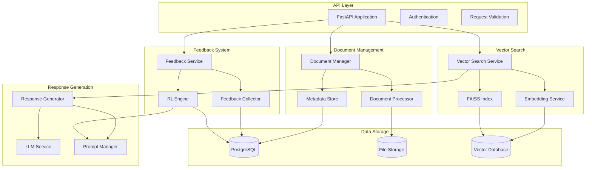
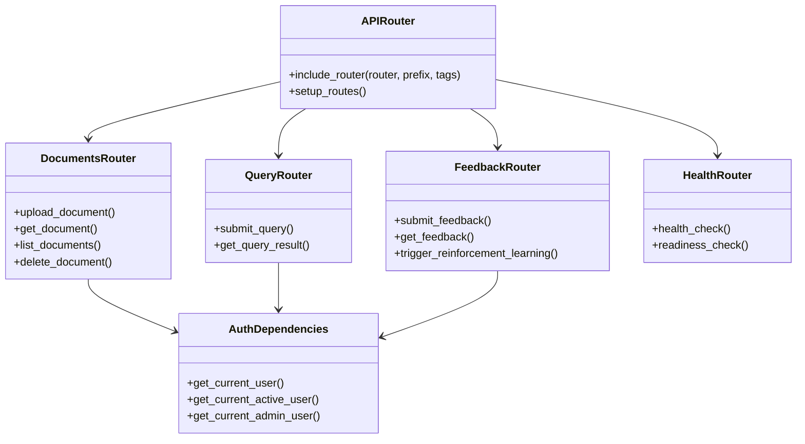
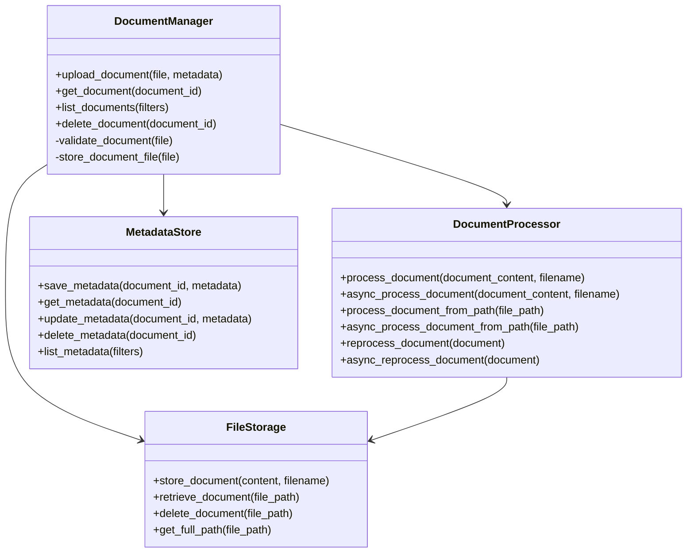
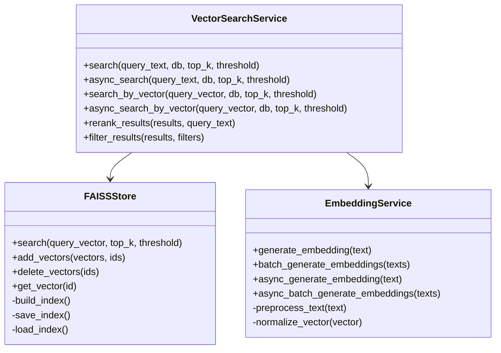

# Component Design

This document provides detailed design information for each component in the Document Management and AI Chatbot System. It builds upon the high-level architecture focusing on the internal structure, responsibilities, interfaces, and implementation details of each component.

The component design is guided by the following principles:

- **Separation of concerns**: Each component has well-defined responsibilities and boundaries
- **Interface-based design**: Components interact through clearly defined interfaces
- **Testability**: Components are designed to be easily testable in isolation
- **Maintainability**: Code organization follows consistent patterns for ease of maintenance
- **Extensibility**: Components can be extended or replaced without affecting the entire system

This document is intended for developers implementing or maintaining the system, providing the necessary details to understand how each component works and how they interact with each other.

# 1.1 System Component Overview

The Document Management and AI Chatbot System consists of the following major components:

| Component | Primary Responsibility | Key Dependencies | Critical Considerations |
| --- | --- | --- | --- |
| API Layer | Handle HTTP requests, authentication, and routing | FastAPI, Pydantic, JWT | Request validation, error handling, authentication |
| Document Processor | Extract text from PDFs and prepare for vectorization | PyMuPDF, asyncio | Document size limits, text extraction quality |
| Vector Engine | Generate and store document embeddings, perform similarity search | FAISS, Sentence Transformers | Vector quality, search performance, index management |
| LLM Connector | Interface with language models for response generation | OpenAI API or alternative LLM | Token limits, prompt engineering, response quality |
| Feedback Manager | Collect and process user feedback for reinforcement learning | SQLAlchemy, Ray RLlib | Feedback quality, learning rate, model improvement |
| Data Store | Manage document metadata and system state | PostgreSQL, SQLAlchemy | Data consistency, query performance |



These components work together to provide the complete functionality of the system, from document upload and processing to intelligent query responses and continuous improvement through feedback.

# 2. API Layer

The API Layer serves as the entry point for all client interactions with the system, handling HTTP requests, authentication, and routing to appropriate processing components.

# 2.1 Component Structure



The API Layer is implemented using FastAPI and consists of the following components:

- **APIRouter**: Central router that includes all endpoint routers
- **AuthDependencies**: Authentication and authorization dependencies
- **DocumentsRouter**: Endpoints for document management
- **QueryRouter**: Endpoints for query processing and search
- **FeedbackRouter**: Endpoints for feedback collection and processing
- **HealthRouter**: Health check endpoints for monitoring

# 2.2 Key Responsibilities

The API Layer has the following key responsibilities:

1. **Request Handling**: Process incoming HTTP requests
2. **Authentication**: Verify user identity using JWT tokens
3. **Authorization**: Enforce access control based on user roles
4. **Input Validation**: Validate request data using Pydantic models
5. **Response Formatting**: Format responses according to API contracts
6. **Error Handling**: Provide consistent error responses
7. **Routing**: Direct requests to appropriate service components
8. **Documentation**: Generate OpenAPI documentation

The API Layer follows RESTful design principles and provides a consistent interface for all system functionality.

# 2.3 Implementation Details

The API Layer is implemented in the following files:

- `app/api/router.py`: Main router setup
- `app/api/dependencies.py`: Common dependencies including authentication
- `app/api/v1/endpoints/*.py`: Endpoint implementations for each feature area

Endpoints are organized by feature area, with each area having its own router module. The main router includes these feature routers with appropriate prefixes and tags.

Example endpoint implementation:

```python
@router.post("/", response_model=DocumentResponse, status_code=202)
async def upload_document(
    file: UploadFile = File(...),
    current_user: User = Depends(get_current_active_user),
    db: AsyncSession = Depends(get_db)
):
    """Upload a new document for processing."""
    if not file.filename.lower().endswith(".pdf"):
        raise HTTPException(
            status_code=415,
            detail="Only PDF files are supported"
        )
    
    content = await file.read()
    
    # Create document record in database
    document_in = DocumentCreate(
        title=file.filename,
        filename=file.filename,
        size_bytes=len(content),
        status=DocumentStatus.processing,
        uploader_id=current_user.id
    )
    document = await crud.document.create(db, obj_in=document_in)
    
    # Start background processing
    background_tasks.add_task(
        process_document_task,
        content,
        file.filename,
        document.id,
        db
    )
    
    return DocumentResponse(
        id=document.id,
        title=document.title,
        filename=document.filename,
        size_bytes=document.size_bytes,
        upload_date=document.upload_date,
        status=document.status,
        uploader_id=document.uploader_id
    )
```

# 2.4 Interface Definitions

The API Layer exposes the following main interfaces:

**Document Management Endpoints:**

| Endpoint | Method | Description | Authentication |
| --- | --- | --- | --- |
| `/documents/` | POST | Upload a new document | Required |
| `/documents/` | GET | List all documents | Required |
| `/documents/{document_id}` | GET | Get document details | Required |
| `/documents/{document_id}` | DELETE | Delete a document | Required |

**Query Endpoints:**

| Endpoint | Method | Description | Authentication |
| --- | --- | --- | --- |
| `/query/` | POST | Submit a query | Required |
| `/query/{query_id}` | GET | Get query results | Required |

**Feedback Endpoints:**

| Endpoint | Method | Description | Authentication |
| --- | --- | --- | --- |
| `/feedback/` | POST | Submit feedback | Required |
| `/feedback/{query_id}` | GET | Get feedback for query | Required |
| `/reinforce/` | POST | Trigger reinforcement learning | Admin Only |

**Authentication Endpoints:**

| Endpoint | Method | Description | Authentication |
| --- | --- | --- | --- |
| `/auth/token` | POST | Get access token | Not Required |
| `/auth/refresh` | POST | Refresh access token | Not Required |

**Health Check Endpoints:**

| Endpoint | Method | Description | Authentication |
| --- | --- | --- | --- |
| `/health/live` | GET | Liveness check | Not Required |
| `/health/ready` | GET | Readiness check | Not Required |

# 2.5 Error Handling

The API Layer implements consistent error handling with appropriate HTTP status codes and structured error responses:

```python
@app.exception_handler(HTTPException)
async def http_exception_handler(request, exc):
    return JSONResponse(
        status_code=exc.status_code,
        content={
            "error": {
                "code": exc.status_code,
                "message": exc.detail,
                "details": getattr(exc, "details", None)
            }
        }
    )

@app.exception_handler(RequestValidationError)
async def validation_exception_handler(request, exc):
    return JSONResponse(
        status_code=status.HTTP_422_UNPROCESSABLE_ENTITY,
        content={
            "error": {
                "code": status.HTTP_422_UNPROCESSABLE_ENTITY,
                "message": "Validation error",
                "details": jsonable_encoder(exc.errors())
            }
        }
    )

@app.exception_handler(Exception)
async def general_exception_handler(request, exc):
    logger.exception("Unhandled exception")
    return JSONResponse(
        status_code=status.HTTP_500_INTERNAL_SERVER_ERROR,
        content={
            "error": {
                "code": status.HTTP_500_INTERNAL_SERVER_ERROR,
                "message": "Internal server error"
            }
        }
    )
```

Common error status codes used in the API:

- 400 Bad Request: Invalid request parameters
- 401 Unauthorized: Missing or invalid authentication
- 403 Forbidden: Insufficient permissions
- 404 Not Found: Resource not found
- 415 Unsupported Media Type: Unsupported file format
- 422 Unprocessable Entity: Validation error or processing failure
- 429 Too Many Requests: Rate limit exceeded
- 500 Internal Server Error: Unexpected server error

# 2.6 Dependencies and Middleware

The API Layer uses the following dependencies and middleware:

**Dependencies:**

- `get_db`: Provides database session
- `get_current_user`: Extracts and validates user from JWT token
- `get_current_active_user`: Ensures user is active
- `get_current_admin_user`: Ensures user has admin role

**Middleware:**

- `AuthenticationMiddleware`: Handles JWT token extraction and validation
- `RequestLoggingMiddleware`: Logs request details for monitoring
- `ResponseTimeMiddleware`: Measures and logs response times
- `CORSMiddleware`: Handles Cross-Origin Resource Sharing
- `RateLimitMiddleware`: Implements rate limiting for API endpoints

Example middleware implementation:

```python
@app.middleware("http")
async def response_time_middleware(request: Request, call_next):
    start_time = time.time()
    response = await call_next(request)
    process_time = time.time() - start_time
    response.headers["X-Process-Time"] = str(process_time)
    
    # Log response time for monitoring
    logger.info(
        f"Request processed",
        extra={
            "path": request.url.path,
            "method": request.method,
            "process_time": process_time,
            "status_code": response.status_code
        }
    )
    
    return response
```

# 3. Document Management Component

The Document Management component handles all document-related operations, including upload, retrieval, listing, and deletion. It coordinates document processing, storage, and metadata management.

# 3.1 Component Structure



The Document Management component consists of the following subcomponents:

- **DocumentManager**: Coordinates document operations and workflow
- **DocumentProcessor**: Extracts text from PDFs, chunks documents, and generates embeddings
- **FileStorage**: Handles storage and retrieval of document files
- **MetadataStore**: Manages document metadata in the database

# 3.2 Key Responsibilities

The Document Management component has the following key responsibilities:

1. **Document Validation**: Validate uploaded documents (format, size)
2. **Document Storage**: Store original document files
3. **Text Extraction**: Extract text content from PDF documents
4. **Document Chunking**: Split documents into manageable chunks
5. **Metadata Management**: Store and retrieve document metadata
6. **Document Retrieval**: Retrieve documents and their metadata
7. **Document Deletion**: Remove documents and associated data

The component handles the complete lifecycle of documents in the system, from upload through processing to deletion.

# 3.3 Implementation Details

The Document Management component is implemented in the following files:

- `app/services/document_processor.py`: Document processing service
- `app/services/file_storage.py`: File storage service
- `app/crud/crud_document.py`: Document metadata CRUD operations
- `app/crud/crud_document_chunk.py`: Document chunk CRUD operations
- `app/utils/pdf_utils.py`: PDF processing utilities
- `app/utils/file_utils.py`: File handling utilities

**Document Processing Implementation:**

The DocumentProcessor class handles the extraction of text from PDF documents, chunking the text into manageable segments, and coordinating the generation of vector embeddings:

```python
class DocumentProcessor:
    def __init__(self, file_storage=None, chunk_size=None, chunk_overlap=None):
        self._logger = get_logger(__name__)
        self._file_storage = file_storage or FileStorage()
        self._chunk_size = chunk_size or document_settings.CHUNK_SIZE
        self._chunk_overlap = chunk_overlap or document_settings.CHUNK_OVERLAP
    
    async def async_process_document(self, document_content, filename, db_document=None):
        """Asynchronously process a document by extracting text, creating chunks, and generating vector embeddings."""
        try:
            # Validate document is a PDF
            if not is_pdf_file(document_content):
                raise ValueError("Invalid PDF file")
            
            # Store the document file
            file_path = self._file_storage.store_document(document_content, filename)
            
            # Extract text from PDF
            text = extract_text_from_pdf_bytes(document_content)
            metadata = extract_pdf_metadata(document_content)
            
            # Create text chunks
            text_chunks = chunk_text(text, self._chunk_size, self._chunk_overlap)
            token_counts = [count_tokens(chunk) for chunk in text_chunks]
            
            # Create document chunks
            document_id = db_document.id if db_document else uuid.uuid4()
            chunks = create_document_chunks(text_chunks, token_counts, document_id)
            
            # Process chunks to generate embeddings
            embedding_results = await async_process_document_chunks(chunks)
            
            # Update document status if provided
            if db_document:
                await db_document.update_status(DocumentStatus.available)
            
            return {
                "file_path": file_path,
                "metadata": metadata,
                "chunks": embedding_results,
                "status": "success"
            }
        except Exception as e:
            self._logger.error(f"Error processing document: {str(e)}")
            if db_document:
                await db_document.update_status(DocumentStatus.error)
            raise
```

**File Storage Implementation:**

The FileStorage class handles the storage and retrieval of document files:

```python
class FileStorage:
    def __init__(self, storage_path=None):
        self._storage_path = storage_path or document_settings.DOCUMENT_STORAGE_PATH
        os.makedirs(self._storage_path, exist_ok=True)
        self._logger = get_logger(__name__)
    
    def store_document(self, content, filename):
        """Store a document file and return the file path."""
        # Generate a unique filename to avoid collisions
        unique_filename = f"{uuid.uuid4()}_{secure_filename(filename)}""
        file_path = os.path.join(self._storage_path, unique_filename)
        
        # Write the file to disk
        with open(file_path, "wb") as f:
            f.write(content)
        
        self._logger.info(f"Document stored at {file_path}")
        return unique_filename
    
    def retrieve_document(self, file_path):
        """Retrieve a document file by path."""
        full_path = self.get_full_path(file_path)
        if not os.path.exists(full_path):
            raise FileNotFoundError(f"Document not found: {file_path}")
        
        with open(full_path, "rb") as f:
            content = f.read()
        
        return content
    
    def delete_document(self, file_path):
        """Delete a document file."""
        full_path = self.get_full_path(file_path)
        if os.path.exists(full_path):
            os.remove(full_path)
            self._logger.info(f"Document deleted: {file_path}")
            return True
        return False
    
    def get_full_path(self, file_path):
        """Get the full path to a document file."""
        return os.path.join(self._storage_path, file_path)
```

# 3.4 Interface Definitions

The Document Management component exposes the following interfaces:

**DocumentManager Interface:**

```python
class DocumentManager:
    async def upload_document(self, file: UploadFile, user_id: UUID) -> Document:
        """Upload a document and start processing."""
        pass
    
    async def get_document(self, document_id: UUID) -> Document:
        """Get a document by ID."""
        pass
    
    async def list_documents(self, filters: Dict = None, skip: int = 0, limit: int = 100) -> List[Document]:
        """List documents with optional filtering."""
        pass
    
    async def delete_document(self, document_id: UUID) -> bool:
        """Delete a document and all associated data."""
        pass
```

**DocumentProcessor Interface:**

```python
class DocumentProcessor:
    async def process_document(self, document_content: bytes, filename: str, db_document: Optional[Document] = None) -> Dict:
        """Process a document by extracting text, creating chunks, and generating vector embeddings."""
        pass
    
    async def process_document_from_path(self, file_path: str, db_document: Optional[Document] = None) -> Dict:
        """Process a document from a file path."""
        pass
    
    async def reprocess_document(self, document: Document) -> Dict:
        """Reprocess an existing document."""
        pass
```

**FileStorage Interface:**

```python
class FileStorage:
    def store_document(self, content: bytes, filename: str) -> str:
        """Store a document file and return the file path."""
        pass
    
    def retrieve_document(self, file_path: str) -> bytes:
        """Retrieve a document file by path."""
        pass
    
    def delete_document(self, file_path: str) -> bool:
        """Delete a document file."""
        pass
    
    def get_full_path(self, file_path: str) -> str:
        """Get the full path to a document file."""
        pass
```

**MetadataStore Interface:**

```python
class MetadataStore:
    async def save_metadata(self, document_id: UUID, metadata: Dict) -> bool:
        """Save document metadata."""
        pass
    
    async def get_metadata(self, document_id: UUID) -> Dict:
        """Get document metadata."""
        pass
    
    async def update_metadata(self, document_id: UUID, metadata: Dict) -> bool:
        """Update document metadata."""
        pass
    
    async def delete_metadata(self, document_id: UUID) -> bool:
        """Delete document metadata."""
        pass
    
    async def list_metadata(self, filters: Dict = None, skip: int = 0, limit: int = 100) -> List[Dict]:
        """List document metadata with optional filtering."""
        pass
```

# 3.5 Data Models

The Document Management component uses the following data models:

**Document Model:**

```python
class Document(Base):
    __tablename__ = "documents"
    
    id = Column(UUID(as_uuid=True), primary_key=True, default=uuid.uuid4)
    title = Column(String, nullable=False)
    filename = Column(String, nullable=False)
    size_bytes = Column(Integer, nullable=False)
    upload_date = Column(DateTime, default=datetime.utcnow)
    status = Column(Enum(DocumentStatus), default=DocumentStatus.processing)
    file_path = Column(String, nullable=True)
    uploader_id = Column(UUID(as_uuid=True), ForeignKey("users.id"))
    
    # Relationships
    uploader = relationship("User", back_populates="documents")
    chunks = relationship("DocumentChunk", back_populates="document", cascade="all, delete-orphan")
    
    async def update_status(self, status: DocumentStatus):
        """Update the document status."""
        self.status = status
```

**DocumentChunk Model:**

```python
class DocumentChunk(Base):
    __tablename__ = "document_chunks"
    
    id = Column(UUID(as_uuid=True), primary_key=True, default=uuid.uuid4)
    document_id = Column(UUID(as_uuid=True), ForeignKey("documents.id"), nullable=False)
    chunk_index = Column(Integer, nullable=False)
    content = Column(Text, nullable=False)
    token_count = Column(Integer, nullable=False)
    embedding_id = Column(String, nullable=True)
    
    # Relationships
    document = relationship("Document", back_populates="chunks")
    
    __table_args__ = (UniqueConstraint("document_id", "chunk_index"),)
```

**DocumentStatus Enum:**

```python
class DocumentStatus(str, Enum):
    processing = "processing"
    available = "available"
    error = "error"
    deleted = "deleted"
```

# 3.6 Error Handling

The Document Management component implements the following error handling strategies:

1. **Validation Errors**: Raised when document validation fails (invalid format, size limit)
2. **Processing Errors**: Raised when document processing fails (text extraction, chunking)
3. **Storage Errors**: Raised when document storage operations fail (disk full, permissions)
4. **Not Found Errors**: Raised when requested documents don't exist

Errors are logged with appropriate context and propagated to the API layer for consistent error responses. Document status is updated to reflect processing errors.

Example error handling:

```python
try:
    # Process document
    text = extract_text_from_pdf_bytes(document_content)
    metadata = extract_pdf_metadata(document_content)
    text_chunks = chunk_text(text, self._chunk_size, self._chunk_overlap)
    # ... additional processing
    
    # Update document status on success
    if db_document:
        await db_document.update_status(DocumentStatus.available)
    
    return result
except PDFSyntaxError as e:
    self._logger.error(f"PDF syntax error: {str(e)}")
    if db_document:
        await db_document.update_status(DocumentStatus.error)
    raise HTTPException(
        status_code=422,
        detail="Invalid PDF format",
        details={"error": str(e)}
    )
except Exception as e:
    self._logger.error(f"Error processing document: {str(e)}")
    if db_document:
        await db_document.update_status(DocumentStatus.error)
    raise
```

# 3.7 Performance Considerations

The Document Management component addresses the following performance considerations:

1. **Asynchronous Processing**: Document processing is performed asynchronously to prevent blocking API responses
2. **Chunking Strategy**: Documents are chunked with appropriate size and overlap for optimal vector search performance
3. **Batch Processing**: Vector embeddings are generated in batches for efficiency
4. **Caching**: Document metadata is cached to reduce database load
5. **File Storage Optimization**: File storage is optimized for read-heavy operations

Performance metrics are logged for monitoring and optimization:

```python
# Measure processing time
start_time = time.time()
result = await process_function()
processing_time = time.time() - start_time

# Log performance metrics
self._logger.info(
    "Document processing completed",
    extra={
        "document_id": str(document_id),
        "processing_time": processing_time,
        "chunk_count": len(text_chunks),
        "document_size": len(document_content)
    }
)
```

# 4. Vector Search Component

The Vector Search component handles the core functionality of converting queries to vector embeddings and performing similarity searches against the document vector database.

# 4.1 Component Structure



The Vector Search component consists of the following subcomponents:

- **VectorSearchService**: Coordinates search operations and result processing
- **FAISSStore**: Manages the FAISS vector index for similarity search
- **EmbeddingService**: Generates vector embeddings from text

# 4.2 Key Responsibilities

The Vector Search component has the following key responsibilities:

1. **Query Embedding**: Generate vector embeddings for search queries
2. **Similarity Search**: Perform vector similarity search in FAISS
3. **Result Ranking**: Rank and filter search results
4. **Vector Storage**: Store and manage document vector embeddings
5. **Index Management**: Build, save, and load FAISS indices

The component provides both synchronous and asynchronous interfaces for search operations to support different usage patterns.

# 4.3 Implementation Details

The Vector Search component is implemented in the following files:

- `app/services/vector_search.py`: Vector search service
- `app/services/embedding_service.py`: Embedding generation service
- `app/vector_store/faiss_store.py`: FAISS vector store implementation
- `app/vector_store/base.py`: Base vector store interface
- `app/utils/vector_utils.py`: Vector manipulation utilities

**Vector Search Implementation:**

The VectorSearchService class handles the search operations and result processing:

```python
class VectorSearchService:
    def __init__(self, vector_store=None):
        self._vector_store = vector_store or get_vector_store()
        self._logger = logging.getLogger(__name__)
        self._logger.info("Vector search service initialized")
    
    async def async_search(self, query_text, db, top_k=None, threshold=None):
        """Asynchronously search for document chunks similar to the query text."""
        if not query_text or not query_text.strip():
            raise ValueError("Query text cannot be empty")
        
        top_k = top_k or vector_settings.DEFAULT_TOP_K
        threshold = threshold or vector_settings.SIMILARITY_THRESHOLD
        
        start_time = time.time()
        
        # Generate query embedding
        query_vector = await async_generate_embedding(query_text)
        
        # Perform similarity search
        results = await async_search_by_vector(query_vector, db, top_k, threshold)
        
        search_time = time.time() - start_time
        self._logger.info(
            f"Search completed in {search_time:.3f}s",
            extra={
                "query_length": len(query_text),
                "result_count": len(results),
                "search_time": search_time
            }
        )
        
        return results
```

**FAISS Store Implementation:**

The FAISSStore class manages the FAISS vector index for similarity search: