# Data Flow Architecture

This document provides detailed information about the data flows within the Document Management and AI Chatbot System, including data transformations, processing pipelines, and interactions between system components.

## 1. Introduction

The Document Management and AI Chatbot System processes data through several key components, each responsible for specific transformations and operations. Understanding these data flows is crucial for system optimization, troubleshooting, and future enhancements.

The system's data flow architecture follows these principles:

- Clear separation of concerns between components
- Well-defined data transformation points
- Efficient data routing between components
- Optimized storage patterns for different data types
- Scalable processing pipelines

The primary data flow begins with document upload, where PDFs are processed through the Document Processor to extract text. The extracted text is then passed to the Vector Engine, which generates embeddings using Sentence Transformers and stores them in the FAISS index. Document metadata is stored in PostgreSQL through the Data Store component.

For queries, user input is processed by the API Layer and passed to the Vector Engine, which generates a query embedding and performs similarity search in FAISS. The most relevant document segments are retrieved and combined with the original query to form a prompt for the LLM Connector. The LLM generates a response based on the document context, which is returned to the user along with references to the source documents.

Feedback flows from the API Layer to the Feedback Manager, which stores user ratings and uses them to periodically update the response generation process through reinforcement learning techniques.

## 2. Core Data Flow Patterns

The system implements several core data flow patterns:

### 2.1 Data Processing Patterns

### 2.2 Component Interaction Model

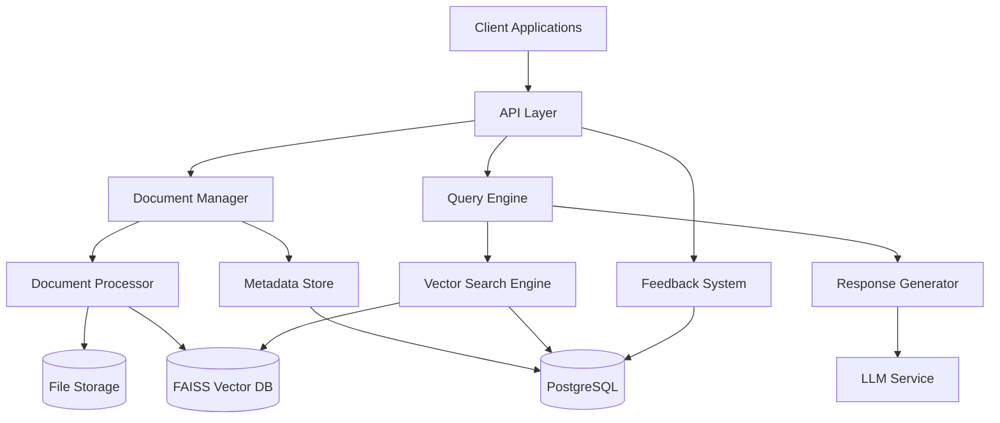

Data transformation occurs primarily at three points:

1. Document text extraction (PDF to plain text)
2. Vector embedding generation (text to vector embeddings)
3. Context preparation (document segments to LLM prompt)

## 3. Document Processing Flow

The document processing flow handles the transformation of uploaded PDF documents into searchable vector embeddings and stored metadata.

### 3.1 End-to-End Document Processing

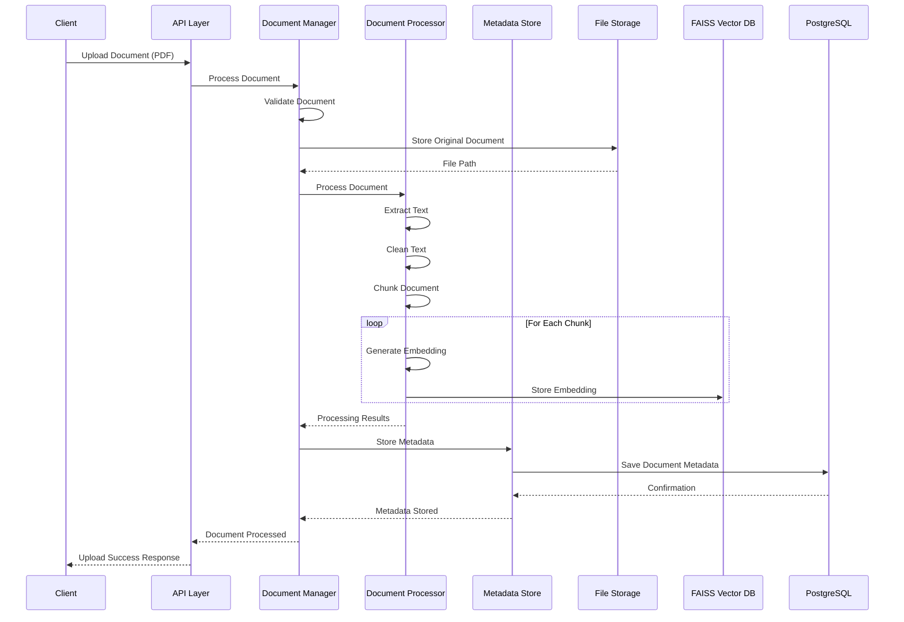

### 3.2 Document Data Transformations

The document undergoes several transformations during processing:

1. **PDF to Text**: 
   - Input: Raw PDF document
   - Process: Text extraction using PyMuPDF
   - Output: Plain text content

2. **Text to Chunks**:
   - Input: Plain text content
   - Process: Splitting into manageable chunks with optimal size
   - Output: Array of text chunks

3. **Chunks to Vectors**:
   - Input: Text chunks
   - Process: Vector embedding generation using Sentence Transformers
   - Output: High-dimensional vector embeddings (768 dimensions)

4. **Metadata Extraction**:
   - Input: PDF document and processing results
   - Process: Extraction of document properties and processing statistics
   - Output: Structured metadata record

### 3.3 Data Quality Controls

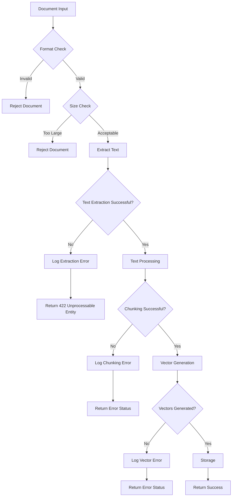

SLA: Document processing completes within 10 seconds for documents up to 10MB in size.

## 4. Query and Response Flow

The query and response flow handles the transformation of user queries into vector searches and AI-generated responses.

### 4.1 End-to-End Query Processing

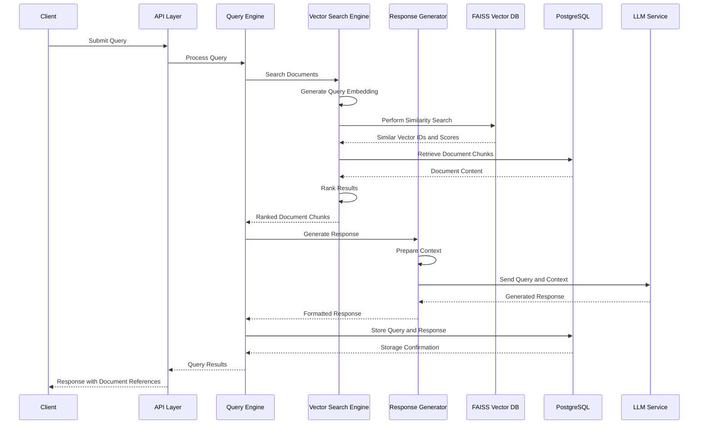

SLA: Query processing completes within 3 seconds for standard queries.

### 4.2 Query Data Transformations

The query undergoes several transformations during processing:

1. **Query Text to Vector**:
   - Input: Natural language query
   - Process: Vector embedding generation using the same model as documents
   - Output: Query vector representation

2. **Vector to Document Retrieval**:
   - Input: Query vector
   - Process: Similarity search in FAISS
   - Output: Ranked list of relevant document chunks with similarity scores

3. **Context Preparation**:
   - Input: Relevant document chunks
   - Process: Selection and formatting of context for LLM
   - Output: Formatted context string

4. **Response Generation**:
   - Input: Query and context
   - Process: LLM processing with prompt engineering
   - Output: Natural language response

### 4.3 Context Window Management

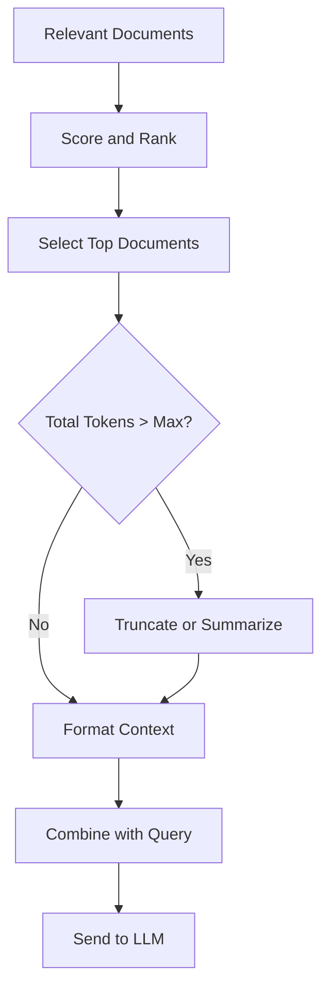

The system carefully manages the context window to ensure optimal use of the LLM's token limit:

1. Documents are ranked by relevance score
2. Top N documents are selected based on relevance
3. If the total token count exceeds the LLM's maximum context window:
   - Either truncate documents
   - Or prioritize most relevant sections
4. Context is formatted with clear section boundaries
5. The formatted context is combined with the query in a structured prompt

## 5. Feedback and Learning Flow

The feedback and learning flow handles the collection, processing, and application of user feedback for system improvement.

### 5.1 End-to-End Feedback Processing

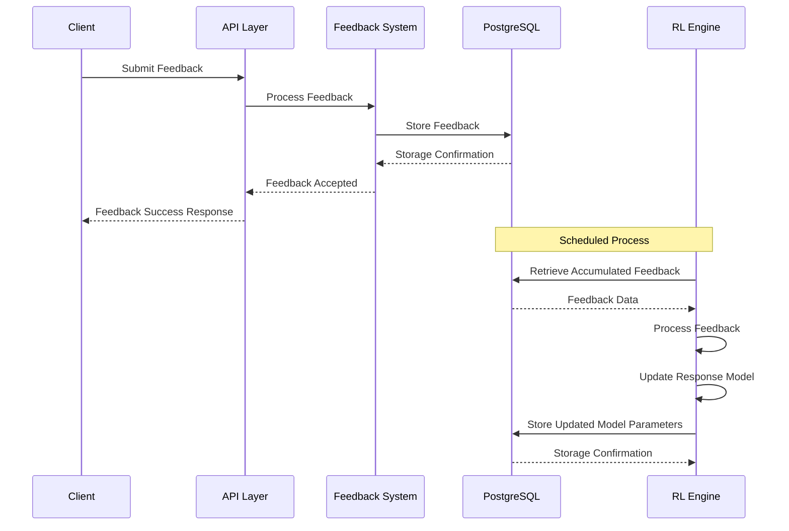

### 5.2 Feedback Data Transformations

The feedback undergoes several transformations during processing:

1. **User Feedback to Storage**:
   - Input: User rating (1-5) and optional comments
   - Process: Association with query and response
   - Output: Structured feedback record

2. **Feedback Aggregation**:
   - Input: Multiple feedback records
   - Process: Statistical analysis and pattern recognition
   - Output: Aggregated feedback metrics

3. **Model Improvement**:
   - Input: Aggregated feedback
   - Process: Parameter adjustment based on reinforcement learning
   - Output: Updated model parameters

### 5.3 Reinforcement Learning Cycle

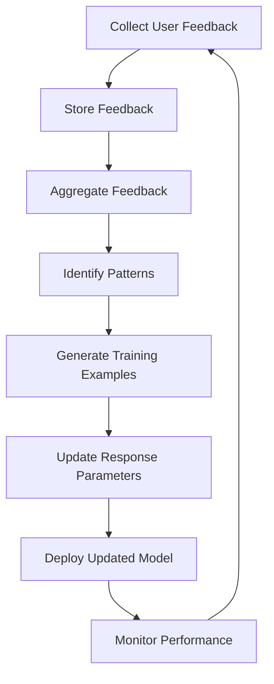

The reinforcement learning cycle operates as follows:

1. User feedback is collected on query responses
2. Feedback is stored with associated queries and responses
3. Feedback is aggregated to identify patterns
4. Successful responses are used as positive examples
5. Response parameters are updated based on learning
6. Updated model is deployed in a controlled manner
7. Performance is monitored to verify improvement
8. The cycle continues with new feedback

## 6. Data Transformations

### 6.1 Key Data Transformation Points

### 6.2 Data Transformation Details

| Transformation | Input Format | Output Format | Process | Technology | Performance Considerations |
| --- | --- | --- | --- | --- | --- |
| PDF to Text | PDF Binary | Plain Text | Text extraction | PyMuPDF | Memory usage for large documents |
| Text to Chunks | Plain Text | Text Chunks Array | Text splitting | Custom algorithm | Chunk size affects search precision |
| Text to Vector | Text | Float Array (768 dim) | Embedding generation | Sentence Transformers | CPU/GPU intensive |
| Query to Vector | Query Text | Float Array (768 dim) | Embedding generation | Sentence Transformers | Latency sensitive |
| Documents to Context | Document Chunks | Formatted String | Context preparation | Custom algorithm | Token limit management |
| Feedback to Metrics | Individual Ratings | Statistical Summary | Aggregation | Pandas/NumPy | Batch processing |

## 7. Data Storage Patterns

### 7.1 Storage Components

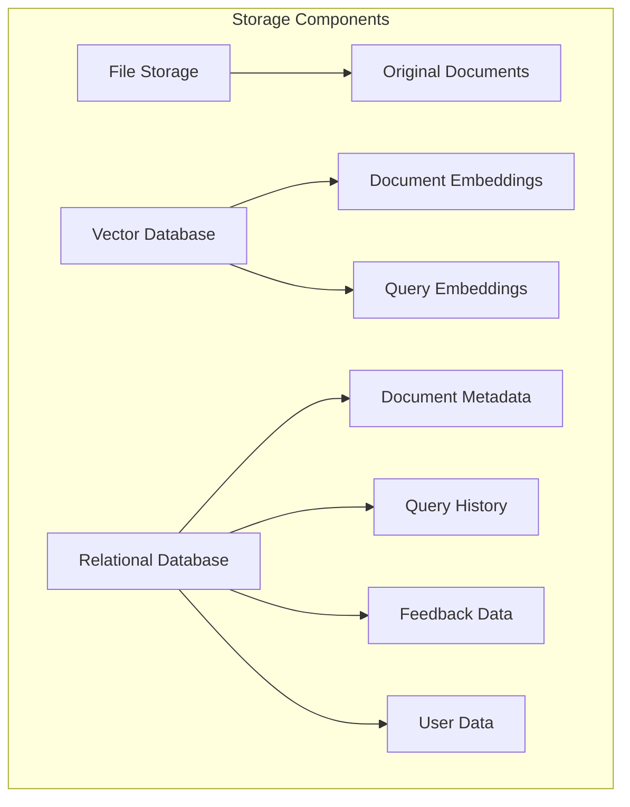

### 7.2 Data Persistence Strategy

| Data Type | Storage | Format | Retention | Access Pattern | Backup Strategy |
| --- | --- | --- | --- | --- | --- |
| Original Documents | File System/S3 | PDF Binary | Until deletion | Write once, read many | Regular snapshots |
| Document Metadata | PostgreSQL | Relational | Until deletion | Frequent reads, occasional updates | Database backups |
| Vector Embeddings | FAISS | Binary Vector | Until document deletion | Write once, read many | Index snapshots |
| Query History | PostgreSQL | Relational | 1 year | Write once, occasional reads | Database backups |
| User Feedback | PostgreSQL | Relational | 2 years | Write once, batch reads | Database backups |
| User Data | PostgreSQL | Relational | Until account deletion | Frequent reads, occasional updates | Database backups |

### 7.3 Data Flow Between Storage Systems

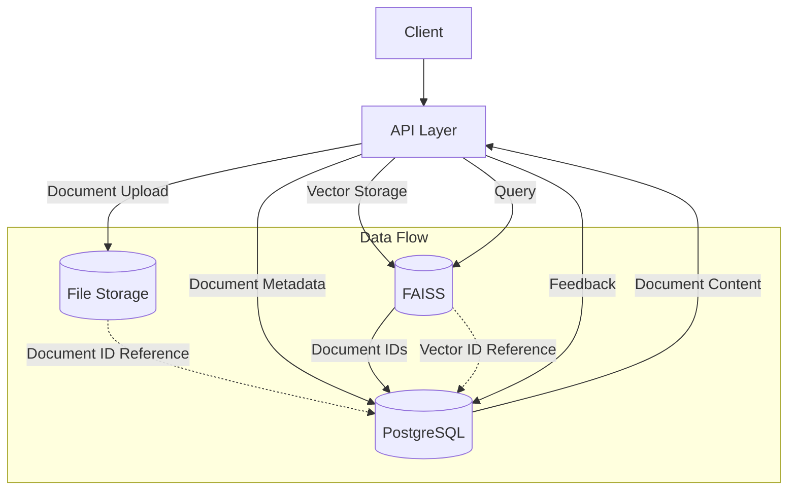

## 8. Performance Considerations

### 8.1 Key Performance Metrics

| Process | Key Metric | Target | Bottleneck | Optimization Technique |
| --- | --- | --- | --- | --- |
| Document Upload | Processing Time | \< 10s for 10MB | PDF extraction | Asynchronous processing |
| Vector Generation | Embedding Time | \< 5s per document | CPU/GPU resources | Batch processing |
| Vector Search | Query Latency | \< 500ms | FAISS index size | Index optimization, sharding |
| Response Generation | Response Time | \< 2.5s | LLM API | Prompt optimization, caching |
| Feedback Processing | Processing Time | N/A (background) | Database I/O | Batch processing |

### 8.2 Performance Optimization Strategies

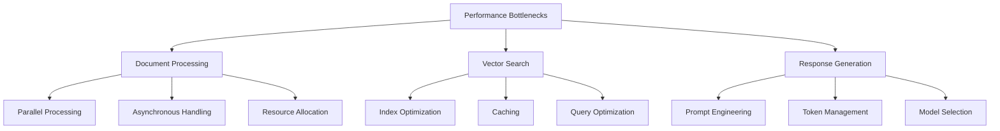

### 8.3 Data Volume Considerations

| Component | Current Capacity | Scaling Threshold | Scaling Strategy |
| --- | --- | --- | --- |
| Document Storage | Unlimited | N/A | Horizontal scaling |
| Vector Database | ~1M documents | When search time \> 500ms | Sharding, index optimization |
| Metadata Database | Unlimited | When query time \> 100ms | Read replicas, query optimization |
| LLM Integration | Rate limited | When queue depth \> 10 | Caching, queue management |

### 8.4 Caching Strategy

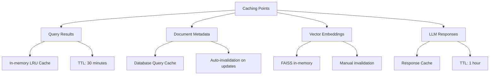

The system implements caching at multiple levels to optimize performance:

1. **Query Results Cache**:
   - Caches results for identical queries
   - Utilizes an LRU (Least Recently Used) eviction policy
   - Time-based expiration (TTL) of 30 minutes

2. **Document Metadata Cache**:
   - Database-level query cache for document metadata
   - Automatically invalidated when documents are updated
   - Optimized for frequent read operations

3. **Vector Embeddings**:
   - FAISS index kept in memory for fast search
   - Manually invalidated when documents are updated
   - Memory-mapped for large indices

4. **LLM Responses**:
   - Caches responses for identical query/context combinations
   - Reduces LLM API costs for repeated queries
   - TTL of 1 hour to balance freshness with performance