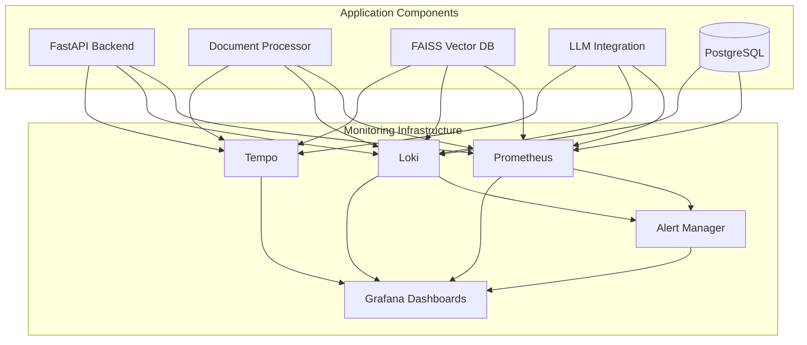
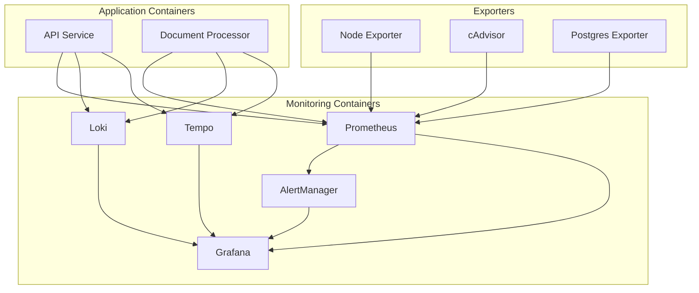
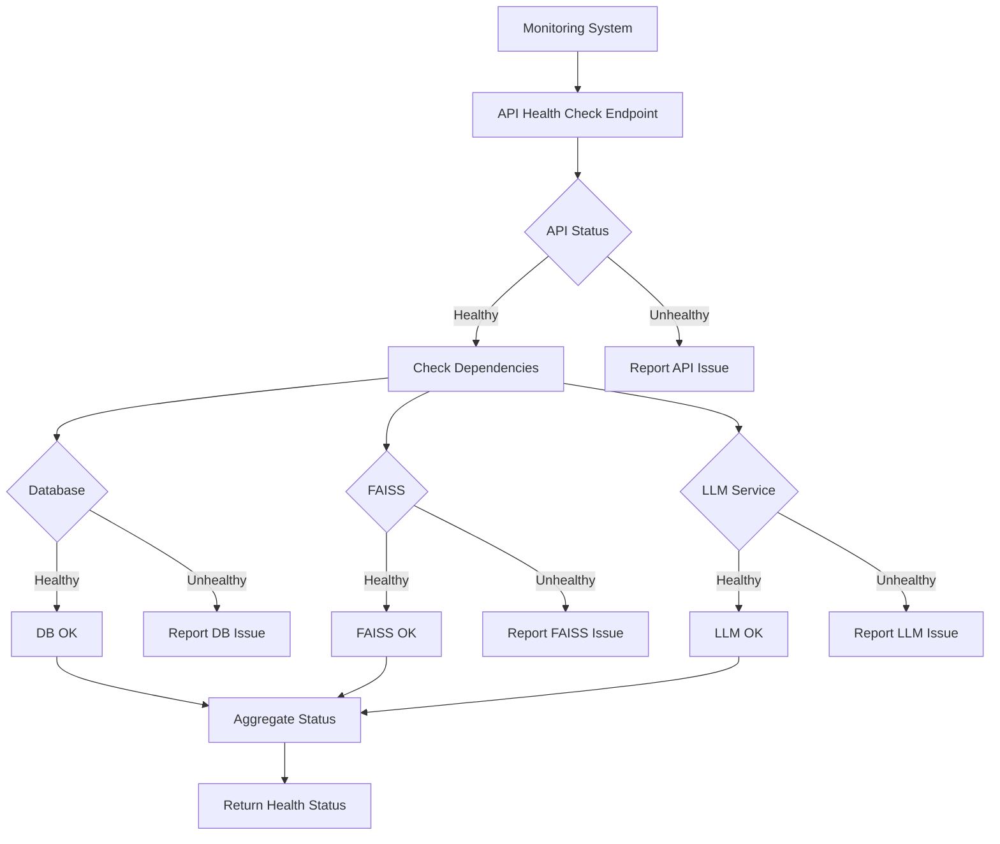
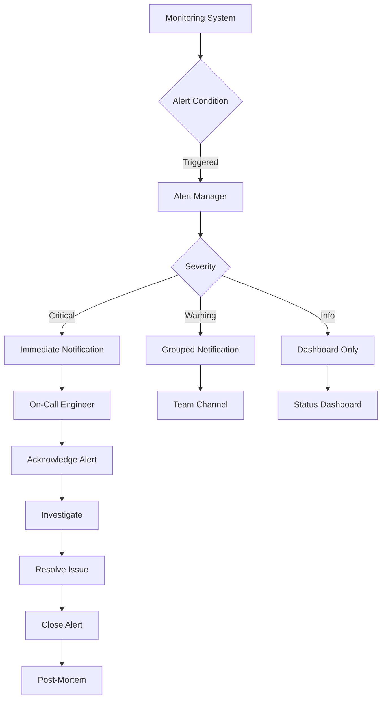
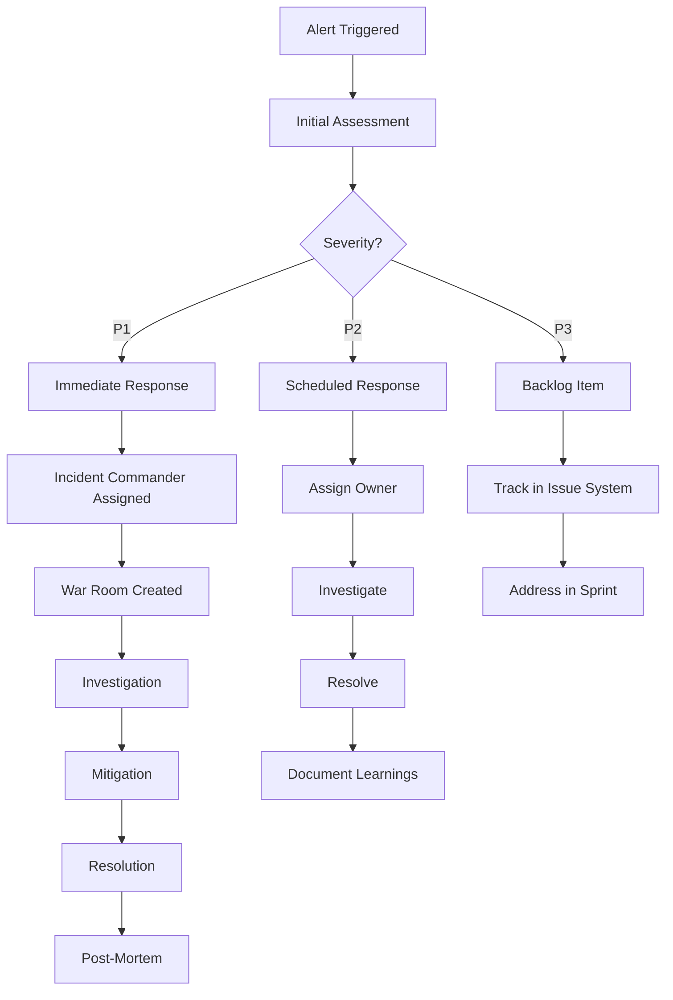
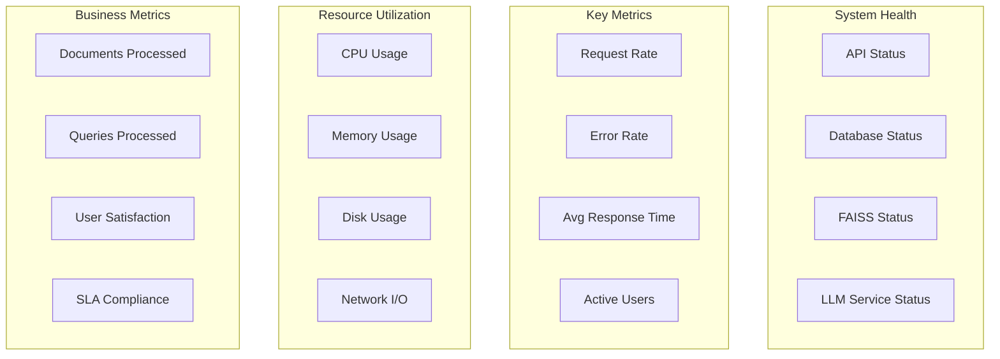

# Monitoring and Observability Architecture

This document describes the monitoring and observability architecture for the Document Management and AI Chatbot System, detailing how the system is monitored, how alerts are managed, and how incidents are handled.

## 1. Introduction

This document describes the monitoring and observability architecture for the Document Management and AI Chatbot System. It outlines the approach to monitoring system health, performance, and behavior, as well as the strategies for detecting, alerting on, and responding to issues.

Effective monitoring and observability are critical for maintaining the reliability, performance, and security of the system. This architecture provides comprehensive visibility into all aspects of the system, enabling proactive issue detection and efficient troubleshooting.

### 1.1 Purpose and Scope

The purpose of this document is to define the monitoring and observability architecture for the Document Management and AI Chatbot System. It covers:

- Monitoring infrastructure components and their integration
- Observability patterns and practices
- Alert management and notification strategies
- Incident response procedures
- Dashboards and visualization approaches
- Logging and metrics strategies

This architecture applies to all components of the system, including the API layer, document processing, vector search, LLM integration, and supporting infrastructure.

### 1.2 Monitoring Objectives

The monitoring and observability architecture is designed to achieve the following objectives:

- **Proactive Issue Detection**: Identify potential issues before they impact users
- **Rapid Troubleshooting**: Enable quick identification of root causes when issues occur
- **Performance Optimization**: Provide insights for optimizing system performance
- **Capacity Planning**: Support data-driven decisions about resource allocation
- **SLA Compliance**: Monitor and report on compliance with service level agreements
- **Security Monitoring**: Detect and alert on potential security issues
- **Business Insights**: Provide visibility into business-relevant metrics

### 1.3 Architectural Principles

The monitoring architecture is guided by the following principles:

- **Comprehensive Coverage**: Monitor all critical components and services
- **Appropriate Granularity**: Collect metrics at a level of detail that balances insight with resource usage
- **Correlation Capability**: Enable correlation between metrics, logs, and traces
- **Actionable Alerts**: Generate alerts that are specific, actionable, and prioritized
- **Minimal Overhead**: Implement monitoring with minimal impact on system performance
- **Scalability**: Scale monitoring infrastructure alongside the application
- **Security**: Protect monitoring data and access to monitoring tools

### 1.4 Monitoring as a Cross-Cutting Concern

Monitoring is implemented as a cross-cutting concern that spans all system components and layers. This approach ensures comprehensive observability across the entire system, enabling correlation between different components and behaviors.

As a cross-cutting concern, monitoring is designed to be:

- **Non-intrusive**: Minimal impact on application code and performance
- **Consistent**: Uniform approach across all components
- **Extensible**: Easily extended to new components and features
- **Integrated**: Part of the overall system architecture rather than an afterthought

The monitoring architecture integrates with all key system components including API services, document processing, vector search, LLM integration, and database operations.

## 2. Monitoring Infrastructure

The monitoring infrastructure consists of several integrated components that collect, store, and visualize monitoring data from all parts of the system.

### 2.1 Infrastructure Overview



The monitoring infrastructure consists of the following core components:

- **Prometheus**: Time-series database for metrics collection and storage
- **Loki**: Log aggregation system for centralized logging
- **Tempo**: Distributed tracing system for request tracing
- **AlertManager**: Alert routing, grouping, and notification system
- **Grafana**: Visualization platform for dashboards and alerts

These components work together to provide a comprehensive view of system health, performance, and behavior.

### 2.2 Metrics Collection

Metrics are collected using Prometheus, with the following components:

| Component | Collection Method | Metrics Type | Retention |
| --- | --- | --- | --- |
| FastAPI | Prometheus client | Request/response metrics | 15 days |
| FAISS | Custom exporter | Search performance metrics | 15 days |
| PostgreSQL | postgres_exporter | Database performance | 15 days |
| LLM Integration | Custom metrics | Response times, token usage | 15 days |

Key metrics collected include:

- Request rates, latencies, and error rates
- Resource utilization (CPU, memory, disk)
- Vector search performance (latency, relevance scores)
- LLM response generation times and token usage
- Database query performance and connection pool status

Metrics are collected at appropriate intervals based on their volatility and importance, with most application metrics collected every 15 seconds.

### 2.3 Log Aggregation

The system implements structured logging with centralized aggregation using Loki:

| Log Source | Log Format | Collection Method | Retention |
| --- | --- | --- | --- |
| Application Logs | JSON | Loki | 30 days |
| Database Logs | Text | Loki | 15 days |
| System Logs | Text | Loki | 15 days |
| Security Logs | JSON | Loki | 90 days |

All logs include:

- Timestamp
- Log level
- Component identifier
- Correlation ID for request tracing
- Structured data relevant to the event

Logs are collected using Promtail agents deployed alongside application components, which forward logs to the central Loki service.

### 2.4 Distributed Tracing

The system implements distributed tracing to track request flows across components:

| Tracing Aspect | Implementation | Collection | Sampling Rate |
| --- | --- | --- | --- |
| Request Tracing | OpenTelemetry | Tempo | 10% of requests |
| Database Queries | SQLAlchemy instrumentation | Tempo | 5% of queries |
| LLM API Calls | Custom instrumentation | Tempo | 100% of calls |

Traces capture:

- End-to-end request latency
- Component-level processing times
- Cross-service dependencies
- Error propagation paths

Tracing is implemented using OpenTelemetry instrumentation, with traces collected and stored in Tempo. Sampling rates are configured to balance insight with resource usage, with higher sampling rates for critical operations and error cases.

### 2.5 Alert Management

Alerts are managed using Prometheus AlertManager, which handles:

- Alert routing to appropriate notification channels
- Alert grouping to reduce notification noise
- Alert silencing for maintenance periods
- Alert escalation for critical issues

AlertManager is configured to send notifications through multiple channels based on alert severity and type, including Slack, email, and PagerDuty for critical alerts.

### 2.6 Visualization

Grafana provides the primary visualization interface for all monitoring data, including:

- Dashboards for system overview and component-specific metrics
- Exploration interface for ad-hoc queries and investigations
- Alert visualization and management
- Correlation between metrics, logs, and traces

Dashboards are organized hierarchically, from high-level system overview to detailed component-specific views, allowing for both broad monitoring and deep troubleshooting.

### 2.7 Infrastructure Deployment

The monitoring infrastructure is deployed alongside the application using containerization:



The monitoring infrastructure is deployed using Docker Compose in development and Kubernetes in production environments. Configuration is managed through environment variables and configuration files stored in version control.

## 3. Observability Patterns

The system implements several observability patterns to provide comprehensive visibility into system health, performance, and behavior.

### 3.1 Health Checks

The system implements multi-level health checks to verify component status:



| Health Check Type | Endpoint | Frequency | Failure Action |
| --- | --- | --- | --- |
| Liveness Check | /health/live | 30 seconds | Restart container if failing |
| Readiness Check | /health/ready | 1 minute | Remove from load balancer |
| Dependency Check | /health/dependencies | 2 minutes | Alert if failing |

Health checks are implemented in the API layer and exposed through dedicated endpoints. The health check implementation verifies the status of all critical dependencies, including the database, vector store, and LLM service.

### 3.2 Performance Metrics

The system tracks key performance indicators to ensure optimal operation:

| Metric Category | Key Metrics | Warning Threshold | Critical Threshold |
| --- | --- | --- | --- |
| API Performance | Request latency | > 1 second | > 3 seconds |
| Vector Search | Search latency | > 500ms | > 2 seconds |
| LLM Integration | Response time | > 2 seconds | > 5 seconds |
| Database | Query time | > 200ms | > 1 second |

Performance dashboards visualize:

- Request rate and latency trends
- Error rates and status code distribution
- Resource utilization correlation with performance
- Dependency service performance impact

Performance metrics are collected at a granular level to enable detailed analysis and troubleshooting, with appropriate aggregation for dashboard visualization.

### 3.3 Business Metrics

The system tracks business-relevant metrics to measure system effectiveness:

| Business Metric | Description | Target | Dashboard |
| --- | --- | --- | --- |
| Document Processing Rate | Documents processed per hour | > 100/hour | Document Operations |
| Query Success Rate | Percentage of queries with relevant results | > 90% | Query Performance |
| User Satisfaction | Average feedback rating | > 4.0/5.0 | User Experience |
| System Utilization | Active users and query volume | N/A (tracking) | Business Overview |

Business metrics provide insights into the system's value delivery and effectiveness, complementing technical metrics that focus on system health and performance.

### 3.4 SLA Monitoring

The system monitors compliance with defined Service Level Agreements:

| Service | SLA Metric | Target | Measurement Method |
| --- | --- | --- | --- |
| Document Upload | Processing time | < 10s for 10MB | Request duration tracking |
| Vector Search | Query response time | < 3s | Request duration tracking |
| System Availability | Uptime | 99.9% | Synthetic monitoring |
| Error Rate | Failed requests | < 0.1% | Error count / total requests |

SLA compliance is visualized through:

- SLA compliance dashboards
- Historical compliance trends
- Violation alerts and notifications
- Root cause analysis tools

SLA monitoring enables objective measurement of service quality and helps identify areas for improvement.

### 3.5 Capacity Tracking

The system monitors resource utilization to predict and prevent capacity issues:

| Resource | Metrics Tracked | Warning Level | Critical Level |
| --- | --- | --- | --- |
| CPU | Utilization percentage | 70% | 85% |
| Memory | Usage percentage | 75% | 90% |
| Disk | Free space percentage | < 20% | < 10% |
| FAISS | Index size and query time | Size > 80% of RAM | Query time > 2s |

Capacity planning dashboards show:

- Resource utilization trends
- Growth projections
- Scaling recommendations
- Performance correlation with capacity

Capacity tracking enables proactive resource management and prevents performance degradation due to resource constraints.

### 3.6 Correlation Capabilities

The system enables correlation between different observability signals:

- **Metrics to Logs**: Linking from metric spikes to relevant logs
- **Logs to Traces**: Following request flows using correlation IDs
- **Traces to Metrics**: Connecting slow traces to system metrics
- **Alerts to Context**: Providing relevant context with alert notifications

Correlation is implemented through:

- Consistent use of correlation IDs across all components
- Integration between Prometheus, Loki, and Tempo in Grafana
- Linking between dashboards and detailed views
- Context-rich alert notifications

Correlation capabilities enable efficient troubleshooting by connecting symptoms to causes across different observability signals.

## 4. Alert Management

The system implements a comprehensive alerting strategy to notify operators of potential issues:

### 4.1 Alert Definitions

| Alert Name | Condition | Severity | Response Time |
| --- | --- | --- | --- |
| API High Error Rate | Error rate > 5% for 5 minutes | Critical | 15 minutes |
| Document Processing Failure | Failed document processing > 3 consecutive | Warning | 1 hour |
| FAISS Search Latency | Search time > 2s for 10 minutes | Warning | 4 hours |
| Database Connection Issues | Connection failures > 3 in 5 minutes | Critical | 30 minutes |
| LLM Service Unavailable | Service unreachable for 2 minutes | Critical | 15 minutes |

Alerts are defined in Prometheus using PromQL expressions and in Loki using LogQL expressions. Each alert includes:

- Clear condition definition
- Appropriate severity level
- Expected response time
- Links to relevant dashboards and runbooks

Alerts are designed to be specific, actionable, and prioritized to enable efficient incident response.

### 4.2 Alert Workflow



The alert workflow defines how alerts are processed from detection to resolution:

1. Alert condition is detected by Prometheus or Loki
2. Alert is sent to AlertManager for processing
3. AlertManager routes the alert based on severity and type
4. Notification is sent to appropriate channels
5. On-call engineer acknowledges and investigates the alert
6. Issue is resolved and alert is closed
7. Post-mortem is conducted for critical incidents

This workflow ensures that alerts are handled efficiently and appropriately based on their severity and impact.

### 4.3 Alert Routing and Escalation

| Severity | Initial Notification | Escalation (15 min) | Escalation (1 hour) |
| --- | --- | --- | --- |
| Critical | On-call engineer | Team lead | Engineering manager |
| Warning | Team channel | On-call engineer | Team lead |
| Info | Dashboard only | Team channel | No escalation |

Alert routing and escalation are configured in AlertManager to ensure that alerts are sent to the appropriate recipients and escalated if not acknowledged or resolved within defined timeframes.

Escalation paths are defined based on alert severity, with critical alerts having more aggressive escalation to ensure timely response.

### 4.4 Alert Notification Channels

The system uses multiple notification channels for alerts:

- **Slack**: Team channels for collaborative response
- **Email**: For non-urgent notifications and summaries
- **PagerDuty**: For critical alerts requiring immediate attention
- **SMS**: Backup notification for critical alerts

Notification content includes:

- Alert name and severity
- Alert condition and current value
- Affected component and environment
- Links to relevant dashboards and runbooks
- Suggested initial actions

Notification channels are selected based on alert severity and time of day, with more intrusive channels used for critical alerts and during non-business hours.

### 4.5 Alert Suppression and Grouping

To reduce alert noise and fatigue, the system implements:

- **Alert Grouping**: Similar alerts are grouped into a single notification
- **Alert Suppression**: Alerts are suppressed during maintenance windows
- **Alert Deduplication**: Duplicate alerts are combined
- **Rate Limiting**: Limit on notification frequency for persistent issues

These mechanisms are configured in AlertManager to ensure that operators receive actionable notifications without being overwhelmed by alert noise.

## 5. Incident Response

The system defines clear procedures for responding to and resolving incidents:

### 5.1 Incident Classification

| Severity | Definition | Example | Initial Response |
| --- | --- | --- | --- |
| P1 | Service outage | API unavailable | Immediate response |
| P2 | Degraded service | Slow search responses | Response within 1 hour |
| P3 | Minor issue | Occasional errors | Next business day |

Incidents are classified based on their impact on system functionality and users. Classification determines the response priority and escalation path.

### 5.2 Incident Response Workflow



The incident response workflow defines the process for handling incidents from initial detection to resolution and follow-up. The workflow varies based on incident severity, with more formal processes for high-severity incidents.

### 5.3 Runbooks

The system maintains runbooks for common issues:

1. **API Performance Degradation**

   - Check system resource utilization
   - Verify database connection pool status
   - Check for long-running queries
   - Verify FAISS index performance
   - Check LLM service response times

2. **Document Processing Failures**

   - Verify file storage accessibility
   - Check PDF extraction service logs
   - Verify vector embedding service status
   - Check for malformed documents

3. **Vector Search Issues**

   - Verify FAISS index integrity
   - Check for memory pressure
   - Verify embedding generation service
   - Consider index rebuilding if corrupted

4. **Database Connectivity Issues**

   - Check connection pool metrics
   - Verify database server status
   - Check for connection leaks
   - Verify network connectivity

Runbooks provide step-by-step instructions for diagnosing and resolving common issues, enabling faster incident resolution and consistent response procedures.

### 5.4 Post-Mortem Process

After resolving P1 and P2 incidents, the team conducts a post-mortem:

1. Timeline reconstruction
2. Root cause analysis
3. Impact assessment
4. Resolution steps documentation
5. Preventive measures identification
6. Action items assignment

The post-mortem process focuses on learning from incidents to prevent recurrence, rather than assigning blame. Post-mortem documents are stored in a knowledge base for future reference.

### 5.5 Communication Templates

The system provides templates for incident communication:

- **Initial Notification**: Alert stakeholders about the incident
- **Status Updates**: Provide regular updates during incident resolution
- **Resolution Notification**: Inform stakeholders when the incident is resolved
- **Post-Mortem Summary**: Share key findings and action items

Communication templates ensure consistent and effective communication during incidents, with appropriate information for different audiences and incident stages.

## 6. Dashboards and Visualization

The system provides comprehensive dashboards for monitoring and troubleshooting:

### 6.1 Dashboard Hierarchy

Dashboards are organized in a hierarchical structure:

- **System Overview**: High-level view of overall system health
- **Component Dashboards**: Detailed metrics for specific components
- **Functional Dashboards**: Metrics organized by system function
- **Operational Dashboards**: Focused on operational tasks
- **Business Dashboards**: Business-relevant metrics and KPIs

This hierarchy allows users to start with a broad overview and drill down into specific areas of interest for detailed analysis.

### 6.2 System Overview Dashboard



The System Overview dashboard provides a high-level view of system health and performance, including:

- Component status indicators
- Key performance metrics
- Resource utilization
- Business metrics
- Active alerts

This dashboard serves as the starting point for system monitoring and provides links to more detailed dashboards for specific components or functions.

### 6.3 Component-Specific Dashboards

The system includes component-specific dashboards for detailed monitoring:

1. **Document Processing Dashboard**

   - Upload rate and volume
   - Processing success/failure rate
   - Processing time distribution
   - Document size distribution
   - Vector generation performance

2. **Vector Search Dashboard**

   - Query volume and rate
   - Search latency distribution
   - Relevance score distribution
   - Top search terms
   - Index performance metrics

3. **LLM Integration Dashboard**

   - Response generation time
   - Token usage metrics
   - Error rate by query type
   - Cache hit ratio
   - Service availability

4. **Database Performance Dashboard**

   - Query performance
   - Connection pool status
   - Transaction rate
   - Lock contention
   - Index usage statistics

These dashboards provide detailed metrics for specific components, enabling deep analysis and troubleshooting.

### 6.4 Operational Dashboards

Operational dashboards focus on specific operational tasks:

- **SLA Compliance Dashboard**: Tracks compliance with service level agreements
- **Capacity Planning Dashboard**: Shows resource utilization trends and projections
- **Alert Overview Dashboard**: Displays active and recent alerts
- **Deployment Dashboard**: Monitors deployment status and impact

These dashboards support specific operational activities and provide focused views of relevant metrics.

### 6.5 Dashboard Design Principles

Dashboards are designed following these principles:

- **Clarity**: Clear, meaningful titles and labels
- **Consistency**: Consistent layout, color coding, and terminology
- **Context**: Provide context through thresholds and historical trends
- **Actionability**: Focus on metrics that drive actions
- **Hierarchy**: Organize information from high-level to detailed
- **Interactivity**: Enable filtering, zooming, and drill-down

These principles ensure that dashboards are effective tools for monitoring and troubleshooting, providing clear insights and supporting efficient workflows.

### 6.6 Visualization Best Practices

The system follows these visualization best practices:

- **Appropriate Chart Types**: Use the right visualization for each metric type
- **Color Coding**: Consistent use of colors for status and severity
- **Thresholds**: Visual indicators for warning and critical thresholds
- **Time Ranges**: Configurable time ranges with appropriate defaults
- **Annotations**: Mark significant events on time-series charts
- **Legends**: Clear legends with relevant information

These practices ensure that visualizations effectively communicate the state and trends of the system, making it easier to identify issues and patterns.

## 7. Synthetic Monitoring

The system implements synthetic monitoring to proactively detect issues:

### 7.1 Synthetic Test Types

| Test Type | Frequency | Components Tested | Success Criteria |
| --- | --- | --- | --- |
| API Health | 1 minute | API endpoints | 200 OK response |
| Document Upload | 15 minutes | Upload workflow | Successful processing |
| Search Query | 5 minutes | Vector search | Results returned < 3s |
| End-to-End | 30 minutes | Complete workflow | Successful completion |

Synthetic tests simulate user interactions with the system to verify functionality and performance. These tests run at regular intervals and alert on failures, enabling proactive detection of issues before they impact users.

### 7.2 Synthetic Test Implementation

Synthetic tests are implemented using:

- **Blackbox Exporter**: For HTTP endpoint monitoring
- **Custom Scripts**: For complex workflow testing
- **Distributed Testing**: Tests run from multiple locations

Test results are stored in Prometheus and visualized in Grafana dashboards, with alerts triggered for test failures.

### 7.3 Synthetic Test Coverage

Synthetic tests cover key system functionality:

- **Authentication**: Verify authentication endpoints and token validation
- **Document Management**: Test document upload, listing, and retrieval
- **Vector Search**: Test query processing and response generation
- **Feedback Collection**: Verify feedback submission and storage

Test coverage is designed to verify critical user workflows and system functionality, with a focus on high-impact areas.

### 7.4 Synthetic Test Maintenance

Synthetic tests are maintained through:

- **Version Control**: Test scripts stored in version control
- **Automated Deployment**: Tests deployed with application changes
- **Regular Review**: Periodic review of test coverage and effectiveness
- **Failure Analysis**: Investigation of test failures to improve test reliability

Regular maintenance ensures that synthetic tests remain effective as the system evolves, providing reliable detection of issues.

## 8. Logging Strategy

The system implements a structured logging strategy with consistent log levels and formats:

### 8.1 Log Levels

| Log Level | Usage | Example |
| --- | --- | --- |
| ERROR | System errors requiring attention | Database connection failure |
| WARNING | Potential issues or degraded operation | Slow query performance |
| INFO | Normal operational events | Document uploaded successfully |
| DEBUG | Detailed information for troubleshooting | Query parameters and execution plan |

Log levels are used consistently across all components to indicate the severity and importance of logged events. In production, only ERROR, WARNING, and INFO logs are enabled by default, with DEBUG logs available for troubleshooting when needed.

### 8.2 Log Format

All logs include:

- Timestamp with timezone
- Log level
- Component/module identifier
- Correlation ID for request tracing
- Structured data relevant to the event
- User ID (where applicable, anonymized)

Logs are formatted as JSON to enable structured parsing and querying:

```json
{
  "timestamp": "2023-06-15T14:30:45.123Z",
  "level": "INFO",
  "component": "document_processor",
  "correlation_id": "c0rr3l4t10n1d",
  "message": "Document processing completed successfully",
  "document_id": "d0cum3nt1d",
  "processing_time_ms": 1250,
  "document_size_bytes": 1048576
}
```

This structured format enables efficient filtering, searching, and analysis of logs.

### 8.3 Log Collection

Logs are collected using Promtail agents deployed alongside application components. Promtail forwards logs to the central Loki service, which indexes and stores them for querying.

Log collection is configured to:

- Collect logs from all application components
- Add labels for component, environment, and instance
- Parse structured JSON logs
- Handle multi-line log entries
- Buffer logs during network issues

This approach ensures reliable collection and centralization of logs from all system components.

### 8.4 Log Retention

| Log Type | Retention Period | Storage | Archival |
| --- | --- | --- | --- |
| Application Logs | 30 days | Loki | S3 (1 year) |
| Error Logs | 90 days | Loki | S3 (1 year) |
| Security Logs | 1 year | Loki | S3 (7 years) |
| Audit Logs | 1 year | Loki | S3 (7 years) |

Log retention policies balance operational needs with storage efficiency. Critical logs are retained for longer periods, with archival to cost-effective storage for compliance and historical analysis.

### 8.5 Log Querying

Logs are queried using LogQL in Grafana's Explore interface. Common query patterns include:

```logql
# All logs from the API service
{service="api"}

# Error logs from any service
{} |= "ERROR"

# Logs related to a specific document
{} |= "document_id=doc123"

# Logs with processing time over 5 seconds
{service="document_processor"} | json | processing_time_ms > 5000

# Logs for a specific correlation ID (request tracing)
{} |= "correlation_id=abc123"
```

These query patterns enable efficient log exploration and analysis, supporting both broad overview and targeted investigation.

### 8.6 Audit Logging

The system implements audit logging for security-sensitive operations:

| Operation | Audit Detail | Retention |
| --- | --- | --- |
| User Authentication | Username, IP, success/failure | 1 year |
| Document Access | User, document ID, action | 1 year |
| Configuration Changes | User, change details, timestamp | 1 year |
| Admin Actions | User, action, affected resources | 1 year |

Audit logs are stored separately from application logs and have longer retention periods to support security investigations and compliance requirements.

## 9. Metrics Definitions

The system defines standardized metrics across all components:

### 9.1 Request Metrics

| Metric Name | Type | Description | Labels |
| --- | --- | --- | --- |
| request_total | Counter | Total number of requests | method, endpoint, status |
| request_duration_seconds | Histogram | Request duration | method, endpoint |
| request_size_bytes | Histogram | Request payload size | method, endpoint |
| response_size_bytes | Histogram | Response payload size | method, endpoint |

Request metrics track HTTP API usage and performance, enabling analysis of traffic patterns, performance trends, and error rates.

### 9.2 Document Processing Metrics

| Metric Name | Type | Description | Labels |
| --- | --- | --- | --- |
| documents_processed_total | Counter | Total documents processed | status, type |
| document_processing_duration_seconds | Histogram | Processing time | type, status |
| document_size_bytes | Histogram | Document size | type |
| vector_generation_duration_seconds | Histogram | Vector generation time | model |

Document processing metrics track the performance and throughput of the document intake and processing pipeline, enabling optimization of resource allocation and processing algorithms.

### 9.3 Vector Search Metrics

| Metric Name | Type | Description | Labels |
| --- | --- | --- | --- |
| vector_searches_total | Counter | Total vector searches | index, status |
| vector_search_duration_seconds | Histogram | Search time | index, query_type |
| vector_search_results_count | Histogram | Result count | index, query_type |
| vector_search_relevance_score | Histogram | Relevance score | index, query_type |

Vector search metrics track the performance and effectiveness of the vector search engine, supporting optimization of search algorithms and relevance tuning.