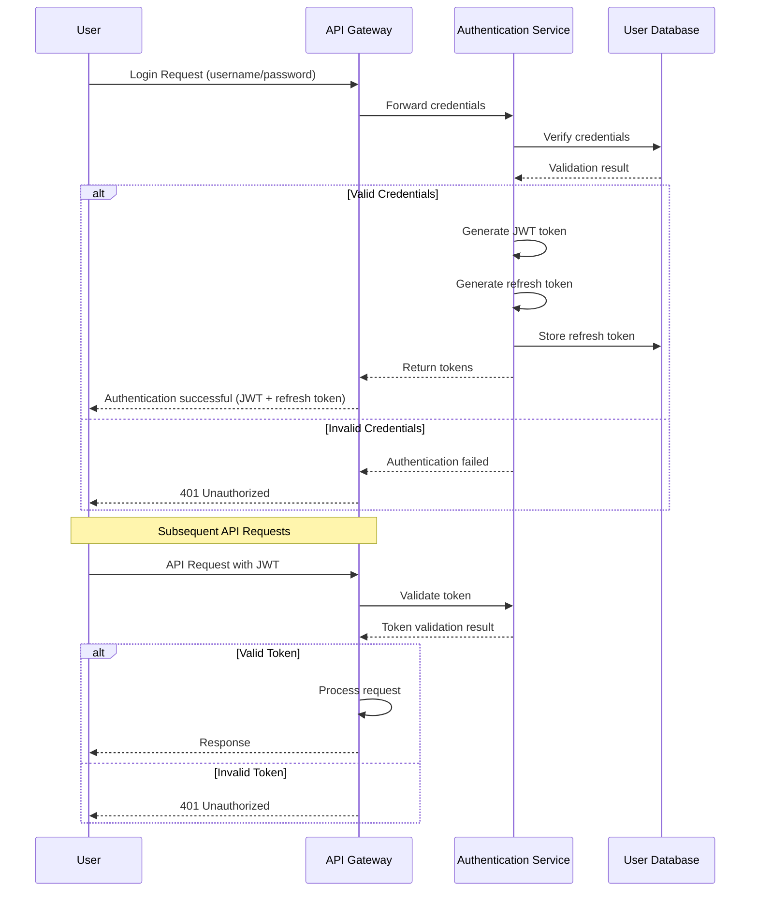
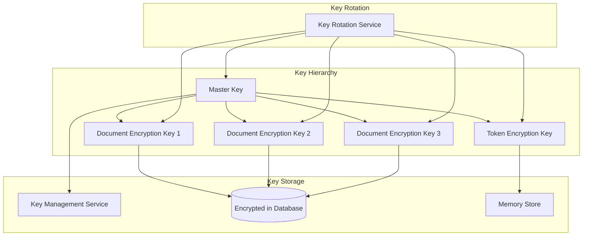
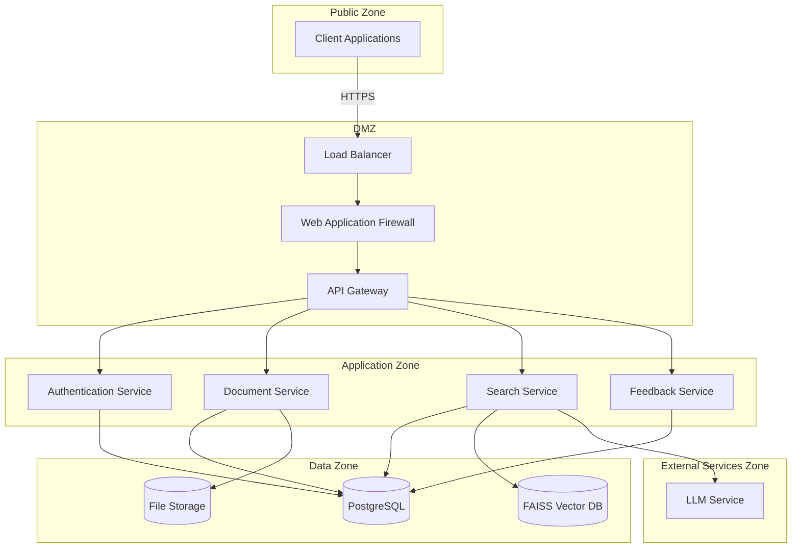
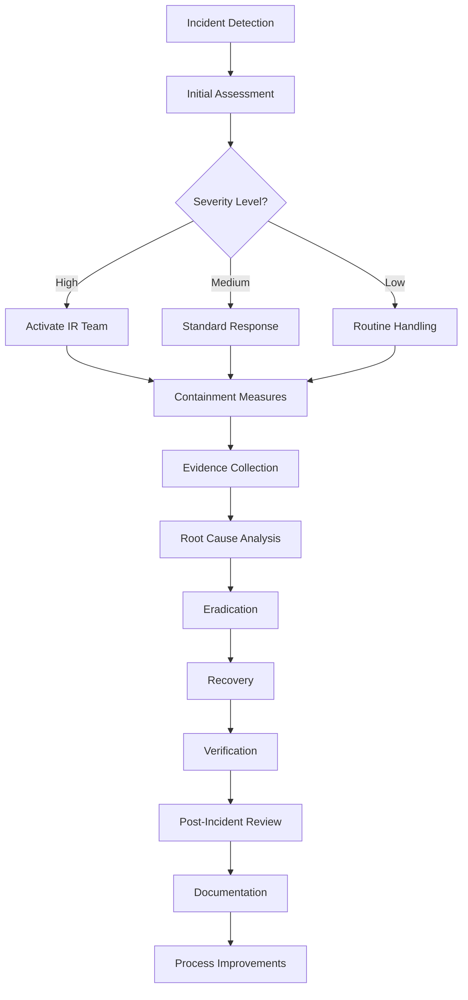

# Security Architecture

## 1. Introduction

The Document Management and AI Chatbot System implements a comprehensive security architecture designed to protect sensitive document data, user information, and system integrity. This document outlines the security principles, objectives, compliance requirements, and specific security controls implemented throughout the system.

### 1.1 Security Principles

The security architecture is guided by the following core security principles:

- **Defense in Depth**: Multiple layers of security controls are implemented to protect the system. If one layer fails, other layers continue to provide protection.

- **Principle of Least Privilege**: Users and system components are granted the minimum level of access required to perform their functions, reducing the potential impact of compromised accounts or components.

- **Secure by Default**: Security is built into the system from the ground up, with secure defaults for all configurations and explicit opt-in for potentially risky features.

- **Privacy by Design**: Privacy considerations are incorporated into the system design from the beginning, ensuring that user data is protected throughout its lifecycle.

- **Zero Trust**: All access requests are authenticated and authorized regardless of the source, with continuous validation throughout user sessions.

### 1.2 Security Objectives

The security architecture aims to achieve the following primary objectives:

- **Confidentiality**: Protecting sensitive information from unauthorized access, including document content, user data, and system configuration.

- **Integrity**: Ensuring that data remains accurate and unaltered throughout its lifecycle, with protection against unauthorized modifications.

- **Availability**: Maintaining system uptime and performance while protecting against denial of service attacks and other threats to availability.

- **Accountability**: Providing comprehensive audit trails and logging to track user actions and system events, enabling forensic analysis and compliance reporting.

### 1.3 Compliance Requirements

The system is designed to meet the following compliance requirements:

- **Data Protection Regulations**: Compliance with GDPR, CCPA, and other applicable data protection regulations, including data minimization, consent management, and right to be forgotten.

- **Industry Standards**: Adherence to security best practices outlined in standards such as OWASP Top 10, NIST Cybersecurity Framework, and ISO 27001.

- **Internal Security Policies**: Alignment with organizational security policies, including access control, data classification, and incident response procedures.

- **Contractual Obligations**: Meeting security requirements specified in service level agreements (SLAs) and contracts with clients and partners.

## 2. Authentication Framework

The Document Management and AI Chatbot System implements a robust JWT-based authentication framework to secure API access and verify user identity.

### 2.1 JWT Implementation

JSON Web Tokens (JWT) are used as the primary authentication mechanism, providing a stateless and scalable approach to user authentication.

- **Token Structure**:
  - Header: Contains the signing algorithm (HS256)
  - Payload: Contains user ID, role, token expiration (exp), issued at time (iat)
  - Signature: HMAC-SHA256 signature created using a secure secret key

- **Signing Algorithm**: The system uses HMAC-SHA256 (HS256) for token signing, offering a good balance of security and performance.

- **Token Lifetime**:
  - Access Tokens: 60 minutes
  - Refresh Tokens: 7 days

- **Token Validation Process**:
  1. Extract token from Authorization header (Bearer scheme)
  2. Verify token signature using the secret key
  3. Check token expiration
  4. Extract user information and role

```python
# Example JWT payload structure
{
  "sub": "user-123",  # Subject (user ID)
  "role": "regular",  # User role
  "exp": 1673458800,  # Expiration timestamp
  "iat": 1673455200   # Issued at timestamp
}
```

### 2.2 Password Security

User passwords are securely stored and validated using industry-standard practices:

- **Password Hashing**: Argon2id algorithm is used for password hashing, with the following parameters:
  - Memory cost: 65536 KB
  - Time cost: 3 iterations
  - Parallelism: 4

- **Password Complexity Requirements**:
  - Minimum length: 10 characters
  - Must include at least one uppercase letter, one lowercase letter, one number, and one special character
  - No reuse of the last 5 passwords
  - Expiration: 90 days

- **Failed Attempt Handling**:
  - Account lockout after 5 failed attempts
  - Incrementally increasing delays between login attempts
  - Secure notification of suspicious login activity

### 2.3 Token Management

The system implements comprehensive token management to ensure secure authentication:

- **Token Creation**:
  - Generated upon successful authentication
  - Contains minimal necessary claims to limit token size
  - Signed with a secure server-side secret

- **Token Validation**:
  - Performed on every authenticated API request
  - Validates signature, expiration, and token structure
  - Implemented as middleware in the FastAPI application

- **Token Refresh**:
  - Uses a secure refresh token rotation pattern
  - Refresh tokens are invalidated after use
  - New access and refresh tokens are issued upon successful refresh

- **Token Revocation**:
  - Access tokens can be revoked in security incidents
  - Refresh tokens stored in database with revocation flag
  - Support for token blacklisting in high-security scenarios

### 2.4 Authentication Workflow

The authentication process follows these steps:

1. **User Login**:
   - User submits credentials (username/password)
   - System validates credentials against stored password hash
   - On success, generates and returns JWT access token and refresh token

2. **Authenticated Requests**:
   - Client includes JWT token in Authorization header
   - System validates token on each request
   - Request processing continues if token is valid

3. **Token Refresh**:
   - Client submits refresh token when access token expires
   - System validates refresh token and issues new token pair
   - Old refresh token is invalidated

4. **Logout**:
   - Client discards tokens
   - Refresh token is invalidated in the database
   - Optional: Access token added to short-term blacklist



## 3. Authorization System

The Document Management and AI Chatbot System implements a role-based access control (RBAC) system to ensure users can only access resources and perform actions appropriate to their role.

### 3.1 Role Definitions

The system defines the following roles with specific permission sets:

- **Admin**:
  - Full system access
  - User management capabilities
  - Access to all documents and queries
  - System configuration rights
  - Analytics and reporting access

- **Regular User**:
  - Document upload, search, and management
  - Access to own documents and shared documents
  - Query submission and feedback
  - Profile management
  - Limited analytics access

- **Guest**:
  - Limited search functionality
  - No document upload capability
  - No access to user-specific features
  - No feedback capabilities

Each role has explicitly defined permissions in the system, following the principle of least privilege.

### 3.2 Permission Matrix

The following matrix details the permissions assigned to each role:

| Resource/Operation | Admin | Regular User | Guest |
| --- | --- | --- | --- |
| **Documents** |
| Upload Document | ✓ | ✓ | ✗ |
| List Documents | All | Own + Shared | ✗ |
| View Document | All | Own + Shared | ✗ |
| Delete Document | All | Own | ✗ |
| **Search/Query** |
| Submit Query | ✓ | ✓ | ✓ (limited) |
| View Query History | All | Own | ✗ |
| **Feedback** |
| Submit Feedback | ✓ | ✓ | ✗ |
| View Feedback | All | Own | ✗ |
| **User Management** |
| Create User | ✓ | ✗ | ✗ |
| Update User | All | Self | ✗ |
| Delete User | All | Self | ✗ |
| **System Configuration** |
| View Configuration | ✓ | ✗ | ✗ |
| Update Configuration | ✓ | ✗ | ✗ |

### 3.3 Implementation Approach

Authorization is implemented using FastAPI's dependency injection system, which provides a clean and efficient way to enforce role-based access control.

- **Role-Based Middleware**:
  - Custom middleware checks user roles and permissions
  - Integrated with FastAPI dependency injection
  - Applied at endpoint level for granular control

- **Implementation Pattern**:

```python
# Pseudocode example for authorization implementation
def require_role(allowed_roles: List[str]):
    def dependency(token: str = Depends(get_token)):
        payload = decode_jwt(token)
        if payload["role"] not in allowed_roles:
            raise HTTPException(status_code=403, detail="Permission denied")
        return payload
    return dependency

# Usage example
@app.post("/documents/upload")
async def upload_document(
    file: UploadFile,
    user: dict = Depends(require_role(["admin", "regular"]))
):
    # Implementation
```

- **Permission Checking**:
  - Role verification on each protected endpoint
  - Additional resource-level permissions where needed
  - Comprehensive validation before any protected operation

### 3.4 Resource Authorization

Beyond role-based permissions, the system implements resource-level authorization to ensure users can only access their own resources or resources explicitly shared with them.

- **Resource Ownership**:
  - Each resource (document, query, feedback) is associated with an owner
  - Ownership is established during resource creation
  - Queries check ownership before granting access

- **Resource Sharing**:
  - Documents can be explicitly shared with other users
  - Sharing creates permission records in the database
  - Access checks validate direct ownership or shared access

- **Implementation Approach**:

```python
# Pseudocode for resource authorization
async def check_document_access(document_id: UUID, user_id: UUID):
    # Check if user owns the document
    document = await get_document(document_id)
    if document.owner_id == user_id:
        return True
        
    # Check if document is shared with user
    shared = await get_document_sharing(document_id, user_id)
    if shared:
        return True
        
    # No access
    return False
```

- **Administration Override**:
  - Administrators can access all resources
  - Administrative access is logged for audit purposes
  - Special permissions can be granted for specific resources

## 4. Data Protection

The Document Management and AI Chatbot System implements multiple layers of data protection to ensure confidentiality, integrity, and availability of sensitive information.

### 4.1 Encryption Standards

The system employs industry-standard encryption algorithms to protect data throughout its lifecycle:

- **Data at Rest**:
  - Algorithm: AES-256
  - Implementation: Transparent database encryption
  - Key storage: Secure key management service

- **Data in Transit**:
  - Protocol: TLS 1.3
  - Ciphers: ECDHE with P-256 curves
  - Certificate management: Automated renewal with Let's Encrypt

- **Passwords**:
  - Algorithm: Argon2id
  - Parameters: Memory: 65536 KB, Iterations: 3, Parallelism: 4
  - Implementation: Via Passlib library

- **Document Content**:
  - Algorithm: AES-256-GCM
  - Key management: Per-document encryption keys
  - Implementation: Unique initialization vector (IV) per document

### 4.2 Key Management

The system implements a comprehensive key management approach to secure encryption keys:

- **Key Hierarchy**:
  - Master Key: Used to encrypt all other keys
  - Document Encryption Keys (DEKs): Individual keys for document content
  - Token Encryption Key (TEK): Used for token signing



- **Key Storage**:
  - Master keys stored in a dedicated key management service
  - Document encryption keys stored encrypted in the database
  - Application keys loaded securely into memory

- **Key Rotation Policies**:
  - Master key: Rotated annually
  - Document encryption keys: Rotated upon request or suspected compromise
  - Token signing key: Rotated quarterly

- **Key Backup Procedures**:
  - Secure offline backup of master keys
  - Key recovery procedures documented and tested
  - Split knowledge procedures for critical key recovery

### 4.3 Data Masking

The system implements data masking rules to protect sensitive information in logs, reports, and user interfaces:

- **Email Addresses**:
  - Display format: user\*\*\*@domain.com
  - Implementation: Custom masking function
  - Application: Logs, user interfaces, exports

- **Document Content**:
  - Method: Context-based redaction
  - Implementation: Automated PII detection and masking
  - Application: Previews, search results, responses

- **User Activity**:
  - Method: Aggregation and anonymization
  - Implementation: Statistical summaries without individual identification
  - Application: Analytics, reports, dashboards

- **Implementation Example**:

```python
# Pseudocode for email masking
def mask_email(email: str) -> str:
    if not email or '@' not in email:
        return email
    
    username, domain = email.split('@', 1)
    if len(username) <= 3:
        masked_username = username[0] + '*' * len(username[1:])
    else:
        masked_username = username[0:3] + '*' * len(username[3:])
    
    return f"{masked_username}@{domain}"
```

### 4.4 Secure Communication

All communication within the system and with external services is secured using strong encryption and secure protocols:

- **Transport Layer Security**:
  - TLS 1.3 for all HTTP traffic
  - Perfect forward secrecy with ECDHE key exchange
  - Strong cipher suites (ECDHE-ECDSA-AES256-GCM-SHA384)

- **API Security**:
  - HTTPS-only API endpoints
  - HSTS headers to enforce secure connections
  - Certificate pinning for mobile clients

- **External Service Communication**:
  - Mutual TLS for critical service integrations
  - API keys transmitted over secure channels
  - Regular rotation of service credentials

- **Internal Communication**:
  - Service-to-service authentication
  - Encrypted inter-service communication
  - Network segmentation to isolate services

## 5. Security Zones

The system architecture is divided into security zones with appropriate controls at each boundary to implement defense in depth.

### 5.1 Network Architecture

The network security architecture consists of multiple security zones with controlled data flows between them:



- **Public Zone**: 
  - Contains client applications and external systems
  - Accessible from the internet
  - Limited to HTTPS traffic on standard ports

- **DMZ (Demilitarized Zone)**:
  - Contains load balancers, WAF, and API gateway
  - Filters and inspects incoming traffic
  - Terminates TLS connections and establishes new ones to internal services

- **Application Zone**:
  - Contains application components and services
  - Not directly accessible from the internet
  - Enforces service-to-service authentication

- **Data Zone**:
  - Contains databases and storage systems
  - Highly restricted access
  - Accessible only from the Application Zone

- **External Services Zone**:
  - Contains third-party services like LLM APIs
  - Secured with API keys and IP restrictions
  - Access controlled and monitored

### 5.2 Security Controls

Each zone boundary is protected by multiple security controls:

- **Public Zone to DMZ**:
  - Web Application Firewall (WAF)
  - DDoS protection
  - TLS termination
  - IP reputation filtering

- **DMZ to Application Zone**:
  - Network ACLs
  - Application-level authentication
  - Rate limiting
  - Traffic filtering

- **Application Zone to Data Zone**:
  - Network ACLs
  - Database authentication
  - Connection pooling
  - Query filtering

- **Application Zone to External Services Zone**:
  - API key management
  - Request validation
  - Response verification
  - Circuit breakers

**Security Group Configuration:**

| Security Group | Inbound Rules | Outbound Rules |
| --- | --- | --- |
| Load Balancer SG | HTTP/HTTPS from internet | HTTP to WAF SG |
| WAF SG | HTTP from Load Balancer SG | HTTP to API Gateway SG |
| API Gateway SG | HTTP from WAF SG | HTTP to Application SG |
| Application SG | HTTP from API Gateway SG | PostgreSQL to DB SG, HTTP to External Services |
| Database SG | PostgreSQL from Application SG | No outbound |

### 5.3 Data Flow Security

Data flows between zones are secured through multiple mechanisms:

- **Client to Application**:
  - TLS 1.3 encryption
  - Token-based authentication
  - Request validation
  - Response sanitization

- **Application to Database**:
  - Encrypted connections
  - Parameterized queries
  - Connection pooling
  - Minimal privilege database accounts

- **Application to External Services**:
  - Secure API keys
  - TLS encryption
  - Request/response validation
  - Circuit breakers and fallbacks

- **Cross-Component Communication**:
  - Service authentication
  - Structured data validation
  - Comprehensive logging
  - Exception handling

## 6. Threat Mitigation

The system implements specific controls to mitigate common security threats and vulnerabilities.

### 6.1 SQL Injection Prevention

SQL injection attacks are prevented through comprehensive database security measures:

- **ORM Usage**:
  - SQLAlchemy ORM for database operations
  - Parameterized queries for all database operations
  - No direct string concatenation for SQL

- **Implementation Example**:

```python
# Secure approach with SQLAlchemy ORM
async def get_document(document_id: UUID, user_id: UUID):
    query = select(Document).where(
        and_(
            Document.id == document_id,
            Document.owner_id == user_id
        )
    )
    result = await db.execute(query)
    return result.scalar_one_or_none()

# Instead of vulnerable string concatenation:
# f"SELECT * FROM documents WHERE id = '{document_id}' AND owner_id = '{user_id}'"
```

- **Additional Protections**:
  - Input validation before database operations
  - Database user with minimal privileges
  - Regular security scanning for SQL injection vulnerabilities

### 6.2 Cross-Site Scripting (XSS) Protection

The system protects against XSS vulnerabilities through multiple layers of defense:

- **Input Validation**:
  - Pydantic models for request validation
  - Data type checking and constraints
  - Rejection of malicious input patterns

- **Output Encoding**:
  - Context-appropriate HTML escaping
  - Content Security Policy (CSP) headers
  - Safe templating practices

- **Response Headers**:
  - Content-Type headers with correct charset
  - X-XSS-Protection header for compatible browsers
  - X-Content-Type-Options: nosniff

- **Content Security Policy Example**:

```
Content-Security-Policy: default-src 'self'; script-src 'self'; object-src 'none'; frame-ancestors 'none';
```

### 6.3 Cross-Site Request Forgery (CSRF) Protection

CSRF attacks are mitigated through the following controls:

- **Token Pattern**:
  - Double Submit Cookie pattern for state-changing operations
  - CSRF tokens with appropriate timeout
  - Validation on all non-idempotent operations

- **Implementation Approach**:

```python
# Pseudocode for CSRF protection
@app.post("/documents/upload")
async def upload_document(
    file: UploadFile,
    csrf_token: str = Form(...),
    user: dict = Depends(require_role(["admin", "regular"]))
):
    # Validate CSRF token
    if not validate_csrf_token(csrf_token, user["sub"]):
        raise HTTPException(status_code=403, detail="Invalid CSRF token")
    
    # Process the upload
    # ...
```

- **Additional Protections**:
  - SameSite=Lax cookie attribute
  - Origin and Referer header validation
  - Short CSRF token lifetimes

### 6.4 Rate Limiting

The system implements rate limiting to prevent brute force attacks, API abuse, and denial of service:

- **Implementation Approach**:
  - Redis-based token bucket algorithm
  - Different rate limits based on endpoint sensitivity
  - User-based and IP-based rate limiting

- **Rate Limit Configuration**:

| Client Type | Rate Limit | Timeframe | Implementation |
| --- | --- | --- | --- |
| Anonymous | 10 requests | Per minute | IP-based limiting |
| Authenticated | 60 requests | Per minute | User-based limiting |
| Admin | 120 requests | Per minute | Role-based limiting |

- **Additional Protections**:
  - Exponential backoff for authentication failures
  - Account lockout after multiple failed attempts
  - Notification of suspicious activity

### 6.5 Prompt Injection Protection

The system implements measures to prevent prompt injection attacks in LLM interactions:

- **Input Sanitization**:
  - Filtering of potentially malicious prompt patterns
  - Validation of query inputs
  - Removal of control characters and formatting

- **Context Boundaries**:
  - Clear separation between system prompts and user input
  - Structured prompts with defined roles
  - Validation of LLM responses

- **Implementation Example**:

```python
# Pseudocode for prompt injection protection
def create_safe_prompt(user_query: str, context: str) -> str:
    # Sanitize user query
    sanitized_query = sanitize_input(user_query)
    
    # Create prompt with clear boundaries
    prompt = f"""
System: You are a helpful assistant that answers questions based on the provided document context.
Only use information from the provided context to answer the question.
If the context doesn't contain relevant information, say "I don't have enough information to answer this question."

Context:
{context}

User question: {sanitized_query}

Answer:
"""
    return prompt
```

- **Additional Protections**:
  - Monitoring of LLM responses for unexpected patterns
  - Response filtering for sensitive information
  - Regular review of prompt templates

## 7. Security Monitoring and Incident Response

The Document Management and AI Chatbot System implements continuous security monitoring and a defined incident response process.

### 7.1 Security Logging

The system implements comprehensive security logging to capture security-relevant events:

- **Log Types**:

| Log Type | Information Captured | Storage | Retention |
| --- | --- | --- | --- |
| Application Logs | API requests, errors, processing events | Structured JSON | 30 days |
| Authentication Logs | Login attempts, token issuance, logouts | Secure log storage | 90 days |
| Authorization Logs | Access attempts, permission checks | Secure log storage | 90 days |
| Data Access Logs | Document access, search queries | Structured JSON | 90 days |
| Admin Activity Logs | Configuration changes, user management | Secure log storage | 1 year |

- **Log Format**:
  - Structured JSON format
  - Consistent schema across services
  - Includes timestamp, severity, component, user ID, action, result
  - Correlation IDs for request tracing

- **Log Collection**:
  - Centralized log aggregation
  - Secure transmission of logs
  - Tamper-evident storage
  - Access controls on log data

- **Log Example**:

```json
{
  "timestamp": "2023-01-15T14:23:45.123Z",
  "level": "INFO",
  "component": "authentication_service",
  "correlation_id": "c1b2d3e4-5f6g-7h8i-9j0k",
  "user_id": "user-123",
  "action": "login",
  "result": "success",
  "ip_address": "192.168.1.1",
  "user_agent": "Mozilla/5.0...",
  "additional_info": {}
}
```

### 7.2 Intrusion Detection

The system implements anomaly detection mechanisms to identify potential security breaches:

- **Detection Methods**:
  - User behavior analytics
  - Unusual access patterns
  - Geographic anomalies
  - Time-based anomalies
  - Rate-based detection

- **Monitored Activities**:
  - Authentication attempts
  - Document access patterns
  - API usage patterns
  - Administrative actions
  - System configuration changes

- **Alert Thresholds**:
  - Login attempts from new locations
  - Multiple failed authentication attempts
  - Unusual document access volumes
  - Off-hours administrative actions
  - Unexpected system configuration changes

- **Response Actions**:
  - Real-time alerts to security team
  - Automatic blocking of suspicious activity
  - Forced re-authentication
  - Session termination
  - Temporary account lockout

### 7.3 Vulnerability Management

The system implements a comprehensive vulnerability management process:

- **Vulnerability Scanning**:
  - Automated scanning of application code
  - Dependency scanning for known vulnerabilities
  - Infrastructure scanning
  - Regular penetration testing

- **Scanning Schedule**:

| Scan Type | Frequency | Tools |
| --- | --- | --- |
| SAST | Every commit | Bandit, SonarQube |
| Dependency Scanning | Daily | Safety, Snyk |
| Infrastructure Scanning | Weekly | AWS Inspector, Nessus |
| Penetration Testing | Quarterly | Manual testing, OWASP ZAP |

- **Vulnerability Assessment**:
  - Risk-based prioritization
  - CVSS scoring
  - Business impact analysis
  - Exploitation difficulty assessment

- **Remediation Process**:
  - Critical vulnerabilities: 24 hours
  - High vulnerabilities: 1 week
  - Medium vulnerabilities: 1 month
  - Low vulnerabilities: Next release cycle

### 7.4 Incident Response Process

The system defines a clear incident response process to address security incidents:

- **Incident Detection and Analysis**:
  - Monitor security alerts and logs
  - Assess the severity and scope
  - Document initial findings
  - Establish an incident response team based on severity

- **Containment**:
  - Isolate affected systems
  - Block attack vectors
  - Preserve evidence
  - Implement temporary workarounds

- **Eradication**:
  - Remove malware or unauthorized access
  - Patch vulnerabilities
  - Reset compromised credentials
  - Verify system integrity

- **Recovery**:
  - Restore systems to normal operation
  - Implement additional security controls
  - Monitor for repeat incidents
  - Gradually return to normal operations

- **Post-Incident Review**:
  - Conduct root cause analysis
  - Document lessons learned
  - Update security controls
  - Improve incident response procedures

- **Incident Response Workflow**:



## 8. Security Testing

The Document Management and AI Chatbot System undergoes regular security testing to identify and address vulnerabilities.

### 8.1 Static Application Security Testing (SAST)

SAST is performed automatically in the CI/CD pipeline to identify code-level security issues:

- **Implementation**:
  - Integrated into CI/CD pipeline
  - Run on every code commit
  - Results reviewed before deployment

- **Tools**:
  - Bandit for Python code analysis
  - SonarQube for comprehensive code quality and security
  - Custom rules for application-specific vulnerabilities

- **Focus Areas**:
  - Insecure coding patterns
  - Input validation issues
  - Authentication and authorization flaws
  - Cryptographic implementation issues
  - Sensitive data exposure

- **Severity Levels**:
  - Critical: Must be fixed before deployment
  - High: Must be fixed within 1 week
  - Medium: Must be fixed within 1 month
  - Low: Should be fixed in future releases

### 8.2 Dynamic Application Security Testing (DAST)

DAST is performed monthly to identify vulnerabilities in the running application:

- **Implementation**:
  - Scheduled monthly scans
  - Ad-hoc scans after significant changes
  - Performed in staging environment

- **Tools**:
  - OWASP ZAP for automated scanning
  - Burp Suite for targeted testing
  - Custom scripts for application-specific tests

- **Focus Areas**:
  - Authentication and session management
  - Access control issues
  - Input/output validation
  - Server configuration issues
  - Client-side security controls

- **Testing Methodology**:
  - Baseline scan (unauthenticated)
  - Authenticated scan with different user roles
  - API endpoint testing
  - File upload/download testing
  - Error handling assessment

### 8.3 Penetration Testing

Penetration testing is conducted quarterly by security professionals to identify vulnerabilities through simulated attacks:

- **Test Scope**:
  - External penetration testing
  - Internal penetration testing
  - API security testing
  - Authentication bypass attempts
  - Privilege escalation attempts

- **Methodology**:
  - Information gathering
  - Vulnerability scanning
  - Exploitation attempts
  - Post-exploitation assessment
  - Reporting and recommendations

- **Deliverables**:
  - Comprehensive test report
  - Vulnerabilities with CVSS scores
  - Exploitation proof of concept
  - Remediation recommendations
  - Retest verification

- **Response Process**:
  - Severity-based prioritization
  - Remediation planning
  - Fix implementation
  - Verification testing
  - Documentation of fixes

### 8.4 Dependency Scanning

Weekly dependency scanning is performed to identify vulnerabilities in third-party libraries:

- **Implementation**:
  - Automated weekly scans
  - Pre-commit hooks for new dependencies
  - Integrated into CI/CD pipeline

- **Tools**:
  - Safety for Python dependencies
  - Snyk for comprehensive dependency analysis
  - GitHub Dependabot for automated updates

- **Focus Areas**:
  - Known vulnerabilities (CVEs)
  - Outdated dependencies
  - License compliance
  - Deprecated packages
  - Supply chain risks

- **Remediation Process**:
  - Automated update PRs for minor versions
  - Manual review for major updates
  - Impact assessment before updating
  - Testing after dependency updates
  - Documentation of changes

## 9. Compliance Controls

The Document Management and AI Chatbot System implements various controls to meet compliance requirements.

### 9.1 Data Retention

The system implements data retention policies for different data categories:

- **Retention Periods**:

| Data Category | Retention Period | Justification | Deletion Process |
| --- | --- | --- | --- |
| User Accounts | Until deletion request + 30 days | User control over personal data | Soft delete, then hard delete after 30 days |
| Documents | Until deletion request or 7 years | Business records retention | Soft delete with option for hard delete |
| Query History | 1 year active, 2 years archived | Balance between utility and storage | Automatic archival, then deletion |
| Feedback Data | 2 years active, 3 years archived | Reinforcement learning needs | Automatic archival, then deletion |
| Authentication Logs | 90 days | Security monitoring | Automatic deletion after retention period |

- **Data Lifecycle Management**:
  - Automatic archiving of older data
  - Scheduled deletion processes
  - Verification of deletion completeness
  - Audit trail of deletion activities

- **Retention Exceptions**:
  - Legal hold process
  - Compliance investigation exemptions
  - User-requested extended retention
  - Critical business data exemptions

### 9.2 Audit Mechanisms

The system implements comprehensive auditing at database and application levels:

- **Database-Level Auditing**:
  - PostgreSQL audit logging for sensitive operations
  - Tracking of all data modifications with user ID and timestamp
  - Separate audit log storage with restricted access

- **Application-Level Auditing**:
  - Logging of all authentication attempts
  - Tracking of document access and modifications
  - Query history with user attribution
  - Administrative action logging

- **Audit Log Protection**:
  - Immutable audit logs
  - Separate storage from application data
  - Restricted access to audit information
  - Backup and retention of audit logs

- **Audit Review Process**:
  - Regular review of authentication logs
  - Periodic review of administrative actions
  - Investigation of suspicious patterns
  - Compliance reporting based on audit data

### 9.3 Privacy Controls

The system implements privacy controls to protect user data and comply with regulations:

- **Data Minimization**:
  - Collection of only necessary user data
  - Purpose-specific data collection
  - Automatic purging of unnecessary data
  - Privacy-focused default settings

- **Access Controls**:
  - Role-based restrictions on personal data
  - Purpose limitation for data access
  - Data access logging and monitoring
  - Need-to-know principle enforcement

- **Data Encryption**:
  - Encryption of personal data at rest
  - Secure transmission of personal data
  - Encrypted backups
  - Secure key management

- **User Consent**:
  - Clear consent mechanisms
  - Purpose-specific consent
  - Consent withdrawal options
  - Consent audit trail

- **Right to be Forgotten**:
  - Account deletion process
  - Data export functionality
  - Comprehensive data removal
  - Verification of deletion completeness

## 10. Security Configuration

The system implements secure configuration settings and management processes.

### 10.1 Security Settings

The system uses a `SecuritySettings` class to manage security-related configuration:

```python
# Pseudocode for SecuritySettings class
class SecuritySettings:
    # JWT Configuration
    jwt_secret: str
    jwt_algorithm: str = "HS256"
    access_token_expire_minutes: int = 60
    refresh_token_expire_days: int = 7
    
    # Password Policy
    password_min_length: int = 10
    password_require_uppercase: bool = True
    password_require_lowercase: bool = True
    password_require_digit: bool = True
    password_require_special: bool = True
    password_expiry_days: int = 90
    password_history_count: int = 5
    
    # Authentication Security
    max_failed_attempts: int = 5
    lockout_duration_minutes: int = 30
    
    # API Security
    rate_limit_anonymous: int = 10
    rate_limit_authenticated: int = 60
    rate_limit_admin: int = 120
    
    # Encryption Configuration
    encryption_algorithm: str = "AES-256-GCM"
    
    # Security Headers
    security_headers: Dict[str, str] = {
        "X-Content-Type-Options": "nosniff",
        "X-Frame-Options": "DENY",
        "Content-Security-Policy": "default-src 'self'; script-src 'self'; object-src 'none'",
        "Strict-Transport-Security": "max-age=31536000; includeSubDomains",
        "X-XSS-Protection": "1; mode=block"
    }
```

These settings are loaded from environment variables with secure defaults and validated at application startup.

### 10.2 Environment Variables

Security-related environment variables are used to configure the system:

| Variable Name | Purpose | Default Value | Notes |
| --- | --- | --- | --- |
| `JWT_SECRET` | Secret key for JWT signing | None (Required) | High entropy random value |
| `JWT_ALGORITHM` | Algorithm for JWT signing | HS256 | HMAC with SHA-256 |
| `ACCESS_TOKEN_EXPIRE_MINUTES` | Access token lifetime | 60 | Balance between security and usability |
| `REFRESH_TOKEN_EXPIRE_DAYS` | Refresh token lifetime | 7 | Allows extended sessions |
| `PASSWORD_MIN_LENGTH` | Minimum password length | 10 | Strong password requirement |
| `ENCRYPTION_KEY` | Master encryption key | None (Required) | Used for data encryption |
| `POSTGRES_PASSWORD` | Database password | None (Required) | Strong randomly generated password |
| `OPENAI_API_KEY` | OpenAI API key | None (Required) | Secured and rotated regularly |

Environment variables are:
- Never logged or exposed in responses
- Loaded securely at application startup
- Validated for presence and format
- Required variables cause startup failure if missing

### 10.3 Secrets Management

Sensitive configuration values are managed securely:

- **Development Environment**:
  - Local .env files excluded from version control
  - Developer-specific keys for non-production use
  - Clear documentation on required secrets

- **Staging/Production Environments**:
  - AWS Secrets Manager for secret storage
  - Environment-specific secrets
  - Automated secret rotation
  - Least privilege access to secrets

- **CI/CD Pipeline**:
  - Secure storage of build secrets
  - Temporary access during build process
  - No persistence of secrets in build artifacts
  - Secrets scanning in CI/CD pipeline

- **Application Access**:
  - Secrets loaded only in memory
  - No logging or exposure of secret values
  - Monitoring for potential secret leakage
  - Regular audit of secret usage

## 11. Security Best Practices

The following guidelines and best practices should be followed to maintain security in the system.

### 11.1 Development Practices

- **Secure Coding Standards**:
  - Input validation for all user-provided data
  - Output encoding to prevent injection attacks
  - Proper error handling without information disclosure
  - Use of parameterized queries for database operations
  - Regular security training for developers

- **Code Review Process**:
  - Security-focused code reviews
  - Use of automated code analysis tools
  - Required reviews for security-sensitive code
  - Validation of security controls implementation
  - Documentation of security decisions

- **Dependency Management**:
  - Regular updates of dependencies
  - Vulnerability scanning before adding new dependencies
  - Pinned dependency versions
  - Verification of dependency integrity
  - Monitoring for security advisories

- **Source Code Protection**:
  - Secure source code repository
  - Branch protection rules
  - Required reviews for merges
  - Signed commits
  - No secrets in source code

### 11.2 Operational Practices

- **Patch Management**:
  - Regular security updates for all components
  - Automated patch management where possible
  - Testing patches before production deployment
  - Emergency patching process for critical vulnerabilities
  - Patch compliance monitoring

- **Access Control Reviews**:
  - Regular review of user access rights
  - Prompt deprovisioning of access
  - Privilege audit logging
  - Separation of duties
  - Principle of least privilege enforcement

- **Security Monitoring**:
  - Real-time monitoring of security events
  - Correlation of security logs
  - Alerting on suspicious activities
  - Regular review of security logs
  - Incident response readiness

- **Backup and Recovery**:
  - Regular data backups
  - Encryption of backup data
  - Secure offsite storage
  - Regular recovery testing
  - Documented recovery procedures

### 11.3 Deployment Practices

- **Secure Configuration**:
  - Hardened base images
  - Removal of unnecessary components
  - Secure default configurations
  - Configuration validation
  - Documentation of secure configurations

- **Container Security**:
  - Minimal, hardened container images
  - Container vulnerability scanning
  - No running as root
  - Read-only file systems where possible
  - Resource limitations

- **Infrastructure Hardening**:
  - Network segmentation
  - Host-based firewalls
  - Unnecessary services disabled
  - Regular security scanning
  - Compliance with security benchmarks

- **Deployment Process**:
  - Security validation before deployment
  - Immutable infrastructure
  - Automated deployment
  - Rollback capability
  - Deployment monitoring

## 12. References

### 12.1 Internal References

- **API Security Documentation**:
  - Comprehensive API security guidelines
  - Authentication and authorization flows
  - API endpoint security requirements
  - Error handling and security responses

- **Deployment Security Procedures**:
  - Secure deployment checklist
  - Security configuration guide
  - Infrastructure security standards
  - Cloud security controls

- **Security Policies**:
  - Incident response procedures
  - Data classification policy
  - Password policy
  - Access control policy
  - Acceptable use policy

### 12.2 External References

- **Security Standards**:
  - OWASP API Security Top 10
  - OWASP Web Security Testing Guide
  - NIST Cybersecurity Framework
  - CIS Benchmarks

- **Best Practices**:
  - AWS Security Best Practices
  - SANS Security Guidelines
  - Python Security Best Practices
  - FastAPI Security Documentation

- **Compliance Guidelines**:
  - GDPR Compliance Documentation
  - CCPA Implementation Guide
  - ISO 27001 Framework
  - SOC 2 Security Controls