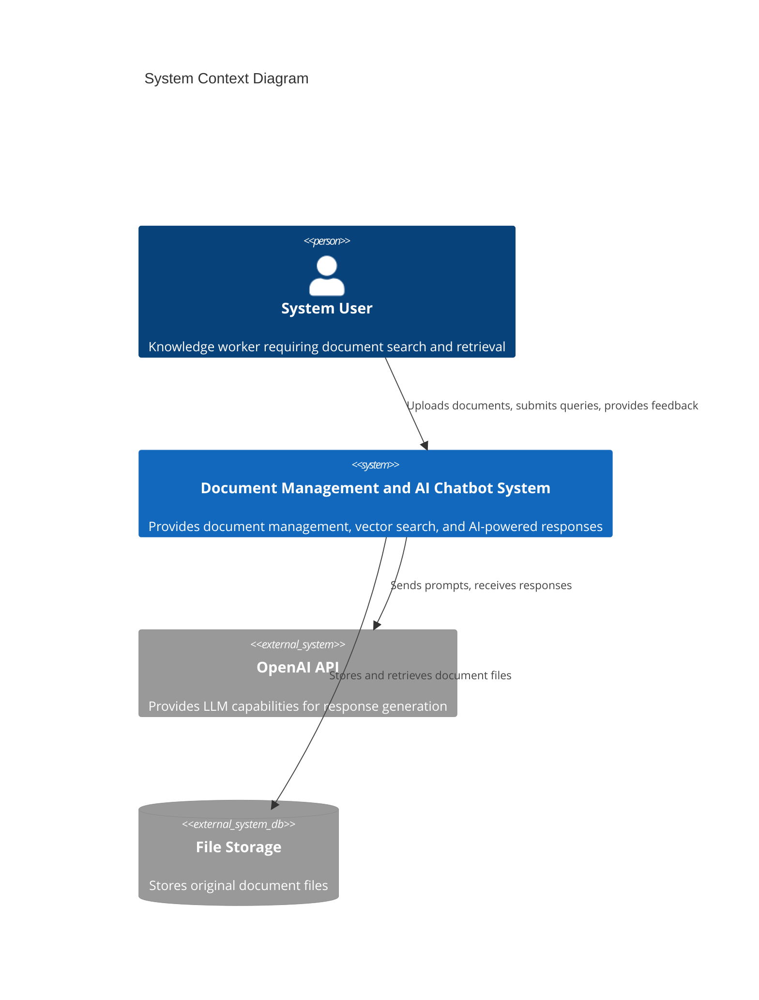
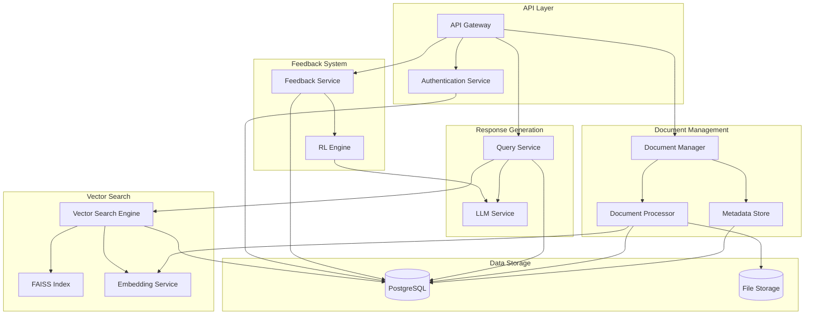
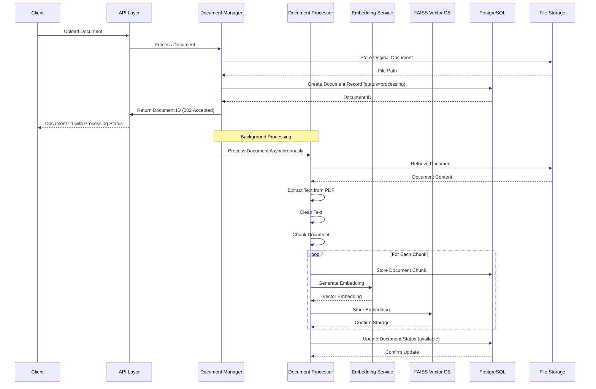
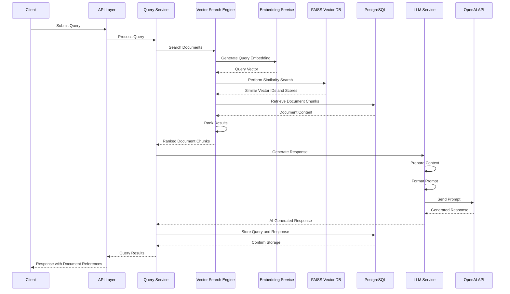
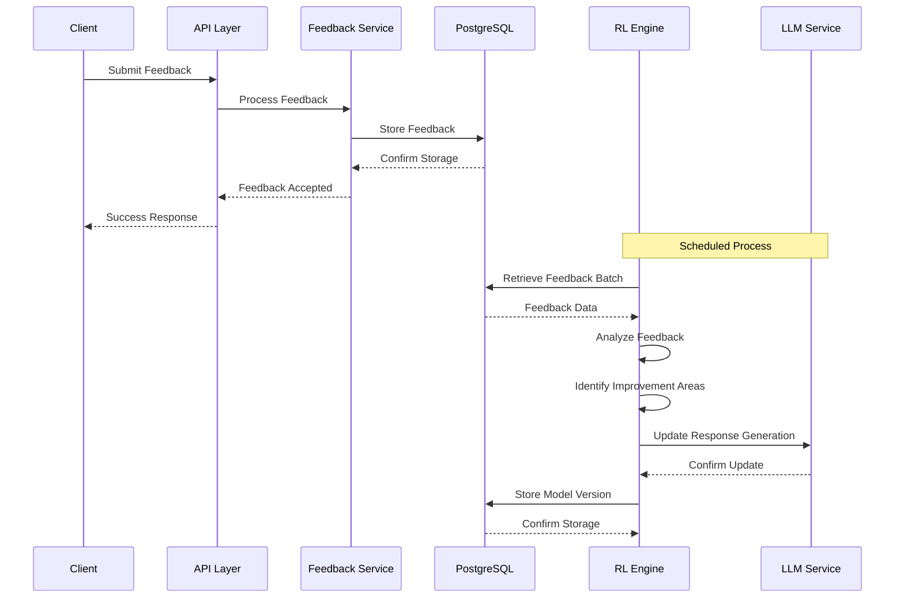
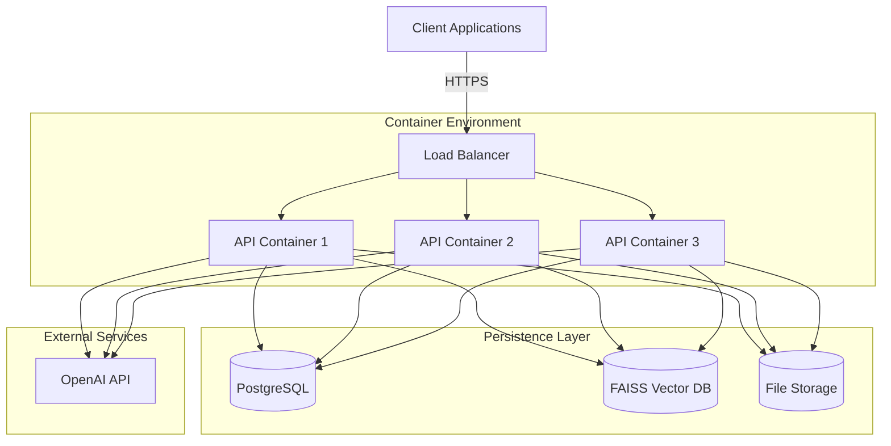

# System Architecture Overview

This document provides a high-level overview of the Document Management and AI Chatbot System architecture, explaining the system's purpose, core components, data flows, and key architectural decisions.

## 1. Introduction

The Document Management and AI Chatbot System is a comprehensive backend solution designed to provide intelligent document search and retrieval capabilities through a vector database and AI-powered chatbot. This system addresses the growing need for efficient knowledge management and information retrieval in organizations by combining document storage with natural language processing capabilities.

This document provides a high-level overview of the system architecture, explaining the key components, their interactions, and the architectural decisions that shape the system. It serves as an entry point to more detailed architecture documentation.

### 1.1 Purpose and Scope

The system provides a comprehensive API-based solution for document management, vector search, and AI-powered responses. It combines FastAPI for the backend, FAISS for vector storage, and LLM integration for intelligent query processing.

Primary capabilities include:

- Document upload, storage, and management
- Vector-based document search and retrieval
- AI-powered chatbot responses based on document content
- Basic reinforcement learning from user feedback

The architecture follows a modular approach with components for document processing, vector storage, query handling, and reinforcement learning, initially deployed as a monolithic application but designed for future scalability.

### 1.2 Business Context

The system positions itself as a lightweight yet powerful document management and search solution in the growing knowledge management market. It addresses limitations in traditional keyword-based search systems by implementing vector embeddings and AI-powered responses.

| Business Problem | Solution Approach | Value Proposition |
| --- | --- | --- |
| Inefficient document search and information retrieval | Vector-based document storage with AI-powered query processing | Faster access to relevant information, improved knowledge worker productivity |
| Time-consuming manual document analysis | Automated document processing and intelligent querying | Reduced time spent searching for information, better decision-making |
| Difficulty extracting insights from large document collections | AI chatbot that can understand and respond to natural language queries | Enhanced knowledge discovery and utilization |

### 1.3 Document Structure

This document is organized as follows:

1. **Introduction**: Overview of the system and its business context
2. **Architectural Principles**: Key principles guiding the architecture
3. **System Context**: How the system interacts with external entities
4. **Core Components**: Main components and their responsibilities
5. **Data Flow**: How data moves through the system
6. **Technology Stack**: Technologies used in the system
7. **Deployment Architecture**: How the system is deployed
8. **Cross-Cutting Concerns**: Security, monitoring, and other cross-cutting aspects
9. **Key Architectural Decisions**: Important decisions and their rationale
10. **Future Evolution**: How the architecture may evolve over time

For more detailed information, refer to the following architecture documents:
- [Component Design](component-design.md): Detailed design of system components
- [Data Flow](data-flow.md): Detailed data flow documentation
- [Security Architecture](security.md): Security mechanisms and controls
- [Monitoring Architecture](monitoring.md): Monitoring and observability approach

## 2. Architectural Principles

The architecture of the Document Management and AI Chatbot System is guided by the following key principles:

### 2.1 Separation of Concerns

The system is designed with clear boundaries between document management, vector search, and AI response generation. Each component has well-defined responsibilities and interfaces, making the system easier to understand, maintain, and extend.

### 2.2 API-First Design

All functionality is exposed through well-defined REST APIs. This approach enables flexibility in client implementation and facilitates integration with other systems. The API design follows standard REST principles and includes comprehensive documentation.

### 2.3 Stateless Processing

Core processing components maintain minimal state for scalability. This stateless approach allows for horizontal scaling and improves system resilience. Where state is required, it is stored in persistent storage systems like the database or vector store.

### 2.4 Asynchronous Processing

Document processing and other resource-intensive operations are handled asynchronously to maintain system responsiveness. This approach prevents long-running operations from blocking API responses and improves user experience.

### 2.5 Data Isolation

The system maintains clear separation between document storage, vector database, and metadata. This isolation improves data management, security, and performance by using appropriate storage technologies for different data types.

### 2.6 Future-Ready Design

While initially implemented as a monolithic application, the architecture is designed with clear component boundaries to facilitate future migration to microservices if needed. This approach balances current simplicity with future scalability.

## 3. System Context

The system context diagram illustrates how the Document Management and AI Chatbot System interacts with external entities:

### 3.1 User Interactions

Users interact with the system through client applications that consume the system's REST APIs. The primary user interactions include:

- Uploading documents for processing and indexing
- Searching for information using natural language queries
- Receiving AI-generated responses based on document content
- Providing feedback on response quality for system improvement

### 3.2 External System Integrations

The system integrates with the following external systems:

- **OpenAI API**: Provides language model capabilities for generating contextual responses based on document content and user queries
- **File Storage**: Stores original document files, which could be a local file system or cloud storage service

These integrations are designed with appropriate abstraction layers to allow for future changes in external service providers.

### 3.3 System Boundaries

The system boundaries are defined by the FastAPI application, which serves as the entry point for all client interactions. The system is responsible for:

- Document processing and storage
- Vector embedding generation and similarity search
- Query processing and response generation
- User authentication and authorization
- Feedback collection and processing

The system does not include frontend user interfaces, which are expected to be implemented by client applications consuming the APIs.

## 4. Core Components

The Document Management and AI Chatbot System consists of the following core components:

### 4.1 API Layer

The API Layer serves as the entry point for all client interactions with the system, handling HTTP requests, authentication, and routing to appropriate processing components.

**Key Responsibilities:**
- Handle HTTP requests and responses
- Implement authentication and authorization
- Validate request data using Pydantic models
- Route requests to appropriate processing components
- Handle error conditions and generate appropriate responses

**Technologies:**
- FastAPI for API implementation
- Pydantic for data validation
- PyJWT for token-based authentication

**Key Interfaces:**
- `/documents/*` endpoints for document management
- `/query/*` endpoints for vector search and chatbot interaction
- `/feedback/*` endpoints for reinforcement learning
- `/auth/*` endpoints for authentication and token management

### 4.2 Document Management

The Document Management component handles all document-related operations, including upload, retrieval, listing, and deletion.

**Key Responsibilities:**
- Validate incoming document files (format, size)
- Coordinate document processing workflow
- Manage document metadata
- Handle document deletion and updates

**Subcomponents:**
- **Document Manager**: Coordinates document operations and workflow
- **Document Processor**: Extracts text from PDFs, chunks documents, and generates embeddings
- **Metadata Store**: Manages document metadata in the database

**Technologies:**
- PyMuPDF for PDF text extraction
- SQLAlchemy for database operations
- File system or S3 for document storage

### 4.3 Vector Search

The Vector Search component handles the core functionality of converting queries to vector embeddings and performing similarity searches against the document vector database.

**Key Responsibilities:**
- Generate vector embeddings for search queries
- Perform similarity search in FAISS
- Rank and filter search results
- Retrieve document content for matched vectors

**Subcomponents:**
- **Vector Search Engine**: Coordinates search operations
- **FAISS Index**: Stores and searches vector embeddings
- **Embedding Service**: Generates vector embeddings from text

**Technologies:**
- FAISS for vector storage and similarity search
- Sentence Transformers for embedding generation
- NumPy for vector operations

### 4.4 Response Generation

The Response Generation component handles the creation of AI-powered responses based on document content and user queries.

**Key Responsibilities:**
- Prepare context from relevant document chunks
- Format prompts for the LLM
- Process and format LLM responses
- Handle token limits and context management

**Subcomponents:**
- **Query Service**: Coordinates query processing and response generation
- **LLM Service**: Interfaces with the OpenAI API for response generation

**Technologies:**
- OpenAI API client for LLM integration
- Prompt engineering techniques
- Context window management

### 4.5 Feedback System

The Feedback System component handles the collection, storage, and processing of user feedback on AI-generated responses.

**Key Responsibilities:**
- Collect and validate user feedback
- Store feedback data in the database
- Process feedback for reinforcement learning
- Update response generation based on feedback

**Subcomponents:**
- **Feedback Service**: Manages feedback collection and storage
- **RL Engine**: Processes feedback and updates response generation

**Technologies:**
- SQLAlchemy for feedback storage
- Ray RLlib for reinforcement learning
- Statistical analysis for feedback processing

### 4.6 Data Storage

The Data Storage components handle persistent storage of system data.

**Key Responsibilities:**
- Store document metadata and content
- Store vector embeddings for similarity search
- Store user data, queries, and feedback

**Subcomponents:**
- **PostgreSQL**: Relational database for structured data
- **FAISS**: Vector database for embedding storage
- **File Storage**: Storage for original document files

**Technologies:**
- PostgreSQL for relational data
- FAISS for vector data
- File system or S3 for document storage

### 4.7 Component Interactions

The components interact through well-defined interfaces to implement the system's functionality. Key interactions include:

- **API Layer → Document Management**: For document upload, retrieval, and management
- **API Layer → Vector Search**: For query processing and search
- **Vector Search → Response Generation**: For generating AI responses based on search results
- **API Layer → Feedback System**: For collecting and processing user feedback
- **Feedback System → Response Generation**: For improving response quality based on feedback

For detailed component interactions, refer to the [Component Design](component-design.md) document.

## 5. Data Flow

The data flow through the system illustrates how information is processed from input to output:

### 5.1 Document Processing Flow

The document processing flow handles the transformation of uploaded PDF documents into searchable vector embeddings and stored metadata. Key data transformations include:

1. **PDF to Text**: Extracting text content from PDF documents
2. **Text to Chunks**: Splitting text into manageable chunks
3. **Chunks to Vectors**: Generating vector embeddings for each chunk

For more detailed information on data transformations, refer to the [Data Flow](data-flow.md) document.

### 5.2 Query and Response Flow

The query and response flow handles the transformation of user queries into vector searches and AI-generated responses. Key data transformations include:

1. **Query to Vector**: Converting natural language queries to vector embeddings
2. **Vector to Document Chunks**: Finding relevant document chunks through similarity search
3. **Document Chunks to Context**: Preparing context for the LLM
4. **Context to Response**: Generating AI responses based on context and query

For more detailed information on query processing, refer to the [Data Flow](data-flow.md) document.

### 5.3 Feedback and Learning Flow

The feedback and learning flow handles the collection, processing, and utilization of user feedback to improve system responses over time. Key data transformations include:

1. **Raw Feedback to Metrics**: Aggregating and analyzing feedback data
2. **Metrics to Improvement Areas**: Identifying patterns and areas for improvement
3. **Improvement Areas to Model Updates**: Updating response generation based on feedback

For more detailed information on feedback processing, refer to the [Data Flow](data-flow.md) document.

### 5.4 Data Transformation Summary

The system implements several key data transformations as data flows through the components:

| Transformation | Input | Process | Output | Component |
| --- | --- | --- | --- | --- |
| PDF to Text | PDF Document | Text extraction | Plain text | Document Processor |
| Text to Chunks | Plain text | Chunking algorithm | Text chunks | Document Processor |
| Text to Vector | Text chunk | Embedding generation | Vector embedding | Embedding Service |
| Query to Vector | Query text | Embedding generation | Query vector | Embedding Service |
| Vector to Documents | Query vector | Similarity search | Relevant documents | Vector Search Engine |
| Documents to Context | Document chunks | Context preparation | Formatted context | LLM Service |
| Context to Response | Context + Query | LLM processing | AI response | LLM Service |
| Feedback to Improvements | User feedback | Reinforcement learning | Model updates | RL Engine |

## 6. Technology Stack

The Document Management and AI Chatbot System is built using the following technology stack:

### 6.1 Programming Languages

| Language | Component | Justification | Version |
| --- | --- | --- | --- |
| Python | Backend API, Document Processing, Vector Search | Python offers excellent support for AI/ML libraries, natural language processing, and vector operations. It provides a balance of development speed and performance for this application. | 3.10+ |
| SQL | Database Queries | Required for interacting with PostgreSQL database for document metadata and user feedback storage. | Standard SQL |

### 6.2 Core Frameworks

| Framework | Purpose | Justification | Version |
| --- | --- | --- | --- |
| FastAPI | API Development | FastAPI provides high performance, automatic OpenAPI documentation, and type validation. It's well-suited for async operations needed for document processing and search. | 0.95.0+ |
| SQLAlchemy | ORM | Provides a pythonic interface to the database, simplifying data operations and providing migration capabilities. | 2.0.0+ |
| Pydantic | Data Validation | Integrates seamlessly with FastAPI for request/response validation and provides clean data modeling. | 2.0.0+ |

### 6.3 Document Processing Libraries

| Library | Purpose | Justification | Version |
| --- | --- | --- | --- |
| PyMuPDF | PDF Processing | Efficient library for extracting text and metadata from PDF documents with good performance characteristics. | 1.21.0+ |
| Sentence Transformers | Text Embedding | Provides pre-trained models for generating high-quality text embeddings suitable for semantic search. | 2.2.2+ |
| FAISS | Vector Database | Facebook AI Similarity Search (FAISS) offers efficient similarity search and clustering of dense vectors with optimized performance. | 1.7.4+ |

### 6.4 AI and Machine Learning Libraries

| Library | Purpose | Justification | Version |
| --- | --- | --- | --- |
| OpenAI API Client | LLM Integration | Provides access to GPT models for generating contextual responses based on document content. | Latest |
| Ray RLlib | Reinforcement Learning | Scalable library for reinforcement learning that can be used for the feedback-based learning system. | 2.5.0+ |
| NumPy | Numerical Operations | Fundamental package for scientific computing with Python, used for vector operations. | 1.24.0+ |

### 6.5 Authentication and Security

| Library | Purpose | Justification | Version |
| --- | --- | --- | --- |
| PyJWT | JWT Implementation | Industry-standard implementation for JSON Web Tokens in Python. | 2.6.0+ |
| Passlib | Password Hashing | Comprehensive password hashing library for secure user authentication. | 1.7.4+ |
| python-multipart | File Upload | Handles multipart/form-data for document uploads. | 0.0.6+ |

### 6.6 Databases and Storage

| Database/Storage | Purpose | Justification | Version |
| --- | --- | --- | --- |
| PostgreSQL | Relational Database | Robust, open-source relational database for storing document metadata, user information, and feedback data. Provides advanced querying capabilities and transaction support. | 14.0+ |
| FAISS | Vector Database | Specialized database for efficient storage and similarity search of high-dimensional vectors representing document content. | 1.7.4+ |
| File System | Document Storage | Local or cloud-based file system for storing original document files. | N/A |

## 7. Deployment Architecture

The Document Management and AI Chatbot System is designed to be deployed in a containerized environment for consistency and scalability.

### 7.1 Deployment Diagram

The deployment architecture follows a containerized approach with multiple API containers behind a load balancer. The persistence layer includes PostgreSQL for relational data, FAISS for vector storage, and a file storage system for document files. The system also integrates with the OpenAI API as an external service.

### 7.2 Containerization Strategy

The application is containerized using Docker with the following components:

- **Application Container**: Contains the FastAPI application, document processing libraries, and FAISS vector store
- **Database Container**: PostgreSQL database for metadata and user data
- **Volume Mounts**: For persistent storage of documents and vector indices

This containerization approach ensures consistent deployment across environments and simplifies scaling and management.

### 7.3 Scaling Approach

The system is designed to scale both horizontally and vertically:

| Scaling Dimension | Strategy | Implementation |
| --- | --- | --- |
| Horizontal Scaling | Add more API instances | Deploy behind load balancer with sticky sessions |
| Vertical Scaling | Increase resources per instance | Allocate more CPU/memory to compute-intensive components |
| Database Scaling | Connection pooling and read replicas | Implement for high query volumes |
| FAISS Scaling | Sharded indices | Partition vector database for large document collections |

Initially, the system is deployed as a monolithic application, but the modular design allows for future decomposition into microservices if needed.

### 7.4 Environment Strategy

The system supports multiple deployment environments:

| Environment | Purpose | Configuration |
| --- | --- | --- |
| Development | Feature development and testing | Local containers, minimal resources |
| Staging | Pre-production validation | Cloud deployment, production-like |
| Production | Live system | Full cloud deployment, optimized resources |

Environment-specific configuration is managed through environment variables, with sensible defaults for development and explicit configuration for production environments.

## 8. Cross-Cutting Concerns

The architecture addresses several cross-cutting concerns that affect multiple components:

### 8.1 Security

The system implements comprehensive security measures:

- **Authentication**: JWT-based authentication for API access
- **Authorization**: Role-based access control for endpoints
- **Data Protection**: Encryption at rest and in transit
- **Input Validation**: Request validation using Pydantic models
- **Secure Communication**: TLS for all external communications

For detailed security architecture, refer to the [Security Architecture](security.md) document.

### 8.2 Monitoring and Observability

The system implements a comprehensive monitoring and observability approach:

- **Metrics Collection**: Prometheus for system and application metrics
- **Log Aggregation**: Centralized logging with structured log format
- **Distributed Tracing**: Request tracing across components
- **Alerting**: Automated alerts for system issues
- **Dashboards**: Grafana dashboards for system visualization

For detailed monitoring architecture, refer to the [Monitoring Architecture](monitoring.md) document.

### 8.3 Error Handling

The system implements a consistent error handling pattern across all components:

- **Structured Error Responses**: All errors return a consistent JSON structure with error code, message, and details
- **Appropriate HTTP Status Codes**: Using standard HTTP status codes for different error types
- **Detailed Logging**: All errors are logged with context information for troubleshooting
- **Graceful Degradation**: System continues to function with reduced capabilities when non-critical components fail
- **Circuit Breakers**: Implemented for external service dependencies to prevent cascading failures

### 8.4 Performance Optimization

The system implements several performance optimization strategies:

- **Caching**: Multi-level caching for query results, vector searches, and LLM responses
- **Asynchronous Processing**: Non-blocking operations for document processing and other resource-intensive tasks
- **Connection Pooling**: Database connection pooling for efficient resource utilization
- **Optimized Indices**: Database and vector indices optimized for common query patterns
- **Batch Processing**: Batch operations for vector embedding generation and other bulk operations

### 8.5 Configuration Management

The system uses a centralized configuration approach:

- **Environment Variables**: Primary configuration source for deployment-specific settings
- **Pydantic Settings**: Type-validated configuration models
- **Hierarchical Configuration**: Default values with environment-specific overrides
- **Secret Management**: Secure handling of sensitive configuration values

Configuration is managed through the `app.core.config` module, which provides access to typed configuration settings throughout the application.

## 9. Key Architectural Decisions

This section documents key architectural decisions and their rationale:

### 9.1 Monolithic vs. Microservices

**Decision**: Initially implement as a monolithic application with clear component boundaries.

**Rationale**:
- Simplifies initial development and deployment
- Reduces operational complexity for the initial version
- Clear component boundaries facilitate future migration to microservices if needed
- Appropriate for the current scale and complexity of the system

**Alternatives Considered**:
- Full microservices architecture (rejected due to initial complexity)
- Serverless architecture (rejected due to long-running vector operations)

### 9.2 FastAPI for Backend

**Decision**: Use FastAPI as the web framework for the backend API.

**Rationale**:
- High performance with async support for non-blocking operations
- Automatic OpenAPI documentation generation
- Type validation with Pydantic integration
- Modern Python features and syntax

**Alternatives Considered**:
- Flask (rejected due to lack of native async support)
- Django (rejected as too heavyweight for API-only application)

### 9.3 FAISS for Vector Storage

**Decision**: Use FAISS for vector storage and similarity search.

**Rationale**:
- Optimized for high-dimensional vector similarity search
- Supports efficient indexing and querying of large vector collections
- Provides multiple index types for different performance characteristics
- Well-maintained and widely used in production systems

**Alternatives Considered**:
- Elasticsearch with vector search (rejected due to resource requirements)
- Custom vector storage (rejected due to development complexity)

### 9.4 OpenAI API for LLM Integration

**Decision**: Use OpenAI API for language model integration.

**Rationale**:
- State-of-the-art language models for high-quality responses
- Simple API integration with predictable pricing
- No need to host and maintain large language models
- Regular model updates and improvements

**Alternatives Considered**:
- Self-hosted open-source models (rejected due to resource requirements)
- Other commercial LLM APIs (viable alternative, abstraction layer allows for future switching)

### 9.5 PostgreSQL for Relational Data

**Decision**: Use PostgreSQL for relational data storage.

**Rationale**:
- Robust, mature relational database with advanced features
- Strong support for JSON data types for flexible metadata storage
- Excellent performance and reliability characteristics
- Good ecosystem of tools and libraries

**Alternatives Considered**:
- MySQL (viable alternative, but PostgreSQL preferred for JSON capabilities)
- NoSQL databases (rejected for core data due to transaction requirements)

## 10. Future Evolution

The architecture is designed to evolve over time to meet changing requirements and scale:

### 10.1 Potential Microservices Decomposition

While initially implemented as a monolithic application, the system is designed with clear component boundaries that could facilitate future decomposition into microservices:

- **Document Service**: Handling document upload, processing, and management
- **Vector Search Service**: Managing vector storage and similarity search
- **Query Service**: Processing queries and generating responses
- **Feedback Service**: Collecting and processing user feedback
- **Authentication Service**: Managing user authentication and authorization

This decomposition would allow for independent scaling and deployment of components as the system grows.

### 10.2 Scalability Enhancements

Future scalability enhancements could include:

- **Distributed FAISS**: Sharded vector indices across multiple nodes for larger document collections
- **Read Replicas**: Database read replicas for high query volumes
- **Caching Layer**: Dedicated caching service for query results and vector searches
- **Queue-Based Processing**: Message queues for document processing and other asynchronous operations
- **Horizontal Scaling**: More granular scaling of individual components based on load

### 10.3 Feature Extensions

The architecture is designed to accommodate future feature extensions:

- **Multi-Format Support**: Extending document processing to handle formats beyond PDF
- **Advanced Analytics**: Adding analytics capabilities for document and query insights
- **Multi-Language Support**: Supporting documents and queries in multiple languages
- **Collaborative Features**: Adding collaboration capabilities for document management
- **Advanced Reinforcement Learning**: More sophisticated learning from user feedback

### 10.4 Technology Evolution

The architecture allows for evolution of the technology stack:

- **Alternative LLM Providers**: The LLM integration is abstracted to allow switching providers
- **Vector Database Alternatives**: The vector storage interface could support alternative implementations
- **Storage Solutions**: Document storage could be migrated to different solutions as needed
- **Framework Updates**: Core frameworks can be updated to newer versions with minimal impact

## 11. Conclusion

The Document Management and AI Chatbot System architecture provides a robust foundation for intelligent document search and retrieval. The system combines document management, vector search, and AI-powered responses in a modular, scalable architecture.

Key architectural characteristics include:

- **Modularity**: Clear component boundaries with well-defined interfaces
- **Scalability**: Design that supports both vertical and horizontal scaling
- **Flexibility**: Abstraction layers that allow for technology evolution
- **Security**: Comprehensive security measures throughout the system
- **Observability**: Robust monitoring and logging for operational visibility

This architecture document provides a high-level overview of the system. For more detailed information, refer to the component-specific architecture documents referenced throughout this document.