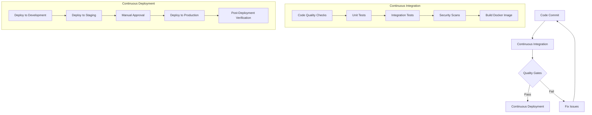
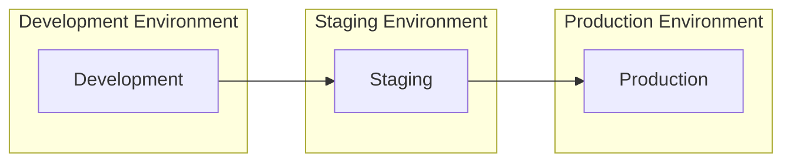
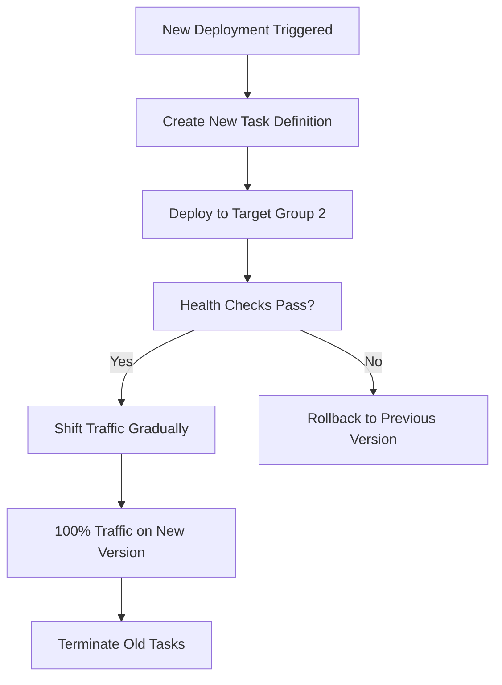

# CI/CD Documentation for Document Management and AI Chatbot System

## Introduction

This document provides a comprehensive guide to the Continuous Integration and Continuous Deployment (CI/CD) pipeline for the Document Management and AI Chatbot System. The CI/CD pipeline automates the build, test, and deployment processes, ensuring consistent quality and reliable deployments across all environments.

The system uses GitHub Actions as the primary CI/CD platform, with workflows defined in YAML files in the `.github/workflows` directory. These workflows automate code quality checks, testing, security scanning, and deployment to various environments.

## CI/CD Philosophy

Our CI/CD approach is guided by the following principles:

- **Automation First**: Automate all repetitive tasks in the development lifecycle
- **Fail Fast**: Identify and fix issues as early as possible in the development process
- **Quality Gates**: Enforce quality standards through automated checks
- **Consistent Environments**: Use containerization to ensure consistency across all environments
- **Progressive Deployment**: Deploy changes gradually through development, staging, and production
- **Observability**: Monitor deployments and collect feedback for continuous improvement
- **Rollback Capability**: Maintain the ability to quickly revert to a previous stable state

By following these principles, we aim to deliver high-quality software rapidly and reliably while minimizing the risk of production issues.

## CI/CD Workflow Overview

The CI/CD pipeline consists of several interconnected workflows that handle different aspects of the software delivery process:



This workflow ensures that code changes go through comprehensive validation before being deployed to production, with appropriate gates and approvals at each stage.

## GitHub Workflow Configuration

### Workflow Files

The CI/CD pipeline is defined in the following GitHub Actions workflow files:

- `.github/workflows/ci.yml`: Continuous Integration workflow
- `.github/workflows/cd.yml`: Continuous Deployment workflow
- `.github/workflows/security-scan.yml`: Security scanning workflow
- `.github/workflows/dependency-updates.yml`: Dependency update workflow

These files define the triggers, jobs, and steps for each part of the CI/CD process.

### Workflow Triggers

The workflows are triggered by different events:

| Workflow | Triggers |
| --- | --- |
| Continuous Integration | Pull requests to main/develop, Pushes to main/develop, Manual trigger |
| Continuous Deployment | Successful CI workflow completion, Release creation, Manual trigger |
| Security Scan | Weekly schedule, Pull requests to main/develop, Manual trigger |
| Dependency Updates | Weekly schedule, Manual trigger |

These triggers ensure that the appropriate workflows run at the right times in the development lifecycle.

## Continuous Integration

### CI Workflow Steps

The Continuous Integration workflow consists of the following jobs:

1. **Code Quality Checks**
   - Checkout code
   - Set up Python environment
   - Install dependencies
   - Run code formatting checks (Black)
   - Run linting (Flake8)
   - Check import sorting (isort)
   - Run type checking (mypy)

2. **Unit Tests**
   - Run unit tests with pytest
   - Generate and upload coverage report
   - Enforce minimum code coverage (80%)

3. **Integration Tests**
   - Set up test database (PostgreSQL)
   - Run integration tests
   - Verify component interactions

4. **Security Scans**
   - Run Bandit security scanner
   - Check dependencies for vulnerabilities
   - Upload security reports

5. **Build Docker Image**
   - Set up Docker Buildx
   - Build Docker image
   - Run Trivy vulnerability scanner on the image
   - Cache image for deployment

Each job depends on the successful completion of the previous job, creating a pipeline of validation steps.

### Quality Gates

The CI workflow enforces several quality gates that must be passed before code can proceed to deployment:

| Gate | Criteria | Action on Failure |
| --- | --- | --- |
| Code Quality | 0 linting errors, code formatting compliance | Block deployment |
| Unit Tests | 100% pass rate, minimum 80% coverage | Block deployment |
| Integration Tests | 100% pass rate | Block deployment |
| Security Scan | No critical or high vulnerabilities | Block deployment |
| Docker Build | Successful build, no critical vulnerabilities | Block deployment |

These gates ensure that only high-quality code that meets the project's standards can proceed to deployment.

### CI Workflow Example

Here's a simplified example of the CI workflow:

```yaml
name: Continuous Integration

on:
  push:
    branches: [main, develop]
  pull_request:
    branches: [main, develop]
  workflow_dispatch:

jobs:
  code-quality:
    runs-on: ubuntu-latest
    steps:
      - uses: actions/checkout@v3
      - name: Set up Python
        uses: actions/setup-python@v4
        with:
          python-version: '3.10'
      - name: Install dependencies
        run: cd src/backend && pip install poetry && poetry install
      - name: Check code formatting
        run: cd src/backend && poetry run black --check app tests
      - name: Run linting
        run: cd src/backend && poetry run flake8 app tests

  unit-tests:
    needs: code-quality
    runs-on: ubuntu-latest
    steps:
      - uses: actions/checkout@v3
      - name: Set up Python
        uses: actions/setup-python@v4
        with:
          python-version: '3.10'
      - name: Install dependencies
        run: cd src/backend && pip install poetry && poetry install
      - name: Run unit tests with coverage
        run: cd src/backend && poetry run pytest tests/unit --cov=app --cov-report=xml --cov-fail-under=80

  # Additional jobs omitted for brevity
```

The complete CI workflow is defined in `.github/workflows/ci.yml`.

## Continuous Deployment

### CD Workflow Steps

The Continuous Deployment workflow consists of the following jobs:

1. **Build and Push**
   - Checkout code
   - Set up Docker Buildx
   - Configure AWS credentials
   - Login to Amazon ECR
   - Build and push Docker image
   - Save image tag for deployment

2. **Deploy to Development**
   - Triggered by pushes to the develop branch
   - Configure AWS credentials
   - Set up Terraform
   - Apply Terraform configuration for development environment
   - Run smoke tests
   - Notify deployment status

3. **Deploy to Staging**
   - Triggered by pushes to the main branch
   - Configure AWS credentials
   - Set up Terraform
   - Apply Terraform configuration for staging environment
   - Run smoke tests and integration tests
   - Run performance tests
   - Notify deployment status

4. **Deploy to Production**
   - Triggered by release creation or manual approval
   - Configure AWS credentials
   - Set up Terraform
   - Apply Terraform configuration for production environment
   - Run smoke tests
   - Tag Docker image as latest
   - Create deployment record
   - Notify deployment status

5. **Rollback**
   - Triggered if any deployment job fails
   - Revert to previous stable version
   - Notify rollback status

This workflow ensures that code changes are deployed progressively through environments with appropriate testing at each stage.

### Environment Promotion Strategy

The system follows a progressive promotion strategy for deploying changes through environments:



| Environment | Purpose | Promotion Criteria | Approval |
| --- | --- | --- | --- |
| Development | Feature testing and integration | CI pipeline success | Automatic |
| Staging | Pre-production validation | Smoke tests, integration tests, performance tests | Automatic |
| Production | Live system | Manual review of staging deployment | Manual |

This strategy ensures that changes are thoroughly tested before reaching production, with appropriate gates and approvals.

### Deployment Configuration

Deployments are managed using Terraform for infrastructure as code. Each environment has its own Terraform configuration:

- `infrastructure/terraform/environments/dev/`
- `infrastructure/terraform/environments/staging/`
- `infrastructure/terraform/environments/prod/`

These configurations define the AWS resources required for each environment, including ECS services, RDS databases, and S3 buckets. The CD workflow applies these configurations with environment-specific variables.

### Blue-Green Deployment

The system uses a blue-green deployment strategy to minimize downtime and enable easy rollbacks:



This approach allows for zero-downtime deployments and quick rollbacks if issues are detected.

### Rollback Procedures

The CD workflow includes automatic rollback procedures if a deployment fails:

1. Identify the environment where the deployment failed
2. Retrieve the previous stable version from ECR
3. Update the ECS service to use the previous version
4. Verify the rollback was successful
5. Notify the team of the rollback

This ensures that service disruptions are minimized in case of deployment issues.

### CD Workflow Example

Here's a simplified example of the CD workflow:

```yaml
name: Continuous Deployment

on:
  workflow_run:
    workflows: ["Continuous Integration"]
    branches: [main, develop]
    types: [completed]
  release:
    types: [published]
  workflow_dispatch:
    inputs:
      environment:
        description: 'Environment to deploy to'
        required: true
        default: 'development'
        type: choice
        options: [development, staging, production]

jobs:
  build-and-push:
    runs-on: ubuntu-latest
    if: github.event.workflow_run.conclusion == 'success' || github.event_name == 'release' || github.event_name == 'workflow_dispatch'
    steps:
      - uses: actions/checkout@v3
      - name: Configure AWS credentials
        uses: aws-actions/configure-aws-credentials@v2
        with:
          aws-access-key-id: ${{ secrets.AWS_ACCESS_KEY_ID }}
          aws-secret-access-key: ${{ secrets.AWS_SECRET_ACCESS_KEY }}
          aws-region: ${{ secrets.AWS_REGION }}
      - name: Build and push Docker image
        uses: docker/build-push-action@v4
        with:
          context: src/backend
          push: true
          tags: ${{ secrets.ECR_REGISTRY }}/${{ secrets.ECR_REPOSITORY }}:${{ github.sha }}

  # Additional jobs omitted for brevity
```

The complete CD workflow is defined in `.github/workflows/cd.yml`.

## Security Scanning

### Security Workflow Steps

The Security Scanning workflow consists of the following jobs:

1. **CodeQL Analysis**
   - Perform static code analysis with CodeQL
   - Identify security vulnerabilities in code

2. **Bandit Scan**
   - Run Bandit security scanner on Python code
   - Identify common security issues

3. **Dependency Scan**
   - Check dependencies for known vulnerabilities
   - Create issues for vulnerable dependencies

4. **Container Scan**
   - Build Docker image
   - Scan for vulnerabilities with Trivy
   - Report critical and high vulnerabilities

5. **Secret Scan**
   - Scan for secrets and credentials in code
   - Prevent accidental exposure of sensitive information

6. **Security Report**
   - Generate comprehensive security report
   - Notify security team of findings

This workflow ensures that security is continuously monitored and enforced throughout the development process.

### Security Scan Schedule

Security scans are performed at different frequencies:

| Scan Type | Frequency | Scope |
| --- | --- | --- |
| Basic Security Checks | Every PR and commit | Changed files |
| Comprehensive Scan | Weekly | Entire codebase |
| Dependency Scan | Daily | All dependencies |
| Container Scan | Every build | Docker image |

This schedule ensures regular security validation while balancing performance and resource usage.

### Vulnerability Management

The security workflow includes a process for managing identified vulnerabilities:

1. Vulnerabilities are detected by security scans
2. Issues are automatically created in GitHub for tracking
3. Vulnerabilities are prioritized based on severity
4. Critical and high vulnerabilities block deployment
5. Medium and low vulnerabilities are tracked for future resolution

This process ensures that security issues are addressed in a timely manner based on their impact.

## Environment Configuration

### Environment Variables

The CI/CD pipeline uses environment variables and secrets for configuration. These are stored in GitHub Secrets and referenced in the workflow files:

| Secret | Purpose | Used In |
| --- | --- | --- |
| AWS_ACCESS_KEY_ID | AWS authentication | CD workflow |
| AWS_SECRET_ACCESS_KEY | AWS authentication | CD workflow |
| AWS_REGION | AWS region | CD workflow |
| ECR_REGISTRY | Amazon ECR registry URL | CD workflow |
| ECR_REPOSITORY | Amazon ECR repository name | CD workflow |
| DEV_DB_PASSWORD | Development database password | CD workflow |
| STAGING_DB_PASSWORD | Staging database password | CD workflow |
| PROD_DB_PASSWORD | Production database password | CD workflow |
| OPENAI_API_KEY | OpenAI API key | CD workflow |
| SLACK_BOT_TOKEN | Slack notification token | CI/CD workflows |
| SLACK_CHANNEL_ID | Slack channel for notifications | CI/CD workflows |

These secrets are managed securely in GitHub and are only accessible to authorized workflows.

### Environment-Specific Configuration

Each environment has specific configuration values defined in Terraform variables:

```hcl
# Example terraform.tfvars for development environment
environment         = "development"
container_image     = "document-management-backend:latest"
instance_count      = 2
instance_type       = "t3.small"
rds_instance_class  = "db.t3.small"
rds_allocated_storage = 20
```

These configurations ensure that each environment is appropriately sized and configured for its purpose.

## Monitoring and Notifications

### CI/CD Monitoring

The CI/CD pipeline includes monitoring to track performance and identify issues:

- GitHub Actions dashboard for workflow status
- Workflow timing metrics to identify slow steps
- Success/failure rates for each job
- Deployment frequency and lead time metrics

These metrics help identify bottlenecks and opportunities for improvement in the CI/CD process.

### Notifications

The pipeline sends notifications at key points in the process:

| Event | Notification Channel | Content |
| --- | --- | --- |
| CI Pipeline Completion | Slack | Build status, test results |
| Deployment Success | Slack | Environment, version, status |
| Deployment Failure | Slack | Environment, error details |
| Security Findings | Slack, Email | Severity, vulnerability details |

These notifications keep the team informed of important events in the CI/CD process.

### Deployment Tracking

Each deployment is tracked with detailed information:

- Version number or commit hash
- Deployment timestamp
- Target environment
- Deploying user or process
- Deployment status

This information is stored in S3 and can be used for auditing and troubleshooting.

## Best Practices

Follow these best practices for working with the CI/CD pipeline:

1. **Branch Strategy**
   - Use feature branches for development
   - Create pull requests to develop branch for integration
   - Merge develop to main for staging deployment
   - Create releases from main for production deployment

2. **Commit Practices**
   - Write clear commit messages
   - Keep commits focused on single changes
   - Run local tests before pushing
   - Reference issue numbers in commits

3. **Pull Request Workflow**
   - Create descriptive pull request titles and descriptions
   - Link pull requests to issues
   - Address all CI feedback before merging
   - Request code reviews from team members

4. **Deployment Practices**
   - Monitor deployments in progress
   - Verify application functionality after deployment
   - Deploy during low-traffic periods when possible
   - Be prepared to rollback if issues are detected

5. **Security Practices**
   - Never commit secrets or credentials
   - Address security vulnerabilities promptly
   - Regularly update dependencies
   - Follow the principle of least privilege for CI/CD permissions

Following these practices will help ensure smooth and reliable CI/CD operations.

## Troubleshooting

Common CI/CD issues and their solutions:

| Issue | Possible Causes | Solutions |
| --- | --- | --- |
| CI Pipeline Failure | Code quality issues, test failures, dependency problems | Check workflow logs, fix identified issues, run tests locally |
| Deployment Failure | Infrastructure issues, configuration errors, resource constraints | Check Terraform logs, verify AWS credentials, check resource limits |
| Security Scan Failures | Vulnerable dependencies, insecure code patterns | Update dependencies, fix identified security issues |
| Slow Pipeline Execution | Inefficient tests, large Docker images, resource constraints | Optimize tests, use Docker layer caching, increase runner resources |
| Environment Configuration Issues | Missing secrets, incorrect variables | Verify all required secrets are set, check variable values |

If you encounter persistent issues, consult the detailed logs in GitHub Actions or contact the DevOps team for assistance.

## Extending the Pipeline

The CI/CD pipeline can be extended to support additional requirements:

1. **Adding New Tests**
   - Add test scripts to the appropriate test directory
   - Update CI workflow to run the new tests
   - Define appropriate quality gates

2. **Adding New Environments**
   - Create new Terraform configuration for the environment
   - Add deployment job to the CD workflow
   - Configure environment-specific variables and secrets

3. **Adding New Security Scans**
   - Identify appropriate security scanning tools
   - Add scanning job to the security workflow
   - Define severity thresholds and reporting

4. **Customizing Notifications**
   - Identify additional notification channels
   - Update workflow to send notifications
   - Configure notification content and triggers

When extending the pipeline, follow the existing patterns and ensure that changes are thoroughly tested before implementation.

## Conclusion

The CI/CD pipeline is a critical component of the Document Management and AI Chatbot System's development process. It ensures that code changes are thoroughly validated, securely deployed, and consistently monitored across all environments.

By following the guidelines in this document, you can effectively work with the CI/CD pipeline and contribute to the reliable delivery of the system.

For more information on related topics, refer to:
- [Development Setup Guide](./setup.md)
- [Testing Strategy](./testing.md)
- [GitHub Actions Documentation](https://docs.github.com/en/actions)