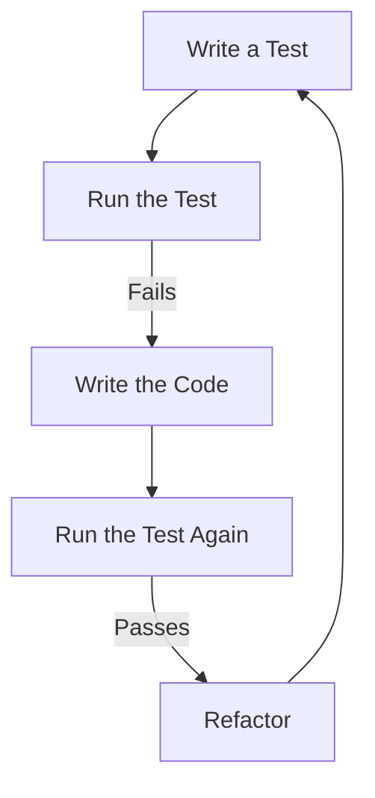

# Testing Guide for Document Management and AI Chatbot System

## Introduction

This document provides comprehensive guidance on testing practices for the Document Management and AI Chatbot System. It covers all aspects of testing, from unit tests to end-to-end tests, and includes information on test automation, quality metrics, and specialized testing approaches.

Effective testing is critical to ensuring the reliability, performance, and security of the system. This guide aims to establish consistent testing practices across the development team and provide clear guidelines for writing, running, and maintaining tests.

The testing approach is designed to align with the system's architecture and requirements, with particular focus on the unique challenges of testing vector search functionality and LLM integration.

## Testing Philosophy

Our testing approach is guided by the following principles:

- **Test Early, Test Often**: Integrate testing throughout the development process, not just at the end
- **Automation First**: Automate tests wherever possible to ensure consistency and enable continuous integration
- **Comprehensive Coverage**: Test all critical functionality and edge cases
- **Realistic Testing**: Create tests that simulate real-world usage patterns
- **Maintainable Tests**: Write clear, focused tests that are easy to understand and maintain
- **Fast Feedback**: Optimize test execution time to provide quick feedback to developers

By following these principles, we aim to catch issues early, reduce debugging time, and ensure high-quality releases.

## Test Types and Methodology

The system employs a comprehensive testing strategy that includes multiple test types to ensure thorough coverage of functionality and quality attributes.

### Unit Testing

Unit tests verify the correctness of individual components in isolation.

**Key Characteristics:**
- Focus on testing a single function, method, or class
- Mock external dependencies
- Fast execution time
- High level of detail

**Tools:**
- pytest as the primary testing framework
- pytest-mock for mocking dependencies
- pytest-cov for coverage reporting

**Example Unit Test:**

```python
# Example unit test for authentication token validation
def test_validate_token_valid(mocker):
    # Arrange
    mock_decode = mocker.patch('app.core.security.jwt.decode')
    mock_decode.return_value = {"sub": "user123", "exp": time.time() + 3600}
    token = "valid.test.token"
    
    # Act
    result = validate_token(token)
    
    # Assert
    assert result is not None
    assert result["sub"] == "user123"
    mock_decode.assert_called_once_with(token, ANY, algorithms=["HS256"])
```

### Integration Testing

Integration tests verify that components work correctly together.

**Key Characteristics:**
- Test interactions between multiple components
- May use real dependencies or realistic mocks
- Medium execution time
- Focus on component interfaces

**Tools:**
- pytest with pytest-asyncio for async testing
- TestClient from FastAPI for API testing
- pytest-postgresql for database integration tests

**Example Integration Test:**

```python
# Example integration test for document upload and retrieval
@pytest.mark.integration
def test_document_upload_and_retrieval(client, test_user_token, sample_pdf):
    # Upload document
    upload_response = client.post(
        "/documents/",
        files={"file": sample_pdf},
        headers={"Authorization": f"Bearer {test_user_token}"},
    )
    assert upload_response.status_code == 201
    document_id = upload_response.json()["id"]
    
    # Retrieve document
    get_response = client.get(
        f"/documents/{document_id}",
        headers={"Authorization": f"Bearer {test_user_token}"},
    )
    assert get_response.status_code == 200
    assert get_response.json()["id"] == document_id
```

### End-to-End Testing

End-to-end tests verify complete user workflows and system behavior.

**Key Characteristics:**
- Test entire workflows from start to finish
- Use real dependencies where possible
- Slower execution time
- Focus on user scenarios

**Tools:**
- pytest for test orchestration
- httpx for HTTP client testing
- Docker Compose for test environment setup

**Example End-to-End Test:**

```python
# Example end-to-end test for document search workflow
@pytest.mark.e2e
def test_document_search_workflow(client, test_user_token, sample_pdf):
    # Upload document
    upload_response = client.post(
        "/documents/",
        files={"file": sample_pdf},
        headers={"Authorization": f"Bearer {test_user_token}"},
    )
    assert upload_response.status_code == 201
    
    # Wait for processing to complete
    document_id = upload_response.json()["id"]
    wait_for_document_processing(client, document_id, test_user_token)
    
    # Perform search query
    search_response = client.post(
        "/query/",
        json={"query": "vector database"},
        headers={"Authorization": f"Bearer {test_user_token}"},
    )
    assert search_response.status_code == 200
    results = search_response.json()
    
    # Verify search results
    assert len(results["relevant_documents"]) > 0
    assert document_id in [doc["id"] for doc in results["relevant_documents"]]
    assert results["response"] is not None
```

### Performance Testing

Performance tests evaluate system behavior under various load conditions.

**Key Characteristics:**
- Focus on response times, throughput, and resource utilization
- Simulate realistic load patterns
- Run in isolated environments
- Measure against defined SLAs

**Tools:**
- locust for load testing
- pytest-benchmark for function-level performance testing

**Example Performance Test:**

```python
# Example locust performance test for vector search
from locust import HttpUser, task, between

class VectorSearchUser(HttpUser):
    wait_time = between(1, 5)
    token = None
    
    def on_start(self):
        # Get authentication token
        response = self.client.post(
            "/auth/token",
            json={"username": "test@example.com", "password": "testpassword"},
        )
        self.token = response.json()["access_token"]
    
    @task
    def search_documents(self):
        self.client.post(
            "/query/",
            json={"query": "vector similarity search"},
            headers={"Authorization": f"Bearer {self.token}"},
        )
```

### Security Testing

Security tests identify vulnerabilities and verify security controls.

**Key Characteristics:**
- Focus on authentication, authorization, and data protection
- Test boundary conditions and edge cases
- Verify proper handling of malicious inputs
- Check compliance with security requirements

**Tools:**
- bandit for static security analysis
- OWASP ZAP for dynamic security testing
- custom test suites for authentication and authorization testing

**Example Security Test:**

```python
# Example security test for authorization boundaries
def test_unauthorized_document_access(client, test_user_token, admin_token):
    # Create document as admin
    admin_response = client.post(
        "/documents/",
        files={"file": open("tests/fixtures/documents/sample.pdf", "rb")},
        headers={"Authorization": f"Bearer {admin_token}"},
    )
    document_id = admin_response.json()["id"]
    
    # Attempt to access as regular user
    user_response = client.get(
        f"/documents/{document_id}",
        headers={"Authorization": f"Bearer {test_user_token}"},
    )
    
    # Verify access is denied
    assert user_response.status_code == 403
```

## Test Organization

Tests are organized in a structured manner to ensure clarity, maintainability, and efficient execution.

### Directory Structure

The test directory structure mirrors the application structure to make it easy to locate tests for specific components:

```
src/backend/tests/
├── conftest.py                # Shared test fixtures and configuration
├── fixtures/                  # Test data and fixtures
│   ├── documents/             # Sample PDF documents
│   ├── vectors/               # Sample vector embeddings
│   └── responses/             # Sample LLM responses
├── unit/                      # Unit tests
│   ├── api/                   # Tests for API endpoints
│   ├── services/              # Tests for service layer
│   └── utils/                 # Tests for utility functions
├── integration/               # Integration tests
│   ├── api/                   # API integration tests
│   └── services/              # Service integration tests
└── e2e/                       # End-to-end tests
```

### Naming Conventions

Consistent naming conventions make tests easier to understand and maintain:

- Test files: `test_<module_name>.py`
- Test functions: `test_<function_name>_<scenario>_<expected_result>`
- Test classes: `Test<ComponentName>`
- Fixtures: Descriptive names indicating purpose (e.g., `test_user`, `sample_pdf`)

Examples:
- `test_auth.py` - Tests for authentication functionality
- `test_login_valid_credentials_returns_token` - Tests successful login
- `test_login_invalid_credentials_returns_error` - Tests failed login

### Test Fixtures

Test fixtures provide reusable test components and setup/teardown functionality. Key fixtures are defined in `conftest.py`:

```python
# Example fixtures from conftest.py

@pytest.fixture
def db_session():
    """Provide a database session for tests."""
    engine = create_engine(TEST_DATABASE_URL)
    Base.metadata.create_all(engine)
    session_factory = sessionmaker(bind=engine)
    session = session_factory()
    try:
        yield session
    finally:
        session.rollback()
        session.close()
        Base.metadata.drop_all(engine)

@pytest.fixture
def client(db_session):
    """Provide a test client for API testing."""
    def override_get_db():
        try:
            yield db_session
        finally:
            pass
    
    app.dependency_overrides[get_db_dependency] = override_get_db
    with TestClient(app) as test_client:
        yield test_client
    app.dependency_overrides.clear()

@pytest.fixture
def test_user(db_session):
    """Provide a test user."""
    user = User(
        username="testuser",
        email="test@example.com",
        password_hash=get_password_hash("testpassword"),
        role=UserRole.regular
    )
    db_session.add(user)
    db_session.commit()
    db_session.refresh(user)
    return user

@pytest.fixture
def test_user_token(test_user):
    """Provide a JWT token for the test user."""
    return create_access_token(data={"sub": str(test_user.id), "role": test_user.role})
```

### Test Categories

Tests are categorized using pytest markers to allow selective execution:

```python
# In conftest.py
pytest.mark.unit        # Unit tests
pytest.mark.integration # Integration tests
pytest.mark.e2e         # End-to-end tests
pytest.mark.security    # Security tests
pytest.mark.performance # Performance tests
```

Example usage:

```python
@pytest.mark.unit
def test_generate_embedding():
    # Test implementation
    pass

@pytest.mark.integration
def test_document_upload_workflow():
    # Test implementation
    pass
```

To run specific test categories:

```bash
# Run only unit tests
pytest -m unit

# Run integration tests
pytest -m integration

# Run all tests except performance tests
pytest -m "not performance"
```

## Test Data Management

Proper test data management is essential for reliable and maintainable tests.

### Test Fixtures

Test fixtures provide consistent test data across test runs. The system uses several types of fixtures:

1. **Database Fixtures**: Pre-defined database records for testing
2. **File Fixtures**: Sample files like PDFs for document processing tests
3. **Vector Fixtures**: Pre-computed vector embeddings for testing vector search
4. **Mock Response Fixtures**: Predefined responses for external services like LLM

### Sample Data

Sample data is stored in the `tests/fixtures` directory:

- `documents/`: Contains sample PDF files for testing document processing
- `vectors/`: Contains pre-computed vector embeddings in JSON format
- `responses/`: Contains sample LLM responses for testing

### Data Generation

For tests requiring large amounts of data, automated data generation is used:

```python
# Example test data generation function
def generate_test_documents(count=10):
    """Generate test documents with random content."""
    documents = []
    for i in range(count):
        doc = Document(
            id=uuid.uuid4(),
            title=f"Test Document {i}",
            filename=f"test_doc_{i}.pdf",
            size_bytes=random.randint(1000, 10000),
            upload_date=datetime.utcnow(),
            status=DocumentStatus.available,
            file_path=f"/tmp/test_doc_{i}.pdf",
            uploader_id=uuid.uuid4()
        )
        documents.append(doc)
    return documents
```

### Mock Data

External dependencies are mocked to ensure tests are isolated and deterministic:

```python
# Example of mocking the LLM service
@pytest.fixture
def mock_llm_service(mocker):
    """Mock the LLM service for testing."""
    mock = mocker.patch("app.services.llm_service.generate_response")
    mock.return_value = {
        "response": "This is a mock LLM response based on the provided context.",
        "sources": ["doc1", "doc2"]
    }
    return mock

# Example of mocking the vector store
@pytest.fixture
def mock_vector_store(mocker):
    """Mock the FAISS vector store for testing."""
    mock = mocker.patch("app.vector_store.faiss_store.FAISSStore")
    mock_instance = mock.return_value
    mock_instance.search.return_value = [
        ("doc1", 0.95),
        ("doc2", 0.85),
        ("doc3", 0.75)
    ]
    return mock_instance
```

### Test Database

Tests use an isolated test database to prevent interference with development or production data:

- SQLite in-memory database for unit tests
- PostgreSQL test database for integration tests

The test database is created and destroyed for each test session to ensure a clean state.

## Test Automation

Test automation is a core part of the development workflow, ensuring tests are run consistently and frequently.

### Local Test Execution

Developers can run tests locally using the following commands:

```bash
# Navigate to the backend directory
cd src/backend

# Run all tests
poetry run pytest

# Run tests with coverage report
poetry run pytest --cov=app --cov-report=term-missing

# Run specific test categories
poetry run pytest -m unit
poetry run pytest -m integration

# Run tests in a specific file
poetry run pytest tests/unit/api/test_auth.py

# Run a specific test
poetry run pytest tests/unit/api/test_auth.py::test_login_success
```

### CI/CD Integration

Tests are automatically run as part of the CI/CD pipeline defined in the project's GitHub workflows. The pipeline includes:

1. **Code Quality Checks**: Linting and formatting verification
2. **Unit Tests**: Run with coverage reporting
3. **Integration Tests**: Run with a test PostgreSQL database
4. **Security Scans**: Static analysis and dependency checking

The CI pipeline enforces quality gates:
- All tests must pass
- Code coverage must meet minimum thresholds (80% overall)
- No critical security vulnerabilities

Refer to the project's CI/CD documentation for more details on the automated testing pipeline.

### Test Reports

Test results are reported in multiple formats:

- Console output for local development
- JUnit XML for CI integration
- HTML coverage reports for detailed analysis
- GitHub annotations for pull requests

Example CI configuration for test reporting:

```yaml
- name: Run unit tests with coverage
  run: cd src/backend && poetry run pytest tests/unit --cov=app --cov-report=xml --cov-report=term-missing --cov-fail-under=80

- name: Upload coverage report
  uses: codecov/codecov-action@v3
  with:
    file: src/backend/coverage.xml
    fail_ci_if_error: true
```

### Scheduled Tests

In addition to tests run during development and CI, certain tests are scheduled to run periodically:

- **Nightly Tests**: Full test suite including end-to-end tests
- **Weekly Performance Tests**: Load and stress testing
- **Monthly Security Scans**: Comprehensive security testing

These scheduled tests help identify issues that might not be caught during regular development testing.

## Specialized Testing Approaches

The Document Management and AI Chatbot System requires specialized testing approaches for its unique components.

### Vector Search Testing

Testing vector search functionality requires specific approaches:

1. **Embedding Generation Testing**:
   - Verify embeddings have expected dimensions
   - Check consistency of embeddings for similar texts
   - Test handling of edge cases (empty text, very long text)

2. **Similarity Search Testing**:
   - Test with known vector pairs and expected similarity scores
   - Verify search returns expected number of results
   - Test with different similarity thresholds

3. **FAISS Integration Testing**:
   - Test index creation and persistence
   - Verify search performance with large indices
   - Test index updates and deletions

Example vector search test:

```python
def test_vector_similarity_search():
    # Create test vectors with known similarities
    vectors = [
        ("doc1", np.array([0.1, 0.2, 0.3])),  # Base vector
        ("doc2", np.array([0.11, 0.21, 0.31])),  # Similar to doc1
        ("doc3", np.array([0.5, 0.6, 0.7])),  # Different from doc1
    ]
    
    # Initialize vector store with test vectors
    store = FAISSStore(dimension=3)
    for doc_id, vector in vectors:
        store.add_vector(doc_id, vector)
    
    # Search with a vector similar to doc1
    query_vector = np.array([0.12, 0.22, 0.32])
    results = store.search(query_vector, top_k=2)
    
    # Verify results
    assert len(results) == 2
    assert results[0][0] == "doc1" or results[0][0] == "doc2"
    assert results[1][0] == "doc1" or results[1][0] == "doc2"
    assert "doc3" not in [r[0] for r in results]
```

### LLM Integration Testing

Testing LLM integration requires specialized approaches:

1. **Prompt Construction Testing**:
   - Verify prompts include necessary context
   - Check prompt formatting and structure
   - Test token limit handling

2. **Response Processing Testing**:
   - Test parsing and formatting of LLM responses
   - Verify source attribution
   - Test handling of unexpected responses

3. **Error Handling Testing**:
   - Test behavior when LLM service is unavailable
   - Verify handling of rate limits
   - Test response to malformed responses

Example LLM integration test:

```python
def test_llm_response_generation(mocker):
    # Mock the OpenAI API call
    mock_openai = mocker.patch("app.services.llm_service.openai.ChatCompletion.create")
    mock_openai.return_value = {
        "choices": [{
            "message": {
                "content": "This is a test response based on the provided context."
            }
        }]
    }
    
    # Test data
    query = "What is vector search?"
    context = ["Vector search is a technique for finding similar items in a dataset.", 
              "It works by converting items to vector embeddings and measuring similarity."]
    
    # Call the function
    response = generate_llm_response(query, context)
    
    # Verify the response
    assert response is not None
    assert "test response" in response
    assert mock_openai.called
    
    # Verify the prompt construction
    call_args = mock_openai.call_args[1]
    messages = call_args["messages"]
    assert any(query in m["content"] for m in messages)
    assert any(context[0] in m["content"] for m in messages)
```

### Document Processing Testing

Testing document processing requires specific approaches:

1. **PDF Extraction Testing**:
   - Test with various PDF formats and structures
   - Verify text extraction accuracy
   - Test handling of corrupt or malformed PDFs

2. **Document Chunking Testing**:
   - Verify chunking logic and boundaries
   - Test with different chunk sizes
   - Check handling of special characters and formatting

3. **End-to-End Processing Testing**:
   - Test complete flow from upload to searchable content
   - Verify metadata extraction
   - Test processing of large documents

Example document processing test:

```python
def test_pdf_text_extraction():
    # Test with a known PDF file
    pdf_path = "tests/fixtures/documents/sample.pdf"
    
    # Extract text
    extracted_text = extract_text_from_pdf(pdf_path)
    
    # Verify extraction
    assert extracted_text is not None
    assert len(extracted_text) > 0
    assert "expected content" in extracted_text
    
    # Test with a corrupt PDF
    corrupt_pdf_path = "tests/fixtures/documents/corrupt.pdf"
    with pytest.raises(PDFExtractionError):
        extract_text_from_pdf(corrupt_pdf_path)
```

### Security Testing

Security testing focuses on specific security concerns:

1. **Authentication Testing**:
   - Test token validation and expiration
   - Verify password hashing and verification
   - Test login rate limiting

2. **Authorization Testing**:
   - Test role-based access control
   - Verify resource ownership checks
   - Test permission boundaries

3. **Input Validation Testing**:
   - Test handling of malicious inputs
   - Verify file upload restrictions
   - Test query parameter validation

Example security test:

```python
def test_jwt_token_expiration():
    # Create a token that expires in 1 second
    token_data = {"sub": "user123", "role": "regular"}
    token = create_access_token(token_data, expires_delta=timedelta(seconds=1))
    
    # Token should be valid initially
    decoded = validate_token(token)
    assert decoded is not None
    assert decoded["sub"] == "user123"
    
    # Wait for token to expire
    time.sleep(2)
    
    # Token should be invalid after expiration
    with pytest.raises(HTTPException) as exc_info:
        validate_token(token)
    assert exc_info.value.status_code == 401
    assert "expired" in str(exc_info.value.detail).lower()
```

## Quality Metrics and Thresholds

The project defines specific quality metrics and thresholds to ensure code quality and test effectiveness.

### Code Coverage Requirements

Code coverage measures the percentage of code executed during tests. The project has the following coverage requirements:

| Component | Line Coverage | Branch Coverage |
| --- | --- | --- |
| Core Business Logic | 90% | 85% |
| API Layer | 85% | 80% |
| Utility Functions | 80% | 75% |
| Overall Project | 85% | 80% |

Coverage is measured using pytest-cov and enforced in the CI pipeline:

```yaml
- name: Run unit tests with coverage
  run: cd src/backend && poetry run pytest tests/unit --cov=app --cov-report=xml --cov-report=term-missing --cov-fail-under=80
```

### Test Success Rate

All tests must pass for a build to be considered successful. The CI pipeline enforces this requirement by failing if any tests fail.

Additional metrics tracked include:

- **Flaky Test Rate**: Tests that intermittently fail should be less than 1% of all tests
- **Test Execution Time**: The full test suite should complete in under 10 minutes
- **Test-to-Code Ratio**: Aim for at least 1:1 ratio of test code to production code

### Performance Test Thresholds

Performance tests have specific thresholds based on system requirements:

| Operation | Target Performance | Warning Threshold | Critical Threshold |
| --- | --- | --- | --- |
| Document Upload (10MB) | < 10 seconds | > 8 seconds | > 12 seconds |
| Vector Search | < 3 seconds | > 2 seconds | > 5 seconds |
| API Response Time | < 1 second | > 800ms | > 2 seconds |
| LLM Response Generation | < 2.5 seconds | > 2 seconds | > 4 seconds |

Performance tests that exceed warning thresholds trigger alerts for review, while those exceeding critical thresholds cause the build to fail.

### Security Test Thresholds

Security testing has strict thresholds:

| Security Aspect | Threshold |
| --- | --- |
| Critical Vulnerabilities | 0 allowed |
| High Vulnerabilities | 0 allowed |
| Medium Vulnerabilities | Review required |
| Low Vulnerabilities | Tracking only |

The CI pipeline enforces these thresholds using security scanning tools:

```yaml
- name: Run Bandit security scan
  run: cd src/backend && poetry run bandit -r app -f sarif -o bandit-results.sarif

- name: Check dependencies for vulnerabilities
  run: cd src/backend && poetry export -f requirements.txt | poetry run pip install safety && poetry run safety check --full-report -r /dev/stdin
```

## Test Environments

The system uses multiple test environments to ensure comprehensive testing across different conditions.

### Local Development Environment

Developers run tests in their local environment during development:

- Uses SQLite in-memory database for simplicity
- Mocks external services like OpenAI API
- Fast execution for quick feedback

Setup instructions for the local test environment are available in the [Development Setup Guide](./setup.md).

### CI Environment

The CI pipeline runs tests in an isolated environment:

- Uses PostgreSQL database in a Docker container
- Runs on GitHub Actions runners
- Enforces all quality gates

The CI environment is configured in GitHub workflow files.

### Staging Environment

End-to-end tests run in the staging environment:

- Mirrors production configuration
- Uses dedicated test data
- Tests real integrations with external services

### Test Data Management

Each environment has specific test data management approaches:

| Environment | Test Data Approach | Data Persistence |
| --- | --- | --- |
| Local | Generated test data and fixtures | Temporary (deleted after tests) |
| CI | Versioned test fixtures | Ephemeral (recreated for each run) |
| Staging | Subset of anonymized production data | Persistent with periodic refresh |

### Environment Variables

Test environments use specific environment variables to configure behavior:

```bash
# Example test environment variables
TESTING=True
DATABASE_URL=sqlite:///./test.db
OPENAI_API_KEY=sk-test-key
VECTOR_STORE_PATH=:memory:
LOG_LEVEL=DEBUG
```

These variables are set differently in each environment to ensure appropriate configuration.

## Mocking and Test Doubles

Effective use of mocks and test doubles is essential for isolated and reliable testing.

### Mocking Strategy

The system uses different types of test doubles for different purposes:

| Type | Purpose | When to Use |
| --- | --- | --- |
| Stub | Return fixed values | Simple dependencies with predictable outputs |
| Mock | Verify interactions | Complex dependencies where interaction matters |
| Fake | Simplified implementation | Complex dependencies requiring stateful behavior |
| Spy | Record interactions | When you need to verify calls without affecting behavior |

### Mocking External Services

External services are mocked to ensure tests are isolated and deterministic:

```python
# Example of mocking the OpenAI API
@pytest.fixture
def mock_openai_api(mocker):
    mock = mocker.patch("openai.ChatCompletion.create")
    mock.return_value = {
        "choices": [{
            "message": {
                "content": "This is a mock response from the OpenAI API."
            }
        }]
    }
    return mock

# Example test using the mock
def test_generate_response(mock_openai_api):
    response = generate_response("Test query", ["Context 1", "Context 2"])
    assert "mock response" in response
    mock_openai_api.assert_called_once()
```

### Mocking Database

Database interactions are mocked or replaced with in-memory databases:

```python
# Example of using an in-memory SQLite database
@pytest.fixture
def test_db():
    engine = create_engine("sqlite:///:memory:")
    Base.metadata.create_all(engine)
    Session = sessionmaker(bind=engine)
    session = Session()
    yield session
    session.close()

# Example of mocking the database session
@pytest.fixture
def mock_db_session(mocker):
    mock = mocker.MagicMock()
    mock.query.return_value.filter.return_value.first.return_value = None
    return mock
```

### Mocking File System

File system operations are mocked to avoid actual file I/O during tests:

```python
# Example of mocking file operations
@pytest.fixture
def mock_file_storage(mocker):
    mock_open = mocker.patch("builtins.open", mocker.mock_open(read_data="test file content"))
    mock_exists = mocker.patch("os.path.exists")
    mock_exists.return_value = True
    mock_remove = mocker.patch("os.remove")
    return {
        "open": mock_open,
        "exists": mock_exists,
        "remove": mock_remove
    }
```

### Mocking Vector Store

The FAISS vector store is mocked to avoid complex vector operations during unit tests:

```python
# Example of mocking the FAISS vector store
@pytest.fixture
def mock_faiss_index(mocker):
    mock = mocker.MagicMock()
    mock.search.return_value = (
        np.array([[0.95, 0.85, 0.75]]),  # Similarity scores
        np.array([[0, 1, 2]])  # Vector IDs
    )
    return mock

@pytest.fixture
def mock_vector_store(mock_faiss_index):
    store = mocker.MagicMock()
    store.index = mock_faiss_index
    store.id_to_docid = {0: "doc1", 1: "doc2", 2: "doc3"}
    store.search.return_value = [("doc1", 0.95), ("doc2", 0.85), ("doc3", 0.75)]
    return store
```

## Test-Driven Development

The project encourages Test-Driven Development (TDD) as a development methodology.

### TDD Workflow

The TDD workflow follows these steps:

1. **Write a Test**: Create a test that defines a function or improvement of a function
2. **Run the Test**: Verify that the test fails (red)
3. **Write the Code**: Implement the function to make the test pass
4. **Run the Test Again**: Verify that the test passes (green)
5. **Refactor**: Clean up the code while keeping the test passing



### TDD Benefits

TDD provides several benefits for this project:

- **Clear Requirements**: Tests serve as executable specifications
- **Focused Development**: Developers focus on making specific tests pass
- **Regression Prevention**: Tests catch regressions early
- **Improved Design**: TDD encourages modular, testable code
- **Documentation**: Tests document expected behavior

### TDD Example

Here's an example of applying TDD to develop a vector similarity function:

1. **Write the Test**:

```python
def test_calculate_cosine_similarity():
    # Test with perpendicular vectors (similarity should be 0)
    vec1 = np.array([1, 0, 0])
    vec2 = np.array([0, 1, 0])
    assert calculate_cosine_similarity(vec1, vec2) == 0.0
    
    # Test with identical vectors (similarity should be 1)
    vec3 = np.array([0.5, 0.5, 0.5])
    assert calculate_cosine_similarity(vec3, vec3) == 1.0
    
    # Test with similar vectors
    vec4 = np.array([0.1, 0.2, 0.3])
    vec5 = np.array([0.2, 0.3, 0.4])
    similarity = calculate_cosine_similarity(vec4, vec5)
    assert 0.9 < similarity < 1.0
```

2. **Run the Test** (it fails because the function doesn't exist)

3. **Write the Code**:

```python
def calculate_cosine_similarity(vec1, vec2):
    """Calculate cosine similarity between two vectors."""
    dot_product = np.dot(vec1, vec2)
    norm_vec1 = np.linalg.norm(vec1)
    norm_vec2 = np.linalg.norm(vec2)
    
    # Handle zero vectors to avoid division by zero
    if norm_vec1 == 0 or norm_vec2 == 0:
        return 0.0
        
    return dot_product / (norm_vec1 * norm_vec2)
```

4. **Run the Test Again** (it passes)

5. **Refactor** (if needed)

This TDD approach ensures that the function works as expected and handles edge cases properly.

## Debugging Tests

Effective debugging techniques help resolve test failures quickly.

### Common Test Failures

Common types of test failures and how to address them:

| Failure Type | Symptoms | Debugging Approach |
| --- | --- | --- |
| Logic Errors | Incorrect assertions | Use print statements or debugger to inspect values |
| Setup Issues | Fixture failures | Check fixture dependencies and initialization |
| Timing Problems | Intermittent failures | Add delays or use async testing tools |
| Environment Issues | Works locally, fails in CI | Check environment differences |
| Dependency Problems | Import errors | Verify package versions and dependencies |

### Debugging Tools

Tools available for debugging tests:

1. **pytest Verbose Mode**:
   ```bash
   pytest -v tests/unit/test_file.py
   ```

2. **Print Debugging**:
   ```python
   def test_function():
       result = function_under_test()
       print(f"Result: {result}")
       assert result == expected_value
   ```

3. **pytest Debug Mode**:
   ```bash
   pytest --pdb tests/unit/test_file.py
   ```

4. **Verbose Assertion Output**:
   ```bash
   pytest -vv tests/unit/test_file.py
   ```

5. **Trace Function Calls**:
   ```python
   @pytest.fixture
   def trace_calls(monkeypatch):
       def trace(frame, event, arg):
           if event == 'call':
               print(f"Calling: {frame.f_code.co_name}")
           return trace
       sys.settrace(trace)
       yield
       sys.settrace(None)
   ```

### Debugging Asynchronous Tests

Asynchronous tests require special debugging approaches:

```python
@pytest.mark.asyncio
async def test_async_function():
    # Add delay to help with debugging
    await asyncio.sleep(0.1)
    
    # Use explicit awaits for clarity
    result = await async_function_under_test()
    
    # Print intermediate results
    print(f"Async result: {result}")
    
    assert result == expected_value
```

### Debugging Integration Tests

Integration tests may require additional debugging techniques:

1. **Inspect Database State**:
   ```python
   def test_database_integration(db_session):
       # Perform test operations
       result = function_under_test()
       
       # Inspect database state
       records = db_session.query(Model).all()
       for record in records:
           print(f"Record: {record.id}, {record.name}")
       
       assert result == expected_value
   ```

2. **Inspect API Responses**:
   ```python
   def test_api_integration(client):
       response = client.post("/endpoint", json={"key": "value"})
       print(f"Status: {response.status_code}")
       print(f"Headers: {response.headers}")
       print(f"Body: {response.json()}")
       assert response.status_code == 200
   ```

3. **Enable Debug Logging**:
   ```python
   @pytest.fixture
   def enable_debug_logging():
       import logging
       logging.basicConfig(level=logging.DEBUG)
       yield
       logging.basicConfig(level=logging.INFO)
   ```

## Best Practices

Following these best practices ensures effective and maintainable tests.

### General Testing Best Practices

1. **Write Focused Tests**
   - Each test should verify one specific behavior
   - Keep tests small and focused on a single assertion
   - Use descriptive test names that explain the expected behavior

2. **Maintain Test Independence**
   - Tests should not depend on each other
   - Each test should set up its own test data
   - Tests should clean up after themselves

3. **Use Appropriate Assertions**
   - Use specific assertions (e.g., `assert_equal` instead of just `assert`)
   - Include meaningful error messages in assertions
   - Use appropriate tolerance for floating-point comparisons

4. **Keep Tests Fast**
   - Optimize slow tests
   - Use mocks for external dependencies
   - Run slow tests separately from fast tests

5. **Maintain Test Code Quality**
   - Apply the same code quality standards to tests as production code
   - Refactor tests when needed
   - Avoid duplicate test code through fixtures and helper functions

### Writing Effective Unit Tests

1. **Follow the AAA Pattern**
   - Arrange: Set up test data and conditions
   - Act: Call the function or method being tested
   - Assert: Verify the expected outcome

```python
def test_vector_normalization():
    # Arrange
    vector = np.array([2.0, 0.0, 0.0])
    
    # Act
    normalized = normalize_vector(vector)
    
    # Assert
    assert np.array_equal(normalized, np.array([1.0, 0.0, 0.0]))
    assert np.isclose(np.linalg.norm(normalized), 1.0)
```

2. **Test Edge Cases**
   - Empty inputs
   - Boundary values
   - Invalid inputs
   - Maximum/minimum values

```python
def test_vector_normalization_edge_cases():
    # Test zero vector
    zero_vector = np.array([0.0, 0.0, 0.0])
    assert np.array_equal(normalize_vector(zero_vector), zero_vector)
    
    # Test very large vector
    large_vector = np.array([1e10, 1e10, 1e10])
    normalized = normalize_vector(large_vector)
    assert np.isclose(np.linalg.norm(normalized), 1.0)
```

3. **Use Parameterized Tests**
   - Test multiple inputs with the same logic
   - Reduce code duplication
   - Clearly show the relationship between inputs and expected outputs

```python
@pytest.mark.parametrize("input_vector,expected_output", [
    (np.array([1.0, 0.0, 0.0]), np.array([1.0, 0.0, 0.0])),
    (np.array([0.0, 2.0, 0.0]), np.array([0.0, 1.0, 0.0])),
    (np.array([0.0, 0.0, 3.0]), np.array([0.0, 0.0, 1.0])),
    (np.array([1.0, 1.0, 1.0]), np.array([1/np.sqrt(3), 1/np.sqrt(3), 1/np.sqrt(3)])),
])
def test_vector_normalization_parametrized(input_vector, expected_output):
    normalized = normalize_vector(input_vector)
    assert np.allclose(normalized, expected_output)
    assert np.isclose(np.linalg.norm(normalized), 1.0)
```

### Writing Effective Integration Tests

1. **Focus on Component Interactions**
   - Test how components work together
   - Verify data flows correctly between components
   - Test error handling across component boundaries

2. **Use Realistic Test Data**
   - Use data that resembles production data
   - Test with various data sizes and types
   - Include edge cases in integration scenarios

3. **Test Complete Workflows**
   - Follow user workflows from start to finish
   - Verify state changes across the workflow
   - Test both happy paths and error paths

```python
@pytest.mark.integration
def test_document_search_workflow(client, test_user_token, sample_pdf):
    # Upload document
    upload_response = client.post(
        "/documents/",
        files={"file": sample_pdf},
        headers={"Authorization": f"Bearer {test_user_token}"},
    )
    assert upload_response.status_code == 201
    document_id = upload_response.json()["id"]
    
    # Wait for processing to complete
    wait_for_document_processing(client, document_id, test_user_token)
    
    # Perform search
    search_response = client.post(
        "/query/",
        json={"query": "vector search"},
        headers={"Authorization": f"Bearer {test_user_token}"},
    )
    assert search_response.status_code == 200
    
    # Verify search results
    results = search_response.json()
    assert len(results["relevant_documents"]) > 0
    assert document_id in [doc["id"] for doc in results["relevant_documents"]]
```

## Continuous Improvement

The testing strategy should evolve and improve over time.

### Test Metrics and Monitoring

Regularly track and review test metrics:

- **Test Coverage**: Monitor coverage trends over time
- **Test Execution Time**: Identify and optimize slow tests
- **Test Failures**: Track common failure patterns
- **Flaky Tests**: Identify and fix intermittently failing tests

These metrics should be reviewed during sprint retrospectives to identify areas for improvement.

### Test Refactoring

Regularly refactor tests to maintain quality:

- Remove duplicate test code
- Extract common setup into fixtures
- Update tests when requirements change
- Improve test naming and organization

### Learning from Test Failures

Test failures provide valuable information:

1. **Root Cause Analysis**: Investigate why tests fail
2. **Pattern Recognition**: Identify common failure patterns
3. **Process Improvement**: Adjust development processes to prevent similar failures
4. **Test Enhancement**: Improve tests to catch issues earlier

### Expanding Test Coverage

Continuously expand test coverage:

1. **Identify Coverage Gaps**: Use coverage reports to find untested code
2. **Prioritize Critical Paths**: Focus on high-risk or complex areas
3. **Add Edge Cases**: Continuously add tests for edge cases and error conditions
4. **Update for New Features**: Add tests for new functionality

### Keeping Tests Current

Ensure tests remain relevant:

1. **Review During Code Changes**: Update tests when changing related code
2. **Remove Obsolete Tests**: Delete tests for removed functionality
3. **Update Expected Behavior**: Modify tests when requirements change
4. **Refresh Test Data**: Update test data to reflect current patterns

## Conclusion

Effective testing is critical to the success of the Document Management and AI Chatbot System. This guide provides a comprehensive approach to testing that ensures code quality, reliability, and maintainability.

Key takeaways:

1. **Comprehensive Testing Strategy**: Use a combination of unit, integration, and end-to-end tests
2. **Specialized Testing Approaches**: Apply specific techniques for vector search, LLM integration, and document processing
3. **Test Automation**: Integrate tests into the CI/CD pipeline for continuous validation
4. **Quality Metrics**: Enforce code coverage and other quality thresholds
5. **Best Practices**: Follow established patterns for effective and maintainable tests

By following this testing guide, developers can contribute high-quality code that meets the system's requirements and maintains its reliability over time.

### Additional Resources

- [pytest Documentation](https://docs.pytest.org/)
- [FastAPI Testing Guide](https://fastapi.tiangolo.com/tutorial/testing/)
- [SQLAlchemy Testing](https://docs.sqlalchemy.org/en/14/orm/session_basics.html#session-frequently-asked-questions)
- [Development Setup Guide](./setup.md)