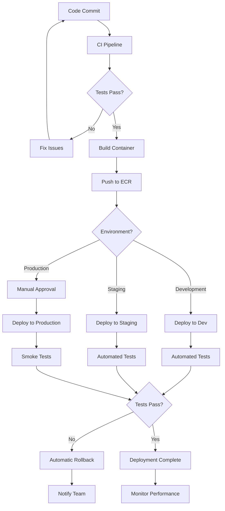
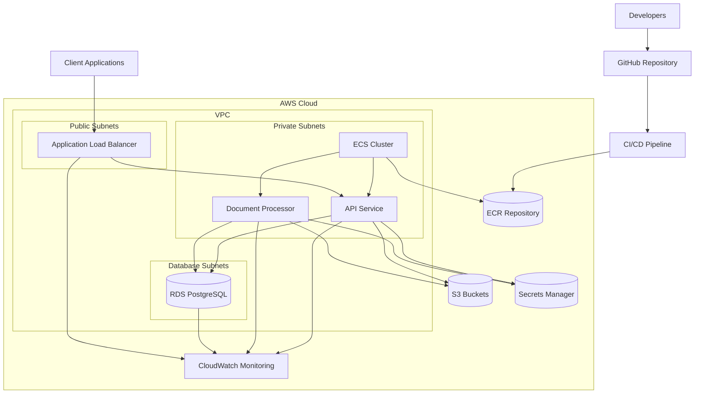
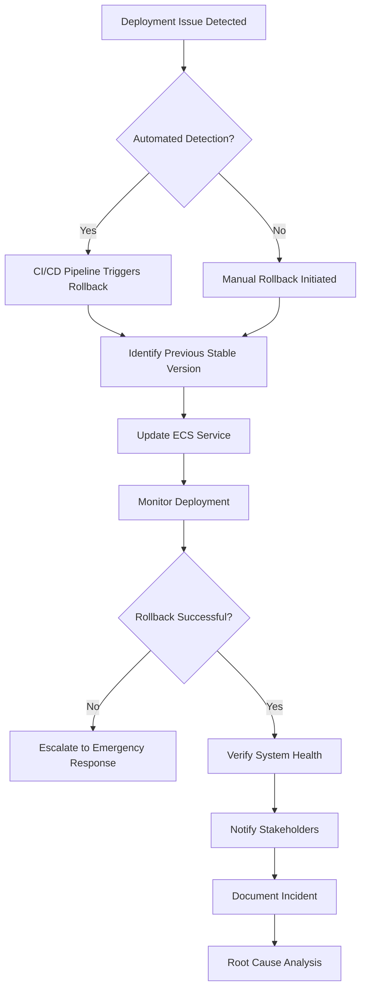

## 1. Introduction

This guide provides detailed instructions for deploying the Document Management and AI Chatbot System across development, staging, and production environments. It covers prerequisites, deployment procedures, verification steps, rollback procedures, and troubleshooting information.

## 2. Deployment Environments

The system supports deployment to three distinct environments, each with specific purposes and configurations.

### 2.1 Development Environment

The development environment is used for ongoing development and initial testing.

- **Purpose**: Feature development, unit testing, integration testing
- **Infrastructure**: Local Docker Compose or lightweight AWS resources
- **Data**: Synthetic test data
- **Access**: Limited to development team
- **Deployment Frequency**: Continuous (on commit to develop branch)

The development environment is configured with debugging enabled and uses minimal resources to reduce costs during development.

### 2.2 Staging Environment

The staging environment mirrors the production configuration for pre-release validation.

- **Purpose**: Pre-production validation, performance testing, user acceptance testing
- **Infrastructure**: AWS resources similar to production but at reduced scale
- **Data**: Anonymized copy of production data or comprehensive test data
- **Access**: Development team, QA team, selected stakeholders
- **Deployment Frequency**: On merge to main branch or manual trigger

The staging environment is configured to be as similar to production as possible while optimizing costs.

### 2.3 Production Environment

The production environment hosts the live system used by end users.

- **Purpose**: Live system for end users
- **Infrastructure**: Full-scale AWS resources with high availability
- **Data**: Real user data with appropriate security controls
- **Access**: Restricted to operations team
- **Deployment Frequency**: Scheduled releases or critical hotfixes

The production environment is optimized for reliability, security, and performance.

## 3. Deployment Prerequisites

Before deploying the system, ensure the following prerequisites are met.

### 3.1 Access Requirements

The following access permissions are required for deployment:

- **AWS Account Access**: IAM credentials with appropriate permissions
- **GitHub Repository Access**: Permission to trigger workflows or merge to protected branches
- **Docker Hub Access**: For pulling base images (if not using ECR)
- **OpenAI API Access**: API key for LLM integration

For production deployments, additional approvals may be required according to your organization's change management process.

### 3.2 Tool Requirements

The following tools should be installed and configured:

- **AWS CLI**: Version 2.0 or higher, configured with appropriate profiles
- **Terraform**: Version 1.4 or higher
- **Docker**: Version 20.0 or higher
- **Python**: Version 3.10 or higher
- **Git**: Latest version

For local development, Docker Compose is also required.

### 3.3 Environment Configuration

Each environment requires specific configuration values. These are stored in:

- **Terraform Variables**: In `infrastructure/terraform/environments/<env>/terraform.tfvars`
- **Environment Variables**: Passed to containers at runtime
- **AWS Secrets Manager**: For sensitive values like database passwords and API keys

Ensure all required configuration values are set before deployment. Refer to `.env.example` for required environment variables.

## 4. Deployment Procedures

This section provides step-by-step instructions for deploying to each environment.

### 4.1 Local Development Deployment

For local development and testing, use Docker Compose:

1. Clone the repository:
   ```bash
   git clone https://github.com/your-org/document-management-ai-chatbot.git
   cd document-management-ai-chatbot
   ```

2. Create a `.env` file based on `.env.example`:
   ```bash
   cp src/backend/.env.example src/backend/.env
   # Edit .env with your configuration values
   ```

3. Start the services:
   ```bash
   cd src/backend
   docker-compose up -d
   ```

4. Initialize the database:
   ```bash
   docker-compose exec app python -m scripts.create_admin
   ```

5. Verify the deployment:
   ```bash
   curl http://localhost:8000/api/v1/health
   ```

The application will be available at http://localhost:8000 with API documentation at http://localhost:8000/docs.

### 4.2 Development Environment Deployment

Development environment deployment is automated through the CI/CD pipeline:

1. Push changes to the `develop` branch:
   ```bash
   git checkout develop
   git pull
   git add .
   git commit -m "Your changes"
   git push origin develop
   ```

2. The GitHub Actions workflow will automatically:
   - Run tests
   - Build the Docker image
   - Push to ECR
   - Deploy to the development environment

3. Monitor the deployment in the GitHub Actions tab of the repository.

Alternatively, you can manually trigger a deployment:

1. Go to the GitHub repository
2. Navigate to Actions > Continuous Deployment
3. Click "Run workflow"
4. Select the `develop` branch and "development" environment
5. Click "Run workflow"

The deployment typically takes 5-10 minutes to complete.

### 4.3 Staging Environment Deployment

Staging environment deployment is triggered by merging to the `main` branch or manually:

1. Create a pull request from `develop` to `main`
2. Ensure all checks pass
3. Get required approvals
4. Merge the pull request

The GitHub Actions workflow will automatically:
- Build the Docker image
- Push to ECR
- Deploy to the staging environment
- Run integration and performance tests

For manual deployment to staging:

1. Go to the GitHub repository
2. Navigate to Actions > Continuous Deployment
3. Click "Run workflow"
4. Select the `main` branch and "staging" environment
5. Click "Run workflow"

The staging environment is available at https://staging-api.document-management.example.com.

### 4.4 Production Environment Deployment

Production deployment requires creating a release and manual approval:

1. Create a new release in GitHub:
   - Go to the repository
   - Navigate to Releases > Draft a new release
   - Create a new tag (e.g., v1.0.0) from the `main` branch
   - Add release notes
   - Publish the release

2. The GitHub Actions workflow will:
   - Build the Docker image
   - Push to ECR with the release tag
   - Create a deployment plan
   - Wait for approval

3. Review and approve the deployment:
   - Go to the GitHub repository
   - Navigate to Actions > Continuous Deployment
   - Find the running workflow
   - Review the plan
   - Approve the deployment

4. The workflow will complete the deployment and run verification tests.

Alternatively, for emergency hotfixes, you can use the manual deployment script:

```bash
# Ensure you have the required AWS credentials configured
export AWS_PROFILE=production

# Run the deployment script
./scripts/deploy-prod.sh
```

The production environment is available at https://api.document-management.example.com.

### 4.5 Infrastructure Deployment

If you need to deploy or update only the infrastructure without deploying a new application version:

1. Navigate to the appropriate Terraform directory:
   ```bash
   cd infrastructure/terraform/environments/<env>
   ```

2. Initialize Terraform:
   ```bash
   terraform init
   ```

3. Plan the changes:
   ```bash
   terraform plan -var-file=terraform.tfvars -out=tfplan
   ```

4. Review the plan carefully

5. Apply the changes:
   ```bash
   terraform apply tfplan
   ```

For production infrastructure changes, always use the CI/CD pipeline or the deployment script to ensure proper review and approval.

## 5. Deployment Verification

After deployment, verify that the system is functioning correctly.

### 5.1 Health Checks

Verify the system health using the health check endpoints:

```bash
# For local or development environment
curl http://localhost:8000/api/v1/health

# For staging environment
curl https://staging-api.document-management.example.com/api/v1/health

# For production environment
curl https://api.document-management.example.com/api/v1/health
```

The response should be a JSON object with status "ok" and health information for all components:

```json
{
  "status": "ok",
  "version": "1.0.0",
  "timestamp": "2023-06-15T12:34:56Z",
  "components": {
    "api": "ok",
    "database": "ok",
    "vector_store": "ok",
    "llm_service": "ok"
  }
}
```

If any component reports a non-"ok" status, refer to the troubleshooting section.

### 5.2 Smoke Tests

Run basic smoke tests to verify core functionality:

1. Authentication:
   ```bash
   # Get a token
   curl -X POST https://api.document-management.example.com/api/v1/auth/token \
     -H "Content-Type: application/json" \
     -d '{"username":"test@example.com","password":"password"}'
   ```

2. Document upload:
   ```bash
   # Upload a test document
   curl -X POST https://api.document-management.example.com/api/v1/documents/upload \
     -H "Authorization: Bearer $TOKEN" \
     -F "file=@test.pdf"
   ```

3. Vector search:
   ```bash
   # Perform a search query
   curl -X POST https://api.document-management.example.com/api/v1/query \
     -H "Authorization: Bearer $TOKEN" \
     -H "Content-Type: application/json" \
     -d '{"query":"test query"}'
   ```

Alternatively, use the automated smoke test script:

```bash
# Run smoke tests against the specified environment
python -m scripts.smoke_tests --environment production --api-url https://api.document-management.example.com
```

### 5.3 Monitoring Verification

Verify that monitoring is working correctly:

1. Check that metrics are being collected:
   - Access the Prometheus UI
   - Query for `up{job="api_service"}` to verify the API service is reporting metrics

2. Check that logs are being collected:
   - Access the Grafana UI
   - Go to Explore > Loki
   - Query for `{service="api"}` to verify API logs are being collected

3. Check that dashboards are populated:
   - Access the Grafana UI
   - Navigate to the System Overview dashboard
   - Verify that metrics are being displayed

Refer to the [Monitoring Guide](./monitoring.md) for more details on monitoring the system.

### 5.4 Performance Verification

For staging and production deployments, verify performance meets requirements:

1. Run performance tests:
   ```bash
   python -m scripts.performance_tests --environment production --api-url https://api.document-management.example.com
   ```

2. Check key performance metrics:
   - API response time: Should be < 1 second for non-search endpoints
   - Vector search time: Should be < 3 seconds for standard queries
   - Document processing time: Should be < 10 seconds for 10MB documents

3. Monitor resource utilization during tests:
   - CPU usage should be < 70%
   - Memory usage should be < 75%
   - Database connection pool should not be exhausted

If performance does not meet requirements, consider scaling resources or optimizing configurations.

## 6. Rollback Procedures

If issues are detected after deployment, follow these procedures to rollback to a previous stable version.

### 6.1 Automated Rollback

The CI/CD pipeline includes automated rollback for failed deployments:

1. If deployment verification fails, the pipeline will automatically:
   - Identify the previous stable version
   - Revert to that version
   - Notify the team

2. Monitor the rollback process in the GitHub Actions workflow.

3. Verify that the rollback was successful using the health checks and smoke tests.

### 6.2 Manual Rollback

For manual rollback when automated rollback fails or for other reasons:

1. Identify the previous stable version:
   ```bash
   # List recent deployments
   aws ecs list-task-definitions --family document-management-prod --sort DESC --max-items 10
   ```

2. Update the ECS service to use the previous task definition:
   ```bash
   aws ecs update-service --cluster document-management-prod-cluster \
     --service document-management-prod-service \
     --task-definition document-management-prod:123 \
     --force-new-deployment
   ```

3. Monitor the deployment:
   ```bash
   aws ecs describe-services --cluster document-management-prod-cluster \
     --services document-management-prod-service
   ```

4. Verify the rollback using health checks and smoke tests.

For infrastructure rollback, use Terraform:

```bash
# Navigate to the Terraform directory
cd infrastructure/terraform/environments/prod

# Initialize Terraform
terraform init

# Restore from a previous state
terraform state pull > terraform.tfstate

# Apply the previous state
terraform apply -var-file=terraform.tfvars
```

### 6.3 Database Rollback

For database-related issues, you may need to restore from a backup:

1. Identify the appropriate backup:
   ```bash
   # List RDS snapshots
   aws rds describe-db-snapshots --db-instance-identifier document-management-prod
   ```

2. Restore the database:
   ```bash
   # Restore from snapshot
   aws rds restore-db-instance-from-db-snapshot \
     --db-instance-identifier document-management-prod-restored \
     --db-snapshot-identifier document-management-prod-snapshot-20230615
   ```

3. Update the application configuration to point to the restored database.

For minor data issues, you can use the database migration scripts to revert specific changes:

```bash
# Downgrade to a specific migration version
cd src/backend
docker-compose exec app alembic downgrade <target_version>
```

### 6.4 Post-Rollback Actions

After a successful rollback:

1. Notify all stakeholders about the rollback
2. Document the issue and rollback in the incident log
3. Create issues in the issue tracker for any bugs identified
4. Schedule a post-mortem meeting to analyze the root cause
5. Develop a plan to fix the issues before attempting redeployment

Ensure that monitoring is in place to detect any lingering issues after the rollback.

## 7. Deployment Troubleshooting

Common deployment issues and their solutions.

### 7.1 Common Deployment Issues

| Issue | Symptoms | Common Causes | Resolution |
| --- | --- | --- | --- |
| Container fails to start | Task status: STOPPED | Missing environment variables, resource constraints | Check container logs, verify environment configuration, increase resource allocation |
| Database connection failure | Error logs: 'Could not connect to database' | Network issues, incorrect credentials, database not initialized | Verify network connectivity, check credentials in Secrets Manager, run database initialization scripts |
| Vector store initialization failure | Error logs: 'Failed to load FAISS index' | Missing FAISS index, insufficient memory | Check vector index path, increase memory allocation, rebuild index |
| LLM service connection failure | API key issues, network connectivity, rate limiting | Verify API key in Secrets Manager, check network connectivity, implement retry with backoff |
| Health check failure | ALB target unhealthy | Service not fully initialized, dependency issues | Check service logs, increase health check grace period, verify all dependencies are available |
| Terraform apply failure | Error: 'Error applying plan' | State conflicts, permission issues, resource constraints | Check Terraform state, verify IAM permissions, check for resource quotas or limits |

### 7.2 Accessing Logs

To access logs for troubleshooting:

**Local Development:**
```bash
# View container logs
docker-compose logs -f app

# View specific service logs
docker-compose logs -f db
```

**AWS Environments:**
```bash
# View ECS task logs
aws logs get-log-events \
  --log-group-name /ecs/document-management-prod \
  --log-stream-name ecs/app/task-id \
  --limit 100

# Stream logs in real-time
aws logs tail /ecs/document-management-prod --follow
```

Alternatively, use the CloudWatch Logs console or Grafana's Loki interface for more advanced log querying and visualization.

### 7.3 Debugging Container Issues

For container-specific issues:

1. Check container status:
   ```bash
   # For local development
   docker-compose ps
   
   # For AWS environments
   aws ecs describe-tasks --cluster document-management-prod-cluster \
     --tasks task-id
   ```

2. Inspect container logs:
   ```bash
   # For local development
   docker-compose logs -f app
   
   # For AWS environments
   aws logs get-log-events \
     --log-group-name /ecs/document-management-prod \
     --log-stream-name ecs/app/task-id
   ```

3. Execute commands in the container:
   ```bash
   # For local development
   docker-compose exec app bash
   
   # For AWS environments (requires SSM Session Manager)
   aws ecs execute-command --cluster document-management-prod-cluster \
     --task task-id \
     --container app \
     --interactive \
     --command "/bin/bash"
   ```

4. Check resource utilization:
   ```bash
   # For local development
   docker stats
   
   # For AWS environments
   aws cloudwatch get-metric-data --metric-data-queries file://metric-queries.json \
     --start-time 2023-06-15T00:00:00Z \
     --end-time 2023-06-15T01:00:00Z
   ```

### 7.4 Infrastructure Troubleshooting

For infrastructure-related issues:

1. Check Terraform state:
   ```bash
   cd infrastructure/terraform/environments/prod
   terraform state list
   terraform state show aws_ecs_service.app
   ```

2. Validate Terraform configuration:
   ```bash
   terraform validate
   ```

3. Check AWS service health:
   ```bash
   aws health describe-events --filter file://health-filter.json
   ```

4. Verify IAM permissions:
   ```bash
   aws iam simulate-principal-policy \
     --policy-source-arn arn:aws:iam::account-id:role/role-name \
     --action-names ecs:CreateService ecs:UpdateService
   ```

5. Check resource quotas and limits:
   ```bash
   aws service-quotas list-service-quotas --service-code ecs
   ```

### 7.5 Getting Help

If you're unable to resolve deployment issues:

1. Check the project documentation and knowledge base
2. Search for similar issues in the project issue tracker
3. Consult with team members who have deployment expertise
4. Escalate to the DevOps or platform team if necessary

When requesting help, provide:
- Detailed description of the issue
- Environment where the issue occurs
- Relevant logs and error messages
- Steps you've already taken to troubleshoot
- Any recent changes that might be related

For urgent production issues, use the emergency contact procedure outlined in the incident response plan.

## 8. Maintenance Procedures

Regular maintenance procedures to keep the system running smoothly.

### 8.1 Database Maintenance

Regular database maintenance tasks:

1. **Backup verification** (weekly):
   ```bash
   # List recent backups
   aws rds describe-db-snapshots --db-instance-identifier document-management-prod
   
   # Restore backup to test instance
   ./scripts/verify-db-backup.sh
   ```

2. **Index optimization** (monthly):
   ```bash
   # Connect to database
   psql -h $DB_HOST -U $DB_USERNAME -d $DB_NAME
   
   # Run VACUUM ANALYZE
   VACUUM ANALYZE;
   
   # Reindex tables
   REINDEX TABLE documents;
   REINDEX TABLE document_chunks;
   ```

3. **Performance monitoring** (ongoing):
   - Monitor query performance using RDS Performance Insights
   - Identify slow queries and optimize as needed
   - Adjust instance size based on utilization patterns

### 8.2 Vector Store Maintenance

FAISS vector store maintenance tasks:

1. **Index optimization** (monthly):
   ```bash
   # Run index optimization script
   ./scripts/optimize-vector-index.sh
   ```

2. **Index backup** (weekly):
   ```bash
   # Backup FAISS index to S3
   ./scripts/backup-vector-index.sh
   ```

3. **Index rebuilding** (as needed):
   ```bash
   # Rebuild index from documents
   ./scripts/rebuild-vector-index.sh
   ```

Monitor vector search performance and consider rebuilding the index if search quality or performance degrades significantly.

### 8.3 Security Updates

Regular security maintenance tasks:

1. **Dependency updates** (monthly):
   ```bash
   # Update dependencies
   cd src/backend
   poetry update
   
   # Run security checks
   poetry run safety check
   ```

2. **Container image updates** (monthly):
   ```bash
   # Build and deploy updated base images
   ./scripts/update-base-images.sh
   ```

3. **Security scanning** (weekly):
   ```bash
   # Run security scans
   ./scripts/security-scan.sh
   ```

4. **Credential rotation** (quarterly):
   ```bash
   # Rotate credentials
   ./scripts/rotate-keys.sh
   ```

Security updates should be tested in development and staging before applying to production.

### 8.4 Backup and Cleanup

Regular backup and cleanup tasks:

1. **Database backups** (daily):
   ```bash
   # Automated via RDS snapshots
   # Verify backup schedule
   aws rds describe-db-instances --db-instance-identifier document-management-prod
   ```

2. **Document storage backups** (daily):
   ```bash
   # Backup documents to secondary storage
   ./scripts/backup-documents.sh
   ```

3. **Log rotation and cleanup** (weekly):
   ```bash
   # Clean up old logs
   ./scripts/cleanup-logs.sh
   ```

4. **Temporary file cleanup** (daily):
   ```bash
   # Clean up temporary files
   ./scripts/cleanup-temp-files.sh
   ```

Ensure that backup retention policies comply with your organization's data retention requirements.

### 8.5 Monitoring and Alerting

Regular monitoring system maintenance:

1. **Alert rule review** (quarterly):
   - Review alert rules for relevance
   - Adjust thresholds based on historical data
   - Remove obsolete alerts

2. **Dashboard updates** (as needed):
   - Update dashboards to reflect system changes
   - Add new metrics as needed
   - Improve visualization for better insights

3. **Notification channel verification** (monthly):
   ```bash
   # Test notification channels
   ./scripts/test-alerts.sh
   ```

Refer to the [Monitoring Guide](./monitoring.md) for detailed information on monitoring system maintenance.

## 9. Conclusion

This deployment guide provides comprehensive instructions for deploying and maintaining the Document Management and AI Chatbot System across different environments. By following these procedures, you can ensure reliable, secure, and efficient deployments.

For additional information, refer to:
- [Architecture Documentation](../architecture/system-overview.md)
- [Monitoring Guide](./monitoring.md)
- [Troubleshooting Guide](./troubleshooting.md)
- [Backup and Recovery Guide](./backup-recovery.md)

If you encounter issues not covered in this guide, please contact the DevOps team or create an issue in the project repository.







| Feature | Development | Staging | Production |
| --- | --- | --- | --- |
| Purpose | Development and testing | Pre-production validation | Live system |
| Infrastructure | Minimal AWS resources | Scaled-down production replica | Full-scale, high availability |
| Data | Synthetic test data | Anonymized production data | Real user data |
| Access | Development team | Dev team, QA, stakeholders | Operations team only |
| Deployment Frequency | Continuous (on commit) | On merge to main | Scheduled releases |
| Monitoring | Basic | Comprehensive | Comprehensive with alerts |
| Backup Frequency | Weekly | Daily | Continuous with point-in-time recovery |
| Scaling | Fixed size | Auto-scaling with limits | Full auto-scaling |
| Domain | dev-api.example.com | staging-api.example.com | api.example.com |

| Check | Method | Expected Result | Action if Failed |
| --- | --- | --- | --- |
| API Health | HTTP GET /api/v1/health | Status: ok for all components | Check component-specific logs |
| Database Connectivity | Database health check | Connection successful | Verify credentials and network |
| Vector Store | Vector search test | Search returns results | Check FAISS index integrity |
| LLM Integration | Test query | AI response generated | Verify API key and connectivity |
| Authentication | Login test | JWT token received | Check auth service logs |
| Document Upload | Upload test document | Document ID returned | Check storage permissions |
| Metrics Collection | Prometheus targets | All targets up | Check Prometheus configuration |
| Log Collection | Loki queries | Logs visible in Grafana | Check logging configuration |
| Performance | Load test | Response time within SLA | Check resource utilization |

| Issue | Symptoms | Common Causes | Resolution |
| --- | --- | --- | --- |
| Container fails to start | Task status: STOPPED | Missing environment variables, resource constraints | Check container logs, verify environment configuration |
| Database connection failure | Error logs: 'Could not connect to database' | Network issues, incorrect credentials | Verify network connectivity, check credentials |
| Vector store initialization | Error logs: 'Failed to load FAISS index' | Missing index file, insufficient memory | Check index path, increase memory allocation |
| LLM service connection |  | API key issues, rate limiting | Verify API key, implement retry with backoff |
| Health check failure | ALB target unhealthy | Service not fully initialized | Increase health check grace period |
| Terraform apply failure | Error: 'Error applying plan' | State conflicts, permission issues | Check Terraform state, verify IAM permissions |
| CI/CD pipeline failure | GitHub Actions: failed | Test failures, build errors | Check workflow logs, fix failing tests |